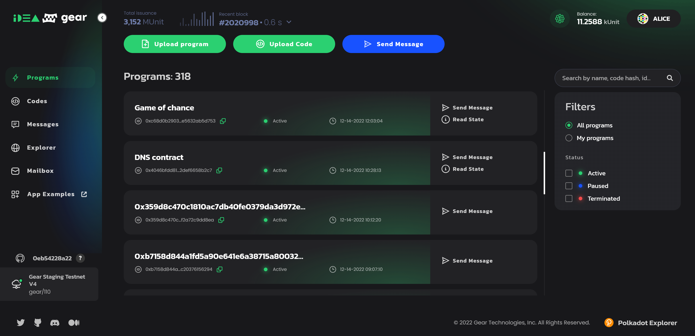

# Upload smart contracts

Following the principles of Actor model for communication, uploading a program in the network is just one of the specific types of transactions that contain a Wasm file as a payload.

Uploading a new program (smart-contract) to the blockchain takes place by calling the custom extrinsic `gear.uploadProgram(code, salt, initPayload, gasLimit, value)`.
Where:

- `code: Bytes` - binary Wasm code
- `salt: Bytes` - the random data that is added to the hashing process to force their uniqueness
- `initPayload: Bytes`- the init message payload that will be processed by the init() function during program initialization
- `gasLimit: u64` - the amount of gas that users are willing to spend on processing the upload of a new program
- `value: u128` - the value that will be transferred to a balance of the newly created account for the program

## Program upload events

> Note: while extrinsics represent information from the outside world, events represent information from the chain. Extrinsics can trigger events.

The extrinsic that was called to upload a program triggers a series of events. Learn more about events [here](/docs/api/events#gear-events-types).

## How to upload

There are several ways to upload a program:

### Upload via Gear GUI

The easiest way to upload the program is to use the “Upload program” option in the Gear Idea portal - **[idea.gear-tech.io](https://idea.gear-tech.io)**.

### Via gear-js library

The Gear-js library provides a simple and intuitive way to connect Gear Component APIs, including interaction with programs. More details: [Gear API](/docs/api/getting-started).

### Via `gear-program`

`gear-program` is the command line (CLI) utility for interacting with the blockchain network. Refer to [gear-program GitHub repo](https://github.com/gear-tech/gear-program) for details.
