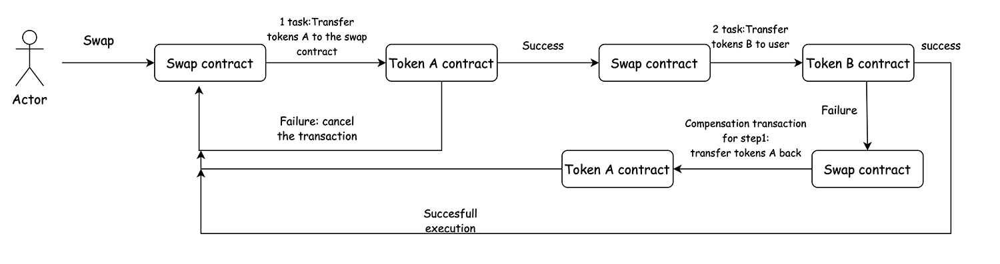

# Ensuring reliability in asynс programming

One of the keys and distinguished features of the Gear Protocol is the Actor model for message-passing communications. Actor model framework enables asynchronous messaging and parallel computation which drastically increases the achievable speed and allows building more complex dApps in an easier way. The state is not shared between programs, the transactions are handled through communication. If a program sends an asynchronous message to another program, it needs to wait for the reply from that program before it can proceed to the next operation. 

When a program interacts with another one, the transaction becomes `distributed`. `Distributed transaction` is a set of operations that are performed across several databases. In our case, operations are performed across actors with their states. The distributed transactions must possess the following features: 
- `Atomicity`: All data changes are treated as if they were a single operation. That is, either all of the modifications are made, or none of them are made;
- `Consistency`: This property implies that when a transaction begins and ends, the state of data is consistent.

For example, the Ethereum transactions are `atomic`.The global state changes when all executions finish successfully. If execution fails due to an error, all of its effects (changes in state) are rolled back just as if this particular transaction has never been running. 

Many applications on the blockchain use atomicity features. So, it is important to understand that if you implement an application following the programming paradigm used, for example, on Ethereum, then there will be the problem of not being able to recover the state after a failed transaction. 

For example, consider the simple exchange, where a user wants to swap tokens A for tokens B in the liquidity pool. The swap contract will send a message to the token A contract and a message to the token B contract. If one message succeeds and the other one fails for some reason, then the state of the token A contract will be changed and the state of the token B contract will remain unchanged.

So, we have to think about another programming paradigm for distributed transactions.
let's look at different programming methods using the example of a token exchange.
## Splitting a token swap transaction into 3 separate transactions
Consider the following situation: we have a liquidity pool of token A and token B, and also a user who wants to exchange his tokens A for tokens B.

`1 step` : A user sends a `MakeOrder` message to the swap contract. During that transaction the contract sends a message to the fungible token contract. The result of executing this message can be a success, a failure. Also, the worst case is the lack of gas when processing a message in the token contract or in the subsequent execution of the swap contract. However, since the token contract supports idempotency, the user can simply restart the transaction and complete it.

<!-- 

 -->
`2 step`:  A user sends an `ExecuteOrder` message to the swap contract.The swap contract just calculates the amount of tokens a user will receive and saves the new state of the liquidity poll.

`3 step`:  A user sends a `Withdraw` message to the swap contract and receives tokens B. The situation here is the same as in the first step.

It is possible to execute a swap in one transaction. To resolve the problem of atomicity we can use the following patterns here:
- `2 PC - 2 Phase Commit protocol` (And also its extension - 3 phase commit protocol);
- `Saga Pattern`.

## Two phase commit protocol

**Theory**:   
We have a coordinator that sends messages to participants. The `two-phase commit protocol` has two parts: the `prepare` phase and the `commit` phase.

**Prepare phase:**  
During the prepare phase, the coordinator and participants perform the following dialog:
- `Coordinator`:  
The coordinator directs each participant database server to prepare to commit the transaction.
- `Participants`:  
Every participant notifies the coordinator whether it can commit its transaction branch.
- `Coordinator`:  
The coordinator, based on the response from each participant, decides whether to commit or roll back the transaction. It decides to commit only if all participants indicate that they can commit their transaction branches. If any participant indicates that it is not ready to commit its transaction branch (or if it does not respond), the coordinator decides to end the global transaction.

**Commit phase:**  
During the commit phase, the coordinator and participants perform the following dialog:
- `Coordinator`:  
The coordinator writes the commit record or rollback record to the coordinator's logical log and then directs each participant to either commit or roll back the transaction.
- `Participants`:  
If the coordinator issued a commit message, the participants commit the transaction by writing the commit record to the logical log and then sending a message to the coordinator acknowledging that the transaction was committed. If the coordinator issued a rollback message, the participants roll back the transaction but do not send an acknowledgment to the coordinator.
- `Coordinator`:  
If the coordinator issues a message to commit the transaction, it waits to receive acknowledgment from each participant before it ends the global transaction. If the coordinator issued a message to roll back the transaction, it does not wait for acknowledgments from the participants.

Let's see how it can be used on the example of a token swap contract. We consider the following situation: the account wants to exchange his tokens (let’s call it tokenA) for other tokens (tokenB) using the liquidity pool in the swap contract.

In that case the swap contract is a coordinator contract and tokens contract are participants.

The swap contract makes the following steps:  
**Prepare phase** 
- `Swap contract:`
Swap contract sends the messages to token contracts to prepare transfer tokens (Messages can be sent in parallel). In fact, token contracts must lock funds at this stage;
- `Token contract`:
Token contracts make all necessary checks, and in case of success, lock funds and reply to the swap contract that they are ready to make a transaction.
- `Swap contract`:
Swap contract handles the messages from the token contracts and decides whether to commit or abort the global transaction. 
receives tokens B. The situation here is the same as in the first step.

**Commit phase**  
- `Swap contract`:  
If token contracts confirmed their readiness to execute the transaction, the swap contract sends them a message to commit the state. Otherwise, the swap contract tells them to abort the transaction.
- `Token contract`:
Token contracts finally change their state and send replies to the swap contract;
- `Swap contracts:
Swap contract handles the messages from the token contracts and saves the result about transaction execution.

Of course, all that workflow handles the case when the gas runs out during the message execution.

`Pros:`
- Messages can be sent in parallel;
- If cases with a lack of gas are taken into account, then the data consistency is achieved.  

`Cons:`
- The participants have to wait for the message from the coordinator, they can’t commit or abort themselves;
- The coordinator plays an important role: if it fails to send the message then all participants go to the blocked state (in our example: the funds in token contracts are blocked).

## Three phase commit protocol.
**Theory**:  
It is similar to two-phase commit protocol but it tries to solve the problems with blocking the state of participants and to give the participants the opportunity to recover their states themselves.

**Prepare phase:**
The same steps of two phase commit protocol are followed here:
- `Coordinator`:  
The coordinator sends a prepare message to all participants and waits for replies;
- `Participants`:  
If the participants are ready to commit a transaction they send the ready message, otherwise they send no message to the coordinator. 
- `Coordinator`:  
Based on replies the coordinator decides either to go to the next state or not. If any of the participants respond with no message or if any of the participants fails to respond within a defined time, the coordinator sends an abort message to every participant.  It is important to highlight the differences from two phase commit protocol:
   - The coordinator limits the response time from the participant. We can implement by sending a message with an indicated amount of gas or indicated the number of blocks the coordinator is ready to wait;
   - If the coordinator fails at this state, then the participants are able to abort the transaction (i.e. unlock their state) using delayed messages. So, in that phase, the timeout cases abort. 

**Prepare-to-commit phase:**
- `Coordinator`:  
The coordinator sends a prepare-to-commit message to all participants and gets acknowledgements from everyone;
- `Participants`:  
Receiving a prepare-to-commit message, a participant knows that the unanimous decision was to commit. As was already mentioned in the prepare phase, if a participant fails to receive this message in time, then it aborts. However, if a participant receives an abort message then it can immediately abort the transaction. 
The possible problem: the coordinator fails during sending a prepare-to-commit to participants. So some participants are in phase 2, others are in phase 1. It's a disaster because the first group will commit, the second group will abort in case of timeout.
So we have to make sure that If one of the participants has received a precommit message, they can all commit. If the coordinator falls, any of the participants, being at the second stage, can become the coordinator itself and continue the transaction. 
- `Coordinator`:  
Having received acknowledgements from all the participants, the coordinator goes to the next phase.

The three-phase commit protocol accomplishes two things:
1. Enables use of a `recovery coordinator` (it can be a coordinator itself that starts a new transaction, or a participant). If a coordinator died, a recovery coordinator can query a participant.
   - If the participant is found to be in phase 2, that means that every participant has completed phase 1 and voted on the outcome. The completion of phase 1 is guaranteed. It is possible that some participants may have received commit requests (phase 3). The recovery coordinator can safely resume at phase 2.
   - If the participant was in phase 1, that means NO participant has started commits or aborts. The protocol can start at the beginning.
   - If the participant was in phase 3, the coordinator can continue in phase 3 – and make sure everyone gets the commit/abort request
2. Every phase can now time out – there is no indefinite wait as in the two-phase commit protocol.
   - `Phase 1`:
Participant aborts if it doesn’t hear from a coordinator in time;
Coordinator sends aborts to all if it doesn’t hear from any participant.
   - `Phase 2`:
If a participant times out waiting for a coordinator, elect a new coordinator.

Let’s get back to our swap contract.

**Prepare phase**:  
The following cases are possible:
- all token contracts receive the message;
- the swap contract fails to wait for response from any token contract
- the swap contract fails itself.

In the case of a fall, if a transaction isn't restarted, the swap contract will not move to the second phase and the token contracts will unlock their state using delayed messages.

**Pre-Commit phase**:
At this stage we can have a failure in the swap contract or in the token contract only due the lack of gas.  To solve this problem we can use gas reservation as follows: 
- The swap contract receives the information about error in its `handle_signal`;
- Using gas reservation (so, it’s necessary to care about gas reservations before), the swap contract sends a message to itself to restart the transaction from the second phase. (The same logic can be also used in `prepare phase`).

**Commit phase**:  
As in the previous stage we can have a failure only due to the lack of gas. Here it is not so critical, since at this stage all participants can commit themselves.

## Saga pattern
**Theory**:  
A `saga` is a sequence of local transactions. Each local transaction updates the database and publishes a message or event to trigger the next local transaction in the saga. If a local transaction fails because it violates a business rule then the saga executes a series of compensating transactions that undo the changes that were made by the preceding local transactions. Thus, Saga consists of multiple steps whereas `2PC` acts like a single request.  
There are two ways of coordination sagas:
- `Choreography` - each local transaction publishes domain events that trigger local transactions in other services;
- `Orchestration` - an orchestrator (object) tells the participants what local transactions to execute.

We will consider the `orchestration based Saga` where there would be an orchestrator (swap contract) to manage the entire operation from one center. 

The swap operation consists of the following steps:
1. Swap contract receives a message to exchange tokens in the liquidity pool. So, it must transfer tokens A from the account to its address and then transfer tokens B to the user.
2. It creates the first task: transfer tokens from the user to the swap contract. It also creates a compensating transaction for the first task: transfer tokens from the swap contract back to the user. The second task is to transfer tokens from the swap contract to the user.
3. It starts executing the first task. If the execution fails, it cancels the transaction. If it’s successful, the swap contract executes the second task;
4. If the execution of the second task is successful, the transaction is completed. Otherwise, the swap contract executes the compensation transaction for the first task.

It is important to note that compensatory transactions should not fail due to any logical error. They can only fall due to lack of gas. If this happens, then you need to restart the transaction again or use the gas reservation. The `idempotency` of the token contract guarantees that the transaction will be completed to the end without any duplicate transactions.
