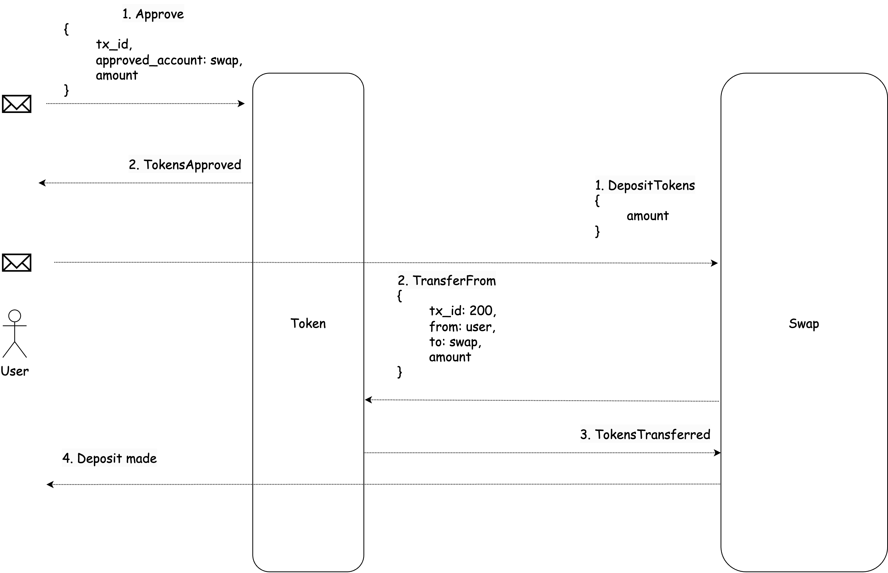
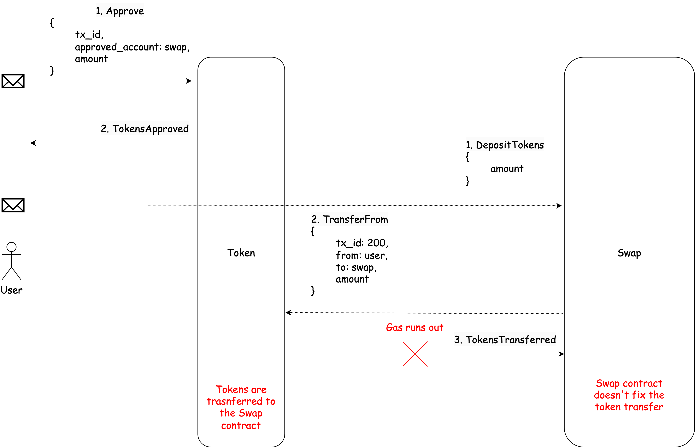
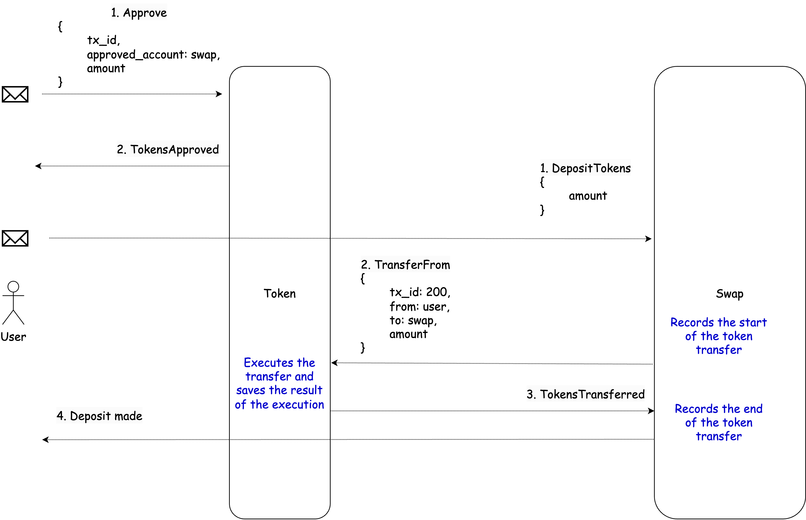

# Gear fungible token standard

Contract state:

```rust
struct Token 
    balances: HashMap<ActorId, u128>,
    allowances: HashMap<ActorId, HashMap<ActorId, u128>>,
    nonces: HashMap<ActorId, u64>,
    account_to_tx_ids: HashMap<ActorId, Vec<TxHash>,
    tx_ids: HashMap<TxHash, (TokenMessage, TxResult)>,
    deposits: HashMap<ActorId, u128>,
}
```
where:
-  `balance`: a mapping or HashMap from account addresses to `u128` value representing the amount of tokens held by the user at that address;
-  `allowances`: a mapping between an account and another mapping between an authorized spender account and the maximum amount of tokens they are permitted to transfer on behalf of the original account.
-  `nonces`: a mapping from account to `u32` value, representing the nonce value for each account. The purpose of using nonces in a smart contract is to prevent replay attacks, which occur when an attacker tries to re-submit a previously executed transaction with the same parameters in an attempt to trick the system into processing it again. By incrementing the nonce value for each new transaction initiated by an account, the system can verify that the transaction is unique and has not been executed before. If the caller specifies an incorrect nonce value (i.e. one that is not equal to the current nonce value for their account), the transaction will be rejected, preventing any potential duplicate transactions.
- `account_to_tx_ids`: a mapping from the account to the transactions executed in the token contract. It is very useful for state consistency, where two parties need to verify that they have the same representation of transactions associated with a specific user. This can provide an added layer of security and confidence in the execution of transactions.
- `tx_ids`: a mapping from the transaction hash to the correspong message and its execution result. This allows for easy retrieval of transaction information, such as the result of a particular transaction, using the transaction hash as a key. The `TokenMessage` and `TxResult` structures will be described below.
- `deposits`: a mapping from account to the amount of Vara tokens the account has deposited in the token contract. This deposit serves as collateral for the account to store its transaction history in the contract. To withdraw locked Vara tokens the account has to clear his transaction history. Overall, it is a mechanism for incentivizing users to use the contract's storage efficiently and avoid bloating the contract with unnecessary data.

## Messages Interface

The message the token contract should handle:
```rust
enum TokenMessage {
    Transfer {
            nonce: Option<u32>,
            tx_id: u32,
            recipient: ActorId,
            amount: u128,
    },
    TransferBatch {
        nonce: Option<u32>,
        tx_id: u32,
        recipients: Vec<ActorId>,
        amounts: Vec<u128>,
    },
    TransferFrom {
        nonce: Option<u32>,
        tx_id: u32,
        sender: ActorId,
        recipient: ActorId,
        amount: u128,
    },
    TransferFromBatch {
        nonce: Option<u32>,
        tx_id: u32,
        senders: Vec<ActorId>,
        recipients: Vec<ActorId>,
        amounts: Vec<u128>,
    },
    Approve {
        nonce: Option<u64>,
        tx_id: u32,
        spender: Vec<ActorId>,
        amount: Vec<u128>,
    },
    GetNonce {
        account: ActorId,
    },
    GetTxResult {
        tx_hash: TxHash,
    },
    ClearTxs {
        account: ActorId,
    },
}
```
The contract responds with `Result<TokenReply, TokenError>`, where `TokenReply` is a reply in case of successful message execution, and `TokenError` contains information about the error that occurred during message processing.
```rust
enum TokenReply {
    TokensTransferred,
    TokenTransferredInBatch {
        errors: Option<(
            recipients: Vec<ActorId>,
            amounts: Vec<u128>,
            errors: Vec<TokenError>
        )>,
    },
    TokenTransferredFromInBatch {
        errors: Option<(
            senders: Vec<ActorId>,
            recipients: Vec<ActorId>,
            amounts: Vec<u128>,
            errors: Vec<TokenError>
        )>,
    },
    TokensApproved,
    NonceOfAccount {
        nonce: u32,
    },
    TxResult {
        result: (TokenMessage, TxResult)
    },
    TxsCleared,
}
```
Error that can occur during messages handling:
```rust 
enum TokenError {
    NotAllowedToTransfer,
    NotEnoughBalance,
    ZeroAccount,
}
```
The result of the message handling can be the following:
```rust
enum TxResult {
    Success,
    Error(TokenError),
    ErrorsInBatches(Vec<Option<TokenError>)
}
```

## Detailed description
Incoming messages:
-   The `Transfer` message: transfers tokens from the caller's account to the recipient's account. 
 `tx_id` field is used for transaction identification and to ensure transaction idempotency. The `nonce` field is optional.
    ```rust
        Transfer {
            nonce: Option<u32>,
            tx_id: u32,
            recipient: ActorId,
            amount: u128,
        },
    ```
    In case of successful transaction execution, the contract responds with the message:
    ```rust
        Ok(TokenReply::TokenTransferred)
    ```
    In case of an error, the contract responds with `Err(TokenError)` indicating the error that occur during message processing.
    The Token saves the transaction result to the `tx_ids` field that here can be `TxResult::Success` or `TxResult::Error`.
    
- The `TransferBatch` message: transfers tokens in batches, where the arrays `recipients` and `amounts` are of equal length. This means that the value in `amounts[i]` is transferred to `recipients[i]`. 
The `nonce` and `tx_id` fields apply to the entire batch transfer, not individual transfers within the batch. So if provided, the same nonce and tx_id value should be used for all transfers within the batch.
    ```rust 
    TransferBatch {
        nonce: Option<u32>,
        tx_id: u32,
        recipients: Vec<ActorId>,
        amounts: Vec<u128>,
    },
    ```
     It is possible that some transfers will succeed and some will fail. In case all transfers are successful, the token will reply with:
     ```rust
        Ok(TokenReply::TokenTransferredInBatch {
            errors: None
        })
    ```
    If any transfer fails, the token will indicate it by responding with 
    ```rust
        Ok(TokenReply::TokenTransferredInBatch {
            errors: Some(
                recipiens: Vec<ActorId>,
                amounts: Vec<u128>,
                errors: Vec<TokenError>,
            )
        })
    ```
    
    The Token saves the transaction result to the `tx_ids` field that here can be `TxResult::Success` or `TxResult::ErrorsInBatches`.

- The `TransferFrom` message: transfers the indicated amount from the sender's account to the recipient's account. This message is used to allow a contract to transfer tokens on behalf of a user. 
The `nonce` field is optional.
    ```rust
    TransferFrom {
        nonce: Option<u32>,
        tx_id: u32,
        sender: ActorId,
        recipient: ActorId,
        amount: u128,
    },
    ```
     In case of successful transaction execution, the contract responds with the message:
    ```rust
        Ok(TokenReply::TokenTransferred)
    ```
    In case of an error, the contract responds with `Err(TokenError)` indicating the error that occur during message processing.
    The Token saves the transaction result to the `tx_ids` field that here can be `TxResult::Success` or `TxResult::Error`.
- The `TransferFromBatch` message: it is similar to `TransferFrom` but can transfer tokens in batches, where `amounts[i]` is transferred from `sender[i]` to `recipient[i]`. The `nonce` and `tx_id` fields apply to the entire batch transfer, not individual transfers within the batch. So if provided, the same nonce and tx_id value should be used for all transfers within the batch.
    ```rust
    TransferFromBatch {
        nonce: Option<u32>,
        tx_id: u32,
        sender: Vec<ActorId>,
        recipient: Vec<ActorId>,
        amount: Vec<u128>,
    },
    ```
    It is possible that some transfers will succeed and some will fail. In case all transfers are successful, the token will reply with:
     ```rust
        Ok(TokenReply::TokenTransferredFromInBatch {
            errors: None
        })
    ```
    If any transfer fails, the token will indicate it by responding with 
    ```rust
        Ok(TokenReply::TokenTransferredFromInBatch {
            errors: Some(
                senders: Vec<ActorId>,
                recipiens: Vec<ActorId>,
                amounts: Vec<u128>,
                errors: Vec<TokenError>,
            )
        })
    ```
    
    The Token saves the transaction result to the `tx_ids` field that here can be `TxResult::Success` or `TxResult::ErrorsInBatches`.
- The `Approve` message: allows the `spender` to withdraw tokens from the `sender's` account, up to the indicated amount. This can be useful in cases where the `sender` wants to authorize another address (the `spender`) to spend a certain amount of tokens from their account, without actually transferring the tokens at that time. The `spender` can later use the `transferFrom` method to withdraw tokens up to the approved amount. This can be particularly useful in scenarios such as decentralized exchanges, where users may want to temporarily authorize the exchange to access their tokens for trading purposes.
The `nonce` field is optional.
    ```rust
    Approve {
        nonce: Option<u64>,
        tx_id: u32,
        spender: Vec<ActorId>,
        amount: Vec<u128>,
    },
    ```
    In case of successful transaction execution, the contract responds with the message:
    ```rust
        Ok(TokenReply::TokensApproved)
    ```
    In case of an error, the contract responds with `Err(TokenError)` indicating the error that occur during message processing.
    The Token saves the transaction result to the `tx_ids` field that here can be `TxResult::Success` or `TxResult::Error`.

- The `GetNonce` message: a request for the `nonce` value of the specified `account`.
    ```rust
    GetNonce {
        account: ActorId,
    },
    ```
    Sends a `reply` with the current nonce of the account. If the account has not yet made a transaction in the token contract, the nonce will be 0.
    ```rust
    Ok(TokenReply::NonceOfAccount {
        nonce,
    })
    ```
- The `GetTxResult` message: a request for the transaction result.
    ```rust 
    GetTxResult {
        tx_hash: TxHash,
    },
    ```
    returns the message that was being processed and the result of the message processing:
    ```rust
    Ok(TokenReply::TxResult {
        result: (TokenMessage, TxResult)
    })
    ```
    
-  The `ClearTxs` message: clears the transaction history of the specified account and withdraws his deposit.
 ```rust
    ClearTxs {
        account: ActorId,
    },
 ```

## Scenarios
Let's consider a scenario where a user wants to send tokens to a `Swap` contract in order to exchange them later. This can be done using the combination of messages `TransferFrom` and `Approve`:

- To transfer tokens to a swap contract using `transferFrom` and `approve`, the user first needs to approve the swap contract to withdraw a certain amount of tokens from its account. This can be done by sending the a`Approve` message with the `spender` parameter set to the address of the swap contract and the amount parameter set to the desired amount of tokens.


- After the approval, the user sends a `Deposit` message to the `Swap` contract, which then sends a `TransferFrom` message to the token contract on behalf of the user's account. The token contract checks if the `Swap` contract is approved to transfer the user's tokens and if so, transfers the tokens to the `Swap` contract and sends a success reply back to the `Swap` contract. The Swap contract records that the user has transferred tokens, sends a reply to the user, and completes the transaction.



#### Rationality for using the transaction IDs:
Let's consider the following scenario:

1. The user successfully approved tokens for the `Swap` contract.
2. The user sent a message to the `Swap` contract, which in turn sent a message to the `Token` contract.
3. The `Token` contract checked that it could transfer tokens to the `Swap` contract and made the transfer.
4. The `Token` contract sent a reply to the `Swap` contract about the successful transfer, but at this point, the gas ran out. It turns out that tokens were transferred to the `Swap` contract, but the `Swap` contract did not record it, resulting in an inconsistency in the states.



Using transaction IDs can achieve transaction idempotency in the token contract. The scenario can be as follows:

1. The user sends a deposit message to the `Swap` contract.
2. The `Swap` contract records the start of the token transfer with a specific `tx_id` and sends a message to transfer the tokens with the specified `tx_id`.

    If gas runs out somewhere after recording the start of the transfer by the `Swap` contract, the `Swap` contract will show that the token transfer started but was not completed. 
    The user can send a request to complete the transaction, and the `Swap` contract will send the same message to the `Token` contract with the same `tx_id`. If the `Token` contract has already executed this message with the specified `tx_id`, it will not execute it again, but will only send a reply with the transaction result. 
    Thus, the `tx_id` can prevent transaction duplication and enables to bring the states of contracts into agreement in case of network failure.

