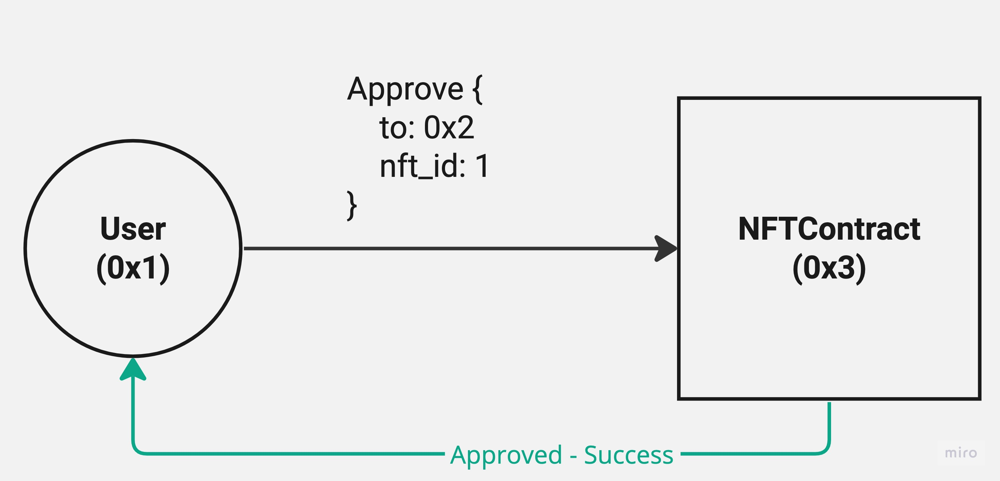
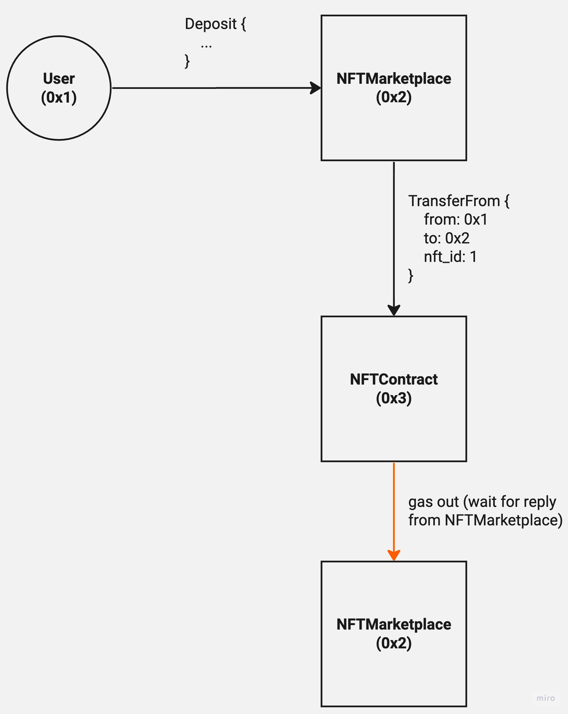
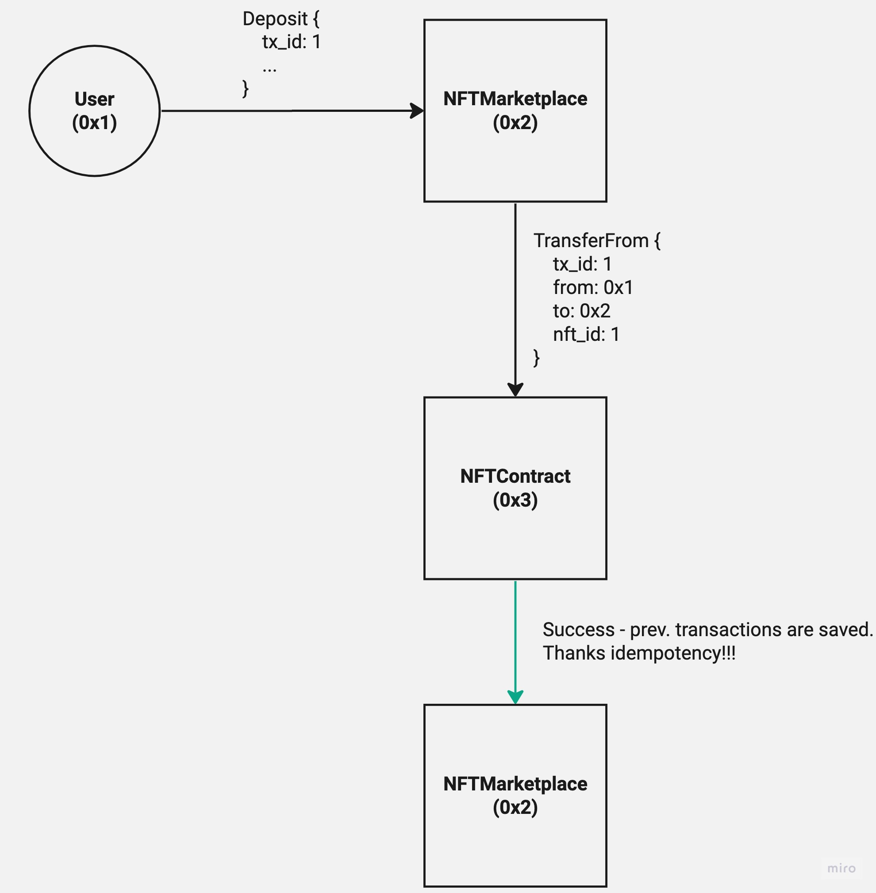

# Gear Non-fungible Token Standard

## Overview
A Gear Non-Fungible Token (gNFT) is used to identify something or someone in a unique way. This type of Token is perfect to be used on platforms that offer collectible items, access keys, game of chance, numbered seats for concerts and sports matches, etc. This special type of Token has amazing possibilities so it deserves a proper Standard, the gRC-721 came to solve that!

## Motivation
In general, gNFTs are designed to help develop decentralized applications by standardizing certain aspects of interaction. A generalized interface will allow different nft collections to be indexed and processed with ease, but without relying on a specific implementation. These principles create a generalized standard, save time, and provide more options for complex dapps composability.

## Abstract contract state(interface)
```rust
struct Collection {
    pub name: String,
    pub description: String,
}

struct Nft {
    pub owner: ActorId,
    pub name: String,
    pub description: String,
    pub media_url: String,
    pub attrib_url: String,
}

struct NFTContract {
    tokens: HashMap<NftId, Nft>,
    owners: HashMap<ActorId, NftId>,
    account_to_tx_ids: HashMap<ActorId, Vec<TxHash>>,
    tx_ids: HashMap<TxHash, (NFTContractAction, TxResult)>,
    collection: Collection
}
```

The above code is abstract and provides the minimal programming interface for the current gNFT standard. In theory this example could work, but in practice much more business logic and specific patterns are required, keep that in mind.

The basis of the contract state is in the `tokens`, `owners` and `collection` fields:
- `tokens`: Technically a hash table or mapping, that relates the index nft(number, id) to a specific user and additional attributes, metadata.
- `owners`: Contains the mapping of the user and its associated nft id(or ids in advanced cases).
- `account_to_tx_ids`: Provides mapping from user or contract account and transaction. This should be used to obtain transactions which involves caller and observe concrete message actions for idempotency(state consistency).
- `tx_ids`: Contains associated transaction hashes with concrete actions(messages) and results. In general, allows you to understand the status of a particular transaction, the result and the input parameters(state consistency).
- `collection`: A structure, that describes general information about the nft contract(project), such as the name or/and description. At least it should contain two `String` fields: `name` and `description`, respectively.

Each entity of the `Nft` structure can contain any fields, but there must be these:
- `owner`: The address of the owner of this particular nft, in most cases it is either a user or another contract.
- `name`: Part of the metadata, the name of a particular instance of nft.
- `description`: Part of the metadata, a description of a particular nft instance.
- `media_url`: Part of the metadata, a link (url) to a third-party web resource containing any media object, most often a picture.
- `attrib_url`: Part of the metadata, a link (url) to a third-party web resource that contains a json structure with attributes. They can be quite different and depend on the specific implementation.

## Message interface
In general, most gNFT smart contracts should handle the messages below:

```rust
enum NFTContractAction {
    Mint {
        tx_id: u64,
        name: String,
        description: String,
        media_url: String,
        attrib_url: String,
    },
    Transfer {
        tx_id: u64,
        to: ActorId,
        nft_id: NftId,
    },
    TransferFrom {
        tx_id: u64,
        from: ActorId,
        to: ActorId,
        nft_id: NftId
    },
    Approve {
        tx_id: u64,
        to: ActorId,
        flag: bool
    }
    GetBalance {
        owner: ActorId,
    },
    GetOwnerOf {
        nft_id: NftId
    }
}
```

There are currently no technical or other restrictions in the context of implementing message actions, but according to generally patterns, the above example should satisfy the task in most cases.

### Details
- `Mint`: This is the basic instruction of any gNFT contract. It must provide some business logic to allow the end user to get a unique token(nft). Typically, this function increments the nonce(global NftId), creates a new copy of the `Nft` entity, and adds the caller to the appropriate mappings.
- `Transfer`: Allows you to send or transfer an `Nft` entity to another user(or contract).
- `TransferFrom`: Same as `Transfer`, except that it allows you to transfer tokens on behalf of `from`. To use it, you will need to approve actual caller.
- `Approve`: Allows the specified entity(contract / user / address) to dispose of the caller's tokens.
- `GetBalance`: Provides the ability to know the number of `Nft` entities of the user. Makes sense if the user may own more than one nft at a time.
- `GetOwnerOf`: This instruction makes it possible to get the address of a specific nft owner knowing only the `NftId`.

After processing incoming message action, the contract must reply and contain such a structure:
```rust
enum NFTContractReply {
    Error(String),
    Minted {
        tx_id: u64,
        user: ActorId,
        id: NftId,
    },
    Transfered {
        tx_id: u64,
        from: ActorId,
        to: ActorId,
        nft_id: NftId,
    },
    Approved {
        tx_id: u64,
        from: ActorId,
        to: ActorId,
        flag: bool
    },
    Balance {
        owner: ActorId,
        amount: u128
    },
    OwnerOf {
        owner: ActorId
    }
}
```

If the action processing is successful, it returns a response, containing the changed parameters, which logically corresponds to the original query, e.g. calling `Mint` will return the result `Minted` if successful. Otherwise, if the execution ended with an error, the result `Error` will be returned, which contains a `String` with a detailed description of the error.

## State Consistency
First, let's deal with state **in**consistency:


Simple example with semi-atomic operation. User send `Approve` message directly to NFTContract, then contract change internal state and replies with success event to the user. This operation will be reverted if gas run out, because there are only one actor message evolved, which originally sended by user.

More complicated example:


Next, user send `Deposit` action to NFTMarketplace contract which will use internally `TransferFrom` from `NFTContract` to perform actual transfer but this cause another actor message and force NFTMarketplace to wait reply.

Here we face a big problem! - potential state inconsistency. This can happen, because the asynchronous nature of messages in gear blockchain. For example in second message, gas can run out in any point, which will lead to incorrect result.

When NFTMarketplace send message to NFTContract, potential reply maybe never received, because gas can run out at any point, but actual transfer maybe processed. So NFTContract can send tokens, but NFTMarketplace can stop execution on reply which will lead to token loss.

### State synchronization pattern
The basic idea of state 'transitions' synchronization is the [idempotency](https://en.wikipedia.org/wiki/Idempotence) of operations.

Abstract contract state must include special fields, that should be used for state sync:
```rust
struct NFTContract {
    ...
    account_to_tx_ids: HashMap<ActorId, Vec<TxHash>>,
    tx_ids: HashMap<TxHash, (NFTContractAction, TxResult)>,
    ...
}
```

This structure allows you to hash incoming message actions, save specific results and the correct state. But when implementing, it is important to keep in mind the need for some input identifiers. For example standard approach:
```rust
enum NFTContractAction {
    Mint {
        tx_id: u64,
        name: String,
        description: String,
        media_url: String,
        attrib_url: String,
    },
    ...
}
```

Obviously, if you send a second transaction with identical parameters and identifiers(nonces), it is not expected to be re-executed, but the 'cached' result will be returned. Hence, idempotence and state consistency are achieved:


Now all involved transactions are 'cached' and if gas will run out, then transaction can be re-sended with required amount of gas and due to idempotency executed successfuly. Note, that state will be changed only once and tokens will be received by NFTMarketplace contract.