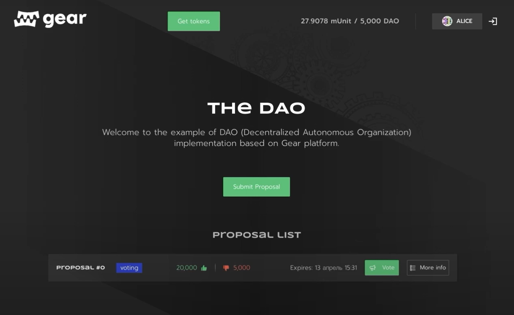

# Decentralized autonomous organization

## Introduction

### What is DAO

A decentralized autonomous organization, or a DAO for short, is a new type of way to run organizations or institutions that enable individuals to work together for a specific cause in transparent, fair and honest ways. DAOs can be thought of as online groups of like-minded individuals that are also collectively owned and managed by the members themselves in equitable ways.

Decisions are governed by proposals and votes to ensure that everyone within a decentralized autonomous organization has a voice. This is significant because it means that no central entity can manipulate anything for personal gain or based on personal beliefs.

DAOs offer safe alternatives to pooling together money for a particular cause. But this isn’t just money that can be ordinarily managed by members. For instance, a group could set up a DAO to govern a charity to begin accepting donations and distributing aid accordingly. However, by far the biggest use cases for DAOs at the moment have been decentralized investment funds. This is where a group of investors create a venture fund that pools capital together and votes transparently on where to allocate the capital.

### DAO application example by Gear

Anyone can easily create their own DAO application and run it on the Gear Network. To do this, Gear created an example of the DAO smart contract, which is available on [GitHub](https://github.com/gear-dapps/dao-light).

This article explains the programming interface, data structure, basic functions and explains their purpose. It can be used as is or modified to suit your own scenarios.

In addition, Gear provides an example implementation of the DAO user interface to demonstrate its interaction with the smart contract in the Gear Network. You can watch a video on how to get the DAO application up and running and its capabilities here: **https://youtu.be/6lxr7eojADw**. The source code for the DAO application is available on [GitHub](https://github.com/gear-dapps/dao-app).

## Interface

### Source files

1. `ft_messages.rs` - contains functions of the fungible token contract. DAO contract interacts with fungible token contract through functions `transfer_tokens` and `balance`:

```rust
pub async fn transfer_tokens(
		&mut self,
		token_id: &ActorId, /// - the fungible token contract address
		from: &ActorId, /// - the sender address
		to: &ActorId, /// - the recipient address
		amount: u128, /// - the amount of tokens
)
```

This function sends a message (the action is defined in the enum `FTAction`) and gets a reply (the reply is defined in the enum `FTEvent`):

```rust
	let transfer_response: FTEvent = msg::send_and_wait_for_reply(
        *token_id, /// - the fungible token contract address,
        FTAction::Transfer(transfer_data), /// - action in the fungible token contract
        0,
    ).unwrap()
     .await
     .expect("Error in transfer tokens");
```

The function balance is defined in a similar way:

```rust
pub async fn balance(
		&mut self,
		token_id: &ActorId, /// - the fungible token contract address
		account: &ActorId, /// - the account address
)
```

and sends a message:

```rust
let balance_response: FTEvent = msg::send_and_wait_for_reply(
        *token_id, /// - the fungible token contract address,
		FTAction::BalanceOf(H256::from_slice(account.as_ref())) /// - action in the fungible token contract
        0,
    ).unwrap()
     .await
     .expect("Error in balance response");
```

2. `lib.rs` - defines the contract logic.

### Structs

The contract has the following structs:

```rust
struct Dao {
    approved_token_program_id: ActorId,
    period_duration: u64,
    voting_period_length: u64,
    grace_period_length: u64,
    total_shares: u128,
    members: BTreeMap<ActorId, Member>,
    proposal_id: u128,
    proposals: BTreeMap<u128, Proposal>,
    locked_funds: u128,
}
```
where:

`approved_token_program_id` - the reference to the token contract (ERC20) that users use as pledge to get the share in the DAO.

`period_duration` - the smallest unit time interval for the DAO, in ms.

`voting_period_length` - voting time interval. Number of intervals for voting time = period duration * voting_period_length.

`grace_period_length` - after the voting period the DAO members are given a period of time in which they can leave the DAO(ragequit) without being diluted and ultimately affected by the proposal’s acceptance into the DAO.


`total_shares` - total shares across all members. Initially it is zero.

`members` - members of the DAO.

`proposal_id` - the index of the last proposal.

`proposals` - all proposals (the proposal queue).

`locked_funds` - tokens that are locked when a funding proposal is submitted.

Parameters `approved_token_program_id`, `period_duration`, `grace_period_length` are set when initializing a contract. The contract is initialized in the function:

```rust
#[no_mangle]
extern "C" fn init() {
    ...
}
```

with the following struct:

```rust
struct InitDao {
    approved_token_program_id: ActorId,
    period_duration: u64,
    voting_period_length: u64,
    grace_period_length: u64,
}
```

The proposal struct:

```rust
 pub struct Proposal {
    pub proposer: ActorId, /// - the member who submitted the proposal
    pub applicant: ActorId, /// - the applicant who wishes to become a member
    pub yes_votes: u128, /// - the total number of YES votes for that proposal
    pub no_votes: u128, /// - the total number of NO votes for that proposal
    pub quorum: u128, /// - a certain threshold of YES votes in order for the proposal to pass
    pub processed: bool, /// - true if the proposal has already been processed
    pub did_pass: bool, /// - true if the proposal has passed
    pub details: String, /// - proposal details
    pub starting_period: u64, /// - the start of the voting period
    pub ended_at: u64, /// - the end of the voting period
    pub votes_by_member: BTreeMap<ActorId, Vote>, /// - the votes on that proposal by each member
}
```
The member struct:

```rust
pub struct Member {
    pub shares: u128, /// - the shares of that member
    pub highest_index_yes_vote: u128, /// - the index of the highest proposal on which the members voted YES (that value is checked when user is going to leave the DAO)
}
```

The actions that the contract receives outside are defined in enum `DaoActions`. The contract's replies are defined in the enum `DaoEvents`.

### DAO functions

- Joining the DAO. Users can call that function in order to send the DAO contract the tokens and become the DAO members.

```rust
 async fn deposit(&mut self, amount: u128)
```

 - The funding proposal. The 'applicant' is an actor that will be funded.

```rust
async fn submit_funding_proposal(
        &mut self,
        applicant: &ActorId,
        amount: u128,
        quorum: u128,
        details: String,
    )
```

 - The member or the delegate address of the member submit his vote (YES or NO) on the proposal.

```rust
async fn submit_vote(
        &mut self,
        proposal_id: u128,
        vote: Vote,
    )
```

 - The right for members to withdraw their capital during the grace period. It can be used when the members don’t agree with the result of the proposal and the acceptance of that proposal can affect their shares. The member can ragequit only if he has voted NO on that proposal.

```rust
async fn ragequit(
    &mut self,
        amount: u128,
    )
```

 - The proposal processing after the proposal competes during the grace period. If the proposal is accepted, the tribute tokens are deposited into the contract and new shares are minted and issued to the applicant. If the proposal is rejected, the tribute tokens are returned to the applicant.

```rust
async fn process_proposal(
        &mut self,
        proposal_id: u128
    )
```

 - These functions are called in `async fn main()` through enum `DaoAction`.

```rust
	#[gstd::async_main]
	async fn main() {
		let action: DaoAction = msg::load().expect("Could not load Action");
    	match action {
            DaoAction::Deposit { amount } => dao.deposit(amount).await,
            DaoAction::SubmitFundingProposal {
                applicant,
                amount,
                quorum,
                details,
            } => {
                dao.submit_funding_proposal(&applicant, amount, quorum, details)
                    .await;
            }
            ...
	}
```
 2. `state.rs` - defines the `State` and `StateReply` enums.  It is important to have the ability to read the contract state off-chain. It is defined in the `fn meta_state()`.  The contract receives a request to read the certain data (the possible requests are defined in the enum `State`) and sends replies. The contracts replies about its state are defined in the enum `StateReply`.

```rust
unsafe extern "C" fn meta_state() -> *mut [i32; 2] {
    let state: State = msg::load().expect("failed to decode input argument");
    let encoded = match state {
        State::UserStatus(account) => {
            let role = if dao.is_member(&account) {
                Role::Member
            } else {
                Role::None
            };
            StateReply::UserStatus(role).encode()
        }
        State::AllProposals => StateReply::AllProposals(dao.proposals.clone()).encode(),
       ...
    };
    gstd::util::to_leak_ptr(encoded)
}
```

## User interface

A [Ready-to-Use application](https://dao.gear-tech.io/) example provides a user interface that interacts with [DAO](https://github.com/gear-dapps/dao-light) and [gFT](https://github.com/gear-dapps/fungible-token) smart contracts.

Gear Fundible Token enables creation of utility token DAO, check [this article](gft-20.md) for details.

This video demonstrates the entire configuration and user interaction workflow: **https://youtu.be/6lxr7eojADw**



A DAO application source code is available on [GitHub](https://github.com/gear-dapps/dao-app).

### Configure basic dApp in .env:

```sh
REACT_APP_NETWORK
REACT_APP_CONTRACT_ERC
REACT_APP_CONTRACT_DAO
```

- `REACT_APP_NETWORK` is Gear network address (wss://rpc-node.gear-tech.io:443)
- `REACT_APP_CONTRACT_ERC` is Fundible Token contract address
- `REACT_APP_CONTRACT_DAO` is DAO contract address

An example is available: [here](https://github.com/gear-dapps/dao-app/blob/master/.env.example)

### How to run

Install required dependencies:
```sh
yarn
```

Run:
```sh
yarn run start
```

## Source code
The source code of this example of DAO smart contract and the example of an implementation of its testing is available on [GitHub](https://github.com/gear-dapps/dao-light).

The extended version of DAO that includes admin, membership proposals and delegated voting can be found at [GitHub](https://github.com/gear-dapps/dao).

The application source code is available in: [https://github.com/gear-dapps/dao-app](https://github.com/gear-dapps/dao-app).

For more details about testing smart contracts written on Gear, refer to the [Program Testing](/docs/developing-contracts/testing) article.
