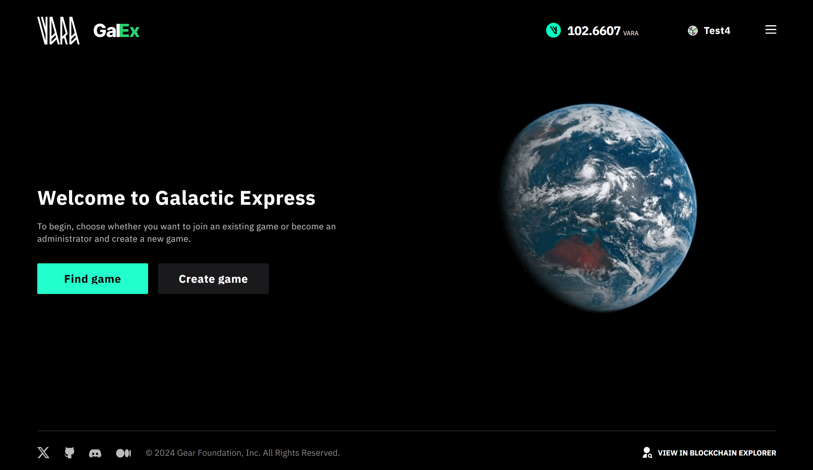

# Galactic Express Game



Galactic Express is a game in which players guide a rocket into space, testing its endurance as it collides with random obstacles. An unpredictable and exciting journey, it challenges players to test their luck and adapt to ever-changing obstacles.

Taking their luck into their own hands, players guide a rocket into outer space, facing challenges such as dynamic weather conditions and varied flight circumstances, making each gameplay experience an exciting adventure.
Players' strategic decisions about fuel allocation and target gains significantly affect the rocket's path, making each playthrough of the game unique.

The article explains the programming interface, data structure, basic functions and explains their purpose. It can be used as is or modified to suit your own scenarios. Anyone can easily create their own application and run it on the Vara Network. The source code is available on [GitHub](https://github.com/gear-foundation/dapps/tree/master/contracts/galactic-express).

## How to run

### The gameplay

Everyone can play the game via this link - [Play Galactic Express](https://galactic-express.vara.network/).

1. Download the pre-built program file of the game via [this link](https://github.com/gear-foundation/dapps/releases/download/nightly/galactic_express.opt.wasm).

2. Go to [Gear Idea](https://idea.gear-tech.io/programs?node=wss%3A%2F%2Frpc.vara.network) portal and Upload the program to the Vara Network:

    a. Connect an account via any supported wallet (VARA tokens are required for gas fees if the program is uploaded to the Vara mainnet, for Vara Network Testent there is an option to request test tokens).

    b. Select the downloaded `.wasm` file to upload, click the `Calculate gas` button, and then the `Upload Program` button, sign the transaction.


3. Once the game program is uploaded to the network, navigate to `Programs`, copy the program's address and paste it into the [game](https://galactic-express.vara.network/).


4. Go to the program's interface, connect the wallet account, paste the address of your program and click `Continue`.

5. Invite up to 3 more friends to play the game - share the program address with them for registration.

6. Players should specify the game parameters for registration - VARA deposit, Payload and Fuel amount and click the `Launch Rocket` button.


7. As soon as everyone registered, the game's admin clicks the `Launch rocket and start Game` button.


The game's program makes turns considering parameters specified by each player. Click the `Play again` and try another parameters to win, have fun :)

### Run the app locally

1. Build a program
> Additional details regarding this matter can be located within the [README](https://github.com/gear-foundation/dapps/tree/master/contracts/galactic-express/README.md) directory of the program.

2. Upload the program to the [Vara Network Testnet](https://idea.gear-tech.io/programs?node=wss%3A%2F%2Ftestnet.vara.network)
> Further details regarding the process of program uploading can be located within the [Getting Started](../../getting-started-in-5-minutes#deploy-your-program-to-the-testnet) section.

3. Build and run user interface
> More information about this can be found in the [README](https://github.com/gear-foundation/dapps/blob/master/frontend/apps/galactic-express/README.md) directory of the frontend.

## Implementation details

### Program description

The program contains the following information

```rust title="galactic-express/src/lib.rs"
struct Contract {
    admin: ActorId,
    session_id: u128,
    altitude: u16,
    weather: Weather,
    reward: u128,
    stage: Stage,
}
```

* `admin` - game admin
* `session_id` - session identifier (game counter)
* `altitude` - flight altitude of the session
* `weather` - session weather conditions
* `reward` - session award
* `stage` - current state of play

There are two possible states: one during the registration stage and the other when the final results are already available

```rust title="galactic-express/io/src/lib.rs"
pub enum Stage {
    Registration(Vec<(ActorId, Participant)>),
    Results(Results),
}
```

The `Participant` structure stores information about its fuel and payload

```rust title="galactic-express/io/src/lib.rs"
pub struct Participant {
    pub fuel_amount: u8,
    pub payload_amount: u8,
}
```

The `Results` record all possible events during the players' turns and the number of scores they have earned

```rust title="galactic-express/io/src/lib.rs"
pub struct Results {
    pub turns: Vec<Vec<(ActorId, Turn)>>,
    pub rankings: Vec<(ActorId, u128)>,
}
```

In flight, a rocket can either use up some amount of fuel or be destroyed by various space conditions, which are described in `HaltReason`

```rust title="galactic-express/io/src/lib.rs"
pub enum Turn {
    Alive { fuel_left: u8, payload_amount: u8 },
    Destroyed(HaltReason),
}
// ...
pub enum HaltReason {
    PayloadOverload,
    FuelOverload,
    SeparationFailure,
    AsteroidCollision,
    FuelShortage,
    EngineFailure,
}
```

### Initialization

This program has no input data for initialization, and anyone who uploads the program to the network automatically becomes an admin

```rust title="galactic-express/src/lib.rs"
fn process_init() -> Result<(), Error> {
    unsafe {
        STATE = Some((
            Contract {
                admin: msg::source(),
                ..Default::default()
            },
            TransactionManager::new(),
        ));
    }

    Ok(())
}
```

### Action

```rust title="galactic-express/io/src/lib.rs"
pub enum Action {
    // applies when you need to change admins
    ChangeAdmin(ActorId),
    // creates a new game session
    CreateNewSession,
    // action for player registration
    Register(Participant),
    // start the game (only available to admin)
    StartGame(Participant),
}
```

### Event

```rust title="galactic-express/io/src/lib.rs"
pub enum Event {
    AdminChanged(ActorId, ActorId),
    NewSession(Session),
    Registered(ActorId, Participant),
    GameFinished(Results),
}
```
```rust title="galactic-express/io/src/lib.rs"
pub struct Session {
    pub session_id: u128,
    pub altitude: u16,
    pub weather: Weather,
    pub reward: u128,
}
```

### Logic

A new game session must be set up using `Action::CreateNewSession` to start the game.

Upon the inception of a new session, random values, encompassing aspects like weather conditions, altitude settings, fuel prices, and potential rewards, are dynamically generated.

```rust title="galactic-express/src/lib.rs"
fn create_new_session(&mut self) -> Result<Event, Error> {
    let stage = &mut self.stage;

    match stage {
        Stage::Registration(participants) => {
            check_admin(self.admin)?;
            participants.clear();
        }
        Stage::Results { .. } => *stage = Stage::Registration(HashMap::new()),
    }

    let mut random = Random::new()?;

    self.weather = match random.next() % (Weather::Tornado as u8 + 1) {
        0 => Weather::Clear,
        1 => Weather::Cloudy,
        2 => Weather::Rainy,
        3 => Weather::Stormy,
        4 => Weather::Thunder,
        5 => Weather::Tornado,
        _ => unreachable!(),
    };
    self.altitude = random.generate(TURN_ALTITUDE.0, TURN_ALTITUDE.1) * TURNS as u16;
    self.reward = random.generate(REWARD.0, REWARD.1);

    Ok(Event::NewSession(Session {
        session_id: self.session_id,
        altitude: self.altitude,
        weather: self.weather,
        reward: self.reward,
    }))
}
```

After successfully creating a new session, players can begin registration: `Action::Register(Participant)`

```rust title="galactic-express/src/lib.rs"
fn register(&mut self, participant: Participant) -> Result<Event, Error> {
    let msg_source = msg::source();

    if msg_source == self.admin {
        return Err(Error::AccessDenied);
    }
    if let Stage::Results(_) = self.stage {
        return Err(Error::SessionEnded);
    }

    let participants = self.stage.mut_participants()?;

    if participants.len() >= PARTICIPANTS - 1 {
        return Err(Error::SessionFull);
    }

    participant.check()?;
    participants.insert(msg_source, participant);

    Ok(Event::Registered(msg_source, participant))
}
```
This function checks the game stage, the number of registered players and the participant's input data.

Input values of fuel and payload cannot be exceeded by predetermined values


```rust title="galactic-express/io/src/lib.rs"
// maximum fuel value that can be entered by the user
pub const MAX_FUEL: u8 = 100;
// maximum payload value that can be entered by the user
pub const MAX_PAYLOAD: u8 = 100;
// ...
impl Participant {
    pub fn check(&self) -> Result<(), Error> {
        if self.fuel_amount > MAX_FUEL || self.payload_amount > MAX_PAYLOAD {
            Err(Error::FuelOrPayloadOverload)
        } else {
            Ok(())
        }
    }
}
```

After players have successfully registered, the admin can initiate the game using the `Action::StartGame(Participant)` action. This action involves several checks on the admin, the number of participants, and their data.


```rust title="galactic-express/src/lib.rs"
async fn start_game(&mut self, mut participant: Participant) -> Result<Event, Error> {
    self.check_admin()?;

    let participants = self.stage.mut_participants()?;

    if participants.is_empty() {
        return Err(Error::NotEnoughParticipants);
    }

    participant.check()?;
// ...
```

Turns are automatically and randomly generated for each participant, which include three tests of luck.

These moves include both events beyond the control of the participant and events that could occur if the participant decides to take a risk by specifying more fuel and payload. More details about the math of the game can be found in the [README](https://github.com/gear-foundation/dapps/tree/master/contracts/galactic-express#math)


```rust title="galactic-express/src/lib.rs"
fn turn(
    turn: usize,
    remaining_fuel: u8,
    random: &mut Random,
    weather: Weather,
    payload: u8,
) -> Result<u8, HaltReason> {
    let new_remaining_fuel =
        match remaining_fuel.checked_sub((payload + 2 * weather as u8) / TURNS as u8) {
            Some(actual_fuel) => actual_fuel,
            None => return Err(HaltReason::FuelShortage),
        };

    match turn {
        0 => {
            // values in "chance" are transmitted as percentages
            if random.chance(3) {
                return Err(HaltReason::EngineFailure);
            }
            // this trap for someone who specified a lot of fuel
            if remaining_fuel >= PENALTY_LEVEL - 2 * weather as u8 && random.chance(10) {
                return Err(HaltReason::FuelOverload);
            }
        }
        1 => {
            // this trap for someone who specified a lot of payload
            if payload >= PENALTY_LEVEL - 2 * weather as u8 && random.chance(10) {
                return Err(HaltReason::PayloadOverload);
            }

            if random.chance(5 + weather as u8) {
                return Err(HaltReason::SeparationFailure);
            }
        }
        2 => {
            if random.chance(10 + weather as u8) {
                return Err(HaltReason::AsteroidCollision);
            }
        }
        _ => unreachable!(),
    }

    Ok(new_remaining_fuel)
}
```

If a participant crashes for any reason, the player receives zero points and, accordingly, loses the game. If the player successfully completes all three parts of the game, the points are counted to determine the winner.

```rust title="galactic-express/src/lib.rs"
let mut scores: Vec<(ActorId, u128)> = turns
    .iter()
    .map(|(actor, turns)| {
        let last_turn = turns.last().expect("there must be at least 1 turn");

        (
            *actor,
            match last_turn {
                Turn::Alive {
                    fuel_left,
                    payload_amount,
                } => (*payload_amount as u128 + *fuel_left as u128) * self.altitude as u128,
                Turn::Destroyed(_) => 0,
            },
        )
    })
    .collect();
```

## Program metadata and state
Metadata interface description:

```rust title="galactic-express/io/src/lib.rs"
pub struct ContractMetadata;

impl Metadata for ContractMetadata {
    type Init = Out<Result<(), Error>>;
    type Handle = InOut<Action, Result<Event, Error>>;
    type Reply = ();
    type Others = ();
    type Signal = ();
    type State = Out<State>;
}
```

To display the program state information, the `state()` function is used:

```rust title="galactic-express/src/lib.rs"
#[no_mangle]
extern fn state() {
    let (state, _tx_manager) = unsafe { STATE.take().expect("Unexpected error in taking state") };
    msg::reply::<State>(state.into(), 0)
        .expect("Failed to encode or reply with `State` from `state()`");
}

```

## Source code

The source code of this example of Galactic-Express Game program and the example of an implementation of its testing is available on [gear-foundation/dapp/contracts/galactic-express](https://github.com/gear-foundation/dapps/tree/master/contracts/galactic-express).

See also an example of the program testing implementation based on `gtest`: [gear-foundation/dapps/galactic-express/tests](https://github.com/gear-foundation/dapps/tree/master/contracts/galactic-express/tests).

For more details about testing programs written on Gear, refer to the [Program Testing](/docs/developing-contracts/testing) article.
