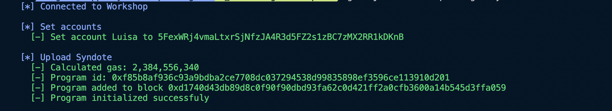

# Monopoly game (Syndote)

Syndote is the name of a Monopoly-like decentralized game that works **completely on-chain**. It has no backend or any centralized components, the user interface interacts directly with the smart contract uploaded in the Gear Network.

This is a "game strategies battle" where players compete with each other by implementing various playing strategies uploaded as smart-contracts into the network.

Syndote consists of Master contract and Player contracts. Master contract is the main contract that starts and controls the game. Player contracts implement the game strategies that can be unique for each participant of the game.

After the game starts, all moves in the game take place automatically, but the UI provides an ability to jump to each one individually to analyze the player's strategy. To complete the game and determine the winner, many moves are required, which are processed over several blocks. In order for the Master contract to have enough gas to perform all the moves, the [gas reservation](/developing-contracts/gas-reservation.md) technology is used.


To launch the game, you need to:

- ⚒️ Build Master and Player contracts
- 🏗️ Upload the contracts to the network
- 🖥️ Build and run user interface

## ⚒️ Build Master and Player contracts

- Get the source code of Master and Player contracts from [GitHub](https://github.com/gear-foundation/dapps/tree/master/contracts/syndote).
- Modify Player's contract as you wish to achieve optimal game strategy.
- Build contracts as described in [program/README.md](https://github.com/gear-foundation/dapps/blob/master/contracts/syndote/README.md).

## 🏗️ Upload contracts on chain

There are two ways to upload the game onto the chain:
1. Using [Gear IDEA portal](https://idea.gear-tech.io/);
2. Using [`gear-js/cli`](https://github.com/gear-tech/gear-js/tree/main/tools/cli).

### 1. Using Gear IDEA portal:

- In the network selector select the network where you are going to run the game:
    - Vara Network Testnet - wss://testnet.vara.network;
    - Local node - ws://localhost:9944
- Upload Master and Player contracts:
    - Click the `Upload Program` button and specify `x.opt.wasm` file of the program, also specify the `*.txt` file with metadata for Master and Palyer contracts accordingly.
    - Save the addresses of the uploaded programs.
- Make gas reservations to ensure continuous game execution.
    - Find your uploaded Master contract and click the `Send message` button:
    
    - Currently the single gas reservation amount can be up to 245 000 000 000 since it is not yet possible to make a reservation more than the block gas limit (250 000 000 000). To make sure the Master contract has enough gas to run and complete the game, it is recommended to make at least 5-10 reservations.

### 2. Using [`gear-js/cli`](https://github.com/gear-tech/gear-js/tree/main/tools/cli)

It allows sending transactions to the Gear node based on `yaml` file:
- Go to folder with [scripts](https://github.com/gear-foundation/dapps/tree/master/frontend/dev/syndote-upload-game):
    ```
    cd ./syndote-upload-game/
    ```
- Upload previously built files into `/programs` folder (replace if necessary): `player.meta.txt`, `syndote.meta.txt`, `player.opt.wasm`, `syndote.opt.wasm`

- Install `gear-js/cli`:
    ```
    npm install -g @gear-js/cli
    ```
- Upload the master contract. The `upload-game.yaml` file contains a transaction that will deploy the contract onto the network, check [README](https://github.com/gear-tech/gear-js/tree/main/tools/cli) for more details.

- Customize the following parameters:

    - Specify the accounts using on of these methods - mnemonic phrase, seed or Using well-known account such as `Alice` and `Bob`
	```
    	accounts:
  		alice: 'bottom drive obey lake curtain smoke basket hold race lonely fit walk'
		bob: //Bob
		my_account: '0x…seed'
    	transactions:
		account: alice
    	```

    - You can also specify which node you want to deploy the contract on by defining the variable `wsAddress` in the file with transactions. If this variable is not defined, the contract will be deployed on the local node which should be running beforehand:
    	```
    	wsAddress: wss://testnet.vara.network
    	```

- To deploy the contract, run the command:
    ```
    gear-js workflow upload-game.yaml
    ```

- If everything goes well, you will see the contract address in the terminal:
    

- To run the application, it is necessary to save this address and later specify it as a variable in the `.env` file.

- Make gas reservations to ensure continuous game execution. Open `reserve-gas.yaml` file and customize account and node address as described above. Run the command with the master contract address specified:
    ```
    gear-js workflow reserve-gas.yaml -a program_id='0x60663aaee2971eb60874b63c92e738cc375f3764a1d3b38d65cbc63d8ee8f70c'
    ```

- If everything goes well, you will see a message confirming a successful reservation. Please send this message 5-10 times to ensure uninterrupted gameplay.

    

- Upload players contracts to the network. For testing purposes, you can upload 4 identical player contracts. After initialization in the network, their addresses will be unique and you will then need to register them in the game. Open `players.yaml` file and customize account and node address as described above. Run the command to add players in the game:
    ```
    gear-js workflow players.yaml
    ```

- You will see the players addresses:
    

- Additionally, you can write your own player contract, build it, and place the `.opt.wasm` and `.meta.txt` files into the `upload-game/programs` folder.
    To deploy your player, specify the necessary files in the `players.yaml` file instead of any existing player.
    

## 🖥️ Build and run user interface

1. Download [this repository](https://github.com/gear-foundation/dapps/tree/master/frontend/apps/syndote) locally and go to the `frontend` folder.
2. Install packages:
```sh
yarn install
```
3. Declare environment variables, go to `/frontend/` foler, create new `.env` file, check `.env.example` file to get necessary variables:
    - `REACT_APP_SYNDOTE_NODE_ADDRESS` - in this parameter specify the address of the node on which you deployed the contracts.
    - `REACT_APP_CONTRACT_ADDRESS` - in this parameter specify the address of the deployed master contract.
4. Put the latest version of the `syndote.meta.txt` file locally in `src/assets/wasm/` folder, replace if necessary.

:::note
In order for all features to work as expected, the node and its runtime version should be chosen based on the current `@gear-js/api` version. In case of issues with the application, try to switch to another network or run your own local node and specify its address in the `.env` file. When applicable, make sure the smart contract(s) wasm files are uploaded and running in this network accordingly.
Also, you can try `npm i --force` in case of `yarn install` issues.
:::

5. Run the app:
```sh
yarn start
```

## Run the game
1. Find the players addresses you have prevously uploaded.

2. Register players in the application's interface one after another. Each player registration is a transaction that needs to be signed. It is possible to register up to 4 players.

3. Once everything is done, start the game via the `Play` button. You will see the game result almost instantly. Click `<` and `>` buttons to navigate through the game and check each separate move.


4. If the game is not over, make more reservations and send a message `GameAction::Play` again. After the game is over, it's state becomes Finished and the admin can restart the game by starting a new player registration.

## Smart contracts
### Master contract

[Master contract](https://github.com/gear-foundation/dapps/tree/master/contracts/syndote/src) is initialized with monopoly card information (cell cost, special cells: jail, lottery). As was already mentioned, it is given enough gas reservation for automatic play. Before each player's step `Master` contract checks the amount of gas and if it is not enough it will send a message to the game admin to request for another gas reservation.

**Players registration**:
Players deploy their strategic contracts and send a message `Register` to `Master` contract. Master contract:
- Adds the players the list of participants and initializes it with the following structure:
```rust
struct PlayerInfo {
    position: 0,
	balance: 15000,
    debt: 0,
	in_jail: false,
	round: 0,
    cells: BTreeSet::new(),
    penalty: 0,
    lost: false,
}
```
- If the number of participants is 4, `Master` contract goes to the state of waiting for the start of the game.

When the required number of participants is reached, the admin sends a message `Play` to `Master` contract. This message starts an automated game that will scroll through the algorithms of the participants in turn:
- `Master`contract starts the round. Each round contains 4 steps (Each player makes one step). Before each step `Master` contract checks the states of the participants (whether they are bankrupt or may be there is already a winner);
- Each step contains the interaction with the strategic contract in turn:
- If the number of steps in the current round is 4, `Master` contract starts the following round.


**Strategic messages:**
[Strategic contracts](https://github.com/gear-foundation/dapps/tree/master/contracts/syndote/player) send strategic messages depending on the position on the monopoly field. A player may be in one of the following positions:
- A cell with his own property. A player has a right:
   - To add a gear on the cell. The gear can be `Bronze`, `Silver` or `Gold`;
   - To upgrade a gear (from `Bronze` to `Silver` and from `Silver` to `Gold`);
- Do nothing.
During actions `AddGear` and `Upgrade` a player can sell his other properties to the bank if he does not have enough balance.
- A cell with other properties. A player has to pay rent. If he has not enough balance, he can sell his properties to the bank. Otherwise he is declared bankrupt.
- Sell with properties which no one has bought yet. A player has a right:
  - Buy cell (with option to sell properties to the bank if not enough balance);
  - Do nothing.

- Jail. A player can throw the rolls. If it is double he gets out of the jail and his position is moved for the roll sum. If it is not a double a player can pay a fine or wait for the next round to throw the rolls again.
- Empty cells. In the `Master` contract there are cells that are not filled with anything. The developers themselves can expand the functionality of the game and add different game mechanics.

### Player's contract
`Player` is a contract in which the monopoly game strategy is implemented. It must meet the following requirements:
- It has to accept the following message from `Master` contract:
    ```rust title="syndote/io/src/lib.rs"
    pub struct YourTurn {
        pub players: Vec<(ActorId, PlayerInfo)>,
        pub properties: Vec<Option<(ActorId, Gears, Price, Rent)>>,
    }
    ```
    That struct contains the information about the state of all players and about the monopoly fields and built gears.
- Based on the information received, the strategic contract has to make a move (`BuyCell`, `AddGear`, `Upgrade`, `PayRent`, `ThrowRolls` etc). The move must be the asynchronous message to the monopoly contract.
- The move has to be made correctly. For example, if a player is in an already occupied field and tries to buy it, then `Master`contract will fine him. Each wrong step is penalized with one point. If a player scores 5 penalty points, it is out of the game.
- After the step a player has to send a reply to the monopoly contract. This way the monopoly contract knows about the completion of the step. The reply can be a simple empty message.
- If a player's contract doesn’t reply, `Master` contract will remove that player from the game.
- `Master` contract gives a limited amount of gas per turn. That amount is quite enough for the move, but if the player's contract contains an incorrect logic (for example, an infinite loop), it will be removed from the game.
