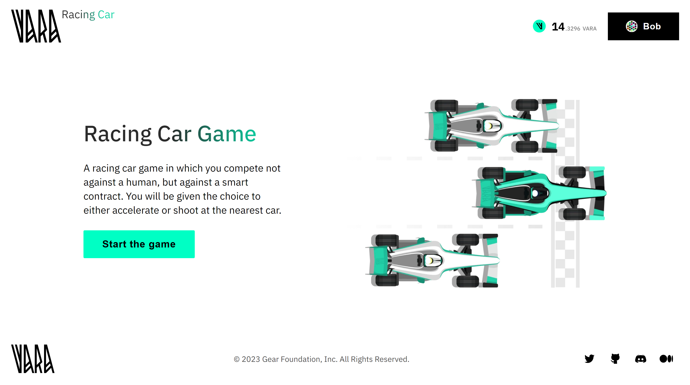

# Racing Cars - Algorithmic Game

The Racing Cars game revolves around a competition of smart contract algorithms. In essence, participants upload their personalized smart contract strategies, all managed by a central Master contract. These strategies are open to optimization and can be re-uploaded. 



In a well-known Ethereum-based [0xMonaco](https://0xmonaco.ctf.paradigm.xyz/) game, central components were necessary to enable multi-block gameplay. However, in the case of Vara, the game operates <u>fully on-chain</u>, thanks to the asynchronous messaging paradigm. Various actors (contracts) communicate with each other, and if a game round can't be accommodated within a single block, it carries over into subsequent ones.

For this example version, the game was refined to enhance its appeal. The game entails a competition where a user races against two pre-uploaded smart contracts on the blockchain. Three cars vie to be the first to cross the finish line in several moves. Both the user and the contract algorithms decide their next move – whether to accelerate or sabotage another car to slow it down.

The source code for the game contract and algorithm examples are available on [GitHub](https://github.com/gear-foundation/dapps/tree/master/contracts/car-races). 
The [frontend application](https://github.com/gear-foundation/dapps/tree/master/frontend/racing-car-game) facilitates gameplay and interacts with the smart contracts.
This article describes the program interface, data structure, basic functions and explains their purpose. It can be used as is or modified to suit your own scenarios.

Everyone can play the game via this link - [Play Racing Cars](https://racing.vara-network.io/) (VARA tokens are requred for gas fees).

## How to run

1. Build a contract
> Additional details regarding this matter can be located within the [README](https://github.com/gear-foundation/dapps/tree/master/contracts/car-races/README.md) directory of the contract.

2. Upload the contract to the [Vara Network Testnet](https://idea.gear-tech.io/programs?node=wss%3A%2F%2Ftestnet.vara.rs)
> Initiate the process by uploading the bot contract, followed by the subsequent upload of the main contract. Further details regarding the process of contract uploading can be located within the [Getting Started](../../getting-started-in-5-minutes/#deploy-your-smart-contract-to-the-testnet) section.

3. Build and run user interface 
> More information about this can be found in the [README](https://github.com/gear-foundation/dapps/tree/master/frontend/racing-car-game/README.md) directory of the frontend.

## Implementation details

### Contract description

The contract contains the following information

```rust title="car-races/src/lib.rs"
pub struct Contract {
    pub admins: Vec<ActorId>,
    pub strategy_ids: Vec<ActorId>,
    pub games: HashMap<ActorId, Game>,
    pub msg_id_to_game_id: HashMap<MessageId, ActorId>,
    pub config: Config,
    pub messages_allowed: bool,
}
```

* `admins` - game admins
* `strategy_ids` - program strategy ids
* `games` - game information for each player
* `msg_id_to_game_id` - this field is responsible for tracking strategy id reply messages
* `config` - game configuration
* `messages_allowed` - access to playability


Where `Game` is defined as follows:

```rust title="car-races/io/src/lib.rs"
pub struct Game {
    pub cars: BTreeMap<ActorId, Car>,
    pub car_ids: Vec<ActorId>,
    pub current_turn: u8,
    pub state: GameState,
    pub result: Option<GameResult>,
    pub current_round: u32,
    pub last_time_step: u64,
}
```
```rust title="car-races/io/src/lib.rs"
pub struct Car {
    pub position: u32,
    pub speed: u32,
    pub car_actions: Vec<RoundAction>,
    pub round_result: Option<RoundAction>,
}
```

### Initialization

To initialize the game contract, it only needs to be passed the game configuration 

```rust title="car-races/src/lib.rs"
#[no_mangle]
extern fn init() {
    let init_msg: GameInit = msg::load().expect("Unable to load the message");

    unsafe {
        CONTRACT = Some(Contract {
            admins: vec![msg::source()],
            config: init_msg.config,
            games: HashMap::with_capacity(20_000),
            msg_id_to_game_id: HashMap::with_capacity(5_000),
            ..Default::default()
        });
    }
}
```

```rust title="car-races/io/src/lib.rs"
pub struct GameInit {
    pub config: Config,
}
//
pub struct Config {
    pub gas_to_remove_game: u64,
    pub initial_speed: u32,
    pub min_speed: u32,
    pub max_speed: u32,
    pub gas_for_round: u64,
    pub time_interval: u32,
    pub max_distance: u32,
    pub time: u32,
    pub time_for_game_storage: u64,
}

```
* `gas_to_remove_game` - gas to delete a game using delayed messages
* `initial_speed` - initial speed of the cars
* `min_speed` - the minimum speed to which the car can decelerate
* `max_speed` - the maximum speed to which the car can accelerate
* `gas_for_round` - gas for one round
* `time_interval` - time after which the game should be deleted using delayed messages
* `max_distance` - race distance
* `time` - the time the car travels each turn
* `time_for_game_storage` - game data storage time

### Action

```rust title="car-races/io/src/lib.rs"
pub enum GameAction {
    AddAdmin(ActorId),
    RemoveAdmin(ActorId),
    AddStrategyIds {
        car_ids: Vec<ActorId>,
    },
    StartGame,
    Play {
        account: ActorId,
    },
    PlayerMove {
        strategy_action: StrategyAction,
    },
    UpdateConfig {
        gas_to_remove_game: Option<u64>,
        initial_speed: Option<u32>,
        min_speed: Option<u32>,
        max_speed: Option<u32>,
        gas_for_round: Option<u64>,
        time_interval: Option<u32>,
        time_for_game_storage: Option<u64>,
    },
    RemoveGameInstance {
        account_id: ActorId,
    },
    RemoveGameInstances {
        players_ids: Option<Vec<ActorId>>,
    },
    AllowMessages(bool),
}
```

### Reply

```rust title="car-races/io/src/lib.rs"
pub enum GameReply {
    GameStarted,
    NotEnoughGas,
    GameFinished,
    GasReserved,
    StrategyAdded,
    PlayersMove,
}
```

### Logic

Before starting the game, the program must specify the address of the opponent machines' programs using the command `GameAction::AddStrategyIds{car_ids: Vec<ActorId>}`, but this is only available to the admin.

```rust title="car-races/src/lib.rs"
fn add_strategy_ids(&mut self, car_ids: Vec<ActorId>) {
    assert!(self.admins.contains(&msg::source()), "You are not admin");

    assert!(car_ids.len() == 2, "There must be 2 strategies of cars");
    self.strategy_ids = car_ids;
}

```

After successfully adding programs, the game can be initialized using the command `GameAction::StartGame`

```rust title="car-races/src/lib.rs"
fn start_game(&mut self) {
    let player = msg::source();

    let last_time_step = exec::block_timestamp();

    let game = if let Some(game) = self.games.get_mut(&player) {
        if game.state != GameState::Finished {
            panic!("Please complete the game");
        }
        game.current_round = 0;
        game.result = None;
        game.last_time_step = last_time_step;
        game
    } else {
        self.games.entry(player).or_insert_with(|| Game {
            last_time_step,
            ..Default::default()
        })
    };

    game.car_ids = vec![player, self.strategy_ids[0], self.strategy_ids[1]];
    let initial_state = Car {
        position: 0,
        speed: self.config.initial_speed,
        car_actions: Vec::new(),
        round_result: None,
    };

    game.cars.insert(player, initial_state.clone());
    game.cars
        .insert(self.strategy_ids[0], initial_state.clone());
    game.cars.insert(self.strategy_ids[1], initial_state);

    game.state = GameState::PlayerAction;
    msg::reply(GameReply::GameStarted, 0).expect("Error during reply");
}
```
Now it's possible to make a move with the command `GameAction::PlayerMove {strategy_action: StrategyAction}`
This action saves the player's move and changes the game state, after which the move is passed to the bots and a message is sent to the bot's address to make the move.

```rust title="car-races/src/lib.rs"
fn player_move(&mut self, strategy_move: StrategyAction) {
    let player = msg::source();
    let game = self.get_game(&player);

    assert_eq!(
        game.state,
        GameState::PlayerAction,
        "Not time for the player"
    );
    match strategy_move {
        StrategyAction::BuyAcceleration => {
            game.buy_acceleration();
        }
        StrategyAction::BuyShell => {
            game.buy_shell();
        }
        StrategyAction::Skip => {}
    }

    game.state = GameState::Race;
    game.last_time_step = exec::block_timestamp();
    let num_of_cars = game.car_ids.len() as u8;

    game.current_turn = (game.current_turn + 1) % num_of_cars;

    let car_id = game.get_current_car_id();

    let msg_id = msg::send_with_gas(
        car_id,
        CarAction::YourTurn(game.cars.clone()),
        self.config.gas_for_round,
        0,
    )
    .expect("Error in sending a message");

    self.msg_id_to_game_id.insert(msg_id, player);
}
```
We receive messages from the machine contract in `handle_reply()`, where the game state also changes depending on what move the bot has made.

```rust title="car-races/src/lib.rs"
#[no_mangle]
extern fn handle_reply() {
    let reply_to = msg::reply_to().expect("Unable to get the msg id");
    let contract = unsafe { CONTRACT.as_mut().expect("The game is not initialized") };

    let game_id = contract
        .msg_id_to_game_id
        .remove(&reply_to)
        .expect("Unexpected reply");

    let game = contract
        .games
        .get_mut(&game_id)
        .expect("Unexpected: Game does not exist");

    let bytes = msg::load_bytes().expect("Unable to load bytes");
    // car eliminated from race for wrong payload
    if let Ok(strategy) = StrategyAction::decode(&mut &bytes[..]) {
        match strategy {
            StrategyAction::BuyAcceleration => {
                game.buy_acceleration();
            }
            StrategyAction::BuyShell => {
                game.buy_shell();
            }
            StrategyAction::Skip => {}
        }
    } else {
        // car eliminated from race for wrong payload
        let current_car_id = game.get_current_car_id();
        game.car_ids.retain(|car_id| *car_id != current_car_id);
    }
    let num_of_cars = game.car_ids.len() as u8;

    game.current_turn = (game.current_turn + 1) % num_of_cars;

    // if one round is made, then we update the positions of the cars
    // and send a message about the new position of the fields
    if game.current_turn == 0 {
        game.current_round = game.current_round.saturating_add(1);
        game.update_positions(&contract.config);
    }

    msg::send(exec::program_id(), GameAction::Play { account: game_id }, 0)
        .expect("Error in sending a msg");
}
```
At the end of `handle_reply()` the `GameAction::Play` is called, which can only be called by the program itself.
This action is needed to track the game status and send a message to another bot.

```rust title="car-races/src/lib.rs"
fn play(&mut self, account: &ActorId) {
    assert_eq!(
        msg::source(),
        exec::program_id(),
        "Only program can send this message"
    );

    let game = self.get_game(account);

    if game.state == GameState::Finished {
        let result = game.result.clone();
        let cars = game.cars.clone();
        let car_ids = game.car_ids.clone();
        self.send_messages(account);
        send_message_round_info(&car_ids[0], &cars, &result);
        return;
    }
    if game.current_turn == 0 {
        game.state = GameState::PlayerAction;
        let result = game.result.clone();
        let cars = game.cars.clone();
        let car_ids = game.car_ids.clone();
        send_message_round_info(&car_ids[0], &cars, &result);
        return;
    }

    let car_id = game.get_current_car_id();

    let msg_id = msg::send(car_id, CarAction::YourTurn(game.cars.clone()), 0)
        .expect("Error in sending a message");

    self.msg_id_to_game_id.insert(msg_id, *account);
}
```
However, if the bots have already made their move, a message is sent to the player informing them of the end of the round and game information.

```rust title="car-races/src/lib.rs"
fn send_message_round_info(
    account: &ActorId,
    cars_info: &BTreeMap<ActorId, Car>,
    result: &Option<GameResult>,
) {
    let mut cars = Vec::new();
    for (car_id, info) in cars_info.iter() {
        cars.push((*car_id, info.position, info.round_result.clone()));
    }
    msg::send(
        *account,
        RoundInfo {
            cars,
            result: result.clone(),
        },
        0,
    )
    .expect("Unable to send the message about round info");
}
```

If the game is completed, a **delayed message** will also be sent to delete the game from the program state

```rust title="car-races/src/lib.rs"
fn send_messages(account: &ActorId, config: &Config) {
    msg::send_with_gas_delayed(
        exec::program_id(),
        GameAction::RemoveGameInstance {
            account_id: *account,
        },
        config.gas_to_remove_game,
        0,
        config.time_interval,
    )
    .expect("Error in sending message");
}
```


## Program metadata and state
Metadata interface description:

```rust title="car-races/io/src/lib.rs"
pub struct ContractMetadata;

impl Metadata for ContractMetadata {
    type Init = In<GameInit>;
    type Handle = InOut<GameAction, GameReply>;
    type Others = InOut<(), RoundInfo>;
    type Reply = ();
    type Signal = ();
    type State = InOut<StateQuery, StateReply>;
}
```
One of Gear's features is reading partial states. 

```rust title="car-races/io/src/lib.rs"
pub enum StateQuery {
    Admins,
    StrategyIds,
    Game { account_id: ActorId },
    AllGames,
    MsgIdToGameId,
    Config,
    MessagesAllowed,
}
```

```rust title="car-races/io/src/lib.rs"
pub enum StateReply {
    Admins(Vec<ActorId>),
    StrategyIds(Vec<ActorId>),
    Game(Option<Game>),
    AllGames(Vec<(ActorId, Game)>),
    MsgIdToGameId(Vec<(MessageId, ActorId)>),
    WaitingMsgs(Vec<(MessageId, MessageId)>),
    Config(Config),
    MessagesAllowed(bool),
}

```

To display the contract state information, the `state()` function is used:

```rust title="car-races/src/lib.rs"
#[no_mangle]
extern fn state() {
    let Contract {
        admins,
        strategy_ids,
        games,
        msg_id_to_game_id,
        config,
        messages_allowed,
    } = unsafe { CONTRACT.take().expect("Failed to get state") };
    let query: StateQuery = msg::load().expect("Unable to load the state query");

    match query {
        StateQuery::Admins => {
            msg::reply(StateReply::Admins(admins), 0).expect("Unable to share the state");
        }
        StateQuery::StrategyIds => {
            msg::reply(StateReply::StrategyIds(strategy_ids), 0)
                .expect("Unable to share the state");
        }
        StateQuery::Game { account_id } => {
            let game = games.get(&account_id).cloned();
            msg::reply(StateReply::Game(game), 0).expect("Unable to share the state");
        }
        StateQuery::AllGames => {
            msg::reply(StateReply::AllGames(games.into_iter().collect()), 0)
                .expect("Unable to share the state");
        }
        StateQuery::MsgIdToGameId => {
            msg::reply(
                StateReply::MsgIdToGameId(msg_id_to_game_id.into_iter().collect()),
                0,
            )
            .expect("Unable to share the state");
        }
        StateQuery::Config => {
            msg::reply(StateReply::Config(config), 0).expect("Unable to share the state");
        }
        StateQuery::MessagesAllowed => {
            msg::reply(StateReply::MessagesAllowed(messages_allowed), 0)
                .expect("Unable to share the state");
        }
    }
}
```

## Source code

The source code of this example of Racing Cars Game smart contract and the example of an implementation of its testing is available on [gear-foundation/dapp/contracts/car-races](https://github.com/gear-foundation/dapps/tree/master/contracts/car-races).

See also an example of the smart contract testing implementation based on `gtest`: [gear-foundation/dapps/car-races/tests](https://github.com/gear-foundation/dapps/tree/master/contracts/car-races/tests).

For more details about testing smart contracts written on Gear, refer to the [Program Testing](/docs/developing-contracts/testing) article.
