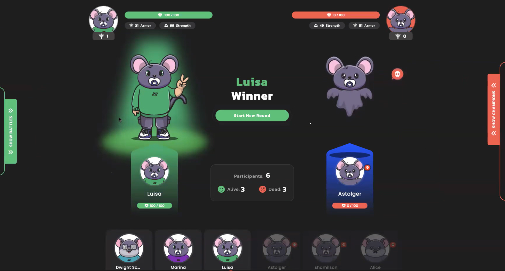

# Tamagotchi Battle



Welcome to the exciting world of Tamagotchi Battle! In this fascinating game your faithful companions - Tamagotchi - are ready to fight each other in pursuit of glory and victory. In this game, you need to use your Tamagotchi, which was described in the [previous article](tamagotchi.md).

To win, you'll have to skillfully manage your Tamagotchi and apply strategy. Take turns making moves, pave your way to success and, of course, rely on luck. In the Tamagotchi Battle Game, your engaging and exciting strategy can take you to the top.

The article explains the programming interface, data structure, basic functions and explains their purpose. It can be used as is or modified to suit your own scenarios. Anyone can easily create their own application and run it on the Vara Network. The source code is available on [GitHub](https://github.com/gear-foundation/dapps/tree/master/contracts/tamagotchi-battle).

## How to run

1. Build a contract
> Additional details regarding this matter can be located within the [README](https://github.com/gear-foundation/dapps/tree/master/contracts/tamagotchi-battle/README.md) directory of the contract.

2. Upload the contract to the [Vara Network Testnet](https://idea.gear-tech.io/programs?node=wss%3A%2F%2Ftestnet.vara.rs)
> Further details regarding the process of contract uploading can be located within the [Getting Started](../../getting-started-in-5-minutes/#deploy-your-smart-contract-to-the-testnet) section.

3. Build and run user interface 
> More information about this can be found in the [README](https://github.com/gear-foundation/dapps/tree/master/frontend/tamagotchi-battle/frontend/README.md) directory of the frontend.

## Implementation details

### Tamagotchi Battle contract description

The Tamagotchi Battle contract contains the following information

```rust title="tamagotchi-battle/src/lib.rs"
struct Battle {
    admins: Vec<ActorId>,
    players: BTreeMap<ActorId, Player>,
    players_ids: Vec<ActorId>,
    current_players: Vec<ActorId>,
    state: BattleState,
    current_winner: ActorId,
    pairs: BTreeMap<PairId, Pair>,
    players_to_pairs: BTreeMap<ActorId, Vec<PairId>>,
    completed_games: u8,
    reservations: BTreeMap<ActorId, ReservationId>,
}
```

* `admins` - administrators, who can start the battle and each new round
* `players` - list of player parameters
* `players_ids` - the actual tamagotchi id's that are playing
* `current_players` - list of all registered tamagotchi
* `state` - current battle stage
* `current_winner` - winner of the last battle
* `pairs` - list of pair parameters
* `players_to_pairs` - matching players and their pair_ids
* `completed_games` - the number of pairs that finished the battle
* `reservations` - reservations id for delayed messages

`Player` structure looks as follows: 

```rust title="tamagotchi-battle/io/src/lib.rs"
pub struct Player {
    pub owner: ActorId,
    pub name: String,
    pub date_of_birth: u64,
    pub tmg_id: TamagotchiId,
    pub defence: u16,
    pub power: u16,
    pub health: u16,
    pub color: String,
    pub victories: u32,
}
```
* `owner` - owner's address
* `name` - Tamagotchi name 
* `date_of_birth` - Tamagotchi's birthday
* `tmg_id` - Tamagotchi id 
* `defence` - level of protection 
* `power` - level of power
* `health` - level of health
* `color` - tamagotchi color 
* `victories` - number of victories

`Pair` structure looks as follows: 

```rust title="tamagotchi-battle/io/src/lib.rs"
pub struct Pair {
    pub owner_ids: Vec<ActorId>,
    pub tmg_ids: Vec<ActorId>,
    pub moves: Vec<Option<Move>>,
    pub rounds: u8,
    pub game_is_over: bool,
    pub winner: ActorId,
    pub move_deadline: u64,
    pub msg_id: MessageId,
}
```
* `owner_ids` - it's a Tamagotchi owner's id 
* `tmg_ids` - it's a Tamagotchi id 
* `moves` - history of moves
* `rounds` - current round number/number of rounds
* `game_is_over` - end-of-game identifier
* `winner` - the winner of the battle (in case there is no winner equals to zero address)
* `move_deadline` - time limit for making a move
* `msg_id` - message id for actions with delayed messages

### Action

The Tamagotchi Battle contract offers the following activities:

```rust title="tamagotchi-battle/io/src/lib.rs"
pub enum BattleAction {
    StartRegistration,
    Register {
        tmg_id: TamagotchiId,
    },
    MakeMove {
        pair_id: PairId,
        tmg_move: Move,
    },
    // the following actions are only available to the admin
    StartBattle,
    AddAdmin(ActorId),
    CheckIfMoveMade {
        pair_id: PairId,
        tmg_id: Option<TamagotchiId>,
    },
}
```

```rust title="tamagotchi-battle/io/src/lib.rs"
pub enum Move {
    Attack,
    Defence,
}
```

### Event

For each activity, the program responds with the following replies:

```rust title="tamagotchi-battle/io/src/lib.rs"
pub enum BattleEvent {
    RegistrationStarted,
    Registered { tmg_id: TamagotchiId },
    MoveMade,
    GoToWaitingState,
    GameIsOver,
    InfoUpdated,
    NewGame,
    BattleStarted,
    RoundResult((PairId, u16, u16, Option<Move>, Option<Move>)),
    NewRound,
    AdminAdded,
}
```

### Logic

Before the start of the battle, it is necessary to initiate the registration process, during which the status of the game is checked and the terms of the contract are determined.

```rust title="tamagotchi-battle/src/lib.rs"
fn start_registration(&mut self) {
    assert_eq!(
        self.state,
        BattleState::GameIsOver,
        "The previous game must be over"
    );
    self.state = BattleState::Registration;
    self.current_winner = ActorId::zero();
    self.players_ids = Vec::new();
    self.completed_games = 0;
    self.players_to_pairs = BTreeMap::new();
    self.current_players = Vec::new();
    self.pairs = BTreeMap::new();
    msg::reply(BattleEvent::RegistrationStarted, 0)
        .expect("Error in sending a reply `BattleEvent::RegistrationStarted`");
}
```

After that, registration for players will be available `BattleAction::Register { tmg_id: TamagotchiId }`, where players must provide the ActorId of their Tamagotchi. The registration function performs a series of checks before including a Tamagotchi in the list of participants. Tamagotchi power and defense are randomly generated during registration.


```rust title="tamagotchi-battle/src/lib.rs"
async fn register(&mut self, tmg_id: &TamagotchiId) {
    assert_eq!(
        self.state,
        BattleState::Registration,
        "The game is not in Registration stage"
    );

    assert!(
        self.players_ids.len() < MAX_PARTICIPANTS as usize,
        "Maximum number of players was reached"
    );

    if self.players_ids.contains(tmg_id) {
        panic!("This tamagotchi is already in game!");
    }
    let (owner, name, date_of_birth) = get_tmg_info(tmg_id).await;

    if owner != msg::source() {
        panic!("It is not your Tamagotchi");
    }
    if !self.players.contains_key(tmg_id) {
        let power = generate_power(*tmg_id);
        let defence = MAX_POWER - power;
    // ...
```

To start the game the admin must send the `BattleAction::StartBattle`, where first checks will be carried out, and then there will be a split into pairs. 

```rust title="tamagotchi-battle/src/lib.rs"
fn start_battle(&mut self) {
    assert!(
        self.state == BattleState::Registration || self.state == BattleState::WaitNextRound,
        "The battle can be started from registration stage of after completing a round"
    );

    assert!(
        self.players_ids.len() > 1,
        "At least 2 players must be in the game"
    );

    if !self.admins.contains(&msg::source()) {
        panic!("Only admin can start the battle");
    }

    // Clear the state if the state is `BattleState::WaitNextRound`
    self.pairs = BTreeMap::new();
    self.players_to_pairs = BTreeMap::new();
    self.completed_games = 0;

    self.split_into_pairs();

    self.state = BattleState::GameIsOn;

    msg::reply(BattleEvent::BattleStarted, 0)
        .expect("Error in a reply `BattleEvent::BattleStarted`");
}
```

> **Important notice**: The *split_into_pairs* function uses a reserved gas delayed messaging feature `msg::send_delayed_from_reservation` designed to keep track of whether a player has made a move. If a player does not make a move in the given time, that player will be penalized and will get damage to his health.

```rust title="tamagotchi-battle/src/lib.rs"
fn send_delayed_msg_from_rsv(
    reservation_id: ReservationId,
    pair_id: PairId,
    tmg_id: &ActorId,
) -> MessageId {
    msg::send_delayed_from_reservation(
        reservation_id,
        exec::program_id(),
        BattleAction::CheckIfMoveMade {
            pair_id,
            tmg_id: Some(*tmg_id),
        },
        0,
        TIME_FOR_MOVE + 1,
    )
    .expect("Error in sending a delayed message `BattleAction::CheckIfModeMade`")
}
```

To make a move a player needs to send a message `BattleAction::MakeMove { pair_id: PairId, tmg_move: Move}` that contains the pair id and the move the player wants to make.

```rust title="tamagotchi-battle/src/lib.rs"
fn make_move(&mut self, pair_id: PairId, tmg_move: Move) {
    assert_eq!(
        self.state,
        BattleState::GameIsOn,
        "The game is not in `GameIsOn` state"
    );

    let pair = self.pairs.get(&pair_id).expect("Pair does not exist");
    assert!(!pair.game_is_over, "The game for this pair is over");

    let current_turn = pair.moves.len();
    let owner = pair.owner_ids[current_turn];
    assert_eq!(owner, msg::source(), "It is not your turn!");

    let pair_ids = self
        .players_to_pairs
        .get(&msg::source())
        .expect("You have no games");
    if !pair_ids.contains(&pair_id) {
        panic!("It is not your game");
    }

    let game_is_over = self.make_move_internal(pair_id, Some(tmg_move));

    if !game_is_over {
        let msg_id = send_delayed_msg_with_gas(pair_id);
        self.pairs
            .entry(pair_id)
            .and_modify(|pair| pair.msg_id = msg_id);
    }

    reply_move_made();
}
```

After the move is made again the delayed messages are used for the same purpose, but this case a different type of delayed message is used `msg::send_with_gas_delayed`, where the gas is applied separately 

```rust title="tamagotchi-battle/src/lib.rs"
fn send_delayed_msg_with_gas(pair_id: PairId) -> MessageId {
    msg::send_with_gas_delayed(
        exec::program_id(),
        BattleAction::CheckIfMoveMade {
            pair_id,
            tmg_id: None,
        },
        GAS_AMOUNT,
        0,
        TIME_FOR_MOVE + 1,
    )
    .expect("Error in sending a delayed message `BattleAction::CheckIfModeMade`")
}
```

After the battle and determination of the winner, the game status is switched to `BattleState::WaitNextRound`, where the winners will fight each other to determine the strongest.

### Important details
1. If after a certain number of rounds (`MAX_STEPS_IN_ROUND`), it was not possible to determine the winner, then the one with more health wins
```rust title="tamagotchi-battle/src/lib.rs"
if pair.rounds == MAX_STEPS_IN_ROUND && winner.is_none() {
    winner = if players[0].health >= players[1].health {
        players[1].health = 0;
        Some(0)
    } else {
        players[0].health = 0;
        Some(1)
    };
}
```
2. After each round it re-generates the power and defence of the tamagotchi 
```rust title="tamagotchi-battle/src/lib.rs"
players[0].power = generate_power(pair.tmg_ids[0]);
players[0].defence = MAX_POWER - players[0].power;
players[1].power = generate_power(pair.tmg_ids[1]);
players[1].defence = MAX_POWER - players[1].power;
```

3. In case when one player made a move - attack, and the other player did not make a move, the damage adds up for both the punishment and the attack of the opponent

```rust title="tamagotchi-battle/src/lib.rs"
[Some(Move::Attack), None] => {
    let player_0_power = players[0].power / 6;
    // penalty for skipping the move
    let penalty = generate_damage();
    health_loss_1 = players[1].health.saturating_sub(
        players[1]
            .health
            .saturating_sub(player_0_power)
            .saturating_sub(penalty),
    );
    players[1].health = players[1]
        .health
        .saturating_sub(player_0_power)
        .saturating_sub(penalty);
    if players[1].health == 0 {
        winner = Some(0);
    }
    (winner, health_loss_0, health_loss_1)
}
```

## Program metadata and state
Metadata interface description:

```rust title="tamagotchi-battle/io/src/lib.rs"
pub struct BattleMetadata;

impl Metadata for BattleMetadata {
    type Init = ();
    type Handle = InOut<BattleAction, BattleEvent>;
    type Others = ();
    type Reply = ();
    type Signal = ();
    type State = Out<Battle>;
}
```

To display the contract state information, the `state()` function is used:

```rust title="tamagotchi-battle/src/lib.rs"
#[no_mangle]
extern fn state() {
    let battle = unsafe { BATTLE.take().expect("Unexpected error in taking state") };
    msg::reply(battle, 0).expect("Failed to share state");
}
```

## Source code

The source code of this example of Tamagotchi Battle smart contract and the example of an implementation of its testing is available on [gear-foundation/dapp/contracts/tamagotchi-battle](https://github.com/gear-foundation/dapps/tree/master/contracts/tamagotchi-battle).

See also an example of the smart contract testing implementation based on `gtest`: [gear-foundation/dapps/tamagotchi-battle/tests](https://github.com/gear-foundation/dapps/tree/master/contracts/tamagotchi-battle/tests).

For more details about testing smart contracts written on Gear, refer to the [Program Testing](/docs/developing-contracts/testing) article.
