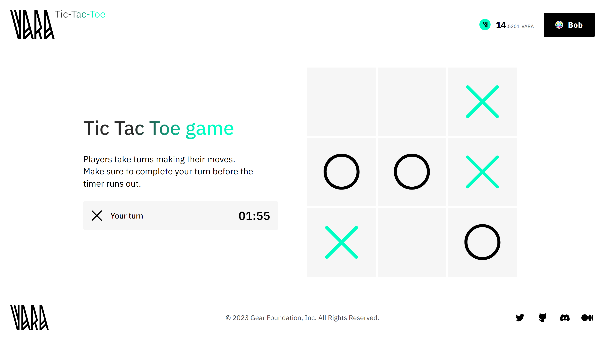

# Tic-Tac-Toe

A classic and simple game in which the user competes against a program operating on the blockchain network.



Usually, the state of a program advances as the application is utilized. A <u>distinctive feature</u> of this game's program implementation is its capability to clean up its storage. In other words, as soon as the game session is completed and the results are recorded in the program, all unnecessary data structures are purged through a special **delayed message**. [Delayed messages](/docs/developing-contracts/delayed-messages) represent one of the various unique features of the Gear Protocol.

The source code is available on [GitHub](https://github.com/gear-foundation/dapps/tree/master/contracts/tic-tac-toe).
The [frontend application](https://github.com/gear-foundation/dapps/tree/master/frontend/apps/tic-tac-toe) facilitates gameplay and interacts with the smart program.
This article describes the program interface, data structure, basic functions and explains their purpose. It can be used as is or modified to suit your own scenarios.

Everyone can play the game via this link - [Play Tic-Tac-Toe](https://tictactoe.vara.network/) (VARA tokens are requred for gas fees).

## How to run

1. Build a program
> Additional details regarding this matter can be located within the [README](https://github.com/gear-foundation/dapps/tree/master/contracts/tic-tac-toe/README.md) directory of the program.

2. Upload the program to the [Vara Network Testnet](https://idea.gear-tech.io/programs?node=wss%3A%2F%2Ftestnet.vara.network)
> Initiate the process by uploading the bot program, followed by the subsequent upload of the main program. Further details regarding the process of program uploading can be located within the [Getting Started](../../getting-started-in-5-minutes#deploy-your-smart-contract-to-the-testnet) section.

3. Build and run user interface
> More information about this can be found in the [README](https://github.com/gear-foundation/dapps/blob/master/frontend/apps/tic-tac-toe/README.md) directory of the frontend.

## Implementation details

### Program description

The program contains the following information

```rust title="tic-tac-toe/src/contract.rs"
struct Game {
    pub admins: Vec<ActorId>,
    pub current_games: HashMap<ActorId, GameInstance>,
    pub config: Config,
    pub messages_allowed: bool,
}
```

* `admins` - game admins
* `current_games` - game information for each player
* `config` - game configuration
* `messages_allowed` - access to playability

Where `GameInstance` is defined as follows:

```rust title="tic-tac-toe/io/src/lib.rs"
pub struct GameInstance {
    pub board: Vec<Option<Mark>>,
    pub player_mark: Mark,
    pub bot_mark: Mark,
    pub last_time: u64,
    pub game_over: bool,
    pub game_result: Option<GameResult>,
}
```
```rust title="tic-tac-toe/io/src/lib.rs"
pub enum Mark {
    X,
    O,
}
```

### Initialization

To initialize the game program, it only needs to be passed the game configuration

```rust title="tic-tac-toe/src/contract.rs"
#[no_mangle]
extern fn init() {
    let init_msg: GameInit = msg::load().expect("Unable to load the message");

    unsafe {
        GAME = Some(Game {
            admins: vec![msg::source()],
            current_games: HashMap::with_capacity(10_000),
            config: init_msg.config,
            messages_allowed: true,
        });
    }
}
```

```rust title="tic-tac-toe/io/src/lib.rs"
pub struct GameInit {
    pub config: Config,
}
//
pub struct Config {
    pub s_per_block: u64,
    pub gas_to_remove_game: u64,
    pub time_interval: u32,
    pub turn_deadline_ms: u64,
}
```
* `s_per_block` - time per block in seconds
* `gas_to_remove_game` - gas to delete a game using delayed messages
* `time_interval` - time after which the game should be deleted using delayed messages
* `turn_deadline_ms` - turnaround time

### Action

```rust title="tic-tac-toe/io/src/lib.rs"
pub enum GameAction {
    AddAdmin(ActorId),
    RemoveAdmin(ActorId),
    StartGame,
    Turn {
        step: u8,
    },
    Skip,
    RemoveGameInstance {
        account_id: ActorId,
    },
    RemoveGameInstances {
        accounts: Option<Vec<ActorId>>,
    },
    UpdateConfig {
        s_per_block: Option<u64>,
        gas_to_remove_game: Option<u64>,
        time_interval: Option<u32>,
        turn_deadline_ms: Option<u64>,
    },
    AllowMessages(bool),
}
```
`GameAction::Skip` is necessary if you didn't make a move in time (`config.turn_deadline_ms`)

### Reply

```rust title="tic-tac-toe/io/src/lib.rs"
pub enum GameReply {
    GameStarted { game: GameInstance },
    MoveMade { game: GameInstance },
}
```

### Logic

The `GameAction::StartGame` command is sent to begin the game. If the player has not completed the previous game, the program will not create a new game. Move turn is determined randomly, if the first move is given to the bot, it automatically makes a move to the center of the board.

```rust title="tic-tac-toe/src/contract.rs"
fn start_game(&mut self) {
    let msg_source = msg::source();

    if let Some(current_game) = self.current_games.get(&msg_source) {
        if !current_game.game_over {
            panic!("Please complete the previous game");
        }
    }

    let turn = turn();

    let (player_mark, bot_mark) = if turn == 0 {
        (Mark::O, Mark::X)
    } else {
        (Mark::X, Mark::O)
    };
    let mut game_instance = GameInstance {
        board: vec![None; 9],
        player_mark,
        bot_mark,
        last_time: exec::block_timestamp(),
        game_result: None,
        game_over: false,
    };

    if bot_mark == Mark::X {
        game_instance.board[4] = Some(Mark::X);
    }

    self.current_games.insert(msg_source, game_instance.clone());

    msg::reply(
        GameReply::GameStarted {
            game: game_instance,
        },
        0,
    )
    .expect("Error in sending a reply");
}

```

After successfully starting a new game, players can take their turn `GameAction::Turn{ step }`, where a series of the following checks are performed:

```rust title="tic-tac-toe/src/contract.rs"
fn player_move(&mut self, step: u8) {
    let msg_source = msg::source();
    let game_instance = self
        .current_games
        .get_mut(&msg_source)
        .expect("The player has no game, please start the game");
    if game_instance.board[step as usize].is_some() {
        panic!("The cell is already occupied!");
    }
    if game_instance.game_over {
        panic!("Game is already over");
    }

    if game_instance.last_time + self.config.turn_deadline_ms < exec::block_timestamp() {
        panic!("You missed your turn, please skip the move");
    }
    //..
```
After successful game status checks, the player's move is saved and the time of the last move is updated

```rust title="tic-tac-toe/src/contract.rs"
    //..
    game_instance.board[step as usize] = Some(game_instance.player_mark);

    game_instance.last_time = exec::block_timestamp();

    if let Some(mark) = get_result(&game_instance.board.clone()) {
        game_instance.game_over = true;
        if mark == game_instance.player_mark {
            game_instance.game_result = Some(GameResult::Player);
            send_messages(&msg_source, &self.config);
        } else {
            game_instance.game_result = Some(GameResult::Bot);
            send_messages(&msg_source, &self.config);
        }
        msg::reply(
            GameReply::MoveMade {
                game: game_instance.clone(),
            },
            0,
        )
        .expect("Error in sending a reply");
        return;
    }
    // ..
```
If the game is over, a **delayed message** will be sent to delete the game from the program

```rust title="tic-tac-toe/src/contract.rs"
fn send_messages(account: &ActorId, config: &Config) {
    msg::send_with_gas_delayed(
        exec::program_id(),
        GameAction::RemoveGameInstance {
            account_id: *account,
        },
        config.gas_to_remove_game,
        0,
        config.time_interval,
    )
    .expect("Error in sending message");
}
```
But if the game is not over, the turn passes to the bot and the same actions are performed

```rust title="tic-tac-toe/src/contract.rs"

    let bot_step = make_move(game_instance);

    if let Some(step_num) = bot_step {
        game_instance.board[step_num] = Some(game_instance.bot_mark);
    }

    let win = get_result(&game_instance.board.clone());

    if let Some(mark) = win {
        game_instance.game_over = true;
        if mark == game_instance.player_mark {
            game_instance.game_result = Some(GameResult::Player);
            send_messages(&msg_source, &self.config);
        } else {
            game_instance.game_result = Some(GameResult::Bot);
            send_messages(&msg_source, &self.config);
        }
    } else if !game_instance.board.contains(&None) || bot_step.is_none() {
        game_instance.game_over = true;
        game_instance.game_result = Some(GameResult::Draw);
        send_messages(&msg_source, &self.config);
    }

    msg::reply(
        GameReply::MoveMade {
            game: game_instance.clone(),
        },
        0,
    )
    .expect("Error in sending a reply");
}
```

## Program metadata and state
Metadata interface description:

```rust title="tic-tac-toe/io/src/lib.rs"
pub struct ContractMetadata;

impl Metadata for ContractMetadata {
    type Init = In<GameInit>;
    type Handle = InOut<GameAction, GameReply>;
    type Others = ();
    type Reply = ();
    type Signal = ();
    type State = InOut<StateQuery, StateReply>;
}
```
One of Gear's features is reading partial states.

```rust title="tic-tac-toe/io/src/lib.rs"
pub enum StateQuery {
    Admins,
    Game { player_id: ActorId },
    AllGames,
    Config,
    MessagesAllowed,
}
```

```rust title="tic-tac-toe/io/src/lib.rs"
pub enum StateReply {
    Admins(Vec<ActorId>),
    Game(Option<GameInstance>),
    AllGames(Vec<(ActorId, GameInstance)>),
    Config(Config),
    MessagesAllowed(bool),
}
```

To display the program state information, the `state()` function is used:

```rust title="tic-tac-toe/src/contract.rs"
#[no_mangle]
extern fn state() {
    let Game {
        admins,
        current_games,
        config,
        messages_allowed,
    } = unsafe { GAME.take().expect("Failed to get state") };
    let query: StateQuery = msg::load().expect("Unable to load the state query");

    match query {
        StateQuery::Admins => {
            msg::reply(StateReply::Admins(admins), 0).expect("Unable to share the state");
        }
        StateQuery::Game { player_id } => {
            let game: Option<GameInstance> = current_games.get(&player_id).cloned();
            msg::reply(StateReply::Game(game), 0).expect("Unable to share the state");
        }
        StateQuery::AllGames => {
            msg::reply(StateReply::AllGames(current_games.into_iter().collect()), 0)
                .expect("Unable to share the state");
        }
        StateQuery::Config => {
            msg::reply(StateReply::Config(config), 0).expect("Unable to share the state");
        }
        StateQuery::MessagesAllowed => {
            msg::reply(StateReply::MessagesAllowed(messages_allowed), 0)
                .expect("Unable to share the state");
        }
    }
}
```

## Source code

The source code of this example of Tic-Tac-Toe Game program and the example of an implementation of its testing is available on [gear-foundation/dapp/contracts/tic-tac-toe](https://github.com/gear-foundation/dapps/tree/master/contracts/tic-tac-toe).
