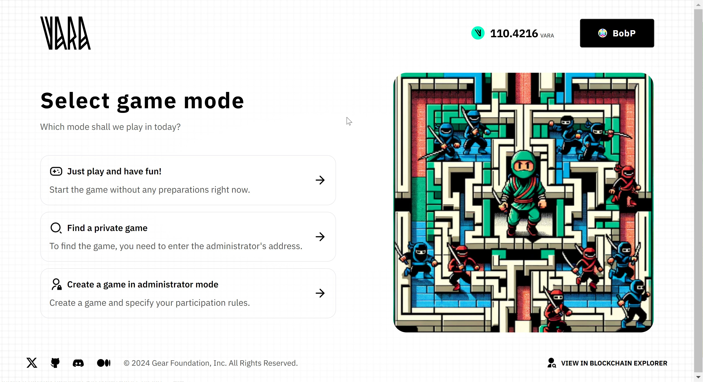

# Vara-Man Game



Vara-Man is a classic arcade game where the player must collect all the coins in a maze within a set time and avoid enemies.

The maze consists of three types of zones. The green zone is a rest area where enemies cannot enter, but it contains no coins. The blue zone is where players must collect available coins and avoid enemies. This zone offers many opportunities to evade enemies. The red zone, smaller in size, has fewer turns for escaping enemies, but it contains gold coins that provide more game points.

The game has two modes: single-player, where a player can independently play and refine their skills.

In the multiplayer mode, a tournament can be initiated where up to eight players can compete. The tournament winner receives the entire prize pool. One player creates a game lobby and sets the tournament properties - its duration, difficulty, and an entry fee that each player must pay upon entering the game, which constitutes the total prize fund. Other players join the game using the Vara address of the player who created the game.
The entry fee can be set to zero, in which case the prize fund will also be empty.

The source code is available on [GitHub](https://github.com/gear-foundation/dapps/tree/master/contracts/vara-man). This article describes the program interface, data structure, basic functions and explains their purpose. It can be used as is or modified to suit your own scenarios. The game has several reward modes, one of which requires connecting the fungible token program that needs to be uploaded separately.

Anyone can play the game via this link - [Play VaraMan](https://vara-man.vara.network/) (VARA tokens are requred for gas fees).

## How to run

1. Build a program
> Additional details regarding this matter can be located within the [README](https://github.com/gear-foundation/dapps/tree/master/contracts/vara-man/README.md) directory of the program.

2. Upload the program to the [Vara Network Testnet](https://idea.gear-tech.io/programs?node=wss%3A%2F%2Ftestnet.vara.network)
> Further details regarding the process of program uploading can be located within the [Getting Started](../../getting-started-in-5-minutes#deploy-your-program-to-the-testnet) section.

3. Build and run user interface
> More information about this can be found in the [README](https://github.com/gear-foundation/dapps/blob/master/frontend/apps/vara-man/README.md) directory of the frontend.

4. **Optional**.
> In case of a reward mode in the form of fungible tokens , build the program as described in the [README](https://github.com/gear-foundation/dapps/tree/master/contracts/fungible-token/README.md) and upload the program to the [Vara Network Testnet](https://idea.gear-tech.io/programs?node=wss%3A%2F%2Ftestnet.vara.network). After that it will be necessary to send a message `VaraManAction::ChangeStatus` to the program to put it in status `StartedWithFungibleToken { ft_address }`, where the address of the loaded program should be specified.


## Implementation details

The VaraMan program contains the following information:

```rust title="vara-man/src/lib.rs"
struct VaraMan {
    tournaments: HashMap<ActorId, Tournament>,
    players_to_game_id: HashMap<ActorId, ActorId>,
    status: Status,
    config: Config,
    admins: Vec<ActorId>,
}
```
* `games` - this field contains the addresses of the players and information about their games
* `players` - information about the player according to his address
* `status` - program status
* `config` - program configuration
* `admins` - admins addresses

Where the structure of the `Tournament` is defined as follows

```rust title="vara-man/src/lib.rs"
pub struct Tournament {
    tournament_name: String,
    admin: ActorId,
    level: Level,
    participants: HashMap<ActorId, Player>,
    bid: u128,
    stage: Stage,
    duration_ms: u32,
}

```
* `level` - level of difficulty (Easy/Medium/Hard)
* `gold_coins` - number of gold coins collected
* `silver_coins` - number of silver coins collected

```rust title="vara-man/io/src/lib.rs"
pub struct Player {
    pub name: String,
    pub time: u128,
    pub points: u128,
}
```

* `name` - player's name
* `lives` - number of lives
* `claimed_gold_coins` - number of gold coins earned
* `claimed_silver_coins` - number of silver coins earned

The program has several modes:

```rust title="vara-man/io/src/lib.rs"
pub enum Status {
    #[default]
    Paused,
    StartedUnrewarded,
    StartedWithFungibleToken {
        ft_address: ActorId,
    },
    StartedWithNativeToken,
}
```
* *Paused* - this status means that the game is suspended
* *StartedUnrewarded* - the mode in which the reward is not given
* *StartedWithFungibleToken* - the reward is given in the form of fungible tokens (the fungible token program must be uploaded separately)
* *StartedWithNativeToken* - the reward is given in the form of native tokens

### Initialization

To initialize the game program, it only needs to be passed game configuration

```rust title="vara-man/io/src/lib.rs"
pub struct VaraManInit {
    pub config: Config,
}
```
```rust title="vara-man/io/src/lib.rs"
pub struct Config {
    pub one_point_in_value: u128,
    pub points_per_gold_coin_easy: u128,
    pub points_per_silver_coin_easy: u128,
    pub points_per_gold_coin_medium: u128,
    pub points_per_silver_coin_medium: u128,
    pub points_per_gold_coin_hard: u128,
    pub points_per_silver_coin_hard: u128,
    pub gas_for_finish_tournament: u64,
    pub time_for_single_round: u32,
}
```

* `one_coin_in_value` - the price of one coin in the value system
* `tokens_per_gold_coin_easy` - gold coin price at easy level
* `tokens_per_silver_coin_easy` - silver coin price at easy level
* `tokens_per_gold_coin_medium` - gold coin price at medium level
* `tokens_per_silver_coin_medium` - silver coin price at medium level
* `tokens_per_gold_coin_hard` - gold coin price at hard level
* `tokens_per_silver_coin_hard` - silver coin price at hard level
* `gold_coins` - the maximum number of gold coins earned
* `silver_coins` - the maximum number of silver coins earned
* `number_of_lives` - the number of lives given to the players

### Action

```rust title="vara-man/io/src/lib.rs"
pub enum VaraManAction {
    CreateNewTournament {
        tournament_name: String,
        name: String,
        level: Level,
        duration_ms: u32,
    },
    StartTournament,
    RegisterForTournament {
        admin_id: ActorId,
        name: String,
    },
    CancelRegister,
    CancelTournament,
    DeletePlayer {
        player_id: ActorId,
    },
    RecordTournamentResult {
        time: u128,
        gold_coins: u128,
        silver_coins: u128,
    },
    FinishTournament {
        admin_id: ActorId,
        time_start: u64,
    },
    FinishSingleGame {
        gold_coins: u128,
        silver_coins: u128,
        level: Level,
    },
    LeaveGame,
    ChangeStatus(Status),
    ChangeConfig(Config),
    AddAdmin(ActorId),
}

```

### Event

```rust title="vara-man/io/src/lib.rs"
pub enum VaraManEvent {
    GameFinished {
        winners: Vec<ActorId>,
        participants: Vec<ActorId>,
        prize: u128,
    },
    NewTournamentCreated {
        tournament_name: String,
        name: String,
        level: Level,
        bid: u128,
    },
    PlayerRegistered {
        admin_id: ActorId,
        name: String,
        bid: u128,
    },
    RegisterCanceled,
    TournamentCanceled {
        admin_id: ActorId,
    },
    PlayerDeleted {
        player_id: ActorId,
    },
    ResultTournamentRecorded {
        time: u128,
        points: u128,
    },
    GameStarted,
    AdminAdded(ActorId),
    StatusChanged(Status),
    ConfigChanged(Config),
    LeftGame,
}
```

### Logic

Before starting the game, it is necessary to register the player by specifying the player's nickname. Registration can reply with error if the game status is on `Paused`, the nickname is a empty string or the player is already registered.

```rust title="vara-man/src/lib.rs"
VaraManAction::RegisterPlayer { name } => {
    let actor_id = msg::source();

    if vara_man.status == Status::Paused {
        return Err(VaraManError::WrongStatus);
    }

    if name.is_empty() {
        return Err(VaraManError::EmptyName);
    }

    if vara_man.players.contains_key(&actor_id) {
        Err(VaraManError::AlreadyRegistered)
    } else {
        vara_man.players.insert(
            actor_id,
            Player {
                name,
                lives: vara_man.config.number_of_lives,
                claimed_gold_coins: 0,
                claimed_silver_coins: 0,
            },
        );

        Ok(VaraManEvent::PlayerRegistered(actor_id))
    }
}
```
If the registration was successful, a game `VaraManAction::StartGame` message can be sent. The start of the game may end with an error  if the status is on `Paused`, the player is not registered yet, player already start game or lives is ended.

```rust title="vara-man/src/lib.rs"
VaraManAction::StartGame { level } => {
    let player_address = msg::source();

    if vara_man.status == Status::Paused {
        return Err(VaraManError::WrongStatus);
    }

    let Some(player) = vara_man.players.get_mut(&player_address) else {
        return Err(VaraManError::NotRegistered);
    };

    if vara_man.games.get(&player_address).is_some() {
        return Err(VaraManError::AlreadyStartGame);
    };

    if !player.is_have_lives() && !vara_man.admins.contains(&player_address) {
        return Err(VaraManError::LivesEnded);
    }

    vara_man.games.insert(
        player_address,
        GameInstance {
            level,
            gold_coins: vara_man.config.gold_coins,
            silver_coins: vara_man.config.silver_coins,
            is_claimed: false,
        },
    );

    Ok(VaraManEvent::GameStarted)
}

```

When the player ends the game, the frontend will send a message about how many coins the player has earned to convert them to value and send them to the player. This message may end in an error if the player is not started the game, the status is on `Paused`, the player is not registered yet, the number of coins exceeds the allowed number of coins or transfer of the value failed.

```rust title="vara-man/src/lib.rs"

VaraManAction::ClaimReward {
    silver_coins,
    gold_coins,
} => {
    let player_address = msg::source();

    if let Some(game) = vara_man.games.get(&player_address) {
        // Check that game is not paused
        if vara_man.status == Status::Paused {
            return Err(VaraManError::GameIsPaused);
        }

        // Check that player is registered
        let Some(player) = vara_man.players.get_mut(&player_address) else {
            return Err(VaraManError::NotRegistered);
        };

        // Check passed coins range
        if silver_coins > game.silver_coins || gold_coins > game.gold_coins {
            return Err(VaraManError::AmountGreaterThanAllowed);
        }
        let (tokens_per_gold_coin, tokens_per_silver_coin) = vara_man
            .config
            .get_tokens_per_gold_coin_for_level(game.level);

        if vara_man.status == Status::StartedWithNativeToken {
            let native_tokens_amount = vara_man
                .config
                .one_coin_in_value
                .checked_mul(tokens_per_gold_coin)
                .expect("Math overflow!")
                .checked_mul(gold_coins)
                .expect("Math overflow!")
                .checked_add(
                    vara_man
                        .config
                        .one_coin_in_value
                        .checked_mul(tokens_per_silver_coin)
                        .expect("Math overflow!")
                        .checked_mul(silver_coins)
                        .expect("Math overflow!"),
                )
                .expect("Math overflow!");
            if msg::send(player_address, 0u8, native_tokens_amount as u128).is_err() {
                return Err(VaraManError::TransferNativeTokenFailed);
            }
        } else if let Status::StartedWithFungibleToken { ft_address } = vara_man.status {
            let fungible_tokens_amount = gold_coins
                .checked_mul(tokens_per_gold_coin)
                .expect("Math overflow!")
                .checked_add(
                    silver_coins
                        .checked_mul(tokens_per_silver_coin)
                        .expect("Math overflow!"),
                )
                .expect("Math overflow!");
            let transfer_response: FTEvent = msg::send_for_reply_as(
                ft_address,
                FTAction::Transfer {
                    from: exec::program_id(),
                    to: player_address,
                    amount: fungible_tokens_amount.into(),
                },
                0,
                0,
            )
            .expect("Error in sending a message")
            .await
            .expect("Error in transfer Fungible Token");
        }

        player.claimed_gold_coins = player
            .claimed_gold_coins
            .checked_add(gold_coins)
            .expect("Math overflow!");
        player.claimed_silver_coins = player
            .claimed_silver_coins
            .checked_add(silver_coins)
            .expect("Math overflow!");

        vara_man.games.remove(&player_address);

        if vara_man.status != Status::StartedUnrewarded
            && !vara_man.admins.contains(&player_address)
        {
            player.lives -= 1;
        }

        Ok(VaraManEvent::GameFinished {
            player_address,
            silver_coins,
            gold_coins,
        })
    } else {
        Err(VaraManError::GameDoesNotExist)
    }
}

```
In the case of `Status::StartedWithNativeToken` the coins are converted into naive tokens and sent to the player, in case of `Status::StartedWithFungibleToken` a message is sent to the fungible token program for transferring tokens to the player's address. After the transfer is successful the game is removed and the number of lives is reduced by one ( in the `Status::StartedUnrewarded` mode, lives are not taken away).

## Program metadata and state
Metadata interface description:

```rust title="vara-man/io/src/lib.rs"
pub struct VaraManMetadata;

impl Metadata for VaraManMetadata {
    type Init = In<VaraManInit>;
    type Handle = InOut<VaraManAction, Result<VaraManEvent, VaraManError>>;
    type Others = ();
    type Reply = ();
    type Signal = ();
    type State = InOut<StateQuery, StateReply>;
}
```
One of Gear's features is reading partial states.

```rust title="vara-man/io/src/lib.rs"
pub enum StateQuery {
    All,
    AllGames,
    AllPlayers,
    Game { player_address: ActorId },
    Player { player_address: ActorId },
    Config,
    Admins,
    Status,
}
```

```rust title="vara-man/io/src/lib.rs"
pub enum StateReply {
    All(VaraMan),
    AllGames(Vec<(ActorId, GameInstance)>),
    AllPlayers(Vec<(ActorId, Player)>),
    Game(Option<GameInstance>),
    Config(Config),
    Admins(Vec<ActorId>),
    Status(Status),
    Player(Option<Player>),
}
```

To display the program state information, the `state()` function is used:

```rust title="vara-man/src/lib.rs"
#[no_mangle]
extern fn state() {
    let contract = unsafe { VARA_MAN.take().expect("Unexpected error in taking state") };

    let query: StateQuery = msg::load().expect("Unable to load the state query");

    let reply = match query {
        StateQuery::All => StateReply::All(contract.into()),
        StateQuery::AllGames => {
            let games = contract
                .games
                .into_iter()
                .map(|(id, game)| (id, game))
                .collect();
            StateReply::AllGames(games)
        }
        StateQuery::AllPlayers => {
            let players = contract
                .players
                .into_iter()
                .map(|(id, player)| (id, player))
                .collect();
            StateReply::AllPlayers(players)
        }
        StateQuery::Game { player_address } => {
            let game: Option<GameInstance> = contract.games.get(&player_address).cloned();
            StateReply::Game(game)
        }
        StateQuery::Player { player_address } => {
            let player: Option<Player> = contract.players.get(&player_address).cloned();
            StateReply::Player(player)
        }
        StateQuery::Config => StateReply::Config(contract.config),
        StateQuery::Admins => StateReply::Admins(contract.admins),
        StateQuery::Status => StateReply::Status(contract.status),
    };
    msg::reply(reply, 0).expect("Unable to share the state");
}
```

## Source code

The source code of this example of VaraMan Game program and the example of an implementation of its testing is available on [gear-foundation/dapp/contracts/vara-man](https://github.com/gear-foundation/dapps/tree/master/contracts/vara-man).

See also an example of the smart contract testing implementation based on `gtest`: [gear-foundation/dapps/vara-man/tests](https://github.com/gear-foundation/dapps/tree/master/contracts/vara-man/tests).

For more details about testing programs written on Gear, refer to the [Program Testing](/docs/developing-contracts/testing) article.
