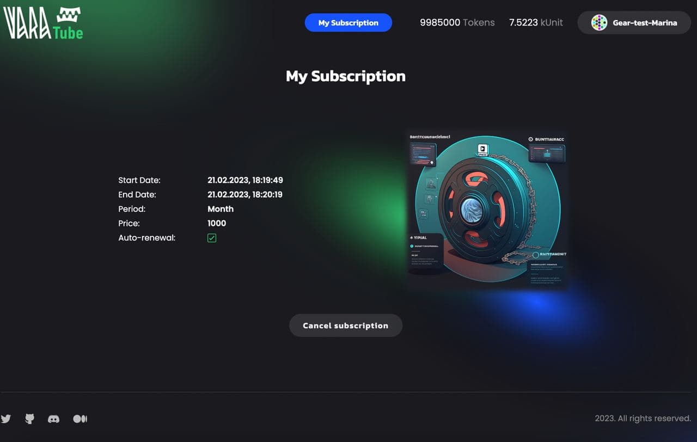
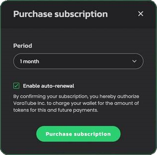

# Decentralized subscription management and auto-renewal



## About

Web services in Web2 often operate on a subscription model, with a key feature being subscription auto-renewal. This means that once the subscription period ends, the payment is automatically deducted, and the subscription renews seamlessly, requiring no action from the user.

This dApp example represents a video-hosting service **[VaraTube](https://github.com/gear-foundation/dapps/tree/master/contracts/varatube)** that enables watching videos with a valid subscription that can be renewed automatically.

### Decentralization aspect

In most blockchain networks, each transaction is invoked by a user or another program and must be completed in a single block (transactions are atomic). In general, a smart contract is able to invoke several functions, but only within a single block. In case of an error, the result of execution of all related functions is rolled back (the State does not change).

According to the Actor Model in Gear Protocol, actors exchange messages. One of the Gear-specific entities is the Waitlist - a database where messages (not transactions) reside.

This makes it possible to implement logic when several logically related messages can be spaced apart in time. As a result, extrinsics that are caused by these messages can be executed in different blocks. It is possible for messages to stay in the Waitlist for a long time. This is achieved through [Gas reservation](/developing-contracts/gas-reservation.md) for deferred messages. A program can send a [delayed message](/developing-contracts/delayed-messages.md) to itself over as many blocks as it defines, provided there is enough reserved gas to be in the Waitlist.

State consistency between programs is achieved using techniques described [here](/developing-contracts/distributed_transactions.md).

## Program logic



When a user purchases a subscription, access to the service is open, and after the subscription expires, access is closed.

The interface provides an option whether to enable or disable subscription auto-renewal. And if it is enabled, the subscription will be renewed automatically by getting funds from the user's.

There is also an option to cancel the active subscription.

The VaraTube consists of two programs:
- [Gear Fungible Token (VFT)](../Standards/vft) contract determines user and service balances required to purchase a subscription and approves Subscription program to get funds from user's balance.
- [VaraTube Subscription](https://github.com/gear-foundation/dapps/tree/master/contracts/varatube) program manages service's subscription - its availability, expiration, auto renewal.

## How to run

### ⚒️ Build program

- Get the source code of [VaraTube program](https://github.com/gear-foundation/dapps/tree/master/contracts/varatube/src) and [Fungible Token contract](https://github.com/gear-foundation/dapps/tree/master/contracts/fungible-token)
- Build programs as described in [README.md](https://github.com/gear-foundation/dapps/tree/master/contracts/fungible-token#readme).

### 🏗️ Upload program

1. You can deploy a program using [idea.gear-tech.io](https://idea.gear-tech.io/)
2. In the network selector choose `Vara Network Testnet` or `Development` if you have running a local node
3. Upload program `varatube.opt.wasm` from `/target/wasm32-unknown-unknown/release/`
4. Upload metadata file `meta.txt`
5. Specify `init payload` and calculate gas!
6. Repeat steps #3-5 for uploading Fungible Token contract `fungible_token.opt.wasm`...

### 🖥️ Run UI

1. Download React application repository and install packages as described in [frontend/README.md](https://github.com/gear-foundation/dapps/blob/master/frontend/apps/varatube/README.md)

```sh
yarn install
```
2. Create `.env` file, `.env.example` will let you know what variables are expected.
3. Configure `.env` file. Specify network address and program ID like in the example below:

```sh
REACT_APP_NODE_ADDRESS=wss://rpc-node.gear-tech.io:443/
REACT_APP_IPFS_GATEWAY_ADDRESS=https://ipfs.io/ipfs/
REACT_APP_CONTRACT_ADDRESS=0x95e4b710736a53f4917194cc1a5122df7cf4b6e9d11652470a53a8cdc1ffe296
REACT_APP_FT_CONTRACT_ADDRESS=0xa2677f49725647da5cff15e8a42b2ead9102c387d646ff856f586b81e4b598a0
```

3. Run app

```sh
yarn start
```

## Source code

The source code of the VaraTube program including its testing as well as JS frontend web application example is available on [GitHub](https://github.com/gear-foundation/dapps/tree/master/contracts/varatube). They can be used as is or modified to suit your own scenarios.

For more details about testing programs written on Gear, refer to the [Program Testing](/docs/developing-contracts/testing) article.
