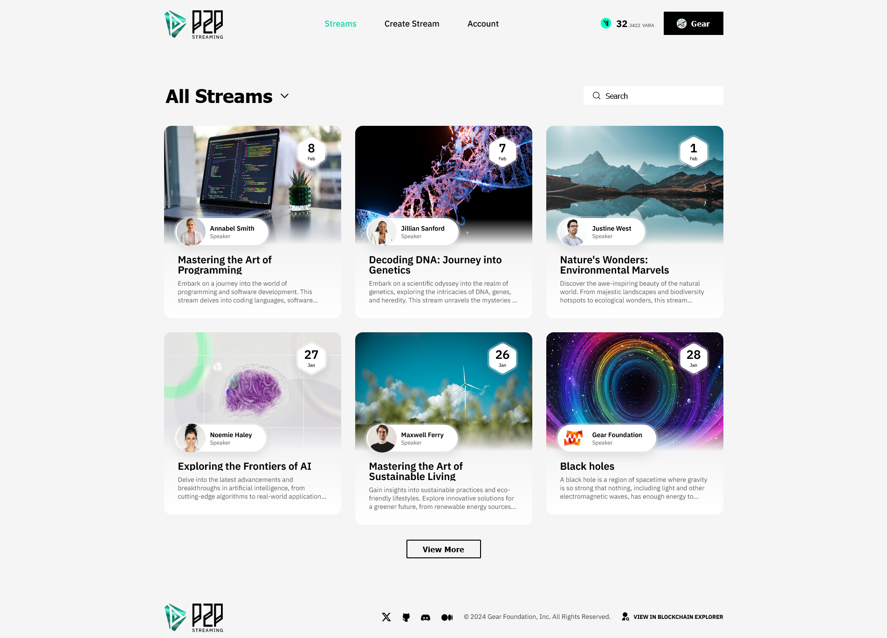

# P2P streaming



P2P streaming is an example of a decentralized application, akin to the widely popular streaming applications in the Web2 realm. Users of this application can connect and watch the live stream of one or more users. A Web2 equivalent could be the Twitch platform.

In this example of the application, a user creates a schedule for an upcoming stream broadcast at a designated time in advance. Other users can view a list of scheduled streams and subscribe to one or more. At the appointed time, the streamer commences the broadcast, and other users join it.

The application comprises three primary components:
- On-chain program: This component is responsible for storing the stream schedule and managing user subscriptions ([GitHub](https://github.com/gear-foundation/dapps/tree/master/contracts/w3bstreaming)).
- Frontend: This component serves as the application's user interface ([GitHub](https://github.com/gear-foundation/dapps/tree/master/frontend/apps/w3bstreaming))
- Signaling server: This component is responsible for establishing peer-to-peer (P2P) connections between the streamer and viewers ([GitHub](https://github.com/gear-foundation/dapps/tree/master/backend/w3bstreaming)).

This article details the program interface, data structure, fundamental functions, and their intended purposes. It can be used as is or customized to suit individual scenarios.

Also, anyone can test the application using this link: [P2P Streaming](https://w3bstreaming.vara.network) (VARA tokens are requred for gas fees).

## How to run

1. ⚒️ **Build a program**: For detailed instructions on this step, please refer to the [README](https://github.com/gear-foundation/dapps/blob/master/contracts/w3bstreaming/README.md) directory within the program's codebase.

2. 🏗️ **Upload the program** to the [Vara Network Testnet](https://idea.gear-tech.io/programs?node=wss%3A%2F%2Ftestnet.vara.network): For further guidance on program uploading, please visit the [Getting Started](../../getting-started-in-5-minutes#deploy-your-program-to-the-testnet) section.

3. 🔀 **Build and run the backend service**: For more information on this step, please consult the [README](https://github.com/gear-foundation/dapps/blob/master/backend/w3bstreaming/README.md) file within the codebase of the backend service.

4. 🖥️ **Build and run user interface**: For more information on this step, please consult the [README](https://github.com/gear-foundation/dapps/blob/master/frontend/apps/w3bstreaming/README.md) directory within the frontend codebase.

## Implementation details

The P2P streaming program contains the following information:

```rust title="w3bstreaming/io/src/lib.rs"
pub struct Program {
    pub streams: BTreeMap<String, Stream>,
    pub users: BTreeMap<ActorId, Profile>,
}
```
* `streams` - contains a pair of values such as identifier and stream information 
* `users` - contains a pair of values such as user address and profile information

Сonsider in detail the information about the `Stream` 

```rust title="w3bstreaming/io/src/lib.rs"
pub struct Stream {
    pub broadcaster: ActorId,
    pub start_time: u64,
    pub end_time: u64,
    pub title: String,
    pub img_link: String,
    pub description: Option<String>,
    pub watchers: Vec<ActorId>,
}
```

* `broadcaster` - the address of the creator of the stream
* `start_time` - stream start time
* `end_time` - stream end time
* `title` - streaming title
* `img_link` - link to the stream banner image
* `description` - streaming description

`Profile` information is as follows:

```rust title="w3bstreaming/io/src/lib.rs"
pub struct Profile {
    pub name: Option<String>,
    pub surname: Option<String>,
    pub img_link: Option<String>,
    pub stream_ids: Vec<String>,
    pub subscribers: Vec<ActorId>,
    pub subscriptions: Vec<Subscription>,
}
```

* `name` - user name
* `surname` - user surname
* `img_link` - user logo link
* `stream_ids` - list of all stream identifiers of the user
* `subscribers` - list of all subscribers of a user
* `subscriptions` - list of all subscribed users

### Action

The streaming program contains the following actions:

```rust title="w3bstreaming/io/src/lib.rs"
pub enum Action {
    NewStream {
        title: String,
        description: Option<String>,
        start_time: u64,
        end_time: u64,
        img_link: String,
    },
    DeleteStream {
        stream_id: String,
    },
    EditStream {
        stream_id: String,
        start_time: Option<u64>,
        end_time: Option<u64>,
        title: Option<String>,
        img_link: Option<String>,
        description: Option<String>,
    },
    Subscribe {
        account_id: ActorId,
    },
    EditProfile {
        name: Option<String>,
        surname: Option<String>,
        img_link: Option<String>,
    },
}
```

### Event

```rust title="w3bstreaming/io/src/lib.rs"
pub enum Event {
    StreamIsScheduled { id: String },
    StreamDeleted { id: String },
    StreamEdited,
    Subscribed,
    ProfileEdited,
}
```

### Logic

Before starting the stream, it is necessary to register a profile, this can be done using the `Action::EditProfile` (this action also allows to edit the profile )

```rust title="w3bstreaming/src/lib.rs"
Action::EditProfile {
    name,
    surname,
    img_link,
} => {
    program
        .users
        .entry(msg::source())
        .and_modify(|profile| {
            profile.name = name.clone();
            profile.surname = surname.clone();
            profile.img_link = img_link.clone();
        })
        .or_insert_with(|| Profile {
            name,
            surname,
            img_link,
            stream_ids: Vec::new(),
            subscribers: Vec::new(),
            subscriptions: Vec::new(),
        });

    msg::reply(Event::ProfileEdited, 0).expect("Unable to send reply");
}
```

After successfully registering a profile, a stream can be scheduled. In order to create a stream it is necessary to enter the following information: title name, stream description, start time, end time and stream picture link

```rust title="w3bstreaming/src/lib.rs"
Action::NewStream {
    title,
    description,
    start_time,
    end_time,
    img_link,
} => {
    let stream_id = exec::block_timestamp().to_string() + &title;
    let msg_src = msg::source();
    if let Some(profile) = program.users.get_mut(&msg_src) {
        profile.stream_ids.push(stream_id.clone());
    } else {
        panic!("Account is no registered");
    }
    program.streams.insert(
        stream_id.clone(),
        Stream {
            broadcaster: msg_src,
            img_link,
            start_time,
            end_time,
            title,
            description,
        },
    );
    msg::reply(Event::StreamIsScheduled { id: stream_id }, 0)
        .expect("Unable to send reply");
}
```
The unique stream identifier is composed of the time stamp of the current block and the title name. After successful stream creation the program sends a reply where the identifier is specified.

This program also allows deleting information about a scheduled stream or editing it using the stream id.

In case of stream deletion, a number of checks are performed to ensure that only the stream creator can delete the stream and the stream with the given identifier exists.

```rust title="w3bstreaming/src/lib.rs"
Action::DeleteStream { stream_id } => {
    let msg_src = msg::source();
    if let Some(profile) = program.users.get_mut(&msg_src) {
        if let Some(index) = profile.stream_ids.iter().position(|x| *x == stream_id) {
            profile.stream_ids.remove(index);
        } else {
            panic!("Id is not exist");
        }
    } else {
        panic!("Account is no registered");
    }

    if let Some(stream) = program.streams.get(&stream_id) {
        if stream.broadcaster == msg_src {
            program.streams.remove(&stream_id);
        } else {
            panic!("You are not broadcaster");
        }
    } else {
        panic!("Id is not exist");
    }

    msg::reply(Event::StreamDeleted { id: stream_id }, 0)
        .expect("Unable to send reply");
}
```

Stream data fields can be modified selectively and only the creator of the stream can do that.

```rust title="w3bstreaming/src/lib.rs"
Action::EditStream {
    stream_id,
    start_time,
    end_time,
    title,
    img_link,
    description,
} => {
    let msg_src = msg::source();

    if let Some(stream) = program.streams.get_mut(&stream_id) {
        if stream.broadcaster == msg_src {
            if let Some(start_time) = start_time {
                stream.start_time = start_time;
            }
            if let Some(end_time) = end_time {
                stream.end_time = end_time;
            }
            if let Some(title) = title {
                stream.title = title;
            }
            if let Some(img_link) = img_link {
                stream.img_link = img_link;
            }
            stream.description = description;
        } else {
            panic!("You are not broadcaster");
        }
    } else {
        panic!("Id is not exist");
    }

    msg::reply(Event::StreamEdited, 0).expect("Unable to send reply");
}
```

To subscribe to another account it is necessary to send a message `Action::Subscribe { account_id }` to the program. Subscription may fail if registration has not been completed or the specified account does not exist in the registered accounts

```rust title="w3bstreaming/src/lib.rs"
Action::Subscribe { account_id } => {
    if program.users.get(&account_id).is_none() {
        panic!("The user is not found");
    }

    let msg_src = msg::source();

    if program.users.get(&msg_src).is_none() {
        panic!("You are not registered");
    }

    program
        .users
        .entry(account_id)
        .and_modify(|profile| profile.subscribers.push(msg_src));

    program.users.entry(msg_src).and_modify(|profile| {
        profile.subscriptions.push(Subscription {
            account_id,
            sub_date: exec::block_timestamp(),
        })
    });

    msg::reply(Event::Subscribed, 0).expect("Unable to send reply");
}
```

## Program metadata and state

Metadata interface description:

```rust title="w3bstreaming/io/src/lib.rs"
pub struct ProgramMetadata;

impl Metadata for ProgramMetadata {
    type Init = ();
    type Handle = InOut<Action, Event>;
    type Reply = ();
    type Others = ();
    type Signal = ();
    type State = Out<State>;
}

```

To display the program state information, the `state()` function is used:

```rust title="w3bstreaming/src/lib.rs"
#[no_mangle]
extern fn state() {
    let program = unsafe { PROGRAM.take().expect("Unexpected error in taking state") };
    msg::reply::<State>(program.into(), 0).expect("Failed to share state");
}
```

## Source code

The source code of this example of P2P streaming program and the example of an implementation of its testing is available on [gear-foundation/dapp/contracts/w3bstreaming](https://github.com/gear-foundation/dapps/tree/master/contracts/w3bstreaming).

See also an example of the program testing implementation based on `gtest`: [gear-foundation/dapps/w3bstreaming/tests](https://github.com/gear-foundation/dapps/tree/master/contracts/w3bstreaming/tests).

For more details about testing programs written on Gear, refer to the [Program Testing](/docs/developing-contracts/testing) article.
