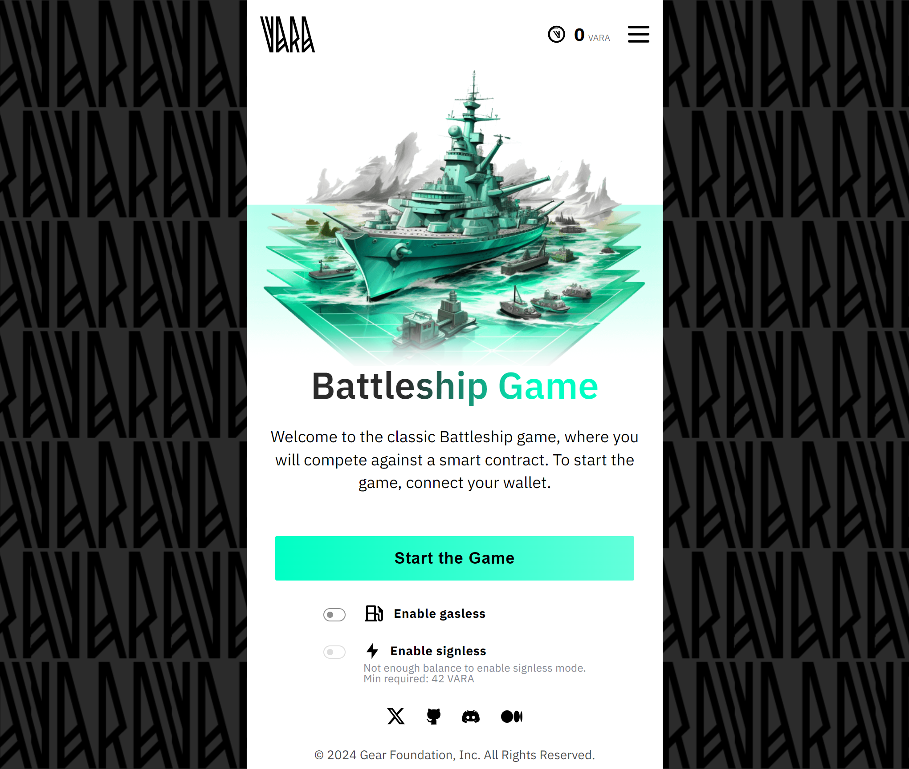

# Battleship Game



Battleship is a strategic board game in which two players compete to sink an opponent's fleet hidden from their view on the playing field. Players place their ships on a grid and then take turns shooting at squares on the opponent's field to locate and sink their ships. The goal of the game is to be the first to destroy all of your opponent's ships.

The game of Battleship requires logical thinking, strategy, and luck. Players must position their ships to remain well hidden from the enemy, with each ship having a different length, adding variety to the tactics of the game.

"Battleship is a popular game that operates **entirely on-chain**. It has no backend or centralized components; instead, the user interface interacts directly with the smart contract uploaded to the Vara Network.

The source code is available on [GitHub](https://github.com/gear-foundation/dapps/tree/master/contracts/battleship ). This article describes the program interface, data structure, basic functions and explains their purpose. It can be used as is or modified to suit your own scenarios.

> **Important notice**: The implementation is based on the interaction of two contracts: the main game contract and the bot contract that users will interact with during the game. To successfully load the game into the [Vara Network Testnet](https://idea.gear-tech.io/programs?node=wss%3A%2F%2Ftestnet.vara.rs), it is imperative to begin by uploading the bot program. Subsequently, during the initialization phase of the main game contract, specifying the bot contract's address is a crucial step.

## How to run

1. Build a contract
> More information about this can be found in the [README](https://github.com/gear-foundation/dapps/tree/master/contracts/battleship) Battleship

2. Upload the contract to the [Vara Network Testnet](https://idea.gear-tech.io/programs?node=wss%3A%2F%2Ftestnet.vara.rs)
> Start by uploading the bot contract, and then proceed to upload the main contract. More information about contract uploading can be found in [Getting Started](../getting-started-in-5-minutes/#deploy-your-smart-contract-to-the-testnet).

3. Build and run user interface 
> Example build and run commands in the [frontend app example](https://github.com/gear-foundation/dapps/tree/master/frontend/battleship).

4. Build and run the backend to release vouchers as specified in the 
> More information about this can be found in the [example](https://github.com/gear-foundation/dapps-battleship-backend).

## Implementation details

### Battleship contract description

The Battleship contract contains the following information:

```rust title="battleship/src/contract.rs"
struct Battleship {
    pub games: HashMap<ActorId, Game>,
    pub msg_id_to_game_id: BTreeMap<MessageId, ActorId>,
    pub bot_address: ActorId,
    pub admin: ActorId,
}
```
* `games` - this field contains the addresses of the players and information about their games
* `msg_id_to_game_id` - this field is responsible for tracking the bot's reply messages 
* `bot_address` - bot address 
* `admin` - admin address 

Where the structure of the "Game" is defined as follows

```rust title="battleship/io/src/lib.rs"
pub struct Game {
    pub player_board: Vec<Entity>,
    pub bot_board: Vec<Entity>,
    pub player_ships: Ships,
    pub bot_ships: Ships,
    pub turn: Option<BattleshipParticipants>,
    pub start_time: u64,
    pub end_time: u64,
    pub total_shots: u64,
    pub game_over: bool,
    pub game_result: Option<BattleshipParticipants>,
}
```
* `player_board` - is a vector with the status of cells of the player's board
* `bot_board` - is a vector with the status of cells of the bot's board
* `player_ships` - the location of the player ships
* `bot_ships` - the location of the bot ships
* `turn` - is a field indicating the turn queue of a move
* `start_time` - game starting time
* `end_time` - end game time
* `total_shots` - number of shots 
* `game_over` - is a field indicating the end of the game
* `game_result` - is a field indicating who won the game

Field cells can take on different values: 

```rust title="battleship/io/src/lib.rs"
pub enum Entity {
    Empty,
    Unknown,
    Occupied,
    Ship,
    Boom,
    BoomShip,
    DeadShip,
}
```
### Initialization

To initialize the game contract, it only needs to be passed the bot's contract address (this contract will be discussed a little later)

```rust title="battleship/io/src/lib.rs"
pub struct BattleshipInit {
    pub bot_address: ActorId,
}
```

### Action

```rust title="battleship/io/src/lib.rs"
pub enum BattleshipAction {
    // To start the game
    StartGame { ships: Ships },
    // In order to make a move
    Turn { step: u8 },
    // Change the bot contract (available only for admin)
    ChangeBot { bot: ActorId },
    // Clean the contract state (available only for admin);
    // leave_active_games specifies how to clean it 
    ClearState { leave_active_games: bool },
    // Deletion of a player's game
    DeleteGame { player_address: ActorId },
}
```

### Reply

```rust title="battleship/io/src/lib.rs"
pub enum BattleshipReply {
    // Every time a message is sent to the bot's contract.
    MessageSentToBot,
    // When the game is over
    EndGame(BattleshipParticipants),
    // When the bot's contract address changes
    BotChanged(ActorId),
}
```

### Logic

After initialization of the program the function to start the game will be available `BattleshipAction::StartGame { ships: Ships }`, where the location of ships is transmitted. The program checks for the correct placement of ships and for the absence of a rolling game at the user. If the checks are successful, the program creates the game and sends a message `msg::send_with_gas` to the bot program to create the game.

```rust title="battleship/src/contract.rs"
fn start_game(&mut self, mut ships: Ships) {
    // ...
    let msg_id = msg::send_with_gas(
        self.bot_address,
        BotBattleshipAction::Start,
        GAS_FOR_START,
        0,
    )
    .expect("Error in sending a message");

    self.msg_id_to_game_id.insert(msg_id, msg_source);
    msg::reply(BattleshipReply::MessageSentToBot, 0).expect("Error in sending a reply");
```
The `msg_id` is stored in the `msg_id_to_game_id` variable to use it in `handle_reply` (One of the message processing functions that Gear provides)

```rust title="battleship/src/contract.rs"
#[no_mangle]
extern fn handle_reply() {
    let reply_to = msg::reply_to().expect("Failed to query reply_to data");
    let battleship = unsafe { BATTLESHIP.as_mut().expect("The game is not initialized") };
    let game_id = battleship
        .msg_id_to_game_id
        .remove(&reply_to)
        .expect("Unexpected reply");

    let game = battleship
        .games
        .get_mut(&game_id)
        .expect("Unexpected: Game does not exist");
```

Using `handle_reply`, response messages from the bot are obtained, while `msg_id_to_game_id` facilitates the retrieval of a particular game for state modification.

After the game starts, the function `BattleshipAction::Turn { step: u8 }` to make a move is available , where the number of the cell the player is going to shoot at is passed. The program performs a number of checks on the entered data and the game state in order to be able to make a move. If the checks are successful, the program changes the field states and changes the turn to the bot and sends `msg::send_with_gas` to the bot program for it to make its move.

```rust title="battleship/src/contract.rs"
fn player_move(&mut self, step: u8) {
    // ...
    game.turn = Some(BattleshipParticipants::Bot);

    let board = game.get_hidden_field();
    let msg_id = msg::send_with_gas(
        self.bot_address,
        BotBattleshipAction::Turn(board),
        GAS_FOR_MOVE,
        0,
    )
    .expect("Error in sending a message");

    self.msg_id_to_game_id.insert(msg_id, msg_source);
    msg::reply(BattleshipReply::MessageSentToBot, 0).expect("Error in sending a reply");
```

Just as when starting a game, a reply message from the bot regarding its move is received in `handle_reply`.
In summary, the interaction between the two contracts is reduced to the ability to receive response messages in a separate function, denoted as `handle_reply()`. The whole implementation of the function looks as follows: 

```rust title="battleship/src/contract.rs"
#[no_mangle]
extern fn handle_reply() {
    let reply_to = msg::reply_to().expect("Failed to query reply_to data");
    let battleship = unsafe { BATTLESHIP.as_mut().expect("The game is not initialized") };
    let game_id = battleship
        .msg_id_to_game_id
        .remove(&reply_to)
        .expect("Unexpected reply");

    let game = battleship
        .games
        .get_mut(&game_id)
        .expect("Unexpected: Game does not exist");

    let action: BattleshipAction =
        msg::load().expect("Failed to decode `BattleshipAction` message.");
    match action {
        BattleshipAction::StartGame { ships } => game.start_bot(ships),
        BattleshipAction::Turn { step } => {
            game.turn(step);
            game.turn = Some(BattleshipParticipants::Player);
            if game.player_ships.check_end_game() {
                game.game_over = true;
                game.game_result = Some(BattleshipParticipants::Bot);
                game.end_time = exec::block_timestamp();
            }
        }
        _ => (),
    }
}
```

### Bot contract

As for the bot program, it has two functions:

```rust title="battleship/bot/src/lib.rs"
pub enum BotBattleshipAction {
    Start,
    Turn(Vec<Entity>),
}
```

After receiving these messages in `handle()`, the program splits them into the appropriate Action and processes them accordingly. In the case of `BotBattleshipAction::Start`, the program takes on the task of generating a random field and then responds by providing the coordinates of the ship. In the other case of `BotBattleshipAction::Turn`, the program is responsible for obtaining the current state of the field, and after careful analysis, it formulates a response by providing the coordinate of the cell where the shot is fired.

```rust title="battleship/bot/src/lib.rs"
#[no_mangle]
extern fn handle() {
    let action: BotBattleshipAction = msg::load().expect("Unable to load the message");
    match action {
        BotBattleshipAction::Start => {
            let ships = generate_field();
            msg::reply(BattleshipAction::StartGame { ships }, 0).expect("Error in sending a reply");
        }
        BotBattleshipAction::Turn(board) => {
            let step = move_analysis(board);
            msg::reply(BattleshipAction::Turn { step }, 0).expect("Error in sending a reply");
        }
    }
}
```

## Program metadata and state
Metadata interface description:

```rust title="battleship/io/src/lib.rs"
pub struct BattleshipMetadata;

impl Metadata for BattleshipMetadata {
    type Init = In<BattleshipInit>;
    type Handle = InOut<BattleshipAction, BattleshipReply>;
    type Others = ();
    type Reply = ();
    type Signal = ();
    type State = InOut<StateQuery, StateReply>;
}
```
One of Gear's features is reading partial states. 

```rust title="battleship/io/src/lib.rs"
pub enum StateQuery {
    All,
    Game(ActorId),
    BotContractId,
}
```

```rust title="battleship/io/src/lib.rs"
pub enum StateReply {
    All(BattleshipState),
    Game(Option<GameState>),
    BotContractId(ActorId),
}
```

To display the contract state information, the `state()` function is used:

```rust title="battleship/src/contract.rs"
#[no_mangle]
extern fn state() {
    let battleship = unsafe { BATTLESHIP.take().expect("Unexpected error in taking state") };
    let query: StateQuery = msg::load().expect("Unable to load the state query");
    match query {
        StateQuery::All => {
            msg::reply(StateReply::All(battleship.into()), 0).expect("Unable to share the state");
        }
        StateQuery::Game(player_id) => {
            let game_state = battleship.games.get(&player_id).map(|game| GameState {
                player_board: game.player_board.clone(),
                bot_board: game.bot_board.clone(),
                player_ships: game.player_ships.count_alive_ships(),
                bot_ships: game.bot_ships.count_alive_ships(),
                turn: game.turn.clone(),
                start_time: game.start_time,
                total_shots: game.total_shots,
                end_time: game.end_time,
                game_over: game.game_over,
                game_result: game.game_result.clone(),
            });

            msg::reply(StateReply::Game(game_state), 0).expect("Unable to share the state");
        }
        StateQuery::BotContractId => {
            msg::reply(StateReply::BotContractId(battleship.bot_address), 0)
                .expect("Unable to share the state");
        }
    }
}
```

## Source code

The source code of this example of Battleship Game smart contract and the example of an implementation of its testing is available on [gear-foundation/dapp/contracts/battleship](https://github.com/gear-foundation/dapps/tree/master/contracts/battleship).

See also an example of the smart contract testing implementation based on `gtest`: [gear-foundation/dapps/battleship/tests](https://github.com/gear-foundation/dapps/tree/master/contracts/battleship/tests).

For more details about testing smart contracts written on Gear, refer to the [Program Testing](/docs/developing-contracts/testing) article.

