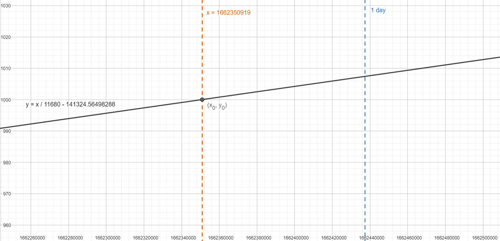

# Compound

## Introduction
Сompound - DeFi in which every user can place crypto assets, as well as borrow funds.

## Contract description

### Initialization
Contract initialized with:
```rust 
pub struct CompoundInit {
    pub token_address: ActorId,  // address of token contract
    pub ctoken_address: ActorId, // address of ctoken contract
    pub owner_address: ActorId,  // contract owner address
    pub ctoken_rate: u128,       // token cost * `ctoken_rate` = ctoken cost
    pub interest_rate: u128,     // user will earn `interest_rate` percent of his asset
    pub collateral_factor: u128, // user can borrow callateral * `collateral_factor`
    pub borrow_rate: u128,       // user will have to pay borrowed amount * `borrow_rate`
}
```

### Logic
Each user can lend tokens with `LendTokens { amount }`, borrow with `BorrowTokens { amount }`, refund with `RedfundTokens { amount }` ad withdraw tokens with `WothdrawTokens { amount }`.

1. User can lend some `amount` of `tokens` if his balance is greater or equal to the `amount`. User receives in return `ctokens` according to the `ctoken_rate`
2. User can borrow some `amount` of `tokens` if his `ctoken` balance multiplied by `ctoken_rate` is not less than `amount` / `collateral_factor`
3. User can refund `amount` of borrowed tokens only if he had borrowed at least `amount`
4. User can withdraw `amount` of lent assets only if his `ctoken` balance multiplied by `ctoken_rate` will not be less than his borrowed balance / `collateral_factor`

### Structs
```rust
struct Compound {
    token_address: ActorId,  // token contract address
    ctoken_address: ActorId, // ctoken contract address
    owner_address: ActorId,  // contract owner address
    interest_rate: u128, // user will earn `interest_rate` percent of his deposit
    collateral_factor: u128, // user can borrow callateral * `collateral_factor`
    borrow_rate: u128,   // user will have to pay borrowed amount * `borrow_rate`
    ctoken_rate: u128,   // token cost * `ctoken_rate` = ctoken cost
    user_assets: BTreeMap<ActorId, Assets>, // assets for each user
    init_time: u64, // compound init time
}

impl Compound {
    // `msg::source` lends `amount` of tokens
    pub async fn lend_tokens(&mut self, amount: u128); 
    
    // `msg::source` borrows `amount` of tokens
    pub async fn borrow_tokens(&mut self, amount: u128); 
    
    // `msg::source` refunds `amount` of tokens
    pub async fn refund_tokens(&mut self, amount: u128);

    // `msg::source` withdraws `amount` tokens fron his deposits
    pub async fn withdraw_tokens(&mut self, amount: u128);

    // updates `self.borrow_rate` and `self.interest_rate`
    fn update_rates(&mut self);
    
    // count how much ctokens corresponds to `tokens_amount` with current `ctoken_rate`
    fn count_ctokens(tokens_amount: u128, ctoken_rate: u128) -> u128;
    
    // count how much tokens corresponds to `ctokens_amount` with current `token_rate`
    fn count_tokens(ctokens_amount: u128, ctoken_rate: u128) -> u128;
}
```

### Assets logic
APY is constantly changing, so we need to calculate interest rate for every amount for every rate. How to do it? Let's imagine that each deposit is a ray ($y = kx + b$), where $k$ (slope of curve) is the interest rate and the ray starts in the point $(x_0, y_0)$, where $x_0$, $y_0$ is timestamp when deposit was made and amount of tokens respectively. So now we have a plane with many rays on it. Now let's itetate from left to right on x-axis and if we find new ray add it to our equation $y = kx + b$, where $k = b = 0$ at the start. Thus we can make dynamicly changing equation, which in every time will show how much tokens we have (to do this insert time in our equation instead of x)

### Example
_User_ wants to make a deposit on `1662350919` timestamp of `1000` tokens and `2.7%` APY. Let's calculate ray equation: <br />
$y = kx + b$, where <br />
$
y_0 = 1000 \\
x_0 = 1662350919 \\
k = \frac{y_0 \cdot k}{ \text{SEC-IN-YEAR} } = \frac{1000 \cdot 2.7}{ 31536000 } = \frac{1}{11680}\\
b = y_0 - k \cdot x_0 = 1000 - \frac{1662350919}{11680} \approx -141324.56498288
$ <br /> <br />


Then _user_ wants to make a deposit on `1662437319` timestamp of `2000` tokens and `1.6%` APY. Let's make the same calculations and get: <br />
$y = \frac{x}{9855} - 166689.73302892$

Thus we have a table: <br />

| Equation | Range |
| --- | :---: |
| $y = 0x + 0$ | $x < 1662350919$ |
| $y = \frac{x}{11680} - 141324.56498288$ | $1662350919 \le x \le 1662437319$ |
| $y = \frac{x}{11680} - 141324.56498288 \\ y = \frac{x}{9855} - 166689.73302892$ | $x > 1662437319$ |

It is not hard to see that for each x greater than second deposit time total tokens amount is a sum of two equations. So our method is correct and we need to sum eqautions after each deposit appears. If _user_ wants to withdraw just subtract amount from $b$ coefficient. The same logic os correct for borrow and refund functions respectively.

```rust
pub struct Assets {
    pub lent_amount: u128, // ctokens amount
    pub lend_start: u64, // first deposit time
    pub interest_rate: u128, // APY (coef k)
    pub lend_offset: i128, // coef b

    pub borrowed_amount: u128, // ctokens
    pub borrow_start: u64, // first borrow time
    pub borrow_rate: u128, // APY (coef k)
    pub borrow_offset: i128, // coef b
}
```

### Functions
```rust
    // Lend `amount` of tokens
    // Called with `CompoundAction::LendTokens`
    //
    // Requirements:
    // `amount` must be greater than zero
    //
    // Replies with `CompoundEvent::TokensLended` 
    pub async fn lend_tokens(&mut self, amount: u128); 
    
    // Borrow `amount` of tokens 
    // Called with `CompoundAction::BorrowTokens`
    //
    // Requirements:
    // `amount` must be greater than zero
    //
    // Replies with `CompoundEvent::TokensBorrowed` 
    pub async fn borrow_tokens(&mut self, amount: u128); 
    
    // Redeem lend deposits with ids in `lend_to_redeem` and borrows with ids in `amount_per_borrow` keys where value is amount
    // Called with `CompoundAction::RedeemTokens`
    //
    // Replies with `CompoundEvent::TokensRedeemed` 
    pub async fn redeem_tokens(
        &mut self,
        lend_to_redeem: BTreeSet<u128>,
        amount_per_borrow: BTreeMap<u128, u128>,
    );
```

### Actions and events
This action and event corresponds to the lend_tokens function
```rust
    CompoundAction::LendTokens {
        amount: u128,
    },
    CompoundEvent::TokensLended {
        address: ActorId,
        amount: u128,
        ctokens_amount: u128,
        interest_rate: u128,
        deposit_id: u128,
    },
```

This action and event corresponds to the borrow_tokens function 
```rust
    CompoundEvent::TokensBorrowed {
        address: ActorId,
        amount: u128,
        borrow_rate: u128,
        borrow_id: u128,
    },
    CompoundAction::BorrowTokens {
        amount: u128,
    },
```

This action and event corresponds to the redeem_tokens function
```rust
    CompoundEvent::TokensRedeemed {
        address: ActorId,
        redeemed_deposits: BTreeSet<Payment>,
        redeem_borrowed: BTreeMap<u128, Payment>,
    },
    CompoundAction::RedeemTokens {
        lend_to_redeem: BTreeSet<u128>,
        amount_per_borrow: BTreeMap<u128, u128>,
    },
```

## Conclusion
A source code of the contract example provided by Gear is available on GitHub: [`compound/src/lib.rs`](https://github.com/gear-dapps/compound/blob/master/src/lib.rs).

See also an example of the smart contract testing implementation based on gtest: [`compound/tests/`](https://github.com/gear-dapps/compound/blob/master/tests/).

For more details about testing smart contracts written on Gear, refer to this article: [Program Testing](/developing-contracts/testing).
