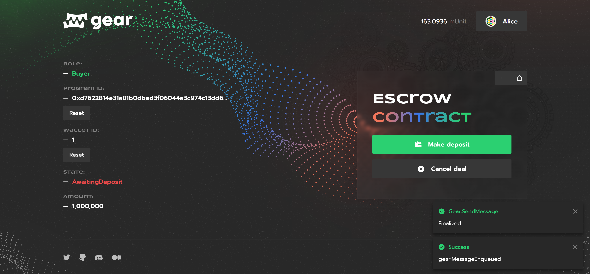

# Escrow



An escrow is a special wallet to which some assets (e.g. money or stocks) are deposited and stored until certain conditions are met. In terms of smart contracts, an escrow is a wallet that is stored on a blockchain and, like a regular escrow, can receive some assets (e.g. a cryptocurrency or fungible tokens (like [Gear fungible tokens - gFT](gft-20.md) in this example)) from one user and, when certain conditions are met, send them to another.

- Program source code is avalible on [Github](https://github.com/gear-dapps/escrow)
- dApp UI [Github](https://github.com/gear-dapps/escrow/tree/master/frontend)

## How to run 

This video demonstrates how to configure and run Escrow application on your own and explains the user interaction workflow: **https://youtu.be/CD8j4epEY4E**

### ⚒️ Build program

- Get the source code of the [Escrow smart contract](https://github.com/gear-dapps/escrow)
- Build contract as described in [program/README.md](https://github.com/gear-dapps/escrow/blob/master/README.md).

### 🏗️ Upload Сode

This application requires code to create an escrow wallet

1. You can uploade code using [idea.gear-tech.io](https://idea.gear-tech.io/).
2. In the network selector choose `Staging Testnet` or `Development` (in this case, you should have a local node running)
3. Upload code `escrow.opt.wasm` from `/target/wasm32-unknown-unknown/release/`

### 🖥️ Run UI

1. Install packages as described in [frontend/README.md](https://github.com/gear-dapps/escrow/blob/master/frontend/README.md)
2. Configure .evn file. Specify network address and code ID like in the example below:

```sh
REACT_APP_NODE_ADDRESS=wss://node-workshop.gear.rs:443
REACT_APP_CODE_ADDRESS=0xa31fa55b98adf40b0ad18ccda10a3deb8bbb59655fa10971c8046c7f6f959bb9
```

3. Run app

```sh
yarn start
```

## Introduction

This article explains at a superficial level the purpose and logic of this smart contract. The source code of the smart contract example is available on [GitHub](https://github.com/gear-dapps/escrow).

## Logic

* Any user can create an escrow wallet as a buyer or seller.
* A buyer can make a deposit or confirm a deal and close a wallet.
* A seller can refund tokens from a paid wallet to a buyer.
* Both buyer and seller can cancel a deal and close an unpaid wallet.

One escrow wallet contains info about a `buyer`, a `seller`, wallet `state` and an `amount` of tokens that this wallet can store:

```rust
pub struct Wallet {
    /// A buyer.
    pub buyer: ActorId,
    /// A seller.
    pub seller: ActorId,
    /// A wallet state.
    pub state: WalletState,
    /// An amount of tokens that a wallet can have. **Not** a current amount on
    /// a wallet balance!
    pub amount: u128,
}
```

`WalletState` is an enum that stores a current state of a wallet:

```rust
enum WalletState {
    AwaitingDeposit,
    AwaitingConfirmation,
    Closed,
}
```

## Interface

### Initialization

```rust
/// Initializes an escrow program.
#[derive(Decode, Encode, TypeInfo)]
pub struct InitEscrow {
    /// Address of a fungible token program.
    pub ft_program_id: ActorId,
}
```

### Actions

```rust
/// An enum to send the program info about what it should do.
///
/// After a successful processing of this enum, the program replies with [`EscrowEvent`].
#[derive(Clone, Decode, Encode, TypeInfo)]
pub enum EscrowAction {
    /// Creates one escrow wallet and replies with its ID.
    ///
    /// # Requirements
    /// * [`msg::source()`](gstd::msg::source) must be `buyer` or `seller` for this wallet.
    /// * `buyer` or `seller` mustn't have the zero address.
    ///
    /// On success, returns [`EscrowEvent::Created`].
    Create {
        /// A buyer.
        buyer: ActorId,
        /// A seller.
        seller: ActorId,
        /// An amount of tokens.
        amount: u128,
    },

    /// Makes a deposit from a buyer to an escrow wallet
    /// and changes wallet's [`WalletState`] to [`AwaitingConfirmation`](WalletState::AwaitingConfirmation).
    ///
    /// Transfers tokens to an escrow wallet until a deal is confirmed (by [`EscrowAction::Confirm`]) or cancelled ([`EscrowAction::Cancel`]).
    ///
    /// # Requirements
    /// * [`msg::source()`](gstd::msg::source) must be a buyer for this wallet.
    /// * Wallet mustn't be paid or closed (that is, wallet's [`WalletState`] must be [`AwaitingDeposit`](WalletState::AwaitingDeposit)).
    ///
    /// On success, returns [`EscrowEvent::Deposited`].
    Deposit(
        /// A wallet ID.
        WalletId,
    ),

    /// Confirms a deal by transferring tokens from an escrow wallet
    /// to a seller and changing wallet's [`WalletState`] to [`Closed`](WalletState::Closed).
    ///
    /// Transfers tokens from an escrow wallet to a seller for this wallet.
    ///
    /// # Requirements
    /// * [`msg::source()`](gstd::msg::source) must be a buyer for this wallet.
    /// * Wallet must be paid and unclosed (that is, wallet's [`WalletState`] must be [`AwaitingDeposit`](WalletState::AwaitingConfirmation)).
    ///
    /// On success, returns [`EscrowEvent::Confirmed`].
    Confirm(
        /// A wallet ID.
        WalletId,
    ),

    /// Refunds tokens from an escrow wallet to a buyer
    /// and changes wallet's [`WalletState`] back to [`AwaitingDeposit`](WalletState::AwaitingDeposit)
    /// (that is, a wallet can be reused).
    ///
    /// Refunds tokens from an escrow wallet to a buyer for this wallet.
    ///
    /// # Requirements
    /// * [`msg::source()`](gstd::msg::source) must be a seller for this wallet.
    /// * Wallet must be paid and unclosed (that is, wallet's [`WalletState`] must be [`AwaitingDeposit`](WalletState::AwaitingConfirmation)).
    ///
    /// On success, returns [`EscrowEvent::Refunded`].
    Refund(
        /// A wallet ID.
        WalletId,
    ),

    /// Cancels a deal and closes an escrow wallet by changing its [`WalletState`] to [`Closed`](WalletState::Closed).
    ///
    /// # Requirements
    /// * [`msg::source()`](gstd::msg::source) must be a buyer or seller for this wallet.
    /// * Wallet mustn't be paid or closed (that is, wallet's [`WalletState`] must be [`AwaitingDeposit`](WalletState::AwaitingDeposit)).
    ///
    /// On success, returns [`EscrowEvent::Cancelled`].
    Cancel(
        /// A wallet ID.
        WalletId,
    ),

    /// Continues the transaction if it fails due to lack of gas
    /// or due to an error in the token contract.
    ///
    /// # Requirements:
    /// * `transaction_id` should exists in `transactions` table;
    ///
    /// When transaction already processed replies with [`EscrowEvent::TransactionProcessed`].
    Continue(
        /// Identifier of suspended transaction.
        u64,
    ),
}
```

## Consistency of contract states
The `Escrow` contract interacts with the `fungible` token contract. Each transaction that changes the states of Escrow and the fungible token is stored in the state until it is completed. User can complete a pending transaction by sending a message `Continue` indicating the transaction id. The idempotency of the fungible token contract allows to restart a transaction without duplicate changes which guarantees the state consistency of these 2 contracts.


## Program metadata and state
Metadata interface description:

```rust
pub struct EscrowMetadata;

impl Metadata for EscrowMetadata {
    type Init = In<InitEscrow>;
    type Handle = InOut<EscrowAction, EscrowEvent>;
    type Others = ();
    type Reply = ();
    type Signal = ();
    type State = EscrowState;
}
```
To display the full contract state information, the `state()` function is used:

```rust
#[no_mangle]
extern "C" fn state() {
    msg::reply(
        unsafe { ESCROW.clone().expect("Uninitialized escrow state") },
        0,
    )
    .expect("Failed to share state");
}
```
To display only necessary certain values from the state, you need to write a separate crate. In this crate, specify functions that will return the desired values from the `Escrow` state. For example - [gear-dapps/escrow/state](https://github.com/gear-dapps/escrow/tree/master/state):

```rust
#[metawasm]
pub mod metafns {
    pub type State = <EscrowMetadata as Metadata>::State;

    pub fn info(state: State, wallet_id: U256) -> Wallet {
        let (_, wallet) = *state
            .wallets
            .iter()
            .find(|(id, _)| id == &wallet_id)
            .unwrap_or_else(|| panic!("Wallet with the {wallet_id} ID doesn't exist"));

        wallet
    }

    pub fn created_wallets(state: State) -> Vec<(WalletId, Wallet)> {
        state
            .wallets
            .iter()
            .map(|(wallet_id, wallet)| (*wallet_id, *wallet))
            .collect()
    }
}
```
