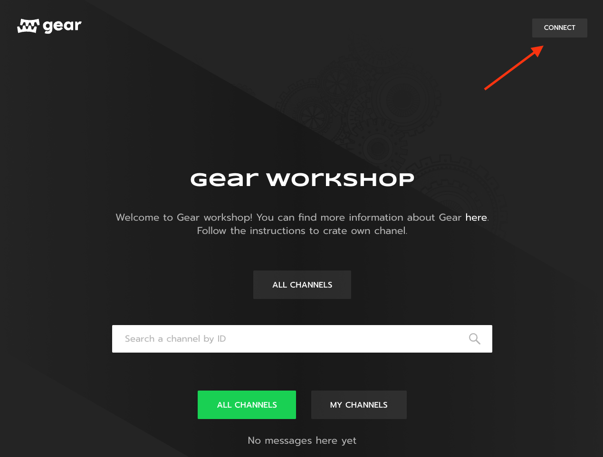

# Introduction
In order to introduce our rapidly growing community to the platform developed by Gear, we've developed a dApplication in order to showcase some of the features that can be implemented using our smart contracts. Specifically, we aimed to build a platform simillar to Twitter: each user can have their own "feed", "feeds" can be subscribed to and the landing page contains global & personal "feeds".

# Feeds dApp composition
The application strcture consists of two smart contracts: the router contract and the channel contract. There's one router contract per application and one channel contract per user.

The router contract has a very straightforward purpose: it records instantiation of new channel contracts and verifies their validity. Thus, it only contains one action: Register, which is invoked by the owner of a channel contract that needs to be added.

The channel contract is a little more complex: it is responsible for handling posts being added to its feed, keeping track of subscribers and providing meta information about itself.

# Interaction flow
Here's a schema of how the contracts are connected to each other:

Let's now go through the flow of the application step by step.

First, channel owner should compile their own version of the contract filled in with information about the channel. Then, when the contract is uploaded to the network via the [idea portal](https://idea.gear-tech.io), owner of the contract should send a `Register` message to the router contract. Once router contract receives that message, it sends a `Meta` request to the recently deployed contract to verify that it has been set up correctly. If the channel contract responds properly, it is added to the list of available channels.

If you want to check out the code available for both the router and the channel contracts, you can find them here: [router](https://github.com/gear-tech/apps/tree/master/gear-feeds-router), [channel](https://github.com/gear-tech/gear-feeds-channel).

The [gear feeds channel contract](https://github.com/gear-tech/gear-feeds-channel) repo contains step-by-step instructions on deploying your own contract.

# The Gear Feeds website

You can use this [link](https://workshop.gear-tech.io) to get to the Gear Feeds website. 

First, log in using your [Polkadot.js extension wallet](https://polkadot.js.org/extension/).

Now, you can browse a list of all channels.

If you have uploaded your own contract under the same ID you've logged in to the website with, you should be able to see it under `my channel`.

When viewing your own channel, you can add posts to it (you will have to conduct a transaction). All the subscribers will see the posts in their personal feeds.

# Conclusion
Gear Feeds is an example of a full-fledged application with core logic being in a decentralized application implemented via Smart Contracts on Gear. We hope to see more exciting projects inspired by Gear feeds and recent platform improvements created by our community members! :) 