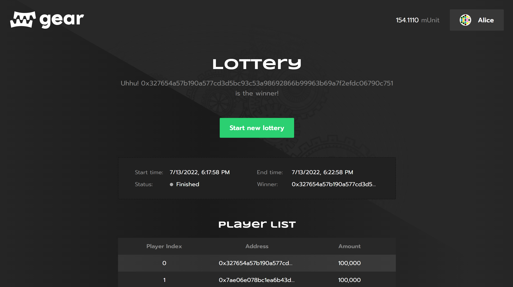

# Game of chance

## Introduction

Anyone can easily create their own game application and run it on the Gear Network. To do this, Gear created an example of the Game-of-chance smart contract, which is available on [GitHub](https://github.com/gear-dapps/lottery).

This article explains the programming interface, data structure, basic functions their purpose. It can be used as is or modified to suit your own scenarios.

Gear also [provides](https://github.com/gear-tech/gear-js/tree/master/apps/game-of-chance) an example implementation of the [Game of chance's](https://lottery.gear-tech.io/) user interface to demonstrate its interaction with smart contracts in the Gear Network. In this example, whoever initializes the contract is considered the game owner. Only the owner has the right to start/finish the game. Players are added to the Game of chance themselves by sending a message with their bet to the contract. Then players monitor the state of the game. The winner is determined randomly.

 You can watch a video on how to get the Game of chance application up and running and its capabilities here: **https://youtu.be/35StUMjbdFc**.

## Source files
1. `game-of-chance/src/lib.rs` - contains functions of the game contract.
2. `game-of-chance/io/src/lib.rs` - contains Enums and structs that the contract receives and sends in the reply.

## Structs

The contract has the following structs:

```rust
struct Lottery {
    lottery_state: LotteryState,
    lottery_owner: ActorId,
    token_address: Option<ActorId>,
    players: BTreeMap<u32, Player>,
    lottery_history: BTreeMap<u32, ActorId>,
    lottery_id: u32,
    lottery_balance: u128,
}
```
where:

`lottery_state` - Game state: Start Time, End time of the game

`lottery_owner` - The address of the game owner who initialized the contract

`token_address` - address of the token contract

`players` - 'map' of the game players

`lottery_history` - 'map' of the game winners

`lottery_id` – current game id

`lottery_balance` - the total amount of bets in the game

The `LotteryState` struct:

```rust
pub struct LotteryState {
    pub lottery_started: bool,
    pub lottery_start_time: u64,
    pub lottery_duration: u64,
}
```

The `Player` struct:

```rust
pub struct Player {
    pub player_id: ActorId,
    pub balance: u128,
}
```

## Enums

```rust
pub enum LtAction {
    Enter(u128),
    StartLottery {
        duration: u64,
        token_address: Option<ActorId>,
    },
    LotteryState,
    PickWinner,
}

pub enum LtEvent {
    LotteryState(LotteryState),
    Winner(u32),
    PlayerAdded(u32),
}

pub enum LtState {
    GetWinners,
    GetPlayers,
    BalanceOf(u32),
    LotteryState,
}

pub enum LtStateReply {
    Winners(BTreeMap<u32, ActorId>),
    Players(BTreeMap<u32, Player>),
    Balance(u128),
    LotteryState(LotteryState),
}
```

## Functions

Game contract interacts with fungible token contract through function `transfer_tokens`.

```rust
async fn transfer_tokens(
	&mut self,
	from: &ActorId, /// - the sender address
	to: &ActorId, /// - the recipient address
	amount_tokens: u128 /// - the amount of tokens
)
```

This function sends a message (the action is defined in the enum `FTAction`) and gets a reply (the reply is defined in the enum `FTEvent`).

```rust
let _transfer_response: FTEvent = msg::send_and_wait_for_reply(
    self.token_address.unwrap(), /// - the fungible token contract address
    FTAction::Transfer {		/// - action in the fungible token-contract
        from: *from,
        to: *to,
        amount: amount_tokens,
    },
    0,
)
```

Launches a game. Only the owner can launch a game. Game must not have been launched earlier.

```rust
fn start_lottery(
	&mut self,
	duration: u64,
	token_address: Option<ActorId>
)
```

Called by a player in order to participate in the game. The player cannot enter the game more than once.

```rust
async fn enter(
	&mut self,
	amount: u128
)
```

Game winner calculation. Only the owner can pick the winner.

```rust
async fn pick_winner(
	&mut self
)
```

These functions are called in `async fn main()` through enum `LtAction`.

This is the entry point to the program, and the program is waiting for a message in `LtAction` format.

```rust
#[gstd::async_main]
async fn main() {
    if msg::source() == ZERO_ID {
        panic!("Message from zero address");
    }

    let action: LtAction = msg::load().expect("Could not load Action");
    let lottery: &mut Lottery = unsafe { LOTTERY.get_or_insert(Lottery::default()) };

    match action {
        LtAction::Enter(amount) => {
            lottery.enter(amount).await;
        }

        LtAction::StartLottery {
            duration,
            token_address,
        } => {
            lottery.start_lottery(duration, token_address);
        }

        LtAction::LotteryState => {
            msg::reply(LtEvent::LotteryState(lottery.lottery_state.clone()), 0).unwrap();
            debug!("LotteryState: {:?}", lottery.lottery_state);
        }

        LtAction::PickWinner => {
            lottery.pick_winner().await;
        }
    }
}
```

It is also important to have the ability to read the contract state off-chain. It is defined in the `fn meta_state()`. The contract receives a request to read the certain data (the possible requests are defined in struct `LtState` ) and sends replies. The contract replies about its state are defined in the enum `LtStateReply`.

```rust
#[no_mangle]
unsafe extern "C" fn meta_state() -> *mut [i32; 2] {
    let query: LtState = msg::load().expect("failed to decode input argument");
    let lottery: &mut Lottery = LOTTERY.get_or_insert(Lottery::default());

    let encoded = match query {
        LtState::GetPlayers => LtStateReply::Players(lottery.players.clone()).encode(),
        LtState::GetWinners => LtStateReply::Winners(lottery.lottery_history.clone()).encode(),
        LtState::LotteryState => LtStateReply::LotteryState(lottery.lottery_state.clone()).encode(),

        LtState::BalanceOf(index) => {
            if let Some(player) = lottery.players.get(&index) {
                LtStateReply::Balance(player.balance).encode()
            } else {
                LtStateReply::Balance(0).encode()
            }
        }
    };

    gstd::util::to_leak_ptr(encoded)
}
```

## User interface

A [Ready-to-Use application](https://lottery.gear-tech.io/) example provides a user interface that interacts with [Game of chance](https://github.com/gear-dapps/lottery) smart contract running in Gear Network.

This video demonstrates how to configure and run Game application on your own and explains the user interaction workflow: **https://youtu.be/35StUMjbdFc**



A game application source code is available on [GitHub](https://github.com/gear-tech/gear-js/tree/master/apps/game-of-chance).

### Configure basic dApp in .env:

For proper application functioning, one needs to create `.env` file and adjust an environment variable parameters. An example is available [here](https://github.com/gear-tech/gear-js/blob/master/apps/game-of-chance/.env.example).

```sh
REACT_APP_NODE_ADDRESS
REACT_APP_LOTTERY_CONTRACT_ADDRESS
```

- `REACT_APP_NODE_ADDRESS` is the Gear Network's address (wss://rpc-node.gear-tech.io:443)
- `REACT_APP_MARKETPLACE_CONTRACT_ADDRESS` is the Game's smart contract address in the Gear Network

### How to run

Install required dependencies:
```sh
npm install
```

Run the app in the development mode:
```sh
npm start
```
Open http://localhost:3000 to view it in the browser.

## Conclusion

A source code of the contract example provided by Gear is available on GitHub: [`game-of-chance/src/lib.rs`](https://github.com/gear-dapps/game-of-chance/blob/master/src/lib.rs).

See also an examples of the smart contract testing implementation based on gtest:

- [`simple_tests.rs`](https://github.com/gear-dapps/game-of-chance/blob/master/src/simple_tests.rs).

- [`panic_tests.rs`](https://github.com/gear-dapps/game-of-chance/blob/master/src/panic_tests.rs).

- [`token_tests.rs`](https://github.com/gear-dapps/game-of-chance/blob/master/src/token_tests.rs).

For more details about testing smart contracts written on Gear, refer to this article: [Program Testing](/docs/developing-contracts/testing).
