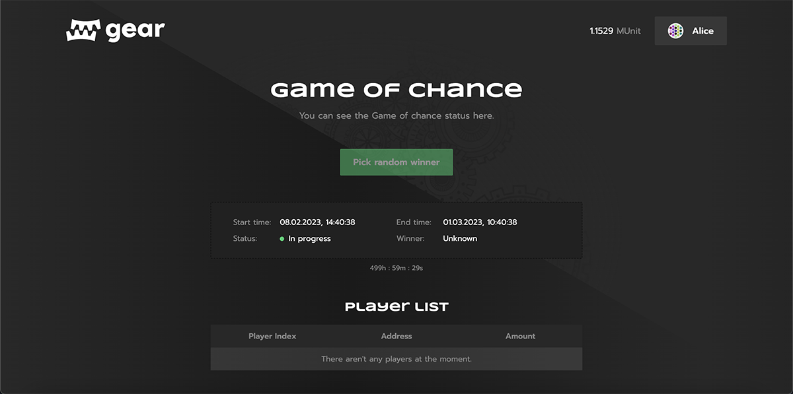

# Game of chance



Game of chance is a simple game smart contract with the lottery logic.

- Program source code available on [Github](https://github.com/gear-foundation/dapps/tree/master/contracts/game-of-chance)
- dApp UI [Github](https://github.com/gear-foundation/dapps/tree/master/frontend/game-of-chance)

## How to run

### ⚒️ Build program

- Get the source code of [GOC contract](https://github.com/gear-foundation/dapps/tree/master/contracts/game-of-chance)
- Build contracts as described in [program/README.md](https://github.com/gear-foundation/dapps/blob/master/contracts/game-of-chance/README.md).

### 🏗️ Upload program

1. You can deploy a program using [idea.gear-tech.io](https://idea.gear-tech.io/).
2. In the network selector choose `Staging Testnet` or `Development` (in this case, you should have a local node running)
3. Upload program `game_of_chance.opt.wasm` from `/target/wasm32-unknown-unknown/release/`
4. Upload metadata file `meta.txt`
5. Specify `init payload` and calculate gas!

### 🖥️ Run UI

1. Install packages as described in [frontend/README.md](https://github.com/gear-foundation/dapps/blob/master/frontend/game-of-chance/README.md)
2. Configure `.env` file. Specify network address and program ID like in the example below:

```sh
REACT_APP_NODE_ADDRESS=wss://testnet.vara-network.io:443
REACT_APP_CONTRACT_ADDRESS=0x45f48855184656f4fa7779e5ec0e3e54be8069a61cf62815e114d04d1b4916b4
```

3. Run app

```sh
yarn start
```

## Program logic

:::note
For a more detailed technical description, see its [documentation on the dApps documentation portal](https://dapps.gear.rs/game_of_chance) and [the source code section](#source-code).
:::

During initialization, the game administrator is assigned. The administrator has the rights to start a new game round and select a winner after the end of each one. Other actors can participate in a round if they have enough fungible tokens or the native value they use to contribute to the prize funds. After the players' entry stage ends, the administrator should execute the action to select a winner. This smart contract randomly selects the winner and then sends the prize funds to them.

## Interface

### Initialization

```rust title="game-of-chance/io/src/lib.rs"
/// Initializes the Game of chance contract.
///
/// # Requirements
/// - `admin` mustn't be [`ActorId::zero()`].
#[derive(Debug, Default, Encode, Decode, PartialEq, Eq, PartialOrd, Ord, Clone, Copy, TypeInfo, Hash)]
#[codec(crate = gstd::codec)]
#[scale_info(crate = gstd::scale_info)]
pub struct InitGOC {
    /// [`ActorId`] of the game administrator that'll have the rights to
    /// [`Action::Start`] a game round and [`Action::PickWinner`].
    pub admin: ActorId,
}
```

### Actions

```rust title="game-of-chance/io/src/lib.rs"
/// Sends a contract info about what it should do.
#[derive(Debug, Encode, Decode, PartialEq, Eq, PartialOrd, Ord, Clone, Copy, TypeInfo, Hash)]
#[codec(crate = gstd::codec)]
#[scale_info(crate = gstd::scale_info)]
pub enum Action {
    /// Starts a game round and allows to participate in it.
    ///
    /// # Requirements
    /// - [`msg::source()`](gstd::msg::source) must be the game administrator.
    /// - The current game round must be over.
    /// - `ft_actor_id` mustn't be [`ActorId::zero()`].
    ///
    /// On success, replies with [`Event::Started`].
    Start {
        /// The duration (in milliseconds) of the players entry stage.
        ///
        /// After that, no one will be able to enter a game round and a winner
        /// should be picked.
        duration: u64,
        /// The price of a participation in a game round.
        participation_cost: u128,
        /// A currency (or FT contract [`ActorId`]) of a game round.
        ///
        /// Determines fungible tokens in which a prize fund and a participation
        /// cost will be collected. [`None`] means that the native value will be
        /// used instead of fungible tokens.
        fungible_token: Option<ActorId>,
    },

    /// Randomly picks a winner from current game round participants (players)
    /// and sends a prize fund to it.
    ///
    /// The randomness of a winner pick depends on
    /// [`exec::block_timestamp()`](gstd::exec::block_timestamp).
    /// Not the best source of entropy, but, in theory, it's impossible to
    /// exactly predict a winner if the time of an execution of this action is
    /// unknown.
    ///
    /// If no one participated in the round, then a winner will be
    /// [`ActorId::zero()`].
    ///
    /// # Requirements
    /// - [`msg::source()`](gstd::msg::source) must be the game administrator.
    /// - The players entry stage must be over.
    /// - A winner mustn't already be picked.
    ///
    /// On success, replies with [`Event::Winner`].
    PickWinner,

    /// Pays a participation cost and adds [`msg::source()`] to the current game
    /// round participants (players).
    ///
    /// A participation cost and its currency can be queried from the contract
    /// state.
    ///
    /// # Requirements
    /// - The players entry stage mustn't be over.
    /// - [`msg::source()`] mustn't already participate.
    /// - [`msg::source()`] must have enough currency to pay a participation
    /// cost.
    /// - If the current game round currency is the native value
    /// (`fungible_token` is [`None`]), [`msg::source()`] must send this action
    /// with the amount of the value exactly equal to a participation cost.
    ///
    /// On success, replies with [`Event::PlayerAdded`].
    ///
    /// [`msg::source()`]: gstd::msg::source
    Enter,
}
```

### Program metadata and state
Metadata interface description:

```rust title="game-of-chance/io/src/lib.rs"
pub struct ContractMetadata;

impl Metadata for ContractMetadata {
    type Init = InOut<InitGOC, Result<(), Error>>;
    type Handle = InOut<Action, Result<Event, Error>>;
    type Reply = ();
    type Others = ();
    type Signal = ();
    type State = Out<State>;
}
```
To display the full contract state information, the `state()` function is used:

```rust title="game-of-chance/src/lib.rs"
#[no_mangle]
extern fn state() {
    let contract = unsafe { CONTRACT.take().expect("Unexpected error in taking state") };
    msg::reply::<State>(contract.into(), 0)
        .expect("Failed to encode or reply with `IoNFT` from `state()`");
}
```
To display only necessary certain values from the state, you need to write a separate crate. In this crate, specify functions that will return the desired values from the `State` struct.

## Source code

The source code of the Game of Chance smart contract and an implementation of its testing are available on [GitHub](https://github.com/gear-foundation/dapps/tree/master/frontend/game-of-chance). They can be used as is or modified to suit your own scenarios.

For more details about testing smart contracts written on Gear, refer to the [Program Testing](/docs/developing-contracts/testing) article.
