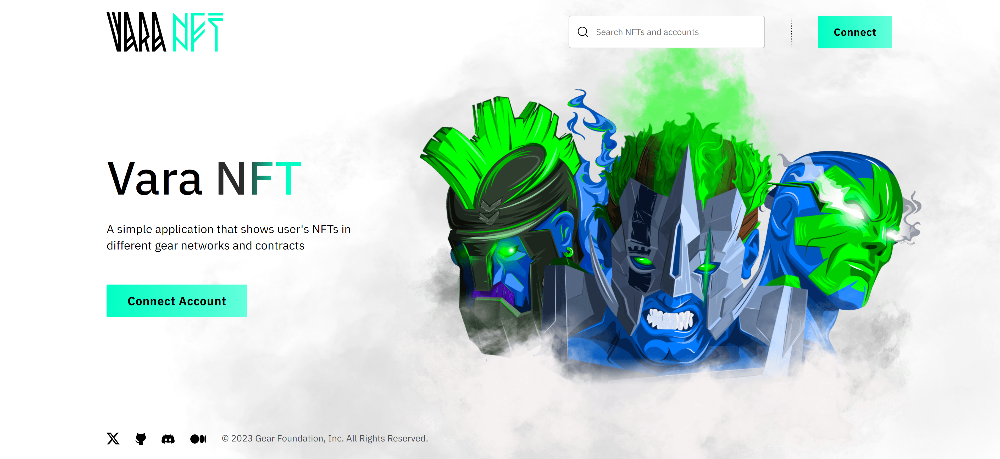

# Gear Non-Fungible Token



Non-fungible tokens (NFTs) are unique cryptographic tokens on a blockchain used to prove ownership of digital assets, such as digital art or gaming assets. The difference from fungible tokens is that fungible tokens store value, while non-fungible tokens store a cryptographic certificate.

Under the hood, a non-fungible token consists of a unique token identifier, or token ID, which is mapped to an owner identifier and stored inside an NFT smart contract. <center> <em><strong>token_id</strong></em> → <em><strong>address</strong></em> </center>

When the owner of a given token ID wishes to transfer it to another user, it is easy to verify ownership and reassign the token to a new owner.

This article explains the programming interface, data structure, basic functions, and their purposes. It can be used as-is or modified to suit your scenarios. Anyone can easily create their own application and run it on the Gear-powered network.

## How to run

### ⚒️ Build program

- Get the source code of [NFT contract](https://github.com/gear-foundation/dapps/tree/master/contracts/non-fungible-token)
- Build contracts as described in [program/README.md](https://github.com/gear-foundation/dapps/blob/master/contracts/non-fungible-token/README.md).

### 🏗️ Upload program

1. You can deploy a program using [idea.gear-tech.io](https://idea.gear-tech.io/).
2. In the network selector choose `Staging Testnet` or `Development` (in this case, you should have a local node running)
3. Upload program `nft.opt.wasm` from `/target/wasm32-unknown-unknown/release/`
4. Upload metadata file `meta.txt`
5. Specify `init payload` and calculate gas!

*** Init Payload ***

name `Str` - NFT collection name
symbol `Str` - NFT collection symbol
base_uri `Str` - NFT collection base URI
royalties `Option<Royalties>` - Optional param to specify accounts to pay royalties

### 🖥️ Run UI

1. Download the React application repository from [GitHub](https://github.com/gear-foundation/dapps/tree/master/frontend/non-fungible-token).

2. Install packages as described in [frontend/README.md](https://github.com/gear-foundation/dapps/blob/master/frontend/non-fungible-token/README.md)

3. Configure .evn file. Specify network address and program ID like in the example below:

```sh
REACT_APP_NODE_ADDRESS=wss://node-workshop.gear.rs:443
REACT_APP_IPFS_ADDRESS=https://ipfs.gear-tech.io/api/v0
REACT_APP_IPFS_GATEWAY_ADDRESS=https://ipfs-gw.gear-tech.io/ipfs
REACT_APP_CONTRACT_ADDRESS=0xdf7b9b10240f827f112da757bb68eb301ee873d6c1015855220f2122996540c4
```

4. Run app

```sh
yarn start
```

### Default non-fungible-token implementation
The functions that must be supported by each non-fungible-token contract:

- *transfer(to, token_id)* - is a function that allows you to transfer a token with the *token_id* number to the *to* account;
- *approve(approved_account, token_id)* - is a function that allows you to give the right to dispose of the token to the specified *approved_account*. This functionality can be useful on marketplaces or auctions as when the owner wants to sell his token, they can put it on a marketplace/auction, so the contract will be able to send this token to the new owner at some point;
- *mint(to, token_id, metadata)* is a function that creates a new token. Metadata can include any information about the token: it can be a link to a specific resource, a description of the token, etc;
- *burn(from, token_id)* is a function that removes the token with the mentioned *token_id* from the contract.

The default implementation of the NFT contract is provided in the Gear library: [gear-lib/non_fungible_token](https://github.com/gear-foundation/dapps/tree/master/contracts/gear-lib/src/tokens).

To use the default implementation you should include the packages into your *Cargo.toml* file:

```toml
gear-lib = { git = "https://github.com/gear-foundation/dapps", tag = "0.3.3" }
hashbrown = "0.13.1"
```

The states that non-fungible-contract store are defined in the struct `NFTState`:

```rust
use hashbrown::HashMap;

#[derive(Debug, Default)]
pub struct NFTState {
    pub name: String,
    pub symbol: String,
    pub base_uri: String,
    pub owner_by_id: HashMap<TokenId, ActorId>,
    pub token_approvals: HashMap<TokenId, Vec<ActorId>>,
    pub token_metadata_by_id: HashMap<TokenId, Option<TokenMetadata>>,
    pub tokens_for_owner: HashMap<ActorId, Vec<TokenId>>,
    pub royalties: Option<Royalties>,
}
```

To reuse the default struct you need derive the NFTStateKeeper trait and mark the corresponding field with the #[NFTStateField] attribute.  You can also add your fields in your NFT contract. For example, let's add the owner's address to the contract and the `token_id` that will track the current number of token:

```rust
use derive_traits::{NFTStateKeeper, NFTCore, NFTMetaState};
use gear_contract_libraries::non_fungible_token::{nft_core::*, state::*, token::*};

#[derive(Debug, Default, NFTStateKeeper, NFTCore, NFTMetaState)]
pub struct NFT {
    #[NFTStateField]
    pub token: NFTState,
    pub token_id: TokenId,
    pub owner: ActorId,
    pub transactions: HashMap<H256, NFTEvent>,
}
```
The `transactions` field is used for contract `idempotency`.
There are two possible risks when sending a transaction: the risk of sending duplicate transactions and the risk of not knowing the status of the transaction due to a network failure. The message sender indicates the transaction id, and the token contract obtains the hash of this transaction using the sender's address and the transaction number. If a transaction with such a hash has already been completed, the contract returns the status of this transaction.

To inherit the default logic functions you need to derive `NFTCore` trait. Accordingly, for reading the state of the contracts you need the `NFTMetaState` trait.

Let's write the whole implementation of the NFT contract. First, we define the message
which will initialize the contract and messages that our contract will process:

```rust
#[derive(Debug, Encode, Decode, TypeInfo)]
pub struct InitNFT {
    pub name: String,
    pub symbol: String,
    pub base_uri: String,
}

pub enum NFTAction {
    Mint {
        transaction_id: u64,
        to: ActorId,
        token_id: TokenId,
    },
    Burn {
        transaction_id: u64,
        token_id: TokenId,
    },
    Transfer {
        transaction_id: u64,
        to: ActorId,
        token_id: TokenId,
    },
    Approve {
        transaction_id: u64,
        to: ActorId,
        token_id: TokenId,
    },
    Clear {
        transaction_hash: H256,
    },
}
```

Then the default NFT contract implementation:

```rust
#[derive(Debug, Default, NFTStateKeeper, NFTCore, NFTMetaState)]
pub struct NFT {
    #[NFTStateField]
    pub token: NFTState,
    pub token_id: TokenId,
    pub owner: ActorId,
    pub transactions: HashMap<H256, NFTEvent>,
}

static mut CONTRACT: Option<NFT> = None;

#[no_mangle]
extern "C" fn init() {
    let config: InitNFT = msg::load().expect("Unable to decode InitNFT");
    let mut nft = NFT::default();
    nft.token.name = config.name;
    nft.token.symbol = config.symbol;
    nft.token.base_uri = config.base_uri;
    nft.owner = msg::source();
    unsafe { CONTRACT = Some(nft) };
}

#[no_mangle]
unsafe extern "C" fn handle() {
    let action: NFTAction = msg::load().expect("Could not load NFTAction");
    let nft = CONTRACT.get_or_insert(Default::default());
    match action {
        NFTAction::Mint {
            transaction_id,
            token_metadata,
        } => {
            msg::reply(
                nft.process_transaction(transaction_id, |nft| {
                    NFTEvent::Transfer(NFTCore::mint(nft, token_metadata))
                }),
                0,
            )
            .expect("Error during replying with `NFTEvent::Transfer`");
        }
        NFTAction::Burn {
            transaction_id,
            token_id,
        } => {
            msg::reply(
                nft.process_transaction(transaction_id, |nft| {
                    NFTEvent::Transfer(NFTCore::burn(nft, token_id))
                }),
                0,
            )
            .expect("Error during replying with `NFTEvent::Transfer`");
        }
        NFTAction::Transfer {
            transaction_id,
            to,
            token_id,
        } => {
            msg::reply(
                nft.process_transaction(transaction_id, |nft| {
                    NFTEvent::Transfer(NFTCore::transfer(nft, &to, token_id))
                }),
                0,
            )
            .expect("Error during replying with `NFTEvent::Transfer`");
        }
        NFTAction::Approve {
            transaction_id,
            to,
            token_id,
        } => {
            msg::reply(
                nft.process_transaction(transaction_id, |nft| {
                    NFTEvent::Approval(NFTCore::approve(nft, &to, token_id))
                }),
                0,
            )
            .expect("Error during replying with `NFTEvent::Approval`");
        }
        NFTAction::Clear { transaction_hash } => nft.clear(transaction_hash),
    };
}
```

### Developing your non-fungible-token contract
Next, let's rewrite the implementation of the `mint` function. Our `mint` function will create token for the account that send `Mint` message  and require the metadata as an input argument:
```rust
pub enum NFTAction {
    Mint {
        token_metadata: TokenMetadata,
        token_id: TokenId,
    },
```
The `TokenMetadata` is also defined in the gear NFT library:

```rust
#[derive(Debug, Default, Encode, Decode, Clone, TypeInfo)]
pub struct TokenMetadata {
    // ex. "CryptoKitty #100"
    pub name: String,
    // free-form description
    pub description: String,
    // URL to associated media, preferably to decentralized, content-addressed storage
    pub media: String,
    // URL to an off-chain JSON file with more info.
    pub reference: String,
}
```
Define a trait for our new function that will extend the default `NFTCore` trait:
```rust
pub trait MyNFTCore: NFTCore {
    fn mint(&mut self, token_metadata: TokenMetadata);
}
```
and write the implementation of that trait:
```rust
impl MyNFTCore for NFT {
    fn mint(&mut self, token_metadata: TokenMetadata) {
        NFTCore::mint(self, &msg::source(), self.token_id, Some(token_metadata));
        self.token_id = self.token_id.saturating_add(U256::one());
    }
}
```
Accordingly, it is necessary to make changes to the `handle` function:
```rust
#[no_mangle]
unsafe extern "C" fn handle() {
    let action: NFTAction = msg::load().expect("Could not load NFTAction");
    let nft = CONTRACT.get_or_insert(Default::default());
    match action {
        NFTAction::Mint {
            transaction_id,
            token_metadata,
        } => {
            msg::reply(
                nft.process_transaction(transaction_id, |nft| {
                    NFTEvent::Transfer(MyNFTCore::mint(nft, token_metadata))
                }),
                0,
            )
            .expect("Error during replying with `NFTEvent::Transfer`");
        }
        NFTAction::Burn {
            transaction_id,
            token_id,
        } => {
            msg::reply(
                nft.process_transaction(transaction_id, |nft| {
                    NFTEvent::Transfer(NFTCore::burn(nft, token_id))
                }),
                0,
            )
            .expect("Error during replying with `NFTEvent::Transfer`");
        }
        ...

    };
}
```

### Program metadata and state
Metadata interface description:

```rust
pub struct NFTMetadata;

impl Metadata for NFTMetadata {
    type Init = In<InitNFT>;
    type Handle = InOut<NFTAction, NFTEvent>;
    type Reply = ();
    type Others = ();
    type Signal = ();
    type State = IoNFT;
}
```
To display the full contract state information, the `state()` function is used:

```rust
#[no_mangle]
extern "C" fn state() {
    reply(common_state())
        .expect("Failed to encode or reply with `<NFTMetadata as Metadata>::State` from `state()`");
}
```
To display only necessary certain values from the state, you need to write a separate crate. In this crate, specify functions that will return the desired values from the `IoNFT` state. For example - [non-fungible-token/state](https://github.com/gear-foundation/dapps/tree/master/contracts/non-fungible-token/state):

```rust
#[metawasm]
pub trait Metawasm {
    type State = <NFTMetadata as Metadata>::State;

    fn info(state: Self::State) -> NFTQueryReply {
        ...
    }

    fn token(token_id: TokenId, state: Self::State) -> Token {
       ...
    }

    fn tokens_for_owner(owner: ActorId, state: Self::State) -> Vec<Token> {
        ...
    }
    fn total_supply(state: Self::State) -> u128 {
        ...
    }

    fn supply_for_owner(owner: ActorId, state: Self::State) -> u128 {
       ...
    }

    fn all_tokens(state: Self::State) -> Vec<Token> {
       ...
    }

    fn approved_tokens(account: ActorId, state: Self::State) -> Vec<Token> {
        ...
    }
}
```
## Conclusion

An NFT smart contract source code is available on [Github](https://github.com/gear-foundation/dapps/tree/master/contracts/non-fungible-token).

The React frontend application can be downloaded [here](https://github.com/gear-foundation/dapps/tree/master/frontend/non-fungible-token).

Gear provides a reusable [library](https://github.com/gear-foundation/dapps/tree/master/contracts/gear-lib/src/tokens) with core functionality for the gNFT protocol. By using object composition, that library can be utilized within a custom NFT contract implementation in order to minimize duplication of community available code.

For more details about testing smart contracts written on Gear, refer to this article: [Program Testing](/docs/developing-contracts/testing).
