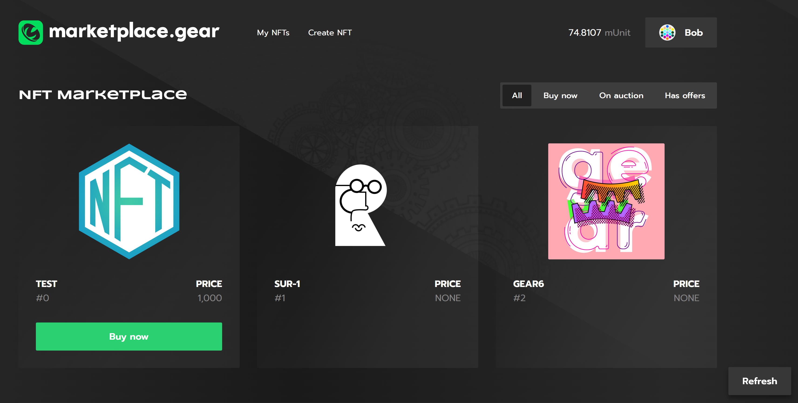

# NFT Marketplace

## Introduction

NFT marketplace is a contract where you can buy and sell non-fungible tokens for fungible tokens. The contract also supports holding the NFT auctions and making/accepting purchase offers on NFTs.

A smart contract examples created by Gear are available on GitHub so anyone can easily create their own NFT marketplace application and run it on the Gear Network:
- [Gear Non-Fungible Token](https://github.com/gear-dapps/non-fungible-token/tree/master/nft). 
- [NFT marketplace](https://github.com/gear-dapps/non-fungible-token/tree/master/nft-marketplace).

This article explains the programming interface, data structure, basic functions and explains their purpose. It can be used as is or modified to suit your own scenarios.

Gear also [provides](https://github.com/gear-tech/gear-js/tree/master/apps/marketplace) an example implementation of the [NFT Marketplace's](https://marketplace.gear-tech.io/) user interface to demonstrate its interaction with smart contracts in the Gear Network.

 You can watch a video on how to get the NFT Marketplace application up and running and its capabilities here: **https://youtu.be/4suveOT3O-Y**.

## Logic
The contract state:
```rust
pub struct Market {
    pub admin_id: ActorId,
    pub treasury_id: ActorId,
    pub treasury_fee: u128,
    pub items: BTreeMap<ContractAndTokenId, Item>,
    pub approved_nft_contracts: BTreeSet<ActorId>,
    pub approved_ft_contracts: BTreeSet<ActorId>,
}
```
- `admin_id` - an account who has the right to approve non-fungible-token and fungible-tokens contracts that can be used in the marketplace contract;
- `treasury_id` - an account to which sales commission will be credited;
- `treasury_fee` - 
commission percentage (from 1 to 5 percent)
The marketplace contract is initialized with the following fields;
- `items` - listed NFTs;
- `approved_nft_contracts` - nft contracts accounts that can be listed on the marketplace;
- `approved_ft_contracts` - 
fungible token accounts for which it is possible to buy marketplace items;

The marketplace item has the following struct:
```rust
pub struct Item {
    pub owner_id: ActorId,
    pub ft_contract_id: Option<ActorId>,
    pub price: Option<u128>,
    pub auction: Option<Auction>,
    pub offers: Vec<Offer>,
}
```
- `owner_id` - an item owner;
- `ft_contract_id` - a contract of fungible tokens for which that item can be bought. If that field is `None` then the item is on sale for native Gear value;
- `price` - 
the item price. `None` field means that the item is not on the sale;
- `auction` - 
a field containing information on the current auction. `None` field means that there is no current auction on the item;
- `offers` - 
purchase offers made on that item;

### Listing NFTs, changing the price or stopping the sale.
To list NFT on the marketplace or modify the terms of sale send the following message: 
```rust
/// Adds data on market item.
/// If the item of that NFT does not exist on the marketplace then it will be listed.
/// If the item exists then that action is used to change the price or suspend the sale.
///
/// # Requirements
/// * [`msg::source()`](gstd::msg::source) must be the NFT owner
/// * `nft_contract_id` must be added to `approved_nft_contracts`
/// * if item already exists, then it cannot be changed if there is an active auction
///
/// Arguments:
/// * `nft_contract_id`: the NFT contract address
/// * `token_id`: the NFT id
/// * `price`: the NFT price (if it is `None` then the item is not on the sale)
///
/// /// On success replies [`MarketEvent::MarketDataAdded`].
AddMarketData {
    nft_contract_id: ActorId,
    ft_contract_id: Option<ActorId>,
    token_id: U256,
    price: Option<u128>,
}
```
### NFT purchase.
To buy NFT send the following message: 

```rust
/// Sells the NFT.
/// 
/// # Requirements:
/// * The NFT item must exist and be on sale.
/// * If the NFT is sold for a native Gear value, then a buyer must attach a value equal to the price.
/// * If the NFT is sold for fungible tokens then a buyer must have enough tokens in the fungible token contract.
/// * There must be no open auction on the item.
/// 
/// Arguments:
/// * `nft_contract_id`: NFT contract address
/// * `token_id`: the token ID
/// 
/// On success replies [`MarketEvent::ItemSold`].
BuyItem {
    nft_contract_id: ActorId,
    token_id: U256,
}
```

### NFT auction.
The marketplace contract includes the *English auction*. *English auction* is an open auction at an increasing price, where participants openly bid against each other, with each subsequent bid being greater than the previous one.

The auction has the following struct:
```rust
pub struct Auction {
    pub bid_period: u64,
    pub started_at: u64,
    pub ended_at: u64,
    pub current_price: u128,
    pub current_winner: ActorId,
}
```
- `bid_period` - the time interval. If the auction ends before `exec::blocktimestamp() + bid_period` then the auction end time is delayed for `bid_period`;
- `started_at` - auction start time;
- `ended_at` - auction end time;
- `current_price` - the current offered price for the NFT;
- `current_winner` - the current auction winner

The auction is started with the following message:

```rust
/// Creates an auction for selected item.
/// If the NFT item doesn't exist on the marketplace then it will be listed
///
/// Requirements:
/// * Only the item owner can start the auction.
/// * `nft_contract_id` must be in the list of `approved_nft_contracts`
/// *  There must be no active auction.
///
/// Arguments:
/// * `nft_contract_id`: the NFT contract address
/// * `ft_contract_id`: the fungible token contract address that can be used for trading
/// * `token_id`: the NFT id
/// * `min_price`: the starting price
/// * `bid_period`: the time interval. If the auction ends before `exec::blocktimestamp() + bid_period`
/// then the auction end time is delayed for `bid_period`.
/// 
/// On success replies [`MarketEvent::AuctionCreated`].
CreateAuction {
    nft_contract_id: ActorId,
    ft_contract_id: Option<ActorId>,
    token_id: U256,
    min_price: u128,
    bid_period: u64,
    duration: u64,
},
```

To add bid to the current auction send the following message:
```rust
/// Adds a bid to an ongoing auction.
/// 
/// # Requirements:
/// * The item must exist.
/// * The auction must exist on the item.
/// * If the NFT is sold for a native Gear value, then a buyer must attach a value equal to the price indicated in the arguments.
/// * If the NFT is sold for fungible tokens then a buyer must have   enough tokens in the fungible token contract.
/// * `price` must be greater than the current offered price for that item.
/// 
/// # Arguments
/// * `nft_contract_id`: the NFT contract address.
/// * `token_id`: the NFT id.
/// * `price`: the offered price.
///  
/// On success replies [`MarketEvent::BidAdded`].
AddBid {
    nft_contract_id: ActorId,
    token_id: U256,
    price: u128,
},
```

If auction period is over then anyone can send message `SettleAuction` that will send the NFT to the winner and pay to the owner:
```rust
/// Settles the auction.
/// 
/// Requirements:
/// * The auction must be over.
/// 
/// Arguments:
/// * `nft_contract_id`: the NFT contract address
/// * `token_id`: the NFT id
///   
/// On successful auction replies [`MarketEvent::AuctionSettled`].
/// If no bids were made replies [`MarketEvent::AuctionCancelled`].
SettleAuction {
    nft_contract_id: ActorId,
    token_id: U256,
}
```

### Offers.
To make offer on the marketplace item send the following message:
```rust
/// Adds a price offer to the item.
/// 
/// Requirements:
/// * NFT item must exists and be listed on the marketplace.
/// * There must be no ongoing auction on the item.
/// * If a user makes an offer in native Gear value, then he must attach a value equal to the price indicated in the arguments.
/// * If a user makes an offer in fungible tokens then he must have  enough tokens in the fungible token contract.
/// * The price can not be equal to 0.
/// * There must be no identical offers on the item.
/// 
/// Arguments:
/// * `nft_contract_id`: the NFT contract address
/// * `ft_contract_id`: the FT contract address
/// * `token_id`: the NFT id
/// * `price`: the offer price
///     
/// On success replies [`MarketEvent::OfferAdded`].
AddOffer {
    nft_contract_id: ActorId,
    ft_contract_id: Option<ActorId>,
    token_id: U256,
    price: u128,
},
```
The item owner can accept the offer:
```rust
/// Accepts an offer.
/// 
/// Requirements:
/// * NFT item must exist and be listed on the marketplace.
/// * Only the owner can accept the offer.
/// * There must be no ongoing auction.
/// * The offer with indicated hash must exist.
/// 
/// Arguments:
/// * `nft_contract_id`: the NFT contract address
/// * `token_id`: the NFT id
/// * `offer_hash`: the offer hash that includes the offer price and the address of fungible token contract.
///      
/// On success replies [`MarketEvent::OfferAccepted`].
AcceptOffer {
    nft_contract_id: ActorId,
    token_id: U256,
    offer_hash: H256,
}
```
The user who made the offer can also withdraw his tokens:

```rust
/// Withdraws tokens.
/// 
/// Requirements:
/// * NFT item must exist and be listed on the marketplace.
/// * Only the offer creator can withdraw his tokens.
/// * The offer with indicated hash must exist.
/// 
/// Arguments:
/// * `nft_contract_id`: the NFT contract address
/// * `token_id`: the NFT id
/// * `offer_hash`: the offer hash that includes the offer price and the address of fungible token contract.
/// 
/// On success replies [`MarketEvent::TokensWithdrawn`].
Withdraw {
    nft_contract_id: ActorId,
    token_id: U256,
    hash: H256,
},
```

## User interface

A [Ready-to-Use application](https://marketplace.gear-tech.io/) example provides a user interface that interacts with [gNFT](https://github.com/gear-dapps/non-fungible-token/tree/master/nft) and [Marketplace](https://github.com/gear-dapps/non-fungible-token/tree/master/nft-marketplace) smart contracts running in Gear Network.
- Gear Non-Fundible Token contract enables creation of NFT tokens, proves an ownership of a digital assets, check [this article](https://wiki.gear-tech.io/examples/gnft-721) for details.
- NFT Marketplace contract enables to buy and sell non-fungible tokens for fungible tokens, hold the NFT auctions and make/accept purchase offers on NFTs.

This video demonstrates how to configure and run Markeplace application on your own and explains the user interaction workflow: **https://youtu.be/4suveOT3O-Y**



An NFT Marketplace application source code is available on [GitHub](https://github.com/gear-tech/gear-js/tree/master/apps/marketplace).

### Configure basic dApp in .env:

For proper application functioning, one needs to adjust an environment variable parameters. An example is available [here](https://github.com/gear-tech/gear-js/blob/master/apps/marketplace/.env.example).

```sh
REACT_APP_NODE_ADDRESS
REACT_APP_IPFS_ADDRESS
REACT_APP_IPFS_GATEWAY_ADDRESS
REACT_APP_NFT_CONTRACT_ADDRESS
REACT_APP_MARKETPLACE_CONTRACT_ADDRESS
```

- `REACT_APP_NETWORK` is Gear Network address (wss://rpc-node.gear-tech.io:443)
- `REACT_APP_IPFS_ADDRESS` is address of IPFS to store NFT assets (https://ipfs.gear-tech.io/api/v0 was used for Gear Marketplace implementation)
- `REACT_APP_IPFS_GATEWAY_ADDRESS` is IPFS Gateway address (https://ipfs-gw.gear-tech.io/ipfs)
- `REACT_APP_NFT_CONTRACT_ADDRESS` is Gear Non-Fungible Token contract address in Gear Network
- `REACT_APP_MARKETPLACE_CONTRACT_ADDRESS` is NFT Marketplace contract address in Gear Network

### Simple NFT

Another example of an interface that demonstrates how to work with a smart contract can be found at the link: https://nft.gear-tech.io.

It implements the ability to mint NFTs, view all NFTs minted by any account in the contract, as well as view NFTs that someone has approved to the current account (`AprovedToMe`) with the possibility of further transfer to another account (this option is not available in the [NFT Marketplace](https://marketplace.gear-tech.io/) application).

A Simple NFT application example is available on [GitHub](https://github.com/gear-tech/gear-js/tree/master/apps/nft).

### How to run

Install required dependencies:
```sh
npm install
```

Run the app in the development mode:
```sh
npm start
```
Open http://localhost:3000 to view it in the browser.

## Source code

The source code of this example of NFT marketplace smart contract and the example of an implementation of its testing is available on [Gear-dapps](https://github.com/gear-dapps/non-fungible-token/tree/master/nft-marketplace).

The Gear JS application code is available in [Gear-tech/gear-js](https://github.com/gear-tech/gear-js/tree/master/apps/marketplace).

For more details about testing smart contracts written on Gear, refer to the [Program Testing](/docs/developing-contracts/testing) article.
