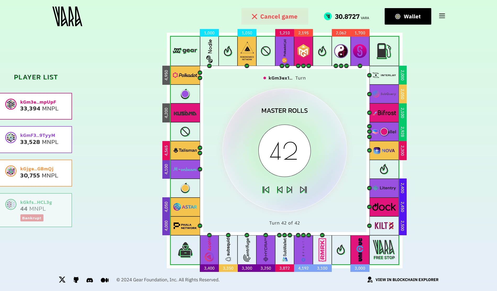
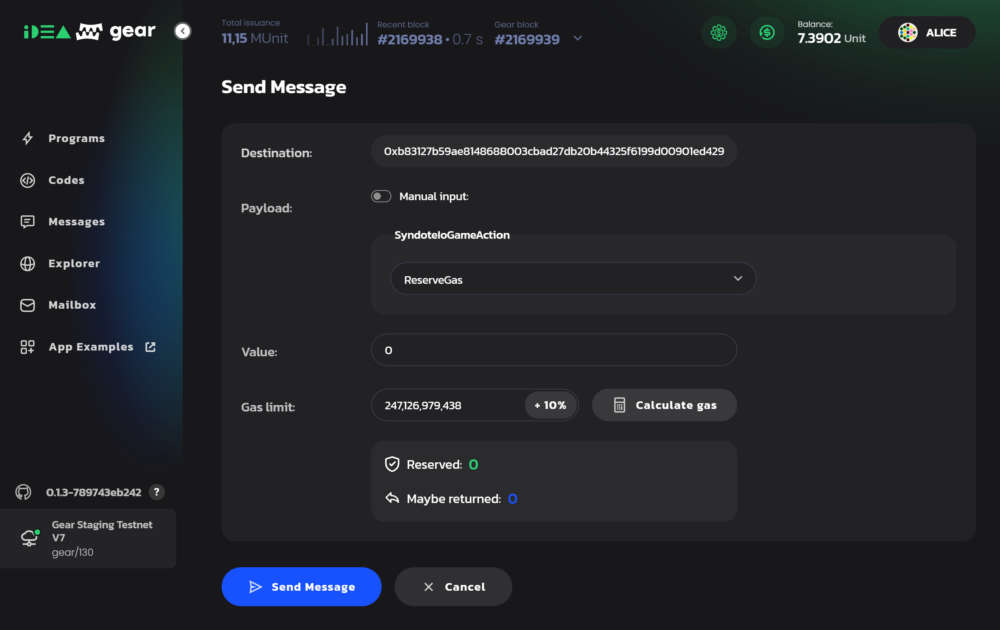

# Monopoly game (Syndote)

Syndote is the name of a Monopoly-like decentralized game that works **completely on-chain**. It has no backend or any centralized components, the user interface interacts directly with the smart contract uploaded in the Gear Network. 

This is a "game strategies battle" where players compete with each other by implementing various playing strategies uploaded as smart-contracts into the network.

Syndote consists of Master contract and Player contracts. Master contract is the main contract that starts and controls the game. Player contracts implement the game strategies that can be unique for each participant of the game. 

After the game starts, all moves in the game take place automatically, but the UI provides an ability to jump to each one individually to analyze the player's strategy. To complete the game and determine the winner, many moves are required, which are processed over several blocks. In order for the Master contract to have enough gas to perform all the moves, the [gas reservation](../developing-contracts/gas-reservation) technology is used.



To launch the game, you need to:

- ⚒️ Build Master and Player contracts
- 🏗️ Upload the contracts to the network
- 🖥️ Build and run user interface

## ⚒️ Build Master and Player contracts

- Get the source code of [Master contract](https://github.com/gear-tech/syndote-game/tree/master/program/syndote) and [Player contract](https://github.com/gear-tech/syndote-game/tree/master/program/player).
- Modify Player's contract as you wish to achieve optimal game strategy.
- Build contracts as described in [program/README.md](https://github.com/gear-tech/syndote-game/blob/master/program/README.md#building-contracts).

## 🏗️ Upload contracts on chain

### Run Gear node locally

This is recommended while you are testing and debugging the program.

[Here](https://get.gear.rs/) you can find prepared binaries for Gear node.

```sh
./gear --dev --tmp --unsafe-ws-external --rpc-methods Unsafe --rpc-cors all
```

Upload and run Master and Player contracts and register players as described in [Running the game](#running-the-game) section.

### Run program in Gear Network

1. You can deploy contracts using [idea.gear-tech.io](https://idea.gear-tech.io/).
2. In the network selector choose Staging Testnet - wss://rpc-node.gear-tech.io network.
3. Upload and run Master and Player contracts.

## 🖥️ Build and run user interface

1. Download [this repository](https://github.com/gear-tech/gear-js) locally and run game application using instruction from [README.md](https://github.com/gear-tech/gear-js/tree/main/apps/syndote#readme).
2. Install packages:
```sh
yarn install
```
3. Declare environment variables - create new `.env` file, check `.env.example` file to get necessary variables.
4. Put the latest version of the `syndote.meta.wasm` file locally in `gear-js\apps\syndote\src\assets\wasm\` folder, replace if necessary.
:::note
In order for all features to work as expected, the node and its runtime version should be chosen based on the current `@gear-js/api` version. In case of issues with the application, try to switch to another network or run your own local node and specify its address in the `.env` file. When applicable, make sure the smart contract(s) wasm files are uploaded and running in this network accordingly.
:::
5. Run the app:
```sh
yarn start
```

## Run the game

### Run via User interface

1. Go to [idea.gear-tech.io](https://idea.gear-tech.io/), find your uploaded Master contract and click the `Send message` button.



2. Currently the single gas reservation amount can be up to 245 000 000 000 since it is not yet possible to make a reservation more than the block gas limit (250 000 000 000). To make sure the Master contract has enough gas to run and complete the game, it is recommended to make at least 5-10 reservations.

3. Run the application locally as described in [Build and run user interface](#🖥️-build-and-run-user-interface).

4. Find Players contracts on idea.gear-tech.io and copy their Ids.

5. Register players in the application's interface one after another. Each player registration is a transaction that needs to be signed. It is possible to register up to 4 players.

6. Once everything is done, start the game via the `Play` button. You will see the game result almost instantly. Click `<` and `>` buttons to navigate through the game and check each separate move.


### Run directly on a local node

1. To run the game you have to deploy the Master contract and the Players contracts to the network (local node). During initialization the Master contract is filled with monopoly card information (cell cost, special cells: jails, lottery, etc).

2. Provide enough gas reservation for automatic play. Before each round the Master contract checks the amount of gas and if it is not enough it will send a message to the game admin to request for another gas reservation. To make a reservation you have to send to the master contract the following message:

```sh
GameAction::ReserveGas
```

3. Register the contracts of your players. For testing purposes you can upload the same player contract several times. Up to four players or less can be added in the Syndote Master contract.
To register the player you have to send the following message to the Syndote contract:

```sh
GameAction::Register {
    player: ActorId
}
```

4. After registering players, just start the game via sending the message:

```sh
GameAction::Play
```

5. If the game is not over, make more reservations and send a message `GameAction::Play` again. After the game is over, it's state becomes Finished and the admin can restart the game by starting a new player registration:

```sh
GameAction::StartRegistration
```