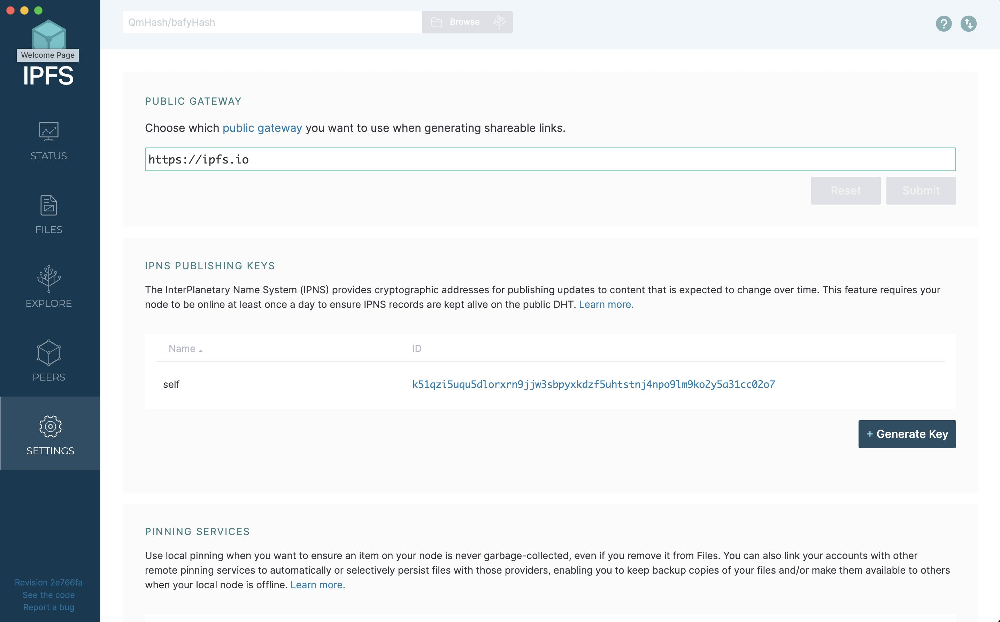
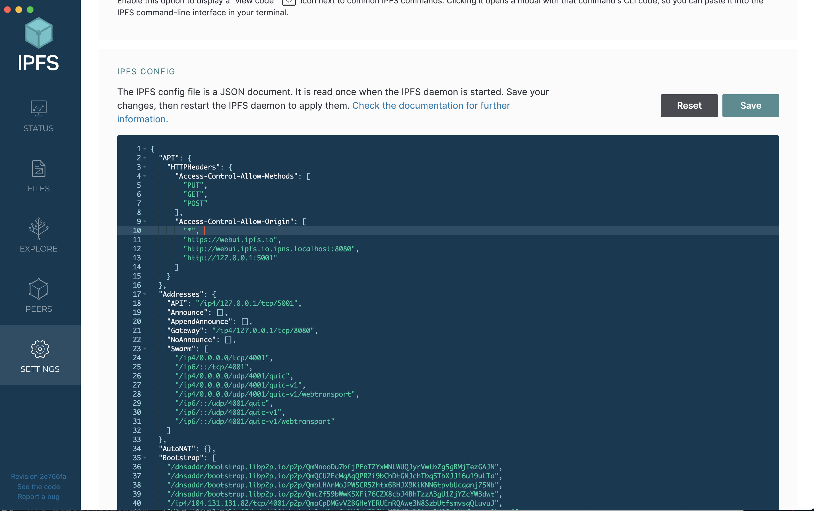

# NFT frontend application

This article explains how to create a `React` application and connect it to an [NFT smart contract](./../gnft-721) running in the blockchain.

### Preparation

1. First clone the [frontend-starter](https://github.com/LouiseMedova/gear-app-starter). Install [NodeJs](https://nodejs.org/en/download/) and [NPM](https://docs.npmjs.com/downloading-and-installing-node-js-and-npm). Make sure you have the latest LTS version of the NodeJs installed. 

2. Then install yarn:
    ```shell
    npm install --global yarn 
    ```

3. There is an `.env.example` file. Create your own `.env` file and copy the contents of `.env.example` to your `.env` file. It contains the following variables:
    - `REACT_APP_NODE_ADDRESS`: This variable defines the node we'll be working on.
    - `REACT_APP_CONTRACT_ADDRESS`: The address of the contract uploaded to the chain.
    - `REACT_APP_IPFS_ADDRESS` and `REACT_APP_IPFS_GATEWAY_ADDRESS`: These variables are needed when we upload media files to IPFS. 

4. Upload the contract to the chain and set up the address in the `.env` file. Place the `meta.txt` file in the `assets/meta` folder and the `nft_state.meta.wasm` file in the `assets/wasm folder`.

5. Install packages:
    ```shell
    yarn install
    ```
    and run the application:
    ```shell
    yarn start
    ```

6. The main file `App.tsx` is simple:

    ```typescript
    import { useApi, useAccount } from '@gear-js/react-hooks';
    import { Routing } from 'pages';
    import { Header, Footer, ApiLoader } from 'components';
    import { withProviders } from 'hocs';
    import 'App.scss';

    function Component() {
    const { isApiReady } = useApi();
    const { isAccountReady } = useAccount();

    const isAppReady = isApiReady && isAccountReady;

    return (
        <>
        <Header isAccountVisible={isAccountReady} />
        <main>{isAppReady ? <Routing /> : <ApiLoader />}</main>
        <Footer />
        </>
    );
    }

    export const App = withProviders(Component);
    ```

    It checks whether the application is connected to the chain:

    ```typescript
    const { isApiReady } = useApi();
    ```

    It checks whether the account is connected to the application through the web extension:

    ```typescript
    const { isAccountReady } = useAccount();
    ```

7. If the `api` is ready and the `account` is connected, it displays the application's pages. Let's navigate to the `pages` folder. The project has only one page `Home`. The `index.tsx` file is also simple:

    ```typescript
    import { Route, Routes } from 'react-router-dom';
    import { Home } from './home/Home';

    const routes = [
    { path: '/', Page: Home },
    ];

    export function Routing() {
    const getRoutes = () => routes.map(({ path, Page }) => 
    <Route key={path} path={path} element={<Page />} />
    );

    return <Routes>{getRoutes()}</Routes>;
    }
    ```

### Create-NFT page

1. Let's create a page for NFT creation.
    ```shell
    mkdir src/pages/create-nft
    touch src/pages/create-nft/CreateNft.tsx
    ```

2. Then move the file with styles from `assets` folder to the `create-nft` folder:
    ```shell
    mv src/assets/styles/CreateNft.module.scss src/pages/create-nft 
    ```

3. Let's start writing the `CreateNft.tsx`:

    ```typescript 
    import styles from 'CreateNft.module.scss'

    export function CreateNft() {
        return (
            <div>Create NFT</div>
        )
    }
    ```

4. We should declare this page in the `index.tsx` file and also add the route for it:

    ```typescript 
    import { Route, Routes } from 'react-router-dom';
    import { CreateNft } from './create-nft/CreateNft';
    import { Home } from './home/Home';

    const routes = [
    { path: '/', Page: Home },
    { path: '/create-nft', Page: CreateNft },
    ];

    export function Routing() {
    const getRoutes = () => routes.map(({ path, Page }) => 
    <Route key={path} path={path} element={<Page />} />
    );

    return <Routes>{getRoutes()}</Routes>;
    }
    ```

5. Let's create a link to the `CreateNft` page from the `Home` page. In the `Home.tsx` file, let's write:

    ```typescript 
    import { Link } from "react-router-dom";

    function Home() {
    return (
        <Link to="/create-nft">
        <h3>Create NFT</h3>
        </Link>
    )
    }
    export { Home };
    ```

6. Now let's go back to the `CreateNft` page. First, we create a form that includes the NFT `title`, `description`, and `image`:

    ```typescript 
    import { Button, FileInput, Input } from '@gear-js/ui'
    import styles from './CreateNft.module.scss'

    export function CreateNft() {
        return (
            <>
                <h2 className={styles.heading}> Create NFT</h2>
                <div className={styles.main}>
                    <form className={styles.from}>
                        <div className={styles.item}>
                            <Input label="Name" className={styles.input} required/>
                        </div>
                        <div className={styles.item}>
                            <Input label="Description" className={styles.input} required/>
                        </div>
                        <div className={styles.item}>
                            <FileInput label="Image" className={styles.input}  required/>
                        </div>
                        <Button type="submit" text="Create" className={styles.button}/>
                    </form>
                </div>
            </>
        )
    }
    ```

7. Let's create a state that will store the NFT's title, description, and image, and add the functions `handleInputChange` and `handleImageChange` that will update this state:

    ```typescript 
    import { Button, FileInput, Input } from '@gear-js/ui'
    import { useState } from 'react'
    import styles from './CreateNft.module.scss'

    const NftInitialState = {
        title: "",
        description: "",
    }

    export function CreateNft() {
        const [nftForm, setNftForm] = useState(NftInitialState);
        const [image, setImage] = useState<File | null>(null)
        const { title, description } = nftForm;

        const handleInputChange = (e: React.ChangeEvent<HTMLInputElement>) => {
            const { name, value } = e.target;        
            setNftForm(prevForm => ({...prevForm , [name]: value}))
        }

        return (
            <>
                <h2 className={styles.heading}> Create NFT</h2>
                <div className={styles.main}>
                    <form className={styles.from}>
                        <div className={styles.item}>
                            <Input label="Name" className={styles.input} required name="title" value={title} onChange={handleInputChange}/>
                        </div>
                        <div className={styles.item}>
                            <Input label="Description" className={styles.input} required name="description" value={description} onChange={handleInputChange}/>
                        </div>
                        <div className={styles.item}>
                            <FileInput label="Image" className={styles.input} onChange={setImage}/>
                        </div>
                        <Button type="submit" text="Create" className={styles.button}/>
                    </form>
                </div>
            </>
        )
    }
    ```

8. Let's also add the image preview for the uploaded image:

    ```typescript
    ...
    export function CreateNft() {
        ...
        return (
            <>
                <h2 className={styles.heading}> Create NFT</h2>
                <div className={styles.main}>
                    <form className={styles.from}>
                        ...
                        <div className={styles.item}>
                            <FileInput label="Image" className={styles.input} onChange={setImage}/>
                            { image ? (
                                <div className="image-preview">
                                    
                                </div> 
                            ): (
                                <p>No image set for this NFT</p>
                            )}
                        </div>
                        <Button type="submit" text="Create" className={styles.button}/>
                    </form>
                </div>
            </>
        )
    }
    ```

### Upload image and mint NFT

1. Next, we upload the image to IPFS and send a `Mint` message to the contract.
Install the [IPFS Desktop App](http://docs.ipfs.tech.ipns.localhost:8080/install/ipfs-desktop/#windows).

2. Navigate to `Settings`:

Locate `IPFS config`:

and configure the `API` of your node:

    ```
    "API": {
            "HTTPHeaders": {
                "Access-Control-Allow-Methods": [
                    "PUT",
                    "GET",
                    "POST"
                ],
                "Access-Control-Allow-Origin": [
                    "*", 
                    "https://webui.ipfs.io",
                    "http://webui.ipfs.io.ipns.localhost:8080",
                    "http://127.0.0.1:5001"
                ]
            }
        },
    ```

3. Now we are ready to upload the files from our application. Let's start writing the function:

    ```typescript
    ...
    import { useIPFS } from 'hooks';
    ...
    export function CreateNft() {
        ...

        const ipfs = useIPFS();
        
        const createNft = async (e: React.FormEvent<HTMLFormElement>) => {
            e.preventDefault();

            let cid;
            if (image) {
            try {
                cid = await ipfs.add(image as File)
            } catch (error) {
                    alert(error)
            }
            }
        }
        ...
    }

    ```

4. Next, we need to send the message to the contract. But before that, let's create the necessary hooks.
Create a file named `api.ts` in the `hooks` folder.

```shell
touch src/hooks/api.ts
```

5. We'll define the hook `useNFTMetadata` and `useSendNFTMessage`:

    ```typescript
    import { useSendMessage } from '@gear-js/react-hooks';
    import metaTxt from 'assets/meta/meta.txt'
    import { ADDRESS } from 'consts';
    import { useMetadata } from "./useMetadata";

    function useNFTMetadata() {
        return useMetadata(metaTxt)
    }

    function useSendNFTMessage() {
        const meta = useNFTMetadata()
        return useSendMessage(ADDRESS.CONTRACT_ADDRESS, meta)
    }

    export {useNFTMetadata, useSendNFTMessage}
    ```

6. Let's continue writing the `CreateNft` function. We will create the `payload` message and send it to the contract.

    ```typescript 
    ...
    import { useAccount } from '@gear-js/react-hooks';
    import { useSendNFTMessage } from 'hooks/api';
    import { useNavigate } from 'react-router-dom';
    ...

    export function CreateNft() {
        ...
        const ipfs = useIPFS();
        const { account }= useAccount();
        const navigate = useNavigate();
        const sendMessage = useSendNFTMessage();

        const resetForm = () => {
            setNftForm(NftInitialState);
            setImage(null)
        }

        const createNft = async (e: React.FormEvent<HTMLFormElement>) => {
            e.preventDefault();

            let cid;
            if (image) {
            try {
                cid = await ipfs.add(image as File)
            } catch (error) {
                    alert(error)
            }
            }
            const tokenMetadata = {
                name: title,
                description,
                media: cid?.cid.toString(),
                reference: "",
            }
            
            const payload = {
                Mint: {
                    to: account?.decodedAddress,
                    tokenMetadata,
                }
            };

            handleMessage(
                payload,
                {
                    onSuccess: () => {
                        resetForm();
                        navigate('/')
                    },
                },
            );
        }
        ...
    }
    ```

7. The `CreateNft` page is ready. The complete code is as follows:

    ```typescript 
    import { useAccount } from '@gear-js/react-hooks';
    import { Button, FileInput, Input } from '@gear-js/ui'
    import { useIPFS } from 'hooks';
    import { useSendNFTMessage } from 'hooks/api';
    import { useState } from 'react'
    import { useNavigate } from 'react-router-dom';
    import styles from './CreateNft.module.scss'

    const NftInitialState = {
        title: "",
        description: "",
    }

    export function CreateNft() {
        const [nftForm, setNftForm] = useState(NftInitialState);
        const [image, setImage] = useState<File | null>(null)
        const { title, description } = nftForm;

        const handleInputChange = (e: {target: {name: any, value: any }}) => {
            const { name, value } = e.target;
            setNftForm({...nftForm, [name]: value})
        }

        const ipfs = useIPFS();
        const { account }= useAccount();
        const navigate = useNavigate();
        const handleMessage = useSendNFTMessage();

        const resetForm = () => {
            setNftForm(NftInitialState);
            setImage(null)
        }

        const createNft = async (e: React.FormEvent<HTMLFormElement>) => {
            e.preventDefault();

            let cid;
            if (image) {
            try {
                cid = await ipfs.add(image as File)
            } catch (error) {
                    alert(error)
            }
            }
            const tokenMetadata = {
                name: title,
                description,
                media: cid?.cid.toString(),
                reference: "",
            }
            
            const payload = {
                Mint: {
                    to: account?.decodedAddress,
                    tokenMetadata,
                }
            };

            handleMessage(
                payload,
                {
                    onSuccess: () => {
                        resetForm();
                        navigate('/')
                    },
                },
            );
        }
        return (
            <>
                <h2 className={styles.heading}> Create NFT</h2>
                <div className={styles.main}>
                    <form className={styles.from} onSubmit={createNft}>
                        <div className={styles.item}>
                            <Input label="Name" className={styles.input} required name="title" value={title} onChange={handleInputChange}/>
                        </div>
                        <div className={styles.item}>
                            <Input label="Description" className={styles.input} required name="description" value={description} onChange={handleInputChange}/>
                        </div>
                        <div className={styles.item}>
                            <FileInput label="Image" className={styles.input} onChange={setImage}/>
                            { image ? (
                                <div className="image-preview">
                                    
                                </div> 
                            ): (
                                <p>No image set for this NFT</p>
                            )}
                        </div>
                        <Button type="submit" text="Create" className={styles.button}/>
                    </form>
                </div>
            </>
        )
    }
    ```

In the next section, we will create the `Home` page where we will read and display the minted NFTs.

### Home page

In the `api.ts` file, we will add hooks for reading the contract state.

1. First, let's add `useNFTState<T>`, where `T` is the type we expect to read (for example, `Token`). It will accept the function name and payload if required for the specified function:

    ```typescript
    import stateMetaWasm from 'assets/wasm/nft_state.meta.wasm'
    import { useMetadata, useWasmMetadata } from './useMetadata'
    import metaTxt from 'assets/meta/meta.txt'
    import { useAccount, useReadWasmState, useSendMessage } from '@gear-js/react-hooks';
    import { ADDRESS } from 'consts';

    function useNFTMetadata() {
        return useMetadata(metaTxt);
    }

    function useNFTState<T>(functionName: string, payload?: any) {
        const { buffer } = useWasmMetadata(stateMetaWasm);
        return useReadWasmState<T>(
            ADDRESS.CONTRACT_ADDRESS,
            buffer,
            functionName,
            payload
        )
    }
    ```

2. Let's read all the tokens our contract has. First, we'll create the type for a token in a separate folder called `types`:

    ```shell
    mkdir types
    touch types/index.ts
    ```

    and add the `Token` description to the `index.ts` file:

    ```typescript
    import { HexString } from "@polkadot/util/types";

    type Token = {
        approvedAccountIds: HexString[];
        description: string;
        id: string;
        media: string;
        name: string;
        ownerId: HexString;
        reference: string;
    };

    export type { Token };
    ```

3. Then we can write the `useNFTs` hook:

    ```typescript
    ...
    import { Token } from 'types';

    ...
    function useNFTs() {
        const { state } = useNFTState<Token[]>("all_tokens", null);
        return state;
    }
    ```

4. Now let's start writing the `Home` page:

    ```typescript

    import { Loader } from 'components';
    import { useNFTs } from 'hooks/api';
    import styles from './Home.module.scss'

    function Home() {

    const nfts = useNFTs();
    const isAnyNft = !!nfts?.length;

    return (
        <>
        <header className={styles.header}>
            <h2 className={styles.heading}>NFTs</h2>
        </header>
        {nfts ? (
            <>
            {isAnyNft && <ul className={styles.list}>Display NFTs here</ul>}
            {!isAnyNft && <h2>There are no NFTs at the moment</h2>}
            </>
        ) : (
            <Loader />
        )}
        </>
    )
    }
    export { Home };
    ```

5. We read `nfts` using the previously written hook `useNFTs`:

    ```typescript
    const nfts = useNFTs();
    ```

6. Then we check whether the contract has tokens:

    ```typescript
    const isAnyNft = !!nfts?.length;
    ```

7. Let's create a component that will display NFT:

    ```
    mkdir pages/home/nft
    touch pages/home/nft/nft.tsx
    ```

    and write the component:

    ```typescript
    import { Link } from "react-router-dom";
    import { getIpfsAddress } from "utils";
    import styles from './nft.module.scss'

    type Props = {
        id: string;
        name: string;
        media: string
    }

    function NFT( {id, name, media }: Props) {
        const to = `/nft/${id}`;
        const src = getIpfsAddress(media)
        const text = `#${id}`
        return (
            <Link to={to} className={styles.nft}>
                
                <h3 className={styles.heading}>{name}</h3>
                <p className={styles.text}>{text}</p>
            </Link>
        )
    }

    export { NFT };
    ```

8. Then let's write a function for retrieving all NFTs from the contract in the `Home.tsx` file:

    ```typescript 
    ...
    import { NFT } from './nft/nft';

    function Home() {

    const nfts = useNFTs();
    const isAnyNft = nfts?.length;

    const getNFTs = () => 
        nfts?.map( ({name, id, media}) => (
        <li key={id}>
            <NFT id = {id} name = {name} media = {media} />
        </li>
        ))
        
    ...
    }
    export { Home };
    ```
    The whole code of the `Home` page:
    ```typescript
    import { Loader } from 'components';
    import { useNFTs } from 'hooks/api';
    import styles from './Home.module.scss'
    import { NFT } from './nft/nft';

    function Home() {

    const { nfts: state, isNftStateRead: isStateRead } = useNFTs();
    const isAnyNft = nfts?.length;

    const getNFTs = () => 
        nfts?.map( ({name, id, media}) => (
        <li key={id}>
            <NFT id = {id} name = {name} media = {media} />
        </li>
        ))
        
        
    const NFTs = getNFTs();

    return (
        <>
        <header className={styles.header}>
            <h2 className={styles.heading}>NFTs</h2>
        </header>
        {isNftStateRead ? (
            <>
            {isAnyNft && <ul className={styles.list}>{NFTs}</ul>}
            {!isAnyNft && <h2>There are no NFTs at the moment</h2>}
            </>
        ) : (
            <Loader />
        )}
        </>
    )
    }
    export { Home };
    ```