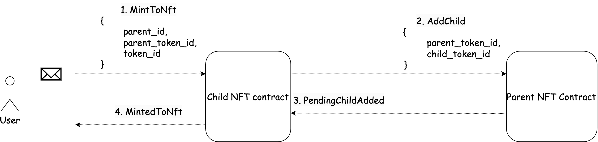
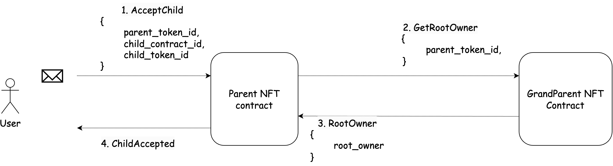
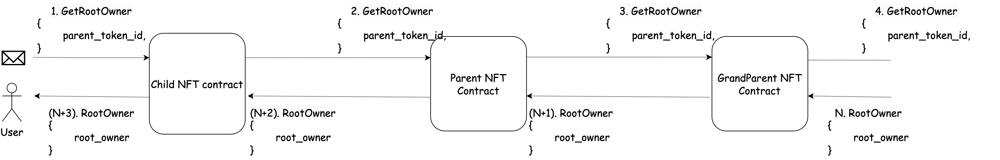
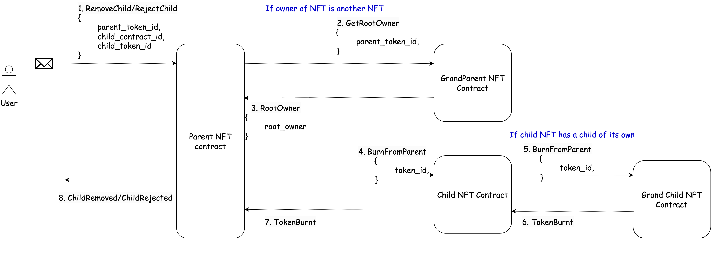

# RMRK NFT standard

## Introduction
RMRK is an NFT protocol dedicated to establishing a standard NFT cross-chain infrastructure on the Kusama and Polkadot ecosystems. The [RMRK NFT 2.0 Concepts](https://docs.rmrk.app/concepts) are divided into RMRK legos and RMRK concepts. Legos are primitives that make up complex use cases and enable certain concepts.
RMRK legos that are already implemented on Gear:
- Nested NFTs:
    The ability for any NFT to contain other RMRK NFT.
- Catalogs and Equippable NFTs;
The ability for an NFT to vary its output depending on the context it is being loaded in.

This article explains the programming interface, data structure, basic functions and explains their purpose. The source code is available on [GitHub](https://github.com/gear-dapps/RMRK). 

## Logic
### Nesting logic
The concept of nested NFTs refers to NFTs being able to own other NFTs. So, the NFT owner can be not only an account or a smart contract, but also another NFT. 

In the usual NFT standard, NFT owners were stored as mapping from the NFT ids to addresses:
```rust
HashMap<TokenId, ActorId>
```
In the RMRK NFT standard we store the owners of tokens in the following way:
```rust
HashMap<TokenId, RMRKOwner>

pub struct RMRKOwner {
    pub token_id: Option<TokenId>,
    pub owner_id: ActorId,
}

```

If the owner of NFT is another NFT then the field `token_id` is `Some(parent_token_id)` and the `owner_id` is the address of the parent RMRK contract, otherwise `token_id` is `None` and `owner_id` is the address of an account or another smart contract.

RMRK NFT tokens have the concept of `owner` and `rootowner`. `Rootowner` will always be an account or program where owner can also be an NFT ID in cases where an NFT owns another NFT. For example, if Alice owns `NFT A` which owns `NFT B` then the `owner` of `NFT B` is `NFT A` and the `rootowner` of `NFT B` is Alice.

RMRK standard has 2 options of minting tokens. The first one is similar to the `mint` function at usual NFT standard:

```rust
/// Mints token to the user or program.
///
/// # Requirements:
/// * The `token_id` must not exist.
/// * The `to` address should be a non-zero address.
///
/// # Arguments:
/// * `to`: is the address who will own the token.
/// * `token_id`: is the tokenId of the new RMRK token.
///
/// On success reply [`RMRKEvent::MintToRootOwner`].
MintToRootOwner {
    to: ActorId,
    token_id: TokenId,
},
```

The second `mint` function allows you to create an NFT that will belong to another NFT (or be a child of another NFT):

```rust
/// Mints token that will belong to another token in another RMRK contract.
///
/// # Requirements:
/// * The `parent_id`  must be a deployed RMRK contract.
/// * The token with id `parent_token_id` must exist in the `parent_id` contract.
/// * The `token_id` must not exist.
///
/// # Arguments:
/// * `parent_id`: is the address of the RMRK parent contract.
/// * `parent_token_id`: is the parent RMRK token.
/// * `token_id`: is the tokenId of the new RMRK token.
///
/// On success replies [`RMRKEvent::MintToNft`].
MintToNft {
    parent_id: ActorId,
    parent_token_id: TokenId,
    token_id: TokenId,
},
```

When creating a token that will belong to another NFT, the contract sends a message `AddChild` to parent the RMRK contract:

```rust
/// That message is designed to be send from another RMRK contracts
/// when minting an NFT(child_token_id) to another NFT(parent_token_id).
/// It adds a child to the NFT with tokenId `parent_token_id`
/// The status of added child is `Pending`.
///
/// # Requirements:
/// * Token with TokenId `parent_token_id` must exist.
/// * There cannot be two identical children.
///
/// # Arguments:
/// * `parent_token_id`: is the tokenId of the parent NFT.
/// * `child_token_id`: is the tokenId of the child instance.
///
/// On success replies [`RMRKEvent::PendingChild`].
AddChild {
    parent_token_id: TokenId,
    child_token_id: TokenId,
},
```

Thus, the interaction between NFT contracts during the minting of an NFT that belongs to another NFT can be summarized as follows:
1. The Child NFT contract sends an "AddChild" message to the parent NFT contract.
2. The parent NFT contract performs all necessary checks. If everything is correct, it adds the NFT to its pending children and responds to the Child NFT contract with a successful execution message.
3. The Child NFT contract mints the NFT, which is owned by another NFT.


The root owner or the approved account can accept the child NFT by sending the following message:
```rust
/// Accepts an RMRK child being in the `Pending` status.
/// Removes RMRK child from `pending_children` and adds it to `accepted_children`.
///
/// # Requirements:
/// * The `msg::source()` must be an RMRK owner of NFT with tokenId `parent_token_id` or an approved account.
/// * The indicated NFT with tokenId `child_token_id` must exist in the pending array of `parent_token_id`.
///
/// # Arguments:
/// * `parent_token_id`: is the tokenId of the parent NFT
/// * `child_token_id`: is the tokenId of the child instance
///
/// On success replies [`RMRKEvent::AcceptedChild`]. 
AcceptChild {
    parent_token_id: TokenId,
    child_contract_id: ActorId,
    child_token_id: TokenId,
},
```

The interaction between NFT contracts during the acceptance of a child NFT can be described as follows:

1. The contract checks if the account that sent the message is the root owner of the parent NFT or an approved account. If the account is not approved and the parent NFT is a child of another NFT, a message is sent to its parent to find the root owner (the root owner search algorithm will be provided below).

2. If the account is successfully verified, the child NFT is either accepted.



Root Owner Search Algorithm:

1. Start with the current parent NFT.
2. If the current parent NFT is the root owner itself, return its address.
3. If the current parent NFT has a parent, move to its parent and continue from step 2.
4. Repeat steps 2 and 3 until reaching the root NFT.
5. Return the address of the root NFT as the root owner.



The root owner can also reject the child NFT with the message:
```rust
/// Rejects an RMRK child being in the `Pending` status.
/// It sends a message to the child NFT contract to burn the NFT token from it.
///
/// # Requirements:
/// * The `msg::source()` must be an RMRK owner or an approved account.
/// * The indicated NFT with tokenId `child_token_id` must exist in the pending array of `parent_token_id`.
///
/// Arguments:
/// * `parent_token_id`: is the tokenId of the parent NFT.
/// * `child_contract_id`: is the address of the child RMRK contract.
/// * `child_token_id`: is the tokenId of the child instance.
///
/// On success replies [`RMRKEvent::RejectedChild`]. 
RejectChild {
    parent_token_id: TokenId,
    child_contract_id: ActorId,
    child_token_id: TokenId,
},
```

or remove the already accepted child from his NFT accepted children:
```rust
/// Removes an RMRK child being in the `Accepted` status.
/// It sends a message to the child NFT contract to burn the NFT token from it.
///
/// # Requirements:
/// * The `msg::source()` must be an RMRK owner or an approved account.
///
/// # Arguments:
/// * `parent_token_id`: is the tokenId of the parent NFT.
/// * `child_contract_id`: is the address of the child RMRK contract.
/// * `child_token_id`: is the tokenId of the child instance.
///
/// On success replies [`RMRKEvent::RemovedChild`].
RemoveChild {
    parent_token_id: TokenId,
    child_contract_id: ActorId,
    child_token_id: TokenId,
},
```
If the root owner rejects  or removes the child NFT, the child NFT must be burnt from the child NFT contract. The parent NFT contract sends the corresponding message to the child NFT contract:

```rust
/// Burns RMRK tokens. It must be called from the RMRK parent contract when the root owner removes or rejects child NFTs.
/// The input argument is an `BTreeSet<TokenId>` since a parent contract can have multiple children that must be burnt.
/// It also recursively sends messages [`RMRKAction::BurnFromParent`] to children of burnt tokens if any.
///
/// # Requirements:
/// * The `msg::source()` must be a RMRK parent contract.
/// * All tokens in `BTreeSet<TokenId>` must exist.
///
/// # Arguments:
/// * `token_ids`: is the tokenIds of the burnt tokens.
///
/// On success replies [`RMRKEvent::TokensBurnt`].
BurnFromParent {
    child_token_ids: BTreeSet<TokenId>,
    root_owner: ActorId,
},
```
The token being burned may also have children in other contracts. When burned, it recursively burns all the children's NFTs.

The interaction between NFT contracts during the removal or rejection of a child NFT can be described as follows:

1. The contract checks if the account that sent the message is the root owner of the parent NFT or an approved account (similar to accepting a child).

2. If the account is successfully verified, a "BurnFromParent" message is sent to the child NFT contract to burn (delete) the NFT.

3. It is possible that the child being burned also has a child of its own. In that case, a "BurnFromParent" message is recursively sent to the grandchild NFT as well.

4. After successful execution of all the aforementioned messages, the child is removed from the pending/accepted children list of the parent NFT.

 

The root owner can also burn the NFT with following message:
```rust
/// Burns RMRK token.
/// It recursively burns all the children's NFTs.
/// It checks whether the token is a child of another token.
/// If so, it sends a message to the parent NFT  to remove the child.
///
/// # Requirements:
/// * The `msg::source()` must be the root owner of the token.
///
/// # Arguments:
/// * `token_id`: is the tokenId of the burnt token.
///
/// On success replies [`RMRKEvent::Transfer`].
Burn(TokenId),
```
In addition to burning tokens recursively, it also checks whether the burnt NFT belongs to another NFT. In that case, it is necessary to remove the token from the children list in the parent's contract with the following message:

```rust
/// Burns a child of NFT.
/// That function must be called from the child RMRK contract during `transfer`, `transfer_to_nft` and `burn` functions.
///
/// # Requirements:
/// * The `msg::source()` must be a child RMRK contract.
/// * The indicated child must exist on the children list of `parent_token_id`.
///
/// # Arguments:
/// * `parent_token_id`: is the tokenId of the parent NFT.
/// * `child_token_id`: is the tokenId of the child instance.
///
/// On success replies [`RMRKEvent::ChildBurnt`].
BurnChild {
    parent_token_id: TokenId,
    child_token_id: TokenId,
},
```

When NFT is transferred, the destination can be either an account or another NFT. To send an NFT to another account you need to send a message:
```rust
/// Transfers NFT to another account.
/// If the previous owner is another RMRK contract, it sends the message [`RMRKAction::BurnChild`] to the parent contract.
///
/// # Requirements:
/// * The `token_id` must exist.
/// * The `msg::source()` must be approved by the owner of the token.
/// * The `to` address should be a non-zero address.
///
/// # Arguments:
/// * `to`: is the receiving address.
/// * `token_id`: is the tokenId of the transferred token.
///
/// On success replies [`RMRKEvent::ChildBurnt`].
Transfer {
    to: ActorId,
    token_id: TokenId,
},
```
If the previous owner is another NFT it sends a message `BurnChild` to the parent contract. 

In case of transferring a token to another NFT, the following message is sent:
```rust
/// Transfers NFT to another NFT.
///
/// # Requirements:
/// * The `token_id` must exist.
/// * The `msg::source()` must be approved by the root owner of the token.
/// * The `to` address should be a non-zero address
///
/// # Arguments:
/// * `to`: is the address of the new parent RMRK contract.
/// * `destination_id: is the tokenId of the parent RMRK token.
/// * `token_id`: is the tokenId of the transferred token.
///
/// On success replies [`RMRKEvent::TransferToNft`].
TransferToNft {
    to: ActorId,
    token_id: TokenId,
    destination_id: TokenId,
},
```
In this case, 5 scenarios are possible:
1. Root owner transfers child token from NFT to another his NFT within one contract.
In that case child RMRK contract sends message `TransferChild` to parent RMRK contract with indicated previous `TokenId` and new `TokenId`:

```rust
/// That message is designed to be sent from another RMRK contracts
/// when the root owner transfers his child to another parent token within one contract.
/// If root owner transfers child token from NFT to another his NFT
/// it adds a child to the NFT  with a status that child had before. 
/// If root owner transfers child token from NFT to another NFT that he does not own
/// it adds a child to the NFT  with a status `Pending`. 
///
/// # Requirements:
/// * The `msg::source()` must be a child RMRK contract.
/// * The `to` must be an existing RMRK token
/// * The `root_owner` of `to` and `from` must be the same.
///
/// # Arguments:
/// * `from`: RMRK token from which the child token will be transferred.
/// * `to`: RMRK token to which the child token will be transferred.
/// * `child_token_id`: is the tokenId of the child in the RMRK child contract.
///
/// On success replies [`RMRKEvent::ChildTransferred`].
TransferChild {
    from: TokenId,
    to: TokenId,
    child_token_id: TokenId,
},
```
2. Root owner transfers child token from RMRK parent token in one contract to another his RMRK token in another contract:
    - Child RMRK contract sends message `BurnChild` to previous parent RMRK contract;
    - Child RMRK contract sends message `AddAcceptedChild` to new parent RMRK contract;
```rust
/// That function is designed to be called from another RMRK contracts
/// when the root owner transfers his child NFT to another his NFT in another contract.
/// It adds a child to the RMRK token with tokenId `parent_token_id` with status `Accepted`.
///
/// # Requirements:
/// * The `msg::source()` must be a child RMRK contract.
/// * The `parent_token_id` must be an existing RMRK token that must have `child_token_id` in its `accepted_children`.
///
/// # Arguments:
/// * `parent_token_id`: RMRK token to which the child token will be transferred.
/// * `child_token_id`: is the tokenId of the child of the RMRK child contract.
///
/// On success replies [`RMRKEvent::AcceptedChild`].
AddAcceptedChild {
    parent_token_id: TokenId,
    child_token_id: TokenId,
},
```
3. Root owner transfers child token to RMRK token that belongs to another root account:
    - Child RMRK contract sends message `BurnChild` to previous parent RMRK contract;
    - Child RMRK contract sends message `AddChild` to new parent RMRK contract;
4. Transferred RMRK token belongs directly to root owner and he transfers RMRK token to his another RMRK token: child RMRK contract sends message `AddAcceptedChild` to new parent RMRK contract.
5. Transferred RMRK token belongs directly to root owner and he transfers RMRK token to another RMRK token that he doesn’t own: child RMRK contract sends message `AddChild` to new parent RMRK contract.

The `approve` function in RMRK NFT standard is similar to the usual nft standard function, except that `msg::source` must the the `root_owner`:
```rust
/// Approves an account to transfer NFT.
///
/// # Requirements:
/// * The `token_id` must exist.
/// * The `msg::source()` must be approved by the root owner of the token.
/// * The `to` address must be a non-zero address
///
/// # Arguments:
/// * `to`: is the address of the approved account.
/// * `token_id`: is the tokenId of the token.
///
/// On success replies [`RMRKEvent::Approval`].
Approve {
    to: ActorId,
    token_id: TokenId,
},
```

### Catalogs and Equippable NFTs
That functionality allows NFTs to equip owned NFTs in order to gain extra utility or change their appearance. It is also known as composable NFTs. 

A Catalog can be considered a catalog of parts from which an NFT can be composed. 

The Catalog contract state:
```rust
#[derive(Debug, Default, Encode, Decode, TypeInfo)]
pub struct Base {
    /// Original creator of the Base.
    /// Admin can add, modify or remove parts from Base.
    pub admin: ActorId,

    /// Specifies how an NFT should be rendered(svg, audio, mixed, video, png).
    pub base_type: String,

    /// Provided ny user during Base creation.
    pub symbol: String,

    /// Mapping from `PartId` to `Part`.
    pub parts: BTreeMap<PartId, Part>,

    /// Vector of parts that are equippable to all collections
    pub is_equippable_to_all: Vec<PartId>,
}
```
Parts can be either of the `Slot` type or `Fixed` type. Slots are intended for equippables.
```rust
#[derive(Debug, Clone, Default, Encode, Decode, TypeInfo, Eq, PartialEq)]
pub struct FixedPart {
    /// An optional zIndex of base part layer.
    /// specifies the stack order of an element.
    /// An element with greater stack order is always in front of an element with a lower stack order.
    pub z: Option<ZIndex>,

    /// The metadata URI of the part.
    pub metadata_uri: String,
}

#[derive(Debug, Clone, Encode, Decode, TypeInfo, Eq, PartialEq)]
pub struct SlotPart {
    /// Array of whitelisted collections that can be equipped in the given slot. Used with slot parts only.
    pub equippable: Vec<CollectionId>,

    /// An optional zIndex of base part layer.
    /// specifies the stack order of an element.
    /// An element with greater stack order is always in front of an element with a lower stack order.
    pub z: Option<ZIndex>,

    /// The metadata URI of the part.
    pub metadata_uri: String,
}
```
The messages that the Catalog contract handles:
```rust
#[derive(Debug, Decode, Encode, TypeInfo)]
pub enum CatalogAction {
/// Adds parts to catalog contract.
///
/// # Requirements:
/// * The `msg::source()` must be the contract issuer.
/// * `PartId` must be unique.
///
/// # Arguments:
/// * `BTreeMap<PartId, Part>`: a mapping from `PartId` to fixed or slot `Part`.
///
/// On success replies `[CatalogReply::PartsAdded]`.
AddParts(BTreeMap<PartId, Part>),

/// Adds equippable to slot part.
///
/// # Requirements:
/// * The `msg::source()` must be the contract admin.
/// * The indicated collection contract must be RMRK contract.
/// * The token from indicated collections must have composable resource that refers to that base.
///
/// # Arguments:
/// * `collection_ids`: an addresses of RMRK contract.
///
/// On success replies `[CatalogReply::EquippableAdded]`.
AddEquippableAddresses {
    part_id: PartId,
    collection_ids: Vec<CollectionId>,
},


 /// Removes parts from the catalog.
///
/// # Requirements:
/// * The `msg::source()` must be the contract issuer.
/// * The parts with indicated PartIds must exist.
///
/// # Arguments:
/// * `Vec<PartId>`: Part IDs to be removed.
///
/// On success replies `[CatalogReply::PartsRemoved]`.
RemoveParts(Vec<PartId>),


/// Removes equippable from the slot part.
///
/// # Requirements:
/// * The `msg::source()` must be the contract issuer.
/// * Indicated equippable must exist.
///
/// # Arguments:
/// * `collection_id`: an address of RMRK contract.
///
/// On success replies `[CatalogReply::EquippableRemoved]`.
RemoveEquippable {
    part_id: PartId,
    collection_id: CollectionId,
},

/// Checks whether the token from specified collection is in equippable list.
///
/// # Arguments:
/// * `part_id`: the Part Id.
/// * `collection_id`: an address of RMRK contract.
/// * `token_id`: the id of the token in RMRK contract.
///
/// On success replies `[CatalogReply::Part]`.
CheckEquippable {
    part_id: PartId,
    collection_id: CollectionId,
},

/// Allows all collections to be equippable into the part
///
/// # Arguments:
/// * `part_id`: the Part Id.
///
/// # Requirements:
/// * The part_id` must be of the Slot type.
///
/// On success replies `[CatalogReply::EquippableToAllSet]`.
SetEquippableToAll {
    part_id: PartId,
},

/// Removes the addresses of nft collections from the equippable list.
///
/// # Arguments:
/// * `part_id`: the Part Id.
///
/// # Requirements:
/// * The part_id` must be of the Slot type.
///
/// On success replies `[CatalogReply::EqippableAddressesReset]`.
ResetEquippableAddress {
    part_id: PartId,
},
}
```

The RMRK contract logic is extended with the struct of assets:
```rust
#[derive(Default)]
pub struct Assets {
    /// Mapping of uint64 Ids to asset metadata
    pub assets: HashMap<u64, String>,
    /// Mapping of uint64 asset ID to corresponding catalog address.
    pub catalog_addresses: HashMap<u64, ActorId>,
    /// Mapping of asset_id to equippable_group_ids.
    pub equippable_group_ids: HashMap<u64, u64>,
    /// Mapping of asset_id to catalog parts applicable to this asset, both fixed and slot
    pub part_ids: HashMap<u64, Vec<PartId>>,
    /// Mapping of tokenId to an array of pending assets
    pub pending_assets: HashMap<TokenId, Vec<u64>>,
    /// Mapping of tokenId to an array of active assets
    pub active_assets: HashMap<TokenId, Vec<u64>>,
    /// Mapping of tokenId to an array of priorities for active assets
    pub active_assets_priorities: HashMap<TokenId, Vec<u64>>,
    /// Mapping of tokenId to new asset, to asset to be replaced
    pub asset_replacement: HashMap<TokenId, HashMap<u64, u64>>,
    /// Mapping of `equippable_group_id` to parent contract address and valid `slot_id`.
    pub valid_parent_slots: HashMap<u64, HashMap<ActorId, PartId>>,
    /// Mapping of token ID and catalog address to slot part ID to equipment information.
    /// Used to compose an NFT.
    pub equipments: HashMap<(TokenId, ActorId), HashMap<PartId, Equipment>>,
}
```
following messages: 
 ```rust
 /// Equips a child to a parent's slot.
///
/// # Arguments:
/// * `token_id`: the tokenId of the NFT to be equipped.
/// * `child_token_id`:
/// * `child_id`:
/// * `asset_id`:ID of the asset that we are equipping into
/// * `slot_part_id`: slotPartId ID of the slot part that we are using to equip
/// * `child_asset_id`: childAssetId ID of the asset that we are equipping
///
/// On success replies [`RMRKEvent::TokenEquipped`].
Equip {
    token_id: TokenId,
    child_token_id: TokenId,
    child_id: CollectionId,
    asset_id: u64,
    slot_part_id: PartId,
    child_asset_id: u64,
},
 ```
## Source code

The source code of RMRK implementation and the example of an implementation of its testing is available on [GitHub](https://github.com/gear-dapps/RMRK).


For more details about testing smart contracts written on Gear, refer to the [Program Testing](/docs/developing-contracts/testing) article.


### MultiAsset logic
The Multi Asset NFT standard is a standalone part of RMRK concepts. The idea is that an NFT can have multiple assets. 
There are four key use cases for NFT multiresource:
- *Cross-metaverse compatibility*:  for example, NFT with several resources can be used in different games.
- *Multimedia output*: NFT can be stored in different digital formats (image, video, audio, eBooks or text file).
- *Media Redundancy*: many NFTs are minted with metadata centralized on a server somewhere or, in some cases, a hardcoded IPFS gateway which can also go down, instead of just an IPFS hash. By adding the same metadata file as different resources, the resilience of the metadata and its referenced media increases exponentially as the chances of all the protocols going down at once become ever less likely.
- *NFT Evolution*: many NFTs, particularly game related ones, require evolution. 
RMRK contract can create a contract to store its resources.
#### **Asset storage contract:**
The storage state:
```rust
#[derive(Default)]
pub struct Assets {
    /// Mapping of uint64 Ids to asset metadata
    pub assets: HashMap<u64, String>,
    /// Mapping of uint64 asset ID to corresponding catalog address.
    pub catalog_addresses: HashMap<u64, ActorId>,
    /// Mapping of asset_id to equippable_group_ids.
    pub equippable_group_ids: HashMap<u64, u64>,
    /// Mapping of asset_id to catalog parts applicable to this asset, both fixed and slot
    pub part_ids: HashMap<u64, Vec<PartId>>,
    /// Mapping of tokenId to an array of pending assets
    pub pending_assets: HashMap<TokenId, Vec<u64>>,
    /// Mapping of tokenId to an array of active assets
    pub active_assets: HashMap<TokenId, Vec<u64>>,
    /// Mapping of tokenId to an array of priorities for active assets
    pub active_assets_priorities: HashMap<TokenId, Vec<u64>>,
    /// Mapping of tokenId to new asset, to asset to be replaced
    pub asset_replacement: HashMap<TokenId, HashMap<u64, u64>>,
    /// Mapping of `equippable_group_id` to parent contract address and valid `slot_id`.
    pub valid_parent_slots: HashMap<u64, HashMap<ActorId, PartId>>,
    /// Mapping of token ID and catalog address to slot part ID to equipment information.
    /// Used to compose an NFT.
    pub equipments: HashMap<(TokenId, ActorId), HashMap<PartId, Equipment>>,
}

```
To add asset to the token the RMRK contract must send the following message:
```rust
/// Adds asset entry on resource storage contract.
///
/// # Requirements:
/// * The `msg::source()` must be the contract admin (RMRK contract).
/// * `id` can not be equal to zero.
/// * Resource with indicated `id` must not exist.
///
/// # Arguments:
/// * `id`: is a resource identifier.
/// * `src`: a string pointing to the media associated with the resource.
/// * `thumb`: a string pointing to thumbnail media associated with the resource.
/// * `metadata_uri`:  a string pointing to a metadata file associated with the resource.
///
/// On success replies [`ResourceEvent::ResourceEntryAdded`]. 
AddResourceEntry {
    id: u8,
    src: String,
    thumb: String,
    metadata_uri: String,
},
```
To get information about whether such a resource exists in the storage or not, send the message:
```rust
/// Used to check from the RMRK contract whether the resource with indicated id exists or not.
///
/// # Arguments:
/// * `id`: is a resource identifier.
///
/// On success replies [`ResourceEvent::Resource`]. 
GetResource {
    id: u8,
},
```

#### **MultiAssets in RMRK contract:**
The RMRK contract admin can add resource to the storage contract through the RMRK contract:
```rust
/// Adds resource entry on resource storage contract.
/// It sends a message to the resource storage contract with information about a new resource.
///
/// # Requirements:
/// * The `msg::source()` must be the contract admin.
///
/// Arguments:
/// * `id`: is a resource identifier
/// * `src`: a string pointing to the media associated with the resource.
/// * `thumb`: a string pointing to thumbnail media associated with the resource.
/// * `metadata_uri`:  a string pointing to a metadata file associated with the resource.
///
/// On success reply `[RMRKEvent::ResourceEntryAdded]`.
AddResourceEntry {
    id: u8,
    src: String,
    thumb: String,
    metadata_uri: String,
},
```
Anyone can add resource to the existing token in the form of a propose-commit pattern. When adding a resource to a token, it is first placed in the "Pending" array, and must be migrated to the "Active" array by the token owner:
```rust
/// Adds resource to an existing token.
/// Checks that the resource with indicated id exists in the resource storage contract.
/// Proposed resource is placed in the "Pending" array.
/// A pending resource can be also proposed to overwrite an existing resource.
///
/// # Requirements
/// Token with indicated `token_id` must exist.
/// The proposed resource must not already exist for the token.
/// The resource that is proposed to be overwritten must exist for the token.
/// The length of resources in pending status must be less or equal to `MAX_RESOURCE_LEN`.
///
/// # Arguments:
/// * `token_id`: an id of the token.
/// * `resource_id`: a proposed resource.
/// * `overwrite_id`: a resource to be overwritten.
///
/// On success reply `[RMRKEvent::ResourceAdded]`.
AddResource {
    token_id: TokenId,
    resource_id: u8,
    overwrite_id: u8,
},
```
To accept resource the root owner must send the message:
```rust
/// Accepts resource from pending list.
/// Moves the resource from the pending array to the accepted array.
///
/// # Requirements
/// Only root owner or approved account can accept a resource.
/// `resource_id` must exist for the token in the pending array.
///
/// # Arguments:
/// * `token_id`: an id of the token.
/// * `resource_id`: a resource to be accepted.
///
/// On success reply  `[RMRKEvent::ResourceAccepted]`.
AcceptResource {
    token_id: TokenId,
    resource_id: u8,
},
```
or reject resource with the message:
```rust
/// Rejects a resource, dropping it from the pending array.
///
/// # Requirements
/// Only root owner or approved account can reject a resource.
/// `resource_id` must exist for the token in the pending array.
///
/// # Arguments:
/// * `token_id`: an id of the token.
/// * `resource_id`: a resource to be rejected.
///
/// On success reply  `[RMRKEvent::ResourceRejected]`.
RejectResource {
    token_id: TokenId,
    resource_id: u8,
},
```

An NFT multiple resources are ordered by priority that is set by the root owner:
```rust
/// Sets the priority of the active resources array
/// Priorities have a 1:1 relationship with their corresponding index in
/// the active resources array. E.G, a priority array of [1, 3, 2] indicates
///  that the the active resource at index 1 of the active resource array
///  has a priority of 1, index 2 has a priority of 3, and index 3 has a priority
///  of 2. There is no validation on priority value input; out of order indexes
///  must be handled by the frontend.
///
/// # Requirements
/// Only root owner or approved account can set priority
/// The length of the priorities array must be equal to the present length of the active resources array
///
/// # Arguments:
/// * `token_id`: an id of the token.
/// * `priorities`: An array of priorities to set.
///
/// On success reply `[RMRKEvent::PrioritySet]`.
SetPriority {
    token_id: TokenId,
    priorities: Vec<u8>,
},
```

