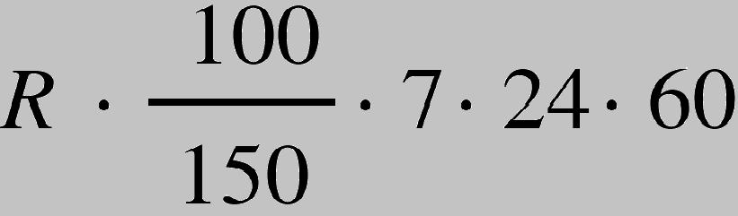
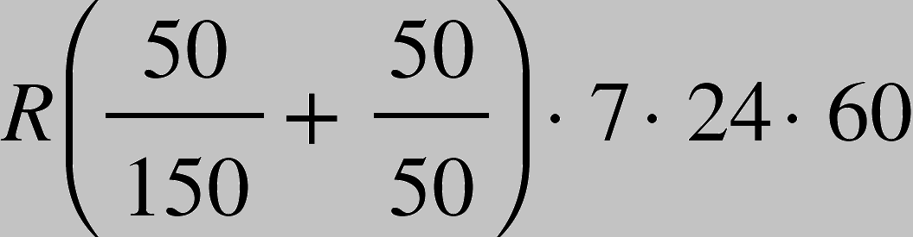
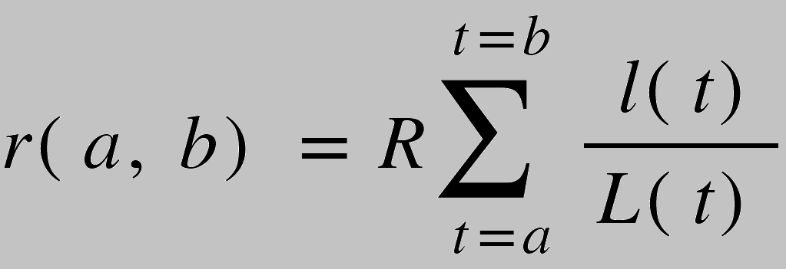
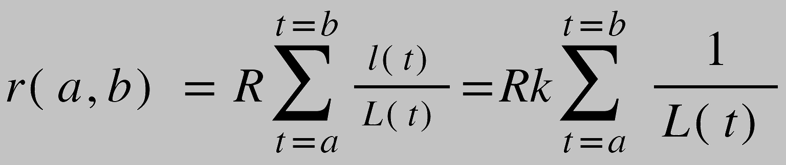
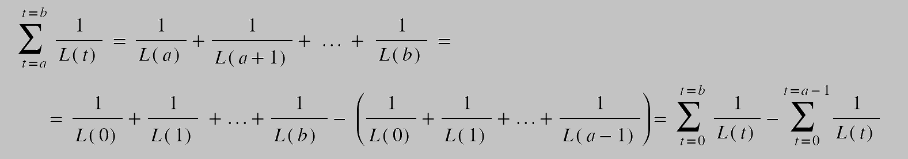
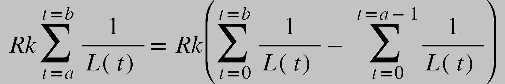

# Staking

## Introduction
Stacking is an analogue of a bank deposit, receiving passive earnings due to simple storage of cryptomonets.
The percentage of income may be different – it all depends on the term of the deposit.

### Mathematics
You can stake the fungible token into the contract (So you deposit tokens into the staking contract and later claim that token (or another fungible token) for a reward.
A fixed amount of reward  is minted for certain time interval (it can be a second, minute or day)
Rewards are distributed fairly across stakers.
How rewards work:
Lets we have Alice who stakes 100 tokens and Bob who stakes 50 tokens. Lets in our example reward tokens are minted every minute.
In total inside the staking contract there are 150 tokens. One week later Alice decided to unstake her tokens. The length of time Alice tokens were staked is 7 * 24 * 60. The amount of reward tokens:

[](./img/staking/staking-formula-1-1.png)

Another week later Bob also decides to unstake his 50 tokens. Lets calculate his reward. During the first week he staked 50 tokens out of 150 tokens. During the second week the he staked 50 tokens out of 50. Then his reward:

[](./img/staking/staking-formula-2-2.png)

It is possible to generalize the formula:

[](./img/staking/staking-formula-3-3.png)

where:
-	r(a, b) -  reward for user for time interval a <= t <= b;
-	R - rewards minted per minute;
-	L(t) - total staked amount of tokens at time t;
-	l(t) - token staked by user at time t;

To implement that formula it’s necessary to store l(t) for each user and for each time interval and L(t) for each time interval. In order to compute a reward we have to run a for loop for each time interval. That operation сonsumes a lot of gas and storage.
It can be done in a more efficient way:
1.	Let l(t) for a user is constant k for  a <= t <= b. Then:

[](./img/staking/staking-formula-4-4.png)

That equation can be further simplified:

[](./img/staking/staking-formula-5-5.png)

So, the equation to calculate the amount of reward that a user will receive from t=a to t=b under the condition the the number of tokens he staked is constant:

[](./img/staking/staking-formula-6-6.png)

Based on that equation the implementation in the smart contract can be written:
```rust
(staker.balance * self.tokens_per_stake) / DECIMALS_COUNT + staker.reward_allowed - staker.reward_debt - staker.distributed
```

### Contract description
The admin initializes the contract by transmitting information about the staking token, reward token and distribution time (`InitStaking` message).
Admin can view the Stakers list (`GetStakers` message). The admin can update the reward that will be distributed (`UpdateStaking` message).
The user first makes a bet (`Stake` message), and then he can receive his reward on demand (`GetReward` message). The user can withdraw part of the amount (`Withdraw` message).

## Interface
### Source files
1. `staking/src/lib.rs` - contains functions of the 'staking' contract.
2. `staking/io/src/lib.rs` - contains Enums and structs that the contract receives and sends in the reply.

### Structs

The contract has the following structs:

```rust
struct Staking {
    staking_token_address: ActorId,
    reward_token_address: ActorId,
    tokens_per_stake: u128,
    total_staked: u128,
    distribution_time: u64,
    produced_time: u64,
    reward_total: u128,
    all_produced: u128,
    reward_produced: u128,
    stakers: BTreeMap<ActorId, Staker>,
}
```
where:

`staking_token_address` - address of the staking token contract

`reward_token_address` - address of the reward token contract

`tokens_per_stake` - the calculated value of tokens per stake

`total_staked` - total amount of deposits

`distribution_time` - time of distribution of reward

`reward_total` - the reward to be distributed within distribution time

`produced_time` - time of `reward_total` update

`all_produced` - the reward received before the update `reward_total`

`reward_produced` - the reward produced so far

`stakers` - 'map' of the 'stakers'


```rust
pub struct InitStaking {
    pub staking_token_address: ActorId,
    pub reward_token_address: ActorId,
    pub distribution_time: u64,
    pub reward_total: u128,
}
```
where:

`staking_token_address` - address of the staking token contract

`reward_token_address` - address of the reward token contract

`distribution_time` - time of distribution of reward

`reward_total` - the reward to be distributed within distribution time


```rust
pub struct Staker {
    pub balance: u128,
    pub reward_allowed: u128,
    pub reward_debt: u128,
    pub distributed: u128,
}
```
where:

`balance` - staked amount

`reward_allowed` - the reward that could have been received from the withdrawn amount

`reward_debt` - The reward that the depositor would have received if he had initially paid this amount

`distributed` - total remuneration paid


### Enums

```rust
pub enum StakingAction {
    Stake(u128),
    Withdraw(u128),
    UpdateStaking(InitStaking),
    GetReward,
}

pub enum StakingEvent {
    StakeAccepted(u128),
    Withdrawn(u128),
    Updated,
    Reward(u128),
}

pub enum StakingState {
    GetStakers,
    GetStaker(ActorId),
}

pub enum StakingStateReply {
    Stakers(BTreeMap<ActorId, Staker>),
    Staker(Staker),
}
```

### Functions

Staking contract interacts with fungible token contract through function `transfer_tokens()`.

```rust
pub async fn transfer_tokens(
    token_address: &ActorId, /// - the token address
	from: &ActorId, /// - the sender address
	to: &ActorId, /// - the recipient address
	amount_tokens: u128 /// - the amount of tokens
)
```

This function sends a message (the action is defined in the enum `FTAction`) and gets a reply (the reply is defined in the enum `FTEvent`).

```rust
msg::send_and_wait_for_reply::<FTEvent, _>(
    *token_address, /// - the fungible token contract address
    FTAction::Transfer {		/// - action in the fungible token-contract
        from: *from,
        to: *to,
        amount: amount_tokens,
    },
    0,
)
```

Calculates the reward produced so far

```rust
fn produced(&mut self) -> u128
```

Updates the reward produced so far and calculates tokens per stake

```rust
fn update_reward(&mut self)
```

Calculates the maximum possible reward.

The reward that the depositor would have received if he had initially paid this amount
```rust
fn get_max_reward(&self, amount: u128) -> u128
```

Calculates the reward of the staker that is currently avaiable.

The return value cannot be less than zero according to the algorithm
```rust
fn calc_reward(&mut self) -> u128
```

Updates the staking contract.

Sets the reward to be distributed within distribution time

```rust
fn update_staking(&mut self, config: InitStaking)
```

Stakes the tokens

```rust
async fn stake(&mut self, amount: u128)
```

Sends reward to the staker

```rust
async fn send_reward(&mut self)
```

Withdraws the staked the tokens

```rust
async fn withdraw(&mut self, amount: u128)
```

These functions are called in `async fn main()` through enum `StakingAction`.

This is the entry point to the program, and the program is waiting for a message in `StakingAction` format.

```rust
#[gstd::async_main]
async unsafe fn main() {
    let staking = unsafe { STAKING.get_or_insert(Staking::default()) };

    let action: StakingAction = msg::load().expect("Could not load Action");

    match action {
        StakingAction::Stake(amount) => {
            staking.stake(amount).await;
        }

        StakingAction::Withdraw(amount) => {
            staking.withdraw(amount).await;
        }

        StakingAction::SetRewardTotal(reward_total) => {
            staking.set_reward_total(reward_total);
            msg::reply(StakingEvent::RewardTotal(reward_total), 0).unwrap();
        }

        StakingAction::GetReward => {
            staking.send_reward().await;
        }
    }
}
```

It is also important to have the ability to read the contract state off-chain. It is defined in the `fn meta_state()`. The contract receives a request to read the certain data (the possible requests are defined in struct `StakingState` ) and sends replies. The contract replies about its state are defined in the enum `StakingStateReply`.

```rust
#[no_mangle]
pub unsafe extern "C" fn meta_state() -> *mut [i32; 2] {
    let query: StakingState = msg::load().expect("failed to decode input argument");
    let staking = STAKING.get_or_insert(Staking::default());

    let encoded = match query {
        StakingState::GetStakers => StakingStateReply::Stakers(staking.stakers.clone()).encode(),

        StakingState::GetStaker(address) => {
            if let Some(staker) = staking.stakers.get(&address) {
                StakingStateReply::Staker(*staker).encode()
            } else {
                panic!("meta_state(): Staker {:?} not found", address);
            }
        }
    };

    gstd::util::to_leak_ptr(encoded)
}
```

## Conclusion

A source code of the contract example provided by Gear is available on GitHub: [`staking/src/lib.rs`](https://github.com/gear-dapps/staking/blob/master/src/lib.rs).

See also an examples of the smart contract testing implementation based on gtest:

- [`simple_test.rs`](https://github.com/gear-dapps/staking/blob/master/tests/simple_test.rs).

- [`panic_test.rs`](https://github.com/gear-dapps/staking/blob/master/tests/panic_test.rs).

For more details about testing smart contracts written on Gear, refer to this article: [Program testing](https://wiki.gear-tech.io/developing-contracts/testing).
