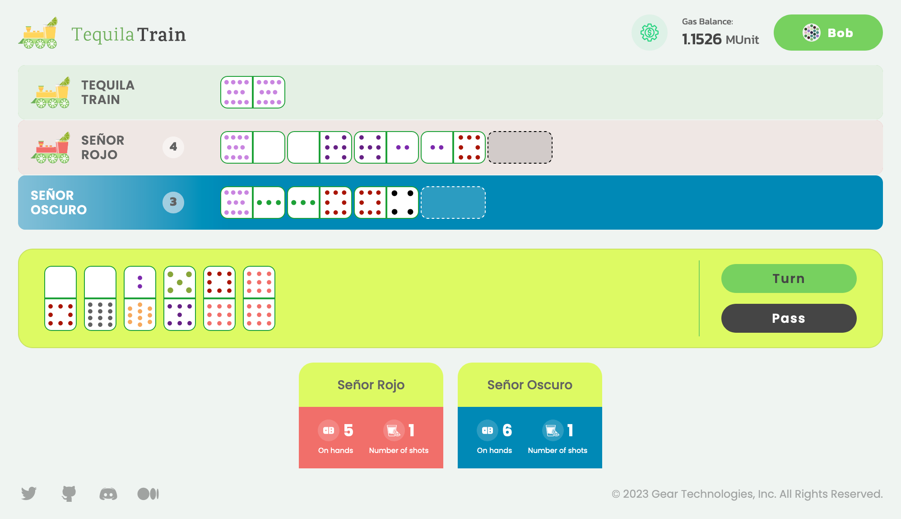

# Tequila Train Game

Tequila Train is a game similar to the Mexican Train game but has several differences in rules. Tequila Train involves a hub, trains, and tequila shots, with each player receiving between 4 to 8 tiles at the start. The game has a playable limit of 8 players using 91 tiles.



## Rules

Each player receives their dominoes, and the number of tiles they receive is automatically calculated based on the number of players.

- 2...4 players: 8 tiles per each player
- 5 players: 7 tiles per each player
- 6 players: 6 tiles per each player
- 7 players: 5 tiles per each player
- 8 players: 4 tiles per each player

Also, each player gets their own train differentiated by the color. Each player revise their tiles and see if they have matching dot numbers on both sides of one tile. 12 dots is the maximum number of each side. The player with the highest double places it in the center of the Tequila Train Hub. In case of nobody has a tile with matching numbers, each player will receive one additional tile, each player will continue receiving one additional tile till someone will receive the tile with the matching numbers on both sides.

The domino must be placed so that one end is touching the end of a domino already on the table and such that the end of the new domino matches (shows the same number of dots) the end of the domino it is adjacent to. Unless the tile is a double, the tile can be placed square in any one of the three directions as long as the two matching sides are touching fully.

First player only places the first tile (maximum double) and then the turn goes to the next player. If, in a later turn, the player draws a domino that enables them to start their train, they can only play this one domino. The player can remove their train but they are free to leave it as is (see below).

If a player is unable to play and the boneyard is empty, the player must simply pass and ensure that a marker is placed upon their train.

In case if a player doesn’t have a matching tile they put a train in their line and skip their turn. Since they have a train another player can put their tile in the line. For the next turn the player with the train can take additional tile from the tiles pool.

Anyone who wants to get their train back after playing a domino to their track should drink one shot of tequila or they will leave their train on the board.

The aim is to be the first player to get rid of all the dominoes in their hand. As soon as this happens, even if the last tile is a Double, the game ends.

## How to run

Source code can be found in the GitHub: https://github.com/gear-foundation/dapps/tree/master/contracts/tequila-train

Clone the repo and enter to the project directory:

```shell
git clone https://github.com/gear-foundation/dapps
cd contracts/tequila-train
```

### Build the smart contract

1. Install Rust on your system using the following command:

    ```shell
    curl --proto '=https' --tlsv1.2 -sSf https://sh.rustup.rs | sh
    ```

2. Add specific toolchains using these commands:

    ```shell
    rustup toolchain add nightly
    rustup target add wasm32-unknown-unknown --toolchain nightly
    ```

    Alternatively, you can run the following command to initialize the contracts:

    ```shell
    make init-contracts
    ```

3. Build the contract using the following command:

    ```shell
    cd contracts
    cargo build --release
    ```

    Alternatively, you can run the following command to build the contract:

    ```shell
    make contracts
    ```

4. Find the program binary `tequila_train.opt.wasm` in `contracts/target/wasm32-unknown-unknown/release` directory, and the meta file `tequila_train.meta.txt` in `contracts` directory.

### Upload program and meta to the network

1. Go to https://idea.gear-tech.io/ and choose **Workshop** node (`wss://node-workshop.gear.rs`).

2. Upload the program binary Wasm `contracts/target/wasm32-unknown-unknown/release/tequila_train.opt.wasm` and the meta file `contracts/tequila_train.meta.txt`.

3. Use the list of players' IDs as a payload when initializing the program. For example, if you want to play on behalf of **Alice** (`0xd43593c715fdd31c61141abd04a99fd6822c8558854ccde39a5684e7a56da27d`) and **Bob** (`0x8eaf04151687736326c9fea17e25fc5287613693c912909cb226aa4794f26a48`), you are to pass the following init payload:

    ```
    [
        "0xd43593c715fdd31c61141abd04a99fd6822c8558854ccde39a5684e7a56da27d",
        "0x8eaf04151687736326c9fea17e25fc5287613693c912909cb226aa4794f26a48"
    ]
    ```

4. Copy the program ID after successful uploading.

### Build and run user interface

1. Install yarn on your system using the following command:

    ```shell
    npm install --global yarn
    ```

2. Install the dependencies using the following command:

    ```shell
    yarn --cwd frontend
    ```

    Alternatively, you can run the following command to install the dependencies:

    ```shell
    make init-frontend
    ```

3. Change the program ID to the correct one obtained after uploading the program to the network (see previous steps) in `frontend/.env.example.local`.

    ```
    REACT_APP_NODE_ADDRESS=wss://node-workshop.gear.rs
    REACT_APP_GAME_ADDRESS=0x3c1095f86e129b72fab05384bd9ff30bf32e155b5dd58a797ab8a4a941209a77
    ```


4. Build the user interface using the following command:

    ```shell
    yarn --cwd frontend build
    ```

    Alternatively, you can run the following command to build the user interface:

    ```shell
    make frontend
    ```

5. Serve the user interface using the following command:

    ```shell
    yarn --cwd frontend start
    ```

    Alternatively, you can run the following command to serve the user interface:

    ```shell
    make serve
    ```

6. Once the user interface starts running, players can access the game by visiting the URL on the screen.

## Implementation details

One user (he may be a player or not) uploads the game program and initializes it. Initialization data is a vector of players’ public addresses:

```rust title="contracts/io/src/lib.rs"
pub struct Players {
    players: Vec<ActorId>,
}
```

Program makes all preparations during initialization.

1. Each player gets their dominoes; the tile count is calculated automatically depending on the player count.
2. The program tries to find the maximum double through users. If it doesn’t, it adds one tile to each user and repeats this step until double has been found.
3. Program chooses the double and selects the first user.

```rust title="contracts/src/contract.rs"
#[no_mangle]
extern "C" fn init() {
    let players_init: Players = msg::load().expect("Failed to decode `Players'");

    // All game initializing logic is inside GameState constructor
    unsafe { GAME_STATE = GameState::new(&players_init) }
}
```

Every player move is the command message sent to the program:

1. Pass: skip the turn if there is no tile to place.
2. Turn: place selected tile to the selected track. Additionally, in certain circumstances the player may get their train back.

```rust title="contracts/io/src/lib.rs"
/// Command to the program
pub enum Command {
    Skip,
    Place {
        tile_id: u32,
        track_id: u32,
        remove_train: bool,
    },
}
```

User interface gets the program state after every action and renders it in the browser.

```rust title="contracts/io/src/lib.rs"
/// The whole game state
pub struct GameState {
    pub players: Vec<ActorId>,
    pub tracks: Vec<TrackData>,
    pub shots: Vec<u32>,
    pub start_tile: u32,
    pub current_player: u32,
    pub tile_to_player: BTreeMap<u32, u32>,
    pub tiles: Vec<Tile>,
    pub remaining_tiles: BTreeSet<u32>,
    pub state: State,
}

/// Information about the player's track
pub struct TrackData {
    pub tiles: Vec<Tile>,
    pub has_train: bool,
}

/// Domino tile
pub struct Tile {
    pub left: Face,
    pub right: Face,
}

/// Tile's face (number of dots)
pub enum Face {
    Zero,
    One,
    Two,
    Three,
    Four,
    Five,
    Six,
    Seven,
    Eight,
    Nine,
    Ten,
    Eleven,
    Twelve,
}

/// The state of the game
pub enum State {
    Playing,
    Stalled,
    Winner(ActorId),
}
```

## Source code

The source code of the Tequila Train Game smart contract is available on [GitHub](https://github.com/gear-foundation/dapps/tree/master/contracts/tequila-train). They can be used as is or modified to suit your own scenarios.
