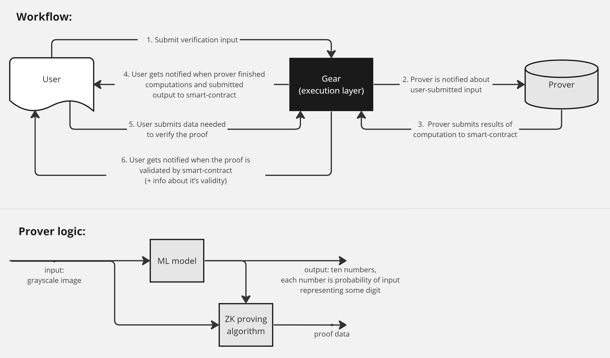

# ZKML: Empowering Privacy on Vara Network

## Introduction

Imagine you have a secret way to prove something is true without revealing any extra details. That's precisely what a zero-knowledge (ZK) proof does in the digital world. It's like a special handshake between two parties: one party (the prover) convinces the other party (the verifier) that something is true without exposing anything else.

In the world of Web3, zero-knowledge cryptography is a game-changer. It empowers developers to create scalable and private applications. This technology allows them to conceal complex calculations while ensuring their accuracy and to create proofs of computational integrity that are much easier to verify than to compute.

Machine learning (ML) is a branch of artificial intelligence that enables computers to learn and improve from data, optimizing their performance through iterative processes.

In the context of ZKML, the prover can demonstrate the correctness of ML models outcome without revealing any additional information. This means that the computations are kept secret from the verifier. It's important to note that this mainly involves creating zero-knowledge proofs for the inference step of an ML model, not the training phase. For instance, this technology could be used in the medical industry to apply an ML model to sensitive data, allowing users to learn the model's result without disclosing their input to third parties.

You can find comprehensive information about ZK and ML on the internet. This article focuses on an example of implementing a zero-knowledge proof application designed for Gear-powered blockchains like the [Vara Network](https://vara-network.io).

## ZKML and Gear: A Perfect Match

One of the main challenges in bringing ML to the blockchain world is the high computational cost. Many ML projects struggle to run directly on blockchains due to limited computational resources. When you combine the complex cryptographic operations and interactions of ZK with the extensive calculations of ML, it becomes clear that most blockchains face limitations in terms of transaction costs, which is a major hurdle for on-chain ML adoption.

ZK proofs offer a solution to the computational challenges of ML. They allow for off-chain execution of complex computations while enabling the computation to be proven correct on-chain. ZK's efficiency in validation surpasses recomputation, but this advantage is typically limited to processing native transaction data on the blockchain.

When you combine this technology with the high-speed, low-cost transactions of Gear-powered blockchains, ZKML becomes a powerful tool for on-chain applications. It enables the utilization of AI while maintaining decentralization and efficiency.

## The Solution: ZKML Implementation

This article presents a proof-of-concept implementation of a zero-knowledge proof application designed for Gear-powered blockchains. You can access the source code on [GitHub](https://github.com/gear-foundation/external-zkml-actor).

:::note
Keep in mind that this example is intended for educational purposes as a technology demonstration. It may contain inaccuracies, suboptimal optimizations, and security vulnerabilities. The solutions used are not recommended for production use.
:::

### How It Works

This implementation offers the capability to shift resource-intensive computations away from the blockchain while ensuring their integrity. It demonstrates the evaluation of the MNIST machine learning model as an illustrative example. This is accomplished by generating zero-knowledge proofs of computations and subsequently verifying them on-chain.

The associated smart contract allows only one verification session per client. If a client wishes to discard the current verification and submit new inputs, they have the option to send a transaction to purge in-progress verification.

### Workflow

The process of employing zero-knowledge proofs for computations involves four key participants: `Initializer`, `User`, `zk-smart-contract`, and `Prover`.

1. `Initializer`: This participant is responsible for deploying the `zk-smart-contract` onto the blockchain and initializing its parameters. During initialization, the structure of the machine learning model is defined, setting the stage for subsequent interactions.

2. `User`: Users of the system interact with the `zk-smart-contract` by submitting their input data, which is intended for processing by the machine learning model. This step demonstrates how external parties can seamlessly engage with the blockchain without directly executing computationally intensive operations.

3. `Prover`: The Prover is deployed on a server and continuously polling `zk-smart-contract` to discover new inputs provided by `User`s, computes outputs, and proves computations. The Prover retrieves input from the `zk-smart-contract`, evaluates the machine learning model, and generates a zero-knowledge proof that attests to the validity of the computation. The resulting output of the machine learning model, along with the zero-knowledge proof, is then submitted back to the `zk-smart-contract`.

4. `User Verification`: Users initiate a verification process by interacting with the `zk-smart-contract`. The `zk-smart-contract` orchestrates the verification of the zero-knowledge proof, independently confirming the accuracy of the computation without exposing sensitive data.

5. `Verification Outcome`: Once the verification process is completed within the `zk-smart-contract`, the user is informed of the verification outcome.

## Conclusion

The Web3 world has a strong demand for the productivity and decision support of AI and ML. ZKML can play a crucial role in automating **DeFi** trading strategies, enhancing **identity management** while ensuring privacy and security, enabling full functionality for Web3 **games**, and assisting fields like **healthcare** and **legal consulting** that require privacy and extensive case accumulation.

In the future, ZKML has the potential to bridge the gap between Web3 and AI, providing robust support for building secure, privacy-preserving, and efficient blockchain applications.