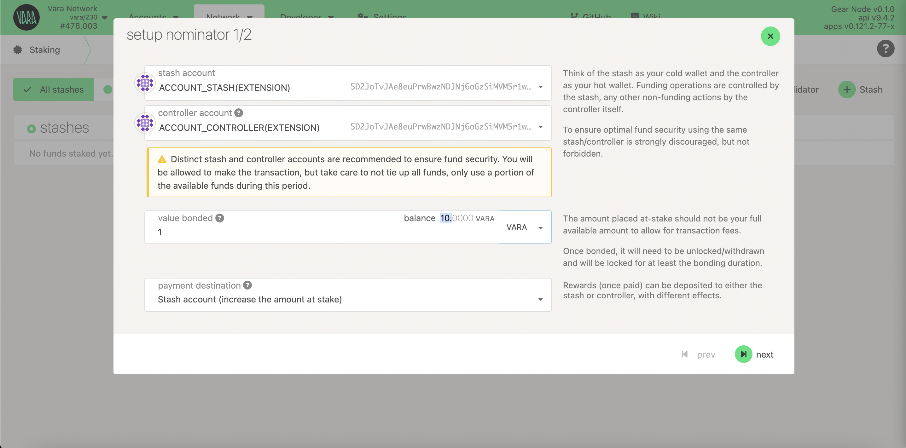
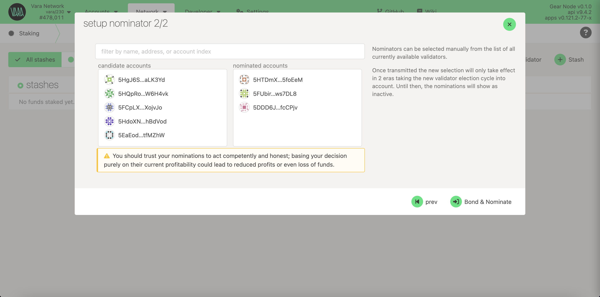
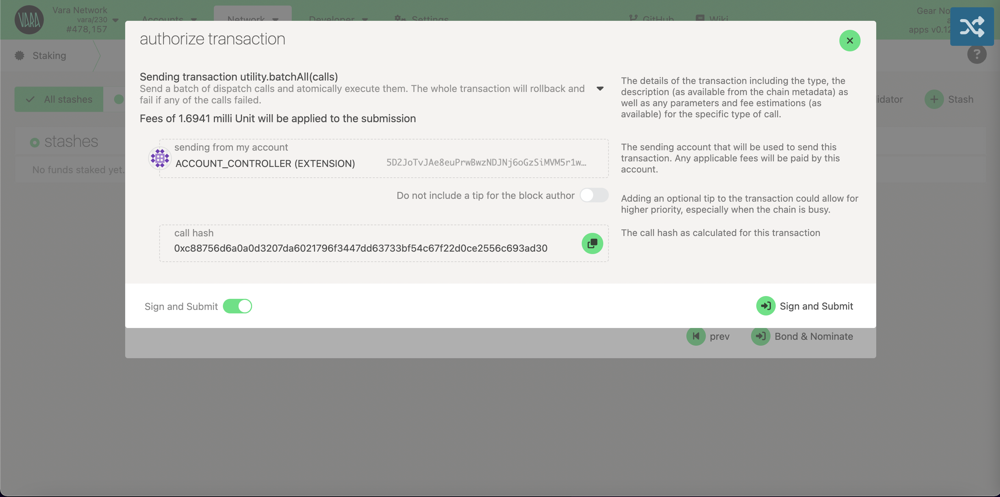

import Tabs from '@theme/Tabs';
import TabItem from '@theme/TabItem';
import CodeBlock from '@theme/CodeBlock';

To nominate your VARA tokens go to Polkadot.{js} app and navigate to Network → Staking → [Account actions](https://polkadot.js.org/apps/?rpc=wss%3A%2F%2Fvara.gear.rs#/staking/actions) section and click `+Nominator`:

Select your account and enter the amount that you’d like to nominate then click next.

Select a validator (or validators) that you’d like to nominate. You can choose up to 16 validators and the algorithm will determinete how to nominate your funds for each Era in the most effective way.

It is worth choosing only reliable validators with a good reputation to be sure that they will not be slashed.

Click Bond & Nominate and sign the transaction. If everything is correct, then you’ll see your bonded VARA will appear in the Nominators list

Congratulations! You are now nominating. Your nominations will become active in the next era.