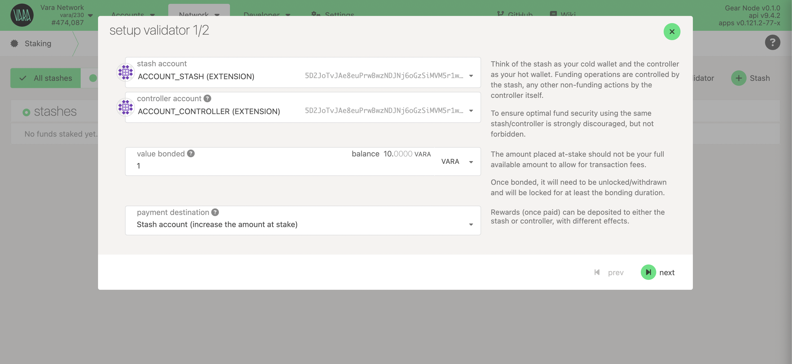
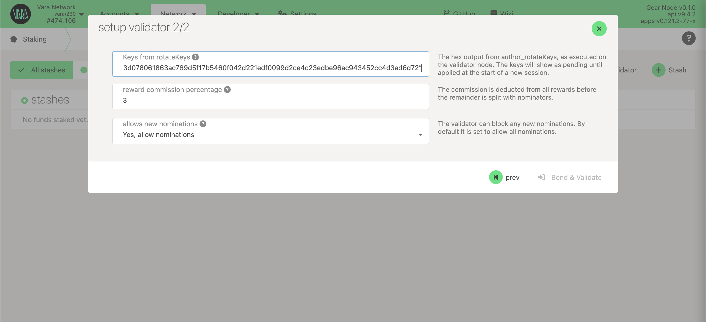
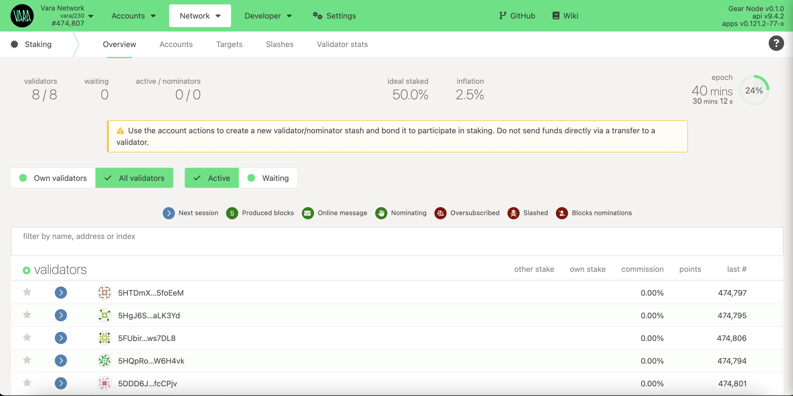

import Tabs from '@theme/Tabs';
import TabItem from '@theme/TabItem';
import CodeBlock from '@theme/CodeBlock';

Running a validator on a live network is a responsible role. The validator is responsible not only for his own stake, but also the stake of your current nominators. Nevertheless, this is an important role that is also well rewarded.

## Initial Set Up

### Hadrware requirements

:::info
The most common way for a beginner to run a validator is on a cloud server running Linux. To do this, choose whatever VPS provider corresponds to the characteristics below.
:::

`Minimum system hardware requirements` : 2vCPUs, 4GB RAM, 100GB SSD storage

`OS`: Ubuntu 20.04 or later, Amazon Linux 2 or later

### Install Vara Node

Download `gear-node` from the nighly builds repo and unpack (choose the binary according to your host operating system):

````mdx-code-block
<Tabs>
<TabItem value="win64" label="Windows x64" className="unique-tabs" default>

Terminal:

```bash
curl -O https://github.com/gear-tech/builds/releases/download/vara/vara-nightly-windows-x86_64.zip
```

or

**Windows x64**: [vara-nightly-windows-x86_64.zip](https://github.com/gear-tech/builds/releases/download/vara/vara-nightly-windows-x86_64.zip)

Unzip the downloaded package then you can try to run the node:

```
❯ gear-node.exe --version
gear-node 0.1.0-hashcode-x86_64-windows
```

</TabItem>
<TabItem value="mac-arm" label="MacOS ARM">

Terminal:

```bash
wget https://github.com/gear-tech/builds/releases/download/vara/vara-nightly-macos-m1.tar.gz && \
tar xvf vara-nightly-macos-m1.tar.gz && \
rm vara-nightly-macos-m1.tar.gz && \
chmod +x gear-node
```

or

**macOS M1/M2**: [vara-nightly-macos-m1.tar.gz](https://github.com/gear-tech/builds/releases/download/vara/vara-nightly-macos-m1.tar.gz)

You can try to run the node:

```
❯ ./gear-node --version
gear-node 0.1.0-hashcode-aarch64-macos
```

</TabItem>
<TabItem value="mac-intel" label="MacOS x64">

Terminal:

```bash
wget https://github.com/gear-tech/builds/releases/download/vara/vara-nightly-macos-x86_64.tar.gz && \
tar xvf vara-nightly-macos-x86_64.tar.gz && \
rm vara-nightly-macos-x86_64.tar.gz && \
chmod +x gear-node
```

or

**macOS Intel x64**: [vara-nightly-macos-x86_64.tar.gz](https://github.com/gear-tech/builds/releases/download/vara/vara-nightly-macos-x86_64.tar.gz)

You can try to run the node:

```
❯ ./gear-node --version
gear-node 0.1.0-hashcode-x86_64-macos
```

</TabItem>

<TabItem value="mac-linux" label="Linux x64">

Terminal:

```bash
wget https://github.com/gear-tech/builds/releases/download/vara/vara-nightly-linux-x86_64.tar.xz && \
tar xvf vara-nightly-linux-x86_64.tar.xz && \
rm vara-nightly-linux-x86_64.tar.xz && \
chmod +x gear-node
```

or

**Linux x64**: [vara-nightly-linux-x86_64.tar.xz](https://github.com/gear-tech/builds/releases/download/vara/vara-nightly-linux-x86_64.tar.xz)

You can try to run the node:

```
❯ ./gear-node --version
gear-node 0.1.0-hashcode-x86_64-linux
```

</TabItem>
</Tabs>
````


### Create Stash and Controller accounts

For security reasons, we recommend creating two separate accounts: `Stash` and `Controller`. It's important to make sure that each of them has enough funds to pay transaction fee. Most of the funds should be stored on the stash account since it's meant to store staking funds.

To generete new seed phrase:

```sh
./gear-node key generate | grep phrase
```

:::note
Both seed phrases should be carefully saved in a secure place. If you want to use your own seed phrase, you can skip the previous step. Also you can use [Polkadot.{js}](https://polkadot.js.org/apps/#/accounts) or [Polkadot extension](https://polkadot.js.org/extension/)
:::

### Run Node

The most convenient and easiest way to run a node in validator mode will be to use the `ansible script` we have prepared.

Install ansible

- macOS:

```
brew install ansible

# Optional If you access your server using SSH login and password instead of SSH key
brew install esolitos/ipa/sshpass

```

- Ubuntu Linux:

```
sudo add-apt-repository --yes --update ppa:ansible/ansible
sudo apt install ansible

# Optional:
sudo apt install sshpass
```

Next, download this [Ansible playbook](https://github.com/gear-tech/builds/blob/master/ansible/vara/install-validator.yml):

```sh
wget https://raw.githubusercontent.com/gear-tech/builds/master/ansible/vara/install-validator.yml
```

Run the Ansible playbook then enter the node name and the seed phrase generated above when prompted (this node name will be visible on the telemetry site, see below):

```sh
ansible-playbook install-validator.yml -i <my-host>, -u <user> --key-file <path-to-key-file>

# use flad -k instead --key-file if you use sshpass 
```

Wait until the playbook completes and check in Ansible log that vara-node.service has running state:

```
TASK [Write vara-node status] ************************

ok: [<my-host>] => {
    "ansible_facts.services[\"vara-node.service\"]": {
        "name": "vara-node.service",
        "source": "systemd",
        "state": "running",
        "status": "enabled"
    }
}
```

You can also see your node with the name you set when running the playbook in telemetry: https://telemetry.rs

### Get session keys

You need to tell the chain your Session keys. If you are on a remote server, it is easier to run this command on the same machine (while the node is running with the default HTTP RPC port configured):

```sh
curl -H "Content-Type: application/json" -d '{"id":1, "jsonrpc":"2.0", "method": "author_rotateKeys", "params":[]}' http://localhost:9933
```

Output:

```
{“jsonrpc”:”2.0",”result”:”0x5e977ddcc0c69a6aed067052d5bd8f6bd365fae03562fd447d434e9814ac415d7c9ffe722364922bda314e44654f5c0cdc00d152470d5433f12cb73d078061863ac769d5f17b5460f042d221edf0099d2ce4c23edbe96ac943452cc4d3ad6d72”,”id”:1}
```

The output will have a hex-encoded `result` field. Copy and save it!


## Setup Validator

If your node is live and synchronized, appears in telemetry, and session keys are prepared it's time to set up the validator.

Go to Polkadot.{js} app and navigate to Network → Staking → [Account actions](https://polkadot.js.org/apps/?rpc=wss%3A%2F%2Fvara.gear.rs#/staking/actions) section and click `+Validator`:

Select stash and controller account. It’s recommended to use different accounts for stash and controller.



Set the `session key` and reward commission.



And sign the transaction. Make sure that you have been added to the stashe and wait for the next Era.
When the next Era starts, your validator will be added.



## Get Payouts