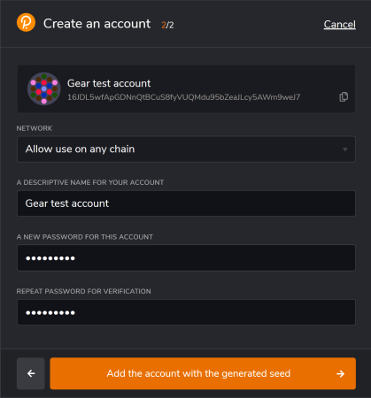
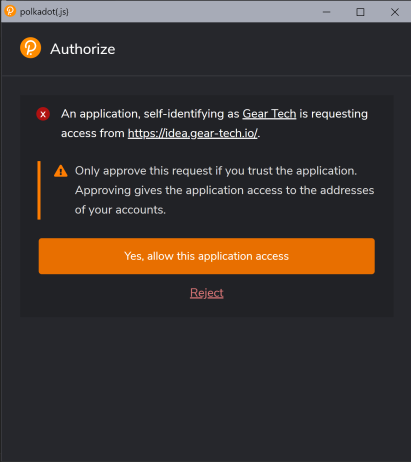
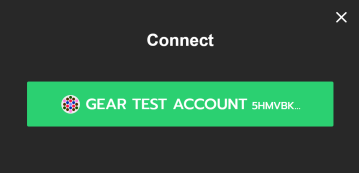
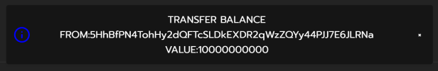
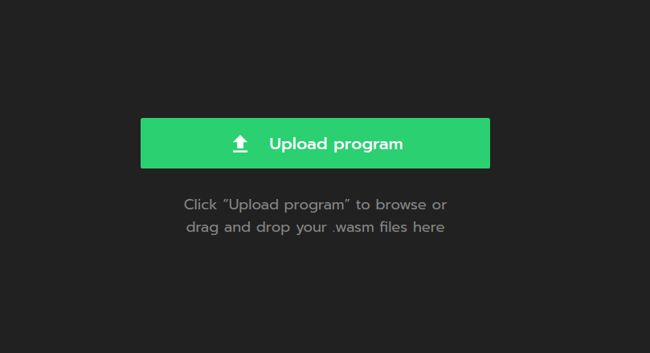
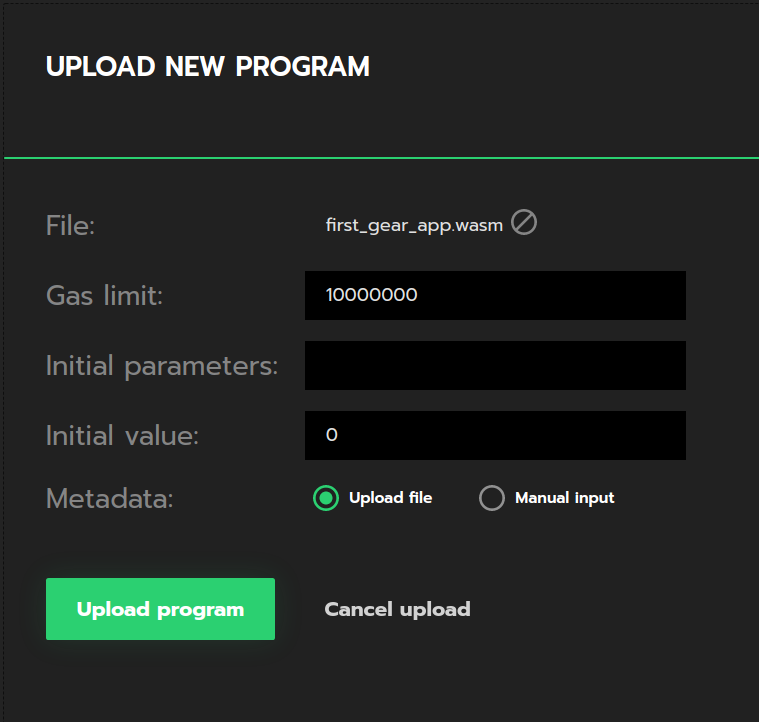
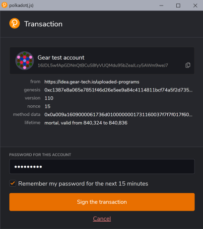
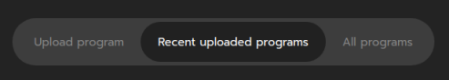
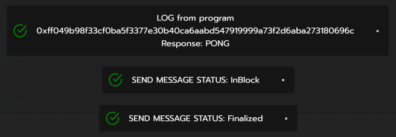

# Getting started in 5 minutes

This guide provides a general overview of running smart-contract in the Gear network. It guides how to write a smart contract of your choice in Rust, compile it to WASM, deploy to a Gear network and interact with it.
For this, a demo environment that emulates the real Gear decentralized network will be used.

## 1. Prerequisites 

1. For your convenience, it is recommended to create a dedicated directory for everything Gear-related. The rest of the article will assume that you are using the paths suggested. To create a folder in your home directory and navigate to it, type:

    ```bash
    mkdir -p Gear
    cd ~/Gear
    ```

2. Make sure you have installed all the tools required to build a smart-contract in Rust. [Rustup](https://rustup.rs/) will be used to get Rust compiler ready:

    ```bash
    curl --proto '=https' --tlsv1.2 -sSf https://sh.rustup.rs | sh
    ```

3. Now, let's install a `nightly` build for `rustup`, since `Gear` uses the most up-to-date features `rustup` provides.

    ```bash
    rustup update
    rustup update nightly
    ```

4. As we will be compiling our Rust smart contract to WASM, we will need a WASM compiler. Let's add it to the toolchain.

    ```bash
    rustup target add wasm32-unknown-unknown --toolchain nightly
    ```
 **_Note:_** If you use Windows, download and install [Build Tools for Visual Studio](https://visualstudio.microsoft.com/downloads/?q=build+tools).

## 2. Creating your first Gear smart contract

1. Let's create a `contracts` directory inside `Gear` and `cd` to it.

    ```bash
    mkdir -p ~/Gear/contracts
    cd ~/Gear/contracts
    ```

2. The next step would be to build a Rust library for our contract.

    ```bash
    cargo new first-gear-app --lib
    ```

    Now, your `Gear/contracts` directory tree should look like this:

    ```bash
    └── first-gear-app
        ├── Cargo.toml
        └── src
            └── lib.rs
    ```

3. It's time to write some code. Open `first-gear-app` with your favorite editor. For `VS Code` editor type:

    ```bash
    code ~/Gear/contracts/first-gear-app
    ```

4. Configure `Cargo.toml` in order for our contract to be properly built.

    ```yaml
    [package]
    name = "first-gear-app"
    version = "0.1.0"
    authors = ["Your Name"]
    edition = "2021"
    license = "GPL-3.0"

    [lib]
    crate-type = ["cdylib"]

    [dependencies]
    gcore = { git = "https://github.com/gear-tech/gear.git", features = ["debug"] }
    gstd = { git = "https://github.com/gear-tech/gear.git", features = ["debug"] }

    [profile.release]
    lto = true
    opt-level = 's'
    ```

5. Replace the default contents of `lib.rs` with the code for our first smart-contract. Open `src/lib.rs` in your editor and paste the following code:

    ```rust
    #![no_std]

    use gstd::{debug, msg, prelude::*};

    static mut MESSAGE_LOG: Vec<String> = vec![];

    #[no_mangle]
    pub unsafe extern "C" fn handle() {
        let new_msg = String::from_utf8(msg::load_bytes()).expect("Invalid message");

        if new_msg == "PING" {
            msg::reply_bytes("PONG", 12_000_000, 0);
        }

        MESSAGE_LOG.push(new_msg);

        debug!("{:?} total message(s) stored: ", MESSAGE_LOG.len());

        for log in MESSAGE_LOG.iter() {
            debug!(log);
        }
    }

    #[no_mangle]
    pub unsafe extern "C" fn init() {}
    ```

    This simple smart-contract responds with `PONG` to a `PING` message sent to the contract.

6. Now compile the smart-contract to WASM

    ```bash
    cd ~/Gear/contracts/first-gear-app/
    RUSTFLAGS="-C link-args=--import-memory" cargo +nightly build --release --target=wasm32-unknown-unknown
    ```

    If everything goes well, your working directory should now have a `target` directory that looks like this:

    ```bash
    target
        ├── CACHEDIR.TAG
        ├── release
        │   ├── ...
        └── wasm32-unknown-unknown
            ├── CACHEDIR.TAG
            └── release
                ├── build
                │   └── ...
                ├── deps
                │   └── ...
                ├── examples
                ├── incremental
                ├── first_gear_app.d
                └── first_gear_app.wasm <---- this is our .wasm file
    ```

    The compiled `first_gear_app.wasm` file is in `target/wasm32-unknown-unknown/release` directory.

## 3. Deploy your Smart Contract to the TestNet

Gear provides a demo environment that emulates the real Gear decentralized network, available in [idea.gear-tech.io](https://idea.gear-tech.io).

### 1. Create account 

1. Download Polkadot extension for your browser via [https://polkadot.js.org/extension/](https://polkadot.js.org/extension/). It does one thing - manages accounts and allows the signing of transactions with those accounts. It is a secure tool that allows injecting your accounts into any Substrate-based dapp. It does not perform wallet functions, e.g send funds.

2. Once downloaded, click '+' button to create a new account: 


3. Make sure you save your 12-word mnemonic seed securely.


4. Select the network that will be used for this account - choose "Allow to use on any chain". Provide any name to this account and password, click "Add the account with the generated seed" to complete account registration.



5. Go to [idea.gear-tech.io](https://idea.gear-tech.io). You will be prompted to grant access to your account for Gear Tech application, click "Yes, allow this application access".



6. Click the `Connect` button on top-right to select an account that will be connected to Gear Tech.



7. In accordance to Actor model, a smart-contracts are uploaded to a network via messages. Gear node charges a gas fee during message processing (see also about [gas](smart-contracts/messaging.md#gas)). Your account balance needs to have enough funds to upload a smart-contract to the `TestNet`. Click "Get test balance".


A notification about successful balance replenishment will appear at the bottom of the window. Also, you can see the current account balance next to the account name in the upper right corner.



### 2. Upload program

1. When your account balance is sufficient, click the `Upload program` and navigate to the `.wasm` file we have pointed to above.



2. Specify program Name and Gas limit 20 000 000 and click the `Upload program` button.



3. Sign in the program uploading transaction to the Gear network. Also, sign in the program and meta data uploading to the Gear demo environment so you could work with the program. It is recommennded to set the checkbox `Remember my password for the next 15 minutes` for your convenience.



4. Once your program is uploaded, head to the `Recently uploaded programs` section and find your program.



### 3. Send message to a program

1. Now, try sending your newly uploaded program a message to see how it responds! Use this button: 


2. In the `Payload` field of the opened dialog type `PING`, provide an amount of gas 20 000 000 and click the `Send request` button.


3. Sign in the message sending transaction as it is shown in the step #2.3

4. After your message has been successfully processed, the program responds with PONG:



***

For additional info about writing smart contracts for Gear and the specifics behind the smart contract implementation, refer to [this article on Smart Contracts](smart-contracts/gear-program.md).
