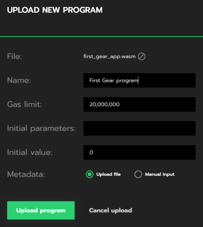

# Getting started in 5 minutes

In this article, we are going to write and deploy our first smart contract to a GEAR network of your choice.

## Prerequesites

(Optional) For your convenience, it'd be best to create a dedicated directory for everything GEAR-related.

```bash
mkdir -p ~/GEAR
cd ~/GEAR
```

The rest of the article will assume that you are using the paths suggested, so make sure you make adjustments according to your directory tree.

First of all, we need to install all the tools required to build our first contract in Rust.

We will use [Rustup](https://rustup.rs/) to get our Rust compiler ready.

```bash
curl --proto '=https' --tlsv1.2 -sSf https://sh.rustup.rs | sh
```

Now, let's install a `nightly` build for `rustup`, since `GEAR` uses the most up-to-date features `rustup` provides.

```bash
rustup update
rustup update nightly
```

As we will be compiling our Rust smart contract to WASM, we will need a WASM compiler. Let's add it to the toolchain.

```bash
rustup target add wasm32-unknown-unknown --toolchain nightly
```

Now, it's time to get the source code for GEAR itself by cloning our public [github repo](https://github.com/gear-tech/gear).

```bash
git clone https://github.com/gear-tech/gear.git
```

## Creating your first GEAR smart contract
Let's create a `contracts` directory inside `GEAR` and `cd` to it.

```bash
mkdir -p ~/GEAR/contracts
cd ~/GEAR/contracts
```

The next step would be to build a Rust library for our contract.

```bash
cargo new first-gear-app --lib
```

Now, your `GEAR/contracts` directory tree should look like this:

```bash
└── first-gear-app
    ├── Cargo.toml
    └── src
        └── lib.rs
```

It's time to write some code. Open `first-gear-app` with your favorite editor, we will use `VS Code`.

```bash
code ~/GEAR/contracts/first-gear-app
```

We will need to configure `Cargo.toml` in order for our contract to be properly built.

```yaml
[package]
name = "first-gear-app"
version = "0.1.0"
authors = ["Your Name"]
edition = "2021"
license = "GPL-3.0"

[lib]
crate-type = ["cdylib"]

[dependencies]
gcore = { path = "https://github.com/gear-tech/gear.git", features = ["debug"] }
gstd = { path = "https://github.com/gear-tech/gear.git", features = ["debug"] }

[profile.release]
lto = true
opt-level = 's'
```

Now, it's time to replace the default contents of `lib.rs` with the code for our first smart contract.

In order to do that, you should open `src/lib.rs` in your editor and paste the following code:

```rust
#![no_std]

use gcore::{ext, msg};
use gstd::prelude::*;

static mut MESSAGE_LOG: Vec<String> = vec![];

#[no_mangle]
pub unsafe extern "C" fn handle() {
    let new_msg =
        String::from_utf8(gstd::msg::load_bytes()).expect("Invalid message: should be utf-8");

    if new_msg == "PING" {
        msg::reply(b"PONG", 10_000_000, 0);
    }

    MESSAGE_LOG.push(new_msg);

    ext::debug(&format!(
        "{:?} total message(s) stored: ",
        MESSAGE_LOG.len()
    ));

    for log in MESSAGE_LOG.iter() {
        ext::debug(log);
    }
}

#[no_mangle]
pub unsafe extern "C" fn handle_reply() {
    msg::reply(b"PONG", 10_000_000, 0);
}

#[no_mangle]
pub unsafe extern "C" fn init() {}
```

We will not dive into the specifics behind the smart contract implementation in this article. The only thing you need to know is that this contract responds to a `PING` message send to the contract with `PONG`. If you want to learn more about writing smart contracts for GEAR, refer to [this article on Smart Contracts](smart-contracts/gear-program.md).

Now, it's time to compile the contract.

```bash
cargo +nightly build --target wasm32-unknown-unknown --release
```

If everything goes well, your working directory should now have a `target` directory that looks like this:


```bash
target
    ├── CACHEDIR.TAG
    ├── release
    │   ├── ...
    └── wasm32-unknown-unknown
        ├── CACHEDIR.TAG
        └── release
            ├── build
            │   └── ...
            ├── deps
            │   └── ...
            ├── examples
            ├── first_gear_app.d
            ├── first_gear_app.wasm <---- this is our .wasm file
            ├── incremental
            ├── libfirst_gear_app.d
            └── libfirst_gear_app.rlib

```

All we need is the `first_gear_app.wasm` file in `target/wasm32-unknown-unknown/release` directory. Now that you know where it is, let's move to the next step.

## Deploy your Smart Contract to the TestNet

GEAR provides a GUI via [idea.gear-tech.io](www.idea.gear-tech.io).

First, log in using the most suitable method.

Second, in the top right corner, you should create an account.


Next, you will need to top up your account balance in order to have enough [gas](smart-contracts/messaging.md) to upload your contract.

When you your account balance is sufficient, click `Upload program` and navigate to the `.wasm` file we have pointed to above.


You should now see the following interface:



You can now upload the program and wait until IDEA uploads it to the `TestNet`.

Once your program is uploaded, head to the `Recently uploaded programs` section and find your program.


You can interact with your program via these action buttons:


Now, try sending your newly uploaded program a `PING` message too see how it responds!

This concludes our tutorial on uploading your first contract.

To learn more, you can deep dive to the `Smart Contracts` section of the `GEAR Wiki`.
