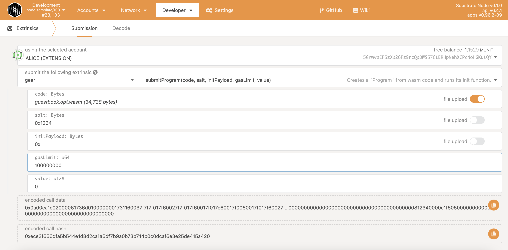

# Deploy Smart contracts

As noted earlier, creating a program is just one of the specific types of transactions that contain a WASM file as a payload.

Uploading a new program to the blockchain takes place by calling the custom extrinsic `gear.submitProgram(code, salt, initPayload, gasLimit, value)`. Where:

`code: Bytes` - binary WASM code

`salt: Bytes` - the random data that's added to the hashing process to force their uniqueness

`initPayload: Bytes`- the initial payload of which will be processed by the init() function during contract initialization

`gasLimit: u64` -  is the amount of gas that users are willing to spend to process upload a new program.

`value: u128` - the value that will be transferred to the program address

## Program submit events

Program submit will trigger a series of events:

> Note: while extrinsics represent information from the outside world, events represent information from the chain. Extrinsics can trigger events.

They appear this way:

1. Gear network tries to post a message into the queue that aims to verify the source account has enough balance to cover sending of value and gas_limit and paying of small processing fee that linearly depends on payload size (this is the standard inclusion fee for Substrate framework, refer to Substrate Documentation for details).

2. Block producer of Gear network posts the message into the block

3. Gear network reserve a maximum amount of gas specified by the user to be spent on program initialization.

3. Program creation and an init message enqueue:

```sh
MessageInfo example:

{
  messageId: 0x4b92a8589e06def4ce06257138ae6fd16c44d065abee9580b4b607fe3c85baa2
  programId: 0xf33843d1481416928d0a432cf357ee3e4dc562a2a963505a8efec75febb4f9de
  origin: 0xd43593c715fdd31c61141abd04a99fd6822c8558854ccde39a5684e7a56da27d
}
```
4. `gear.InitSuccess` or `gear.InitFailure` events. 

> `programId` it's the unique address of the program

## How to deploy

There are several ways to create a program:

### Via Gear GUI

The easiest way to download the program is to use the official website [idea.gear-tech.io](https://idea.gear-tech.io)

### Via Polkadot.js.org

Also to submit a program you can use the standard GUI for substrate-based projects. It's [polkadot{.js}](https://polkadot.js.org) app. Use `gear.submitProgram` extrinsic in Developer -> Extrinsic menu.



### Via gear-js library

Gear-js library that provides a simple and intuitive way to connect GEAR Component APIs, includes interaction with programs. More details [Gear API](https://wiki.gear-tech.io/api/connect)
