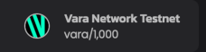
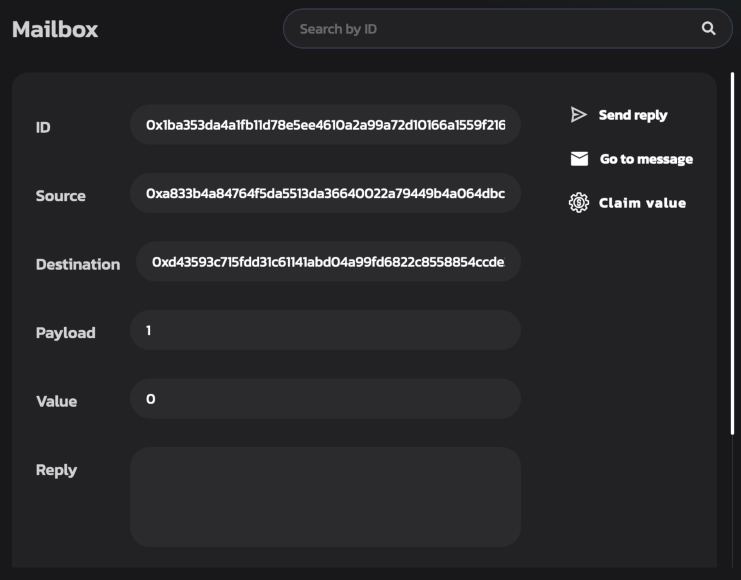

# Getting started in 5 minutes

This guide provides a general overview of running smart contracts on the Gear network. It guides you through how to write a smart contract, compile it to WASM and deploy it to the Gear network.

For this example, a demo environment that emulates the real Gear decentralized network will be used.

## Prerequisites

1. For your convenience, it is recommended that you create a dedicated directory for everything Gear-related. The rest of the article will assume that you are using the paths suggested. Type to create a folder in your home directory:

```bash
mkdir -p ~/gear
```

2. Make sure you have installed all the tools required to build a smart-contract in Rust. [Rustup](https://rustup.rs/) will be used to get Rust compiler ready:

```bash
curl --proto '=https' --tlsv1.2 -sSf https://sh.rustup.rs | sh
```

3. Now, let's install a `nightly` version of the toolchain with `rustup`, since Gear uses the most up-to-date features `rustup` provides.

```bash
rustup toolchain add nightly
```

4. As we will be compiling our Rust smart contract to WASM, we will need a WASM compiler. Let's add it to the toolchain.

```bash
rustup target add wasm32-unknown-unknown --toolchain nightly
```

**_Note:_** If you use Windows, download and install [Build Tools for Visual Studio](https://visualstudio.microsoft.com/downloads/?q=build+tools).

## Creating your first Gear smart contract

1. Let's create a `contracts` directory inside `gear` and `cd` to it.

```bash
mkdir -p ~/gear/contracts
cd ~/gear/contracts
```

2. The next step would be to build a Rust library for our contract.

```bash
cargo new first-gear-app --lib
```

Now, your `gear/contracts` directory tree should look like this:

```
└── first-gear-app
    ├── Cargo.toml
    └── src
        └── lib.rs
```

3. It's time to write some code. Open `first-gear-app` with your favorite editor. For `VS Code` editor type:

```bash
code ~/gear/contracts/first-gear-app
```

4. Create file `build.rs` with the following code:

```rust
fn main() {
    gear_wasm_builder::build();
}
```

and configure `Cargo.toml` in order for our contract to be properly built:

```toml
[package]
name = "first-gear-app"
version = "0.1.0"
authors = ["Your Name"]
edition = "2021"

[dependencies]
gstd = { git = "https://github.com/gear-tech/gear.git", features = ["debug"] }

[build-dependencies]
gear-wasm-builder = { git = "https://github.com/gear-tech/gear.git" }

[dev-dependencies]
gtest = { git = "https://github.com/gear-tech/gear.git" }
```

5. Replace the default contents of `lib.rs` with the code for our first smart-contract. Open `src/lib.rs` in your editor and paste the following code:

```rust
#![no_std]

use gstd::{debug, msg, prelude::*};

static mut MESSAGE_LOG: Vec<String> = vec![];

#[no_mangle]
extern "C" fn handle() {
    let new_msg = String::from_utf8(msg::load_bytes()).expect("Invalid message");

    if new_msg == "PING" {
        msg::reply_bytes("PONG", 0).expect("Unable to reply");
    }

    unsafe {
        MESSAGE_LOG.push(new_msg);

        debug!("{:?} total message(s) stored: ", MESSAGE_LOG.len());

        for log in &MESSAGE_LOG {
            debug!(log);
        }
    }
}
```

This simple smart-contract responds with `PONG` to a `PING` message sent to the contract.

6. Now compile the smart-contract to WASM

```bash
cd ~/gear/contracts/first-gear-app/
cargo build --release
```

If everything goes well, your working directory should now have a `target` directory that looks like this:

```
target
    ├── CACHEDIR.TAG
    ├── release
    │   └── ...
    └── wasm32-unknown-unknown
        └── release
            ├── ...
            ├── first_gear_app.wasm      <---- this is our built .wasm file
            ├── first_gear_app.opt.wasm  <---- this is optimized .wasm file
            └── first_gear_app.meta.wasm <---- this is meta .wasm file
```

The `target/wasm32-unknown-unknown/release` directory contains three WASM binaries:

- `first_gear_app.wasm` is the output WASM binary built from source files
- `first_gear_app.opt.wasm` is the optimized WASM aimed to be uploaded to the blockchain
- `first_gear_app.meta.wasm` is the WASM containing meta information needed to interact with the program

## Deploy your Smart Contract to the Testnet

Gear provides a demo environment that emulates the real Gear decentralized network, available in [idea.gear-tech.io](https://idea.gear-tech.io).

### Create account

1. Download the Polkadot extension for your browser via [https://polkadot.js.org/extension/](https://polkadot.js.org/extension/). This extension manages accounts and allows the signing of transactions with those accounts. It is a secure tool that allows injecting your accounts into any Substrate-based dapp. It does not perform wallet functions, e.g send funds.

2. Once downloaded, click <kbd>+</kbd> button to create a new account:

    

3. Make sure you save your 12-word mnemonic seed securely.

    

4. Select the network that will be used for this account - choose "Allow to use on any chain". Provide any name to this account and password and click "Add the account with the generated seed" to complete account registration.

    

5. Go to [idea.gear-tech.io](https://idea.gear-tech.io). You will be prompted to grant access to your account for Gear Tech application, click "Yes, allow this application access".

    

6. Click the `Connect` button on top-right to select an account that will be connected to Gear Tech.

    

7. Make sure you are connected to the `Gear Staging Testnet V3`. The network name is on the top left corner of the page.

    

8. You may switch the network by clicking on the network name.

    

7. In accordance with the Actor model, smart contracts are uploaded to a network via messages. Gear node charges a gas fee during message processing. Your account balance needs to have enough funds to upload a smart-contract to the `TestNet`. Click the following button to get test balance:

    

    A notification about successful balance replenishment will appear after passing captcha at the bottom of the window. You can also see the current account balance next to the account name in the upper right corner.

    

### Upload program

1. When your account balance is sufficient, click the <kbd>Upload program</kbd> and navigate to the `.opt.wasm` file we have pointed to above.

    

2. Specify program Name and click <kbd>Calculate Gas</kbd> button. The Gas limit will be set automatically. Now click the <kbd>Upload program</kbd> button.

    

3. Sign the program uploading the transaction to the Gear network. Also, sign in the program and meta data uploading to the Gear demo environment so you could work with the program. It is recommended to set the checkbox `Remember my password for the next 15 minutes` for your convenience.

    

:::note


The red dot status for a program indicates init failure. Try to upload the program again with increased **Gas limit**.
:::

4. Once your program is uploaded, head to the `Recently uploaded programs` section and find your program.

    

### Send message to a program

1. Now, try sending your newly uploaded program a message to see how it responds! Use this button:
   

2. In the `Payload` field of the opened dialog type `PING`. Click <kbd>Calculate Gas</kbd> button, the Gas limit will be set automatically. Now click the <kbd>Send request</kbd> button.

    

3. Sign the message sending transaction as it is shown in the step 3 of section **Upload Program**.

4. After your message has been successfully processed, you are to see correspondent log messages:

    

5. Press `Mailbox` tab at the top of page to enter the mailbox and find the reply.

    

    :::note

    The reply is in the mailbox for a limited time depending on the gas limit. If you don't see the reply, try resending the `PING` message with the gas limit increasing and go to the mailbox immediately after sending the message.

    :::
---

## Further reading

For more info about writing smart contracts for Gear and the specifics behind the smart contract implementation, refer to [this article on Smart Contracts](/docs/developing-contracts/executable-functions).
