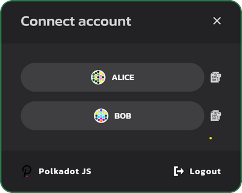
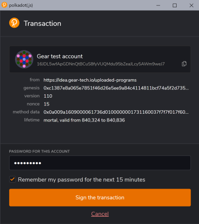
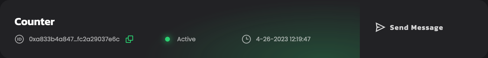

# Getting started in 5 minutes

This guide provides a general overview of running smart contracts on the networks powered by Gear Protocol (such as the [Vara Network](https://vara-network.io/)). It guides you through how to write a smart contract, compile it to Wasm and deploy it to the Gear network.

## Prerequisites

1. Linux users should generally install `GCC` and `Clang`, according to their distribution’s documentation. Also, one needs to install `binaryen` toolset that contains the required wasm-opt tool.

    For example, on Ubuntu use:
    ```bash
    sudo apt install -y clang build-essential binaryen
    ```

    On macOS, you can get a compiler toolset and `binaryen` by running:
    ```bash
    xcode-select --install
    brew install binaryen
    ```

2. Make sure you have installed all the tools required to build a smart-contract in Rust. [Rustup](https://rustup.rs/) will be used to get Rust compiler ready:

    ```bash
    curl --proto '=https' --tlsv1.2 -sSf https://sh.rustup.rs | sh
    ```

3. Now, let's install a `nightly` version of the toolchain with `rustup`, since Gear uses the most up-to-date features `rustup` provides.

    ```bash
    rustup toolchain add nightly
    ```

4. As we will be compiling our Rust smart contract to Wasm, we will need a Wasm compiler. Let's add it to the toolchain.

    ```bash
    rustup target add wasm32-unknown-unknown --toolchain nightly
    ```

**_Note:_** If you use Windows, download and install [Build Tools for Visual Studio](https://visualstudio.microsoft.com/downloads/?q=build+tools).

## Creating your first Gear smart contract

1. For your convenience, it is recommended that you create a dedicated directory for everything Gear-related. The rest of the article will assume that you are using the paths suggested. Type to create a folder in your home directory:

    ```bash
    mkdir -p ~/gear
    ```

2. Let's create a `contracts` directory inside `gear` and `cd` to it.

    ```bash
    mkdir -p ~/gear/contracts
    cd ~/gear/contracts
    ```

3. The next step would be to build a Rust library for our contract:

    ```bash
    cargo new first-gear-app --lib
    cargo new first-gear-app/io --lib
    cargo new first-gear-app/state --lib
    ```

    Now, your `gear/contracts` directory tree should look like this:

    ```
    └── first-gear-app  
        ├── Cargo.toml
        └── src
            └── lib.rs
        └── io
            ├── Cargo.toml
            └── src
                └── lib.rs
        └── state
            ├── Cargo.toml
            └── src
                └── lib.rs
    ```

4. It's time to write some code. Open `first-gear-app` with your favorite editor. For `VS Code` editor type:

    ```bash
    code ~/gear/contracts/first-gear-app
    ```

5. In the `first-gear-app` folder, create the `build.rs` file with the following code:

    ```rust
    fn main() {
        gear_wasm_builder::build_with_metadata::<demo_ping_io::DemoPingMetadata>();
    }
    ```

    and configure `Cargo.toml` in order for our contract to be properly built:

    ```toml
    [package]
    name = "first-gear-app"
    version = "0.1.0"
    authors = ["Gear Technologies"]
    edition = "2021"
    license = "MIT"

    [dependencies]
    gstd = { git = "https://github.com/gear-tech/gear.git", branch = "testnet", features = ["debug"] }

    [dev-dependencies]
    gtest = { git = "https://github.com/gear-tech/gear.git", branch = "testnet" }

    [build-dependencies]
    demo-ping-io = { path = "io" }
    gear-wasm-builder = { git = "https://github.com/gear-tech/gear.git", branch = "testnet" }

    [features]
    # Used for inserting constants with WASM binaries (NOT paths) of the contract in
    # the root crate. Usually these constants used in gclient tests instead of
    # strings with paths to the binaries in the "target" directory. If you don't
    # like this approach or don't use gclient tests, you can freely remove this
    # feature from here and from the rest of the code.
    binary-vendor = []

    # It's necessary to include all metawasm crates in the workspace section,
    # otherwise they'll be ignored by Cargo and won't be built.
    [workspace]
    members = [
        "state"
    ]
    ```

6. Replace the default contents of `lib.rs` in the `first-gear-app` folder with the code for our first smart-contract.

    This simple smart-contract responds with `PONG` to a `PING` message sent to the contract. Open `src/lib.rs` in your editor and paste the following code:

    ```rust
    use gstd::{debug, msg, prelude::*};

    static mut MESSAGE_LOG: Vec<String> = vec![];

    #[no_mangle]
    extern "C" fn handle() {
        let new_msg = String::from_utf8(msg::load_bytes().expect("Invalid message"))
            .expect("Unable to create string");

        if new_msg == "PING" {
            msg::reply_bytes("PONG", 0).expect("Unable to reply");
        }

        unsafe {
            MESSAGE_LOG.push(new_msg);

            debug!("{:?} total message(s) stored: ", MESSAGE_LOG.len());

            for log in &MESSAGE_LOG {
                debug!(log);
            }
        }
    }

    #[no_mangle]
    extern "C" fn state() {
        msg::reply(unsafe { MESSAGE_LOG.clone() }, 0)
            .expect("Failed to encode or reply with `<AppMetadata as Metadata>::State` from `state()`");
    }

    #[no_mangle]
    extern "C" fn metahash() {
        msg::reply::<[u8; 32]>(include!("../.metahash"), 0)
            .expect("Failed to encode or reply with `[u8; 32]` from `metahash()`");
    }

    #[cfg(test)]
    mod tests {
        extern crate std;

        use gtest::{Log, Program, System};

        #[test]
        fn it_works() {
            let system = System::new();
            system.init_logger();

            let program = Program::current(&system);

            let res = program.send_bytes(42, "INIT");
            assert!(res.log().is_empty());

            let res = program.send_bytes(42, "PING");
            let log = Log::builder().source(1).dest(42).payload_bytes("PONG");
            assert!(res.contains(&log));
        }
    }
    ```

7. In the `io` folder:
    1. replace the default content of `src/lib.rs`:

    ```rust
    #![no_std]

    use gmeta::{InOut, Metadata};
    use gstd::prelude::*;

    pub struct DemoPingMetadata;

    impl Metadata for DemoPingMetadata {
        type Init = ();
        type Handle = InOut<String, String>;
        type Others = ();
        type Reply = ();
        type Signal = ();
        type State = Vec<String>;
    }
    ```
    2. replace the content of `Cargo.toml`:
    ```rust
    [package]
    name = "demo-ping-io"
    version = "0.1.0"
    edition = "2021"
    authors = ["Gear Technologies"]
    license = "MIT"

    # See more keys and their definitions at https://doc.rust-lang.org/cargo/reference/manifest.html

    [dependencies]
    gmeta = { git = "https://github.com/gear-tech/gear.git", branch = "testnet" }
    gstd = { git = "https://github.com/gear-tech/gear.git", branch = "testnet" }
    ```

7. In the `state` folder:
    1. create the `build.rs` file with the following code:

    ```rust
    fn main() {
    gear_wasm_builder::build_metawasm();
    }
    ```

    2. replace the default content of `src/lib.rs`:

    ```rust
    #![no_std]

    use demo_ping_io::*;
    use gmeta::{metawasm, Metadata};
    use gstd::prelude::*;

    #[metawasm]
    pub mod metafns {
        pub type State = <DemoPingMetadata as Metadata>::State;

        pub fn get_first_message(state: State) -> String {
            state.first().expect("Message log is empty!").to_string()
        }

        pub fn get_last_message(state: State) -> String {
            state.last().expect("Message log is empty!").to_string()
        }

        pub fn get_messages_len(state: State) -> u64 {
            state.len() as u64
        }

        pub fn get_message(state: State, index: u64) -> String {
            state
                .get(index as usize)
                .expect("Invalid index!")
                .to_string()
        }
    }

    ```
    3. replace the content of `Cargo.toml`:
    ```rust
    [package]
    name = "demo-ping-state"
    version = "0.1.0"
    edition = "2021"
    license = "MIT"
    authors = ["Gear Technologies"]

    # See more keys and their definitions at https://doc.rust-lang.org/cargo/reference/manifest.html

    [dependencies]
    gstd = { git = "https://github.com/gear-tech/gear.git", branch = "testnet" }
    gmeta = { git = "https://github.com/gear-tech/gear.git", branch = "testnet", features = ["codegen"] }
    demo-ping-io = { path = "../io" }

    [build-dependencies]
    gear-wasm-builder = { git = "https://github.com/gear-tech/gear.git", branch = "testnet", features = ["metawasm"] }
    ```    

9. Now compile the smart-contract to Wasm

```bash
cd ~/gear/contracts/first-gear-app/
cargo build --release
```

If everything goes well, your working directory should now have a `target` directory that looks like this:

```
    ├── meta.txt  
    ├── target
        ├── CACHEDIR.TAG
        ├── meta.txt    
        ├── release
        │   └── ...
        └── wasm32-unknown-unknown
            └── release
                ├── ...
                ├── first_gear_app.wasm      <---- this is our built .wasm file
                ├── first_gear_app.opt.wasm  <---- this is optimized .wasm file
                └── first_gear_app.meta.wasm <---- this is legacy meta .wasm file
```

The `target/wasm32-unknown-unknown/release` directory contains three Wasm binaries:

- `first_gear_app.opt.wasm` is the optimized Wasm aimed to be uploaded to the blockchain
- `meta.txt` is the Wasm containing meta information needed to interact with the program
- `first_gear_app.wasm` is the output Wasm binary built from source files
- `first_gear_app.meta.wasm` is the legacy Wasm containing meta information needed to interact with the program

## Deploy your Smart Contract to the Testnet

Gear provides a demo application that implements all of the possibilities of interaction with smart-contracts in Gear networks, available in [idea.gear-tech.io](https://idea.gear-tech.io).

### Create account

1. Download the Polkadot extension for your browser via [https://polkadot.js.org/extension/](https://polkadot.js.org/extension/). This extension manages accounts and allows the signing of transactions with those accounts. It is a secure tool that allows injecting your accounts into any Substrate-based dapp. It does not perform wallet functions, e.g send funds.

2. Once downloaded, click <kbd>+</kbd> button to create a new account:

    

3. Make sure you save your 12-word mnemonic seed securely.

    

4. Select the network that will be used for this account - choose "Allow to use on any chain". Provide any name to this account and password and click "Add the account with the generated seed" to complete account registration.

    

5. Go to **[idea.gear-tech.io](https://idea.gear-tech.io)**. You will be prompted to grant access to your account for Gear Tech application, click "Yes, allow this application access".

    

6. Make sure you are connected to the `Gear Staging Testnet V6`. The network name is on the bottom left corner of the page.

    

7. You may switch the network by clicking on the network name.

    

8.    Click the `Connect` button on top-right to select an account that will be connected to Gear Tech.

    

9. In accordance with the Actor model, smart contracts are uploaded to a network via messages. Gear node charges a gas fee during message processing. Your account balance needs to have enough funds to upload a smart-contract to the `TestNet`. Click the following button to get test balance:

    

    A notification about successful balance replenishment will appear after passing captcha at the bottom of the window. You can also see the current account balance next to the account name in the upper right corner.

    

### Upload program

1. When your account balance is sufficient, click the <kbd>Upload program</kbd> and navigate to the `.opt.wasm` file we have pointed to above. Also upload the `meta.txt` file.

    

2. Specify program Name and click <kbd>Calculate Gas</kbd> button. The Gas limit will be set automatically. Now click the <kbd>Upload program</kbd> button.

    

3. Sign the program uploading the transaction to the Gear network. Also, sign in the program and meta data uploading to the Gear demo environment so you could work with the program. It is recommended to set the checkbox `Remember my password for the next 15 minutes` for your convenience.

    

:::note


The red dot status for a program indicates init failure. Try to upload the program again with increased **Gas limit**.
:::

4. Once your program is uploaded, head to the `Programs` section and find your program.

    

### Send message to a program

1. Now, try sending your newly uploaded program a message to see how it responds! Click the <kbd>Send message</kbd> button.

2. In the `Payload` field of the opened dialog type `PING`. Click <kbd>Calculate Gas</kbd> button, the Gas limit will be set automatically. Now click the <kbd>Send Message</kbd> button.

    

3. Sign the message sending transaction as it is shown in the step 3 of section **Upload Program**.

4. After your message has been successfully processed, you are to see correspondent log messages:

    

5. Press the <kbd>Mailbox</kbd> button to enter the mailbox and find the reply.

    

    :::note

    The reply is in the mailbox for a limited time depending on the gas limit. If you don't see the reply, try resending the `PING` message with the gas limit increasing and go to the mailbox immediately after sending the message.

    :::
---

## Further reading

For more info about writing smart contracts for Gear and the specifics behind the smart contract implementation, refer to [this article on Smart Contracts](/docs/developing-contracts/executable-functions).
