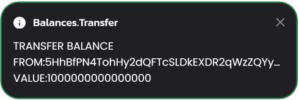
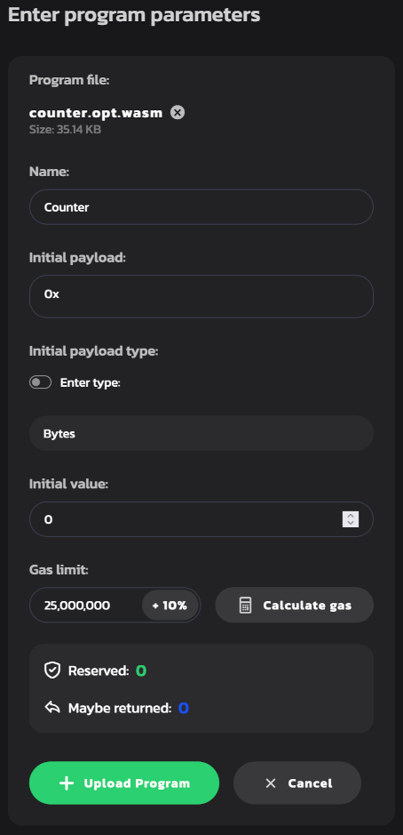
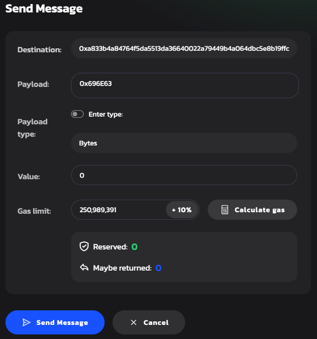
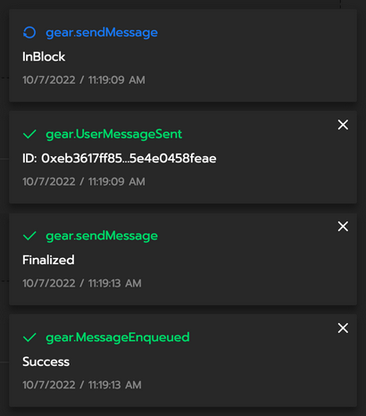

# Getting started in 5 minutes

This guide provides a general overview of running smart contracts on the networks powered by Gear Protocol (such as the [Vara Network](https://vara-network.io/)). It guides you through how to write a smart contract, compile it to Wasm and deploy it to the Gear network.

:::important
 Attention developers! Want to take your blockchain development skills to the next level? Join **[Gear Academy's](https://academy.gear.foundation/)** free course, "Gear Smart Contract Developer." In this comprehensive course, you'll learn the ins and outs of developing on the Gear Protocol, from deploying programs onto the blockchain and interacting with them, to testing your programs on the Gear Network. You'll also gain hands-on experience navigating the `@gear-js` library for interacting with contracts on the client side and developing real-world applications, including contracts and frontends. Don't miss this opportunity to become a pro Gear blockchain developer. Enroll now in Gear Academy's **"[Gear Smart Contract Developer](https://academy.gear.foundation/course/tamagotchi)"** course!
:::

## Prerequisites

1. Linux users should generally install `GCC` and `Clang`, according to their distribution’s documentation.

    For example, on Ubuntu use:

    ```bash
    sudo apt install -y build-essential clang cmake
    ```

    On macOS, you can get a compiler toolset by running:

    ```bash
    xcode-select --install
    ```

2. Make sure you have installed all the tools required to build a smart-contract in Rust. [Rustup](https://rustup.rs/) will be used to get Rust compiler ready:

    ```bash
    curl --proto '=https' --tlsv1.2 -sSf https://sh.rustup.rs | sh
    ```

3. Now, let's install a `nightly` version of the toolchain with `rustup`, since Gear uses the most up-to-date features `rustup` provides. We use `nightly-2023-04-25` as it is the latest version that is compatible with Gear.

    ```bash
    rustup toolchain add nightly-2023-04-25
    ```

4. As we will be compiling our Rust smart contract to Wasm, we will need a Wasm compiler. Let's add it to the toolchain.

    ```bash
    rustup target add wasm32-unknown-unknown --toolchain nightly-2023-04-25
    ```

5. Also, you need to install the `wasm-proc` utility that optimizes compiled Wasm to be more compact.

    ```bash
    cargo install --locked --git https://github.com/gear-tech/gear.git wasm-proc
    ```

**_Note:_** If you use Windows, download and install [Build Tools for Visual Studio](https://visualstudio.microsoft.com/downloads/?q=build+tools).

## Creating your first Gear smart contract

1. For your convenience, it is recommended that you create a dedicated directory for everything Gear-related. The rest of the article will assume that you are using the paths suggested. Type to create a folder in your home directory:

    ```bash
    mkdir -p ~/gear
    ```

2. Let's create a `contracts` directory inside `gear` and `cd` to it.

    ```bash
    mkdir -p ~/gear/contracts
    cd ~/gear/contracts
    ```

3. The next step would be to build a Rust library for our contract:

    ```bash
    cargo new counter --lib
    ```

    Now, your `gear/contracts` directory tree should look like this:

    ```
    counter
    ├── Cargo.toml
    └── src
        └── lib.rs
    ```

4. It's time to write some code. Open `counter` with your favorite editor. For `VS Code` editor type:

    ```bash
    code ~/gear/contracts/counter
    ```

5. In the `counter` folder, configure `Cargo.toml` in order for our contract to be properly built:

    ```ini
    [package]
    name = "counter"
    version = "0.1.0"
    edition = "2021"

    # highlight-start
    [lib]
    crate-type = ["cdylib"]
    # highlight-end

    [dependencies]
    # highlight-next-line
    gstd = { git = "https://github.com/gear-tech/gear.git", branch = "testnet" }
    ```

6. Replace the default contents of `lib.rs` in the `counter` folder with the code for our first smart-contract.

    This simple smart-contract accepts `inc`, `dec`, and `get` commands. Open `src/lib.rs` in your editor and paste the following code:

    ```rust
    #![no_std]

    use gstd::{msg, prelude::*};

    static mut COUNTER: i32 = 0;

    #[no_mangle]
    extern "C" fn handle() {
        let command = msg::load_bytes().expect("Invalid message");

        let mut counter = unsafe { COUNTER };

        match command.as_slice() {
            b"inc" => counter += 1,
            b"dec" => counter -= 1,
            b"get" => {
                msg::reply_bytes(format!("{counter}"), 0).expect("Unable to reply");
            }
            _ => (),
        }

        unsafe { COUNTER = counter };
    }
    ```

7. Now compile the smart-contract to Wasm using `cargo`:

    ```bash
    RUSTFLAGS="-C link-args=--import-memory -C linker-plugin-lto" \
        cargo +nightly-2023-04-25 build --release --target=wasm32-unknown-unknown
    ```

    This command is quite verbose, so we can create cargo config and Rust toolchain override files to make it shorter. Create a `.cargo/config.toml` file in the `counter` directory with the following contents:

    ```ini
    [build]
    target = "wasm32-unknown-unknown"
    rustflags = [
        "-C", "link-args=--import-memory",
        "-C", "linker-plugin-lto",
    ]
    ```

    And create a `rust-toolchain.toml` file in the `counter` directory with the following contents:

    ```ini
    [toolchain]
    channel = "nightly-2023-04-25"
    targets = ["wasm32-unknown-unknown"]
    profile = "default"
    ```

    Now you can build your smart-contract with a single command:

    ```bash
    cargo build --release
    ```

    If everything goes well, your working directory should now have a `target` directory that looks like this:

    ```
    target
    ├── ...
    └── wasm32-unknown-unknown
        └── release
            ├── ...
            └── counter.wasm    <---- this is our built .wasm file
    ```

8. The last preparation step is to optimize the Wasm binary using `wasm-proc`:

    ```bash
    wasm-proc target/wasm32-unknown-unknown/release/counter.wasm
    ```

    A new Wasm file will be created:

    ```bash
    target
    ├── ...
    └── wasm32-unknown-unknown
        └── release
            ├── ...
            ├── counter.wasm        <---- this is our built .wasm file
            # highlight-next-line
            └── counter.opt.wasm    <---- this is optimized .wasm file
    ```

    Now the `target/wasm32-unknown-unknown/release` directory contains two required Wasm binaries:

    - `counter.wasm` is the output Wasm binary built from source files
    - `counter.opt.wasm` is the optimized Wasm aimed to be uploaded to the blockchain

## Deploy your Smart Contract to the Testnet

Gear provides a demo application that implements all of the possibilities of interaction with smart-contracts in Gear networks, available at [idea.gear-tech.io](https://idea.gear-tech.io).

### Create account

1. Download the Polkadot extension for your browser via [https://polkadot.js.org/extension/](https://polkadot.js.org/extension/). This extension manages accounts and allows the signing of transactions with those accounts. It is a secure tool that allows injecting your accounts into any Substrate-based dapp. It does not perform wallet functions, e.g send funds.

2. Once downloaded, click <kbd>+</kbd> button to create a new account:

    

3. Make sure you save your 12-word mnemonic seed securely.

    

4. Select the network that will be used for this account - choose "Allow to use on any chain". Provide any name to this account and password and click "Add the account with the generated seed" to complete account registration.

    

5. Go to **[idea.gear-tech.io](https://idea.gear-tech.io)**. You will be prompted to grant access to your account for Gear Tech application, click "Yes, allow this application access".

    

6. Make sure you are connected to the `Vara Stable Testnet`. The network name is on the bottom left corner of the page.

    

7. You may switch the network by clicking on the network name.

    

8.    Click the `Connect` button on the top-right to select an account that will be connected to Gear Tech.

    

9. In accordance with the Actor model, smart contracts are uploaded to a network via messages. Gear node charges a gas fee during message processing. Your account balance needs to have enough funds to upload a smart-contract to the `TestNet`. Click the following button to get the test balance:

    

    A notification about successful balance replenishment will appear after passing captcha at the bottom of the window. You can also see the current account balance next to the account name in the upper right corner.

    

### Upload program

1. When your account balance is sufficient, click the <kbd>Upload program</kbd> and navigate to the `.opt.wasm` file we have pointed to above.

    

2. Specify the program Name and click <kbd>Calculate Gas</kbd> button. The Gas limit will be set automatically. Now click the <kbd>Upload program</kbd> button.

    

3. Sign the program uploading the transaction to the Gear network. Also, sign the program and metadata upload to the Gear demo environment so you could work with the program. It is recommended to set the checkbox `Remember my password for the next 15 minutes` for your convenience.

    

:::note


The red dot status for a program indicates init failure. Try to upload the program again with an increased **Gas limit**.
:::

4. Once your program is uploaded, head to the `Programs` section and find your program.

    

### Send message to a program

1. Now, try sending your newly uploaded program a message to see how it responds! Click the <kbd>Send message</kbd> button.

2. In the `Payload` field of the opened dialog type `0x696E63` (this is `inc` encoded in hex). Click <kbd>Calculate Gas</kbd> button, the Gas limit will be set automatically. Now click the <kbd>Send Message</kbd> button.

    

3. Sign the message sending transaction as it is shown in step 3 of the section **Upload Program**.

4. After your message has been successfully processed, you are to see correspondent log messages:

    

    Now you have sent an increment command to the program. After processing the counter will be incremented to `1`.

5. Repeat step 2 with `0x676574` payload (this is `get` command). This will send a get command to the program.

6. Press the <kbd>Mailbox</kbd> button to enter the mailbox and find the reply.

    

    :::note

    The reply is in the mailbox for a limited time depending on the gas limit. If you don't see the reply, try resending the `0x676574` (`get`) message with the gas limit increasing and go to the mailbox immediately after sending the message.

    :::
---

## Further reading

For more info about writing smart contracts for Gear and the specifics behind the smart contract implementation, refer to [this article on Smart Contracts](/docs/developing-contracts/introduction.md).
