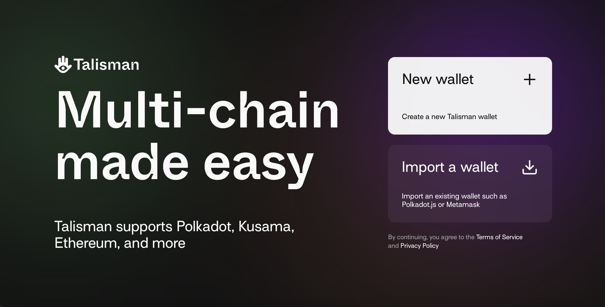
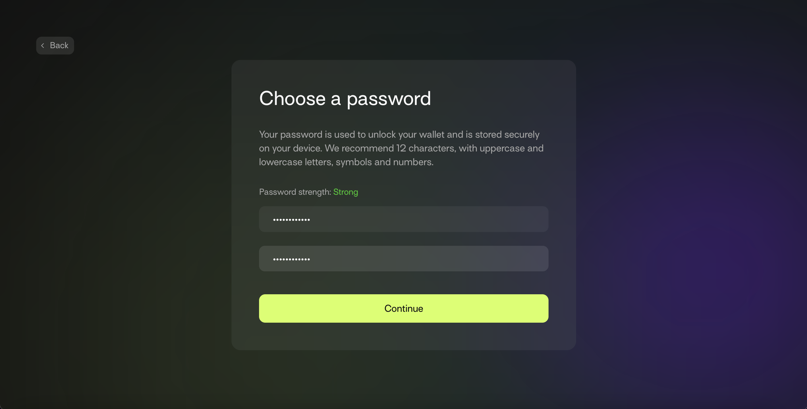
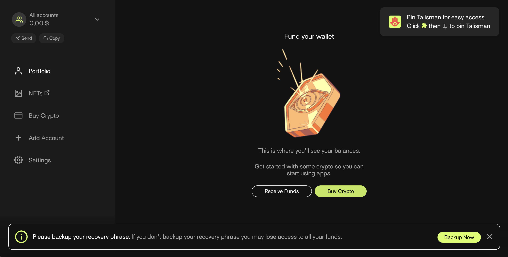
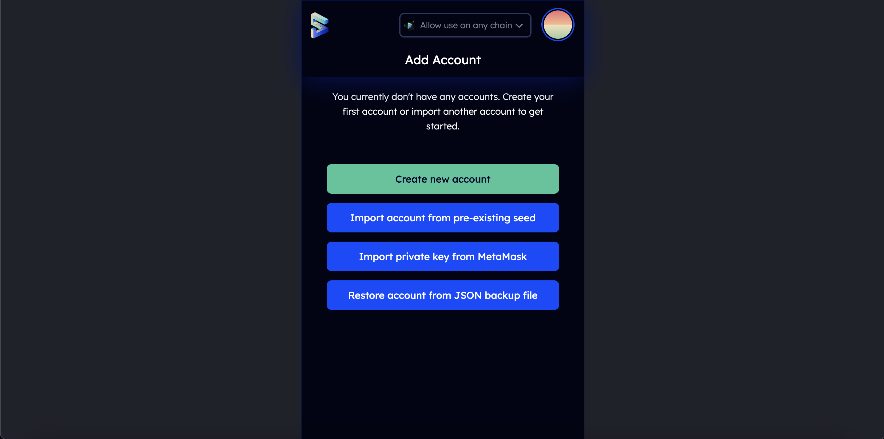
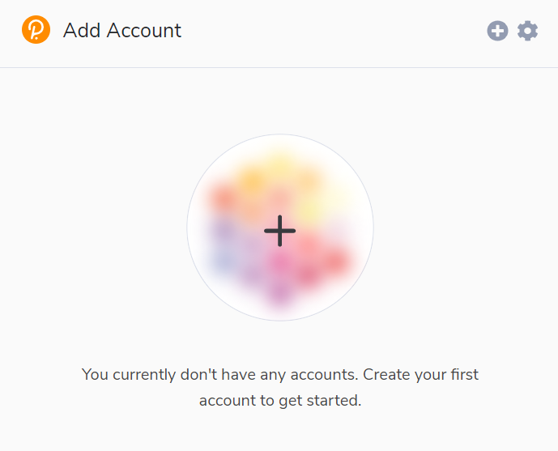
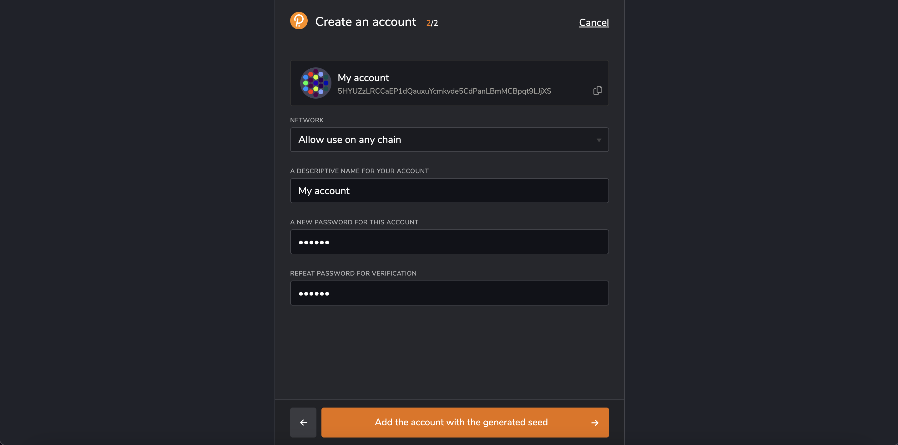

# How to create Gear account

## Key information and security

There are several ways to generate a Substrate or Gear account, depending on whether you are using a desktop or a mobile device.

There are two key features that make up an account; an address and a key. An address is the public aspect of the account. This is essentially a location that you can send transactions to and from. A key is the private part of the account. This is what enables you to access the address.

The only way to access your account is via your private key (using the mnemonic phrase, seed, or your account's JSON file and a password). 

:::tip
Your seed or mnemonic phrase is the key to your account. If you lose seed you will lose access to your account. We recommend that you store your seed in secure places like encrypted hard drives, non-digital devices or ideally, paper. Never share your private key with anyone.
:::

:::info

### Storing your accounts JSON file

JSON file is a backup of your account encrypted with a password. By using JSON, you can import/ restore your account in any wallet. Without a password, you will not be able to restore access to your account. If you use JSON, store the file and passwords in a safe place.
:::

## Via Talisman Wallet

`Talisman` is a popular and user-friendly wallet for managing substrate accounts.

1. Install Talisman extansion for your browser [here](https://talisman.xyz/)

2. Open the extension by clicking on the logo in the menu bar.

3. In the opened application, click "New wallet"



4. Enter a strong password



And that's it. Your wallet has been created! 



## Via Subwallet

Another advanced wallet for managing Substrate and EVM accounts in the same time.

1. To install Subwallet follow this [link](https://subwallet.app/download.html)

2. Open Subwallet by clicking on its logo in the browser menu bar.

3. Click "Create new account"



4. Select the type of account you want to create (Subwallet allows you to create Substrate-like and Ethereum accounts at once). Copy your seed phrase and keep it in the same place.


5. Introduce your password in the next step. And click "Add the account with the generated seed"


Congratulations, your wallet has been successfully created!

## Via Polkadot.js browser extension

The polkadot.js browser extension is the original application created by Parity Technologies for managing Substate accounts. This method involves installing the polkadot.js plugin and using it as a “virtual vault” that’s separate from your browser to store your private keys and sign transactions.

1. You can install the extension via the following links.

Install on [Chromium](https://chrome.google.com/webstore/detail/polkadot%7Bjs%7D-extension/mopnmbcafieddcagagdcbnhejhlodfdd?hl=en)- based browser.

Install on [FireFox](https://addons.mozilla.org/en-US/firefox/addon/polkadot-js-extension).

2. Open the extension by clicking on the logo in the menu bar

3. Click the large plus button to create a new account. Alternatively, you can navigate to the smaller plus icon in the top right and select “Create New Account”.

[img alt](./img/create-account-1.png)

4. Save the `seed phrase` in a safe place using the security advices at the beginning of this article. 



 5. Specify the name of your account and a strong password for making transactions. Click “Add the account with the generated seed”.



:::note
The password that you choose here will be used to encrypt this account’s information. You will need to re-enter it when attempting to process any kind of outgoing transaction, or when using it to cryptographically sign a message. This password is stored locally on the browser extension.
:::

You’ve now successfully created a new account using the polkadot.js browser extension.

## Via mobile app

If you need access to your accounts on a mobile device, then you can use the following mobile wallets for the Polkadot/Kusama ecosystem:

[](https://novawallet.io/)

[](https://subwallet.app/)

All supported wallets you can check [here](https://wiki.polkadot.network/docs/build-wallets)

## Via console

If you have `gear node` installed, you can generate a new `seed phrase` using the command:

```sh
./gear key generate | grep phrase
```

And then `import` the generated seed phrase into any convenient wallet.

### Frequently Asked Questions

Is this account portable?

> Yes, you can access your account on a different device or wallet of your choice as long as you have the account’s seed
> phrase or JSON file associated with the account.

Can I transact directly in the polkadot.js browser extension?

> There isn’t functionally to make transactions directly in the polkadot.js browser extension. To make transactions, you need to launch [polkadot.js apps](https://polkadot.js.org/apps/#/explorer) on your
> browser. Before you can make any transactions, you have to allow polkadot.js
> apps to access your account. The browser extension is what holds your account information. You get to choose which
> websites get to access this information.
