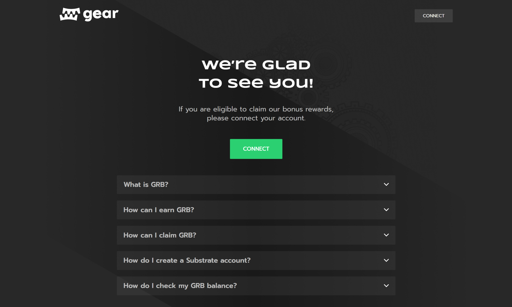
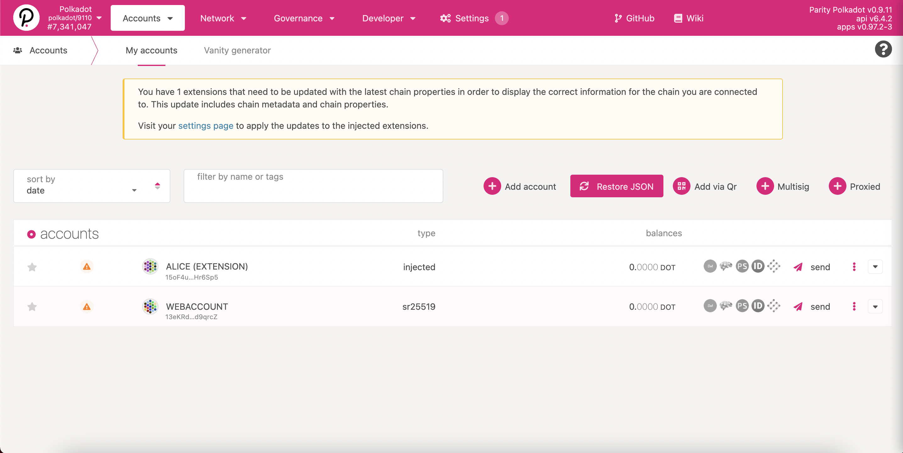
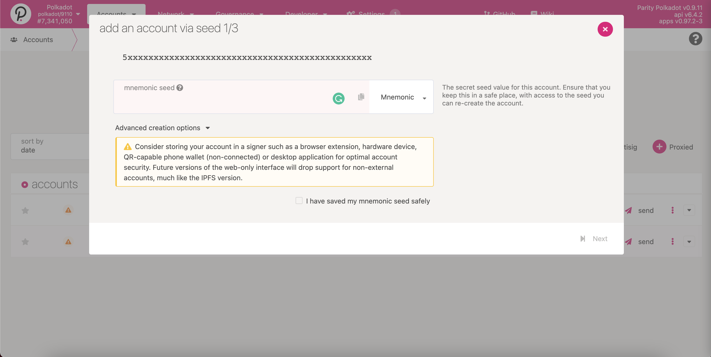
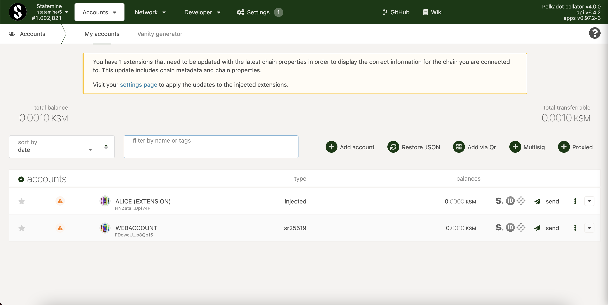

# What is GRB?

While Gear is preparing to launch its Canary Network, we are using Statemine to reward active community members with the Gear Bonus Token (GRB), which in future can be exchanged for native Gear tokens.

To earn GRB, you have to take part in activities and events that are organized by Gear, like workshops and live AMAs. Not all participants will be awarded merely for participation. To earn GRB, individuals have to successfully complete various tasks, for example deploying a dApp during one of our workshops.

To claim your GRB reward, first you have to download the [polkadot.js](https://polkadot.js.org/extension/) extension and create a Substrate account. You can read an in depth post about how to create a Substrate account [here](create-account.md).

To find out if you have received your GRB, please use one of the following options:

# Gear interface

1. Gear provides an easy-to-use interface to check and claim available GRB tokens: [claim.gear-tech.io/](https://claim.gear-tech.io/).

2. Click the `Connect` button to connect your Substrate account that is eligible for the bonus tokens.

3. If GRB is available to claim, the interface will display a `Claim` button. Your available GRB balance will be shown on the top right corner.

# Polkadot/Substrate portal

Polkadot/Substrate portal enables to check if you’ve been awarded with GRB tokens and access them.

### Step 1.

Head over to [the Polkadot/Substrate Portal](https://polkadot.js.org/apps) app. Ensure that your account is added to the wallet and is available for all networks.

When adding an account, you can use your mnemonic phrase or restore it from JSON. To do this, the password you created when saving the JSON earlier is required.

### Step 2.

To connect to Statemine, click the Polkadot icon in the top left corner, navigate to “Kusama & Parachains” and select Statemine via OnFinality/ Parity.

Your accounts should now be displayed on the Statemine network:

### Step 3.

Navigate to “Network” and then “Assets” on the navigation bar.

Then, navigate to “Balances” on the “Assets” navigation bar.

The GEAR Bonus token has the ID 677. When selecting asset 677, your available GRB balance will be displayed.

You can also check incoming transactions to your address using https://www.subscan.io/ by first selecting the Statemine network in the search menu.
