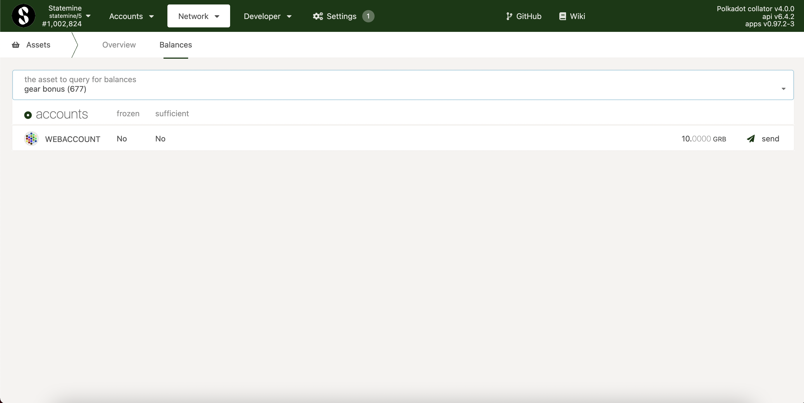

# How to check receipt of Gear Bonus Token

While GEAR is preparing to launch its Canary network, we are using Statemine to reward active members of our community with the GEAR Bonus Token (GRB) - which in the future can be exchanged for native GEAR tokens.

In this article, we will demonstrate how to check if you’ve been awarded with GRB tokens, and how you can access them.

## Step 1.

Head over to [the Polkadot / Substrate Portal](https://polkadot.js.org/apps) app. Ensure that your account is added to the wallet and is available for all networks.

When adding an account, you can use your mnemonic phrase or restore it from JSON. To do this, the password you created when saving the JSON earlier is required.

## Step 2.

To connect to Statemine, click the Polkadot icon in the top left corner, navigate to “Kusama & Parachains” and select Statemine via OnFinality/ Parity.

Your accounts should now be displayed on the Statemine network:

## Step 3.

Navigate to “Network” and then “Assets” on the navigation bar.

Then, navigate to “Balances” on the “Assets” navigation bar.

The GEAR Bonus token has the ID 677. When selecting asset 677, your available GRB balance will be displayed.

You can also check incoming transactions to your address using https://www.subscan.io/ by first selecting the Statemine network in the search menu.
