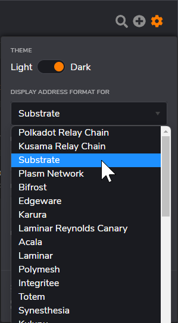

# SS58 Address Format

SS58 is a simple address format designed for Substrate based chains. The basic idea is a base-58 encoded value which can identify a specific account on the Substrate chain. For more details about the format, please check [https://docs.substrate.io/v3/advanced/ss58/](https://docs.substrate.io/v3/advanced/ss58/).

# Select address format to use with Gear network

Both the Gear Idea backend and programs written on Gear use the Substrate address format. When you participate in activities or events organized by the Gear Foundation, such as workshops or live AMAs, you may be required to share your account's public key. In these cases, you will need to provide an account address in the Substrate address format.

If you already have a Polkadot account, Kusama account, or any other Substrate-based network account, you can set the address format for your wallets in polkadot.js extension:

1. Open polkadot.js extension in your browser and click the Settings icon on the top right corner.

2. In the opened window click on the dropdown menu "Display address format for" and select "Substrate":

# SS58 Address converter

It is often more convenient to work with addresses in the respective network's format. You can either convert an address to a key yourself or use this simple online converter: https://ss58.org.
