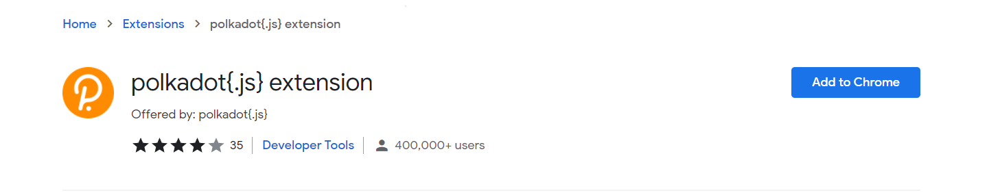
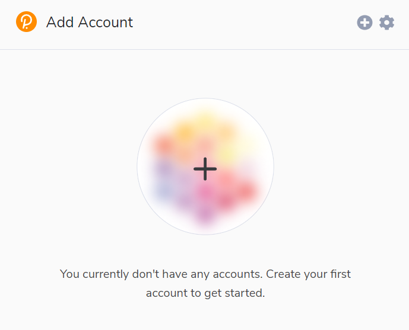
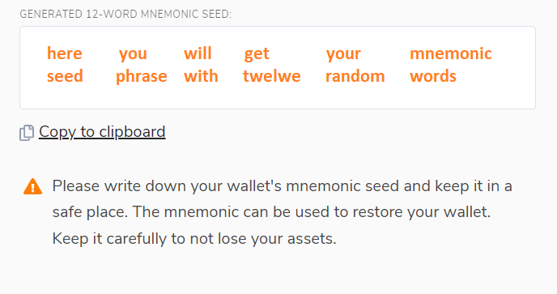
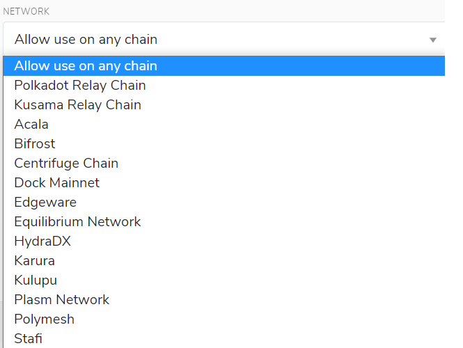
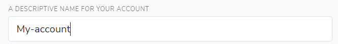
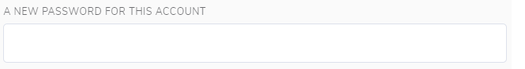

# How to create a Substrate account using the polkadot.js extension

## Key information and security

There are several ways to generate a Substrate or Polkadot account, but by far the easiest and most recommended is by using the polkadot.js browser extension.

There are two key features that make up an account; an address and a key. An address is the public aspect of the account. This is essentially a location that you can send transactions to and from. A key is the private part of the account. This is what enables you to access the address.

The only ways to access your account are via your mnemonic phrase or your accounts JSON file and a password. It’s paramount that you keep both these sources of information secure. If you share them with anyone they will have full access to and control over your account, including all your funds.

### Storing your key safely

Your seed or mnemonic phrase is the key to your account. If you lose access to your account, by changing device, forgetting the password or losing the JSON file, you can restore your account by using the seed. This also means that someone else can have access to your account if they also have access to your seed.

We recommend that you store your seed in secure places like encrypted hard drives, non-digital devices or ideally, paper. We also recommend that you take other safety precautions to prevent this copy from physical damage, for example fire and water, and make multiple copies stored in different locations.

You should never store your seed on a device that is, or ever will be, connected to the internet.

### Storing your accounts JSON file

Your account’s JSON file is encrypted with a password. This means that while you can import into any wallet, you will need to use the password to do so successfully. As there is this additional layer of security - a password - you don’t have to be as cautious about securing it. However, it’s worth using extremely secure passwords that are not used for anything else. You should make a note of this password offline.

## Polkadot.js browser extension

The polkadot.js browser extension is one of the easiest and most secure ways of creating a Substrate account. This method involves installing the polkadot.js plugin and using it as a “virtual vault” that’s separate from your browser to store your private keys and sign transactions.

### Installing the browser extension

The extension is available for both Chromium based browsers and FireFox.

You can install the extension via the following links.

Install on [Chromium](https://chrome.google.com/webstore/detail/polkadot%7Bjs%7D-extension/mopnmbcafieddcagagdcbnhejhlodfdd?hl=en)- based browser.

Install on [FireFox](https://addons.mozilla.org/en-US/firefox/addon/polkadot-js-extension).

Once you’ve installed the extension, you should see an orange and white Polkadot logo in the menu bar.

### Creating an account

Open the extension by clicking on the logo in the menu bar, and click the large plus button to create a new account. Alternatively, you can navigate to the smaller plus icon in the top right and select “Create New Account”.

Then the extension will create a new seed in the form of twelve words and display it for you to make a note of it.

You should back up this seed phrase using the security advice at the beginning of this post.

### Choosing a network

Next, click the “Network” drop down menu and select the network that you wish to create an account for. If you currently do not have a network preference, select “Allow use on any chain”.

### Naming the account

The account name that you select is for your use only. It is not stored on the blockchain and it will not be visible to anyone other than yourself or anyone who has access to this account. If you plan on using multiple accounts then we advise that you make your account names as detailed as possible to avoid future confusion.

### Entering a password

The password that you choose here will be used to encrypt this account’s information. You will need to re-enter it when attempting to process any kind of outgoing transaction, or when using it to cryptographically sign a message. This password is stored locally on the browser extension. 

Please note that this password **does not** protect your seed phrase.

Once you’ve set a password, click “Add the account with the generated seed”.

You’ve now successfully created a new account using the polkadot.js browser extension.

### Frequently Asked Questions

Is this account portable?

> Yes, you can access your account on a different device or wallet of your choice as long as you have the account’s seed
> phrase or JSON file associated with the account. 

Can I transact directly in the polkadot.js browser extension?

> There isn’t functionally to make transactions directly in the polkadot.js browser extension. To make transactions, you need to launch [polkadot.js apps](https://polkadot.js.org/apps/#/explorer) on your 
> browser. Before you can make any transactions, you have to allow polkadot.js 
> apps to access your account. The browser extension is what holds your account information. You get to choose which 
> websites get to access this information.