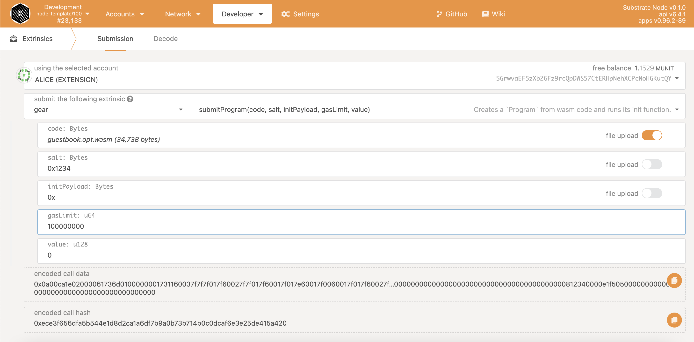

# 部署智能合约

遵循 Actor 模型的通信原则，创建一个只包含 WASM 文件程序，作为有效载荷的具体交易类型之一。

向区块链上传一个新的程序（智能合约）是通过调用自定义 extrinsic `gear.submitProgram(code, salt, initPayload, gasLimit, value)`来实现的。

字段含义如下：

`code: Bytes` - 二进制 WASM 代码。

`salt: Bytes` - 随机数据，以确定其唯一性。

`initPayload: Bytes` - 在程序初始化期间将由 init()函数处理的 init 信息有效载荷。

`gasLimit: u64` -是指用户愿意花在处理上传新程序上的 gas。

`value: u128` - 像新账户转账的数量。

## 通过程序提交事件

> 注意：外在因素代表来自外部世界的信息，而事件代表来自链的信息。外在因素可以触发事件。

为提交程序而调用的外在因素会触发一系列的事件。它们以这种方式出现：

1. Gear 网络试图在队列中发布一条消息，目的是验证源账户有足够的余额来支付 `value` 和 `gas_limit` 的发送。

2. Gear 网络的区块生产者将信息发布到区块中。

3. Gear 网络预留了用户指定的最大 gas 量，用于程序初始化。

4. 程序创建和初始化消息入队：

```sh
MessageInfo example:

{
  messageId: 0x4b92a8589e06def4ce06257138ae6fd16c44d065abee9580b4b607fe3c85baa2
  programId: 0xf33843d1481416928d0a432cf357ee3e4dc562a2a963505a8efec75febb4f9de
  origin: 0xd43593c715fdd31c61141abd04a99fd6822c8558854ccde39a5684e7a56da27d
}
```

5. 程序初始化过程。`gear.InitSuccess` 或 `gear.InitFailure` 事件。

> `programId` 是程序的唯一地址。

## 如何部署

有几种部署程序的方法：

### 通过 Gear GUI 上传

部署程序最简单的方法是使用官网[idea.gear-tech.io](https://idea.gear-tech.io)中的“Upload program”选项。

### 通过 Polkadot.js.org 上传

此外，你可以使用 [polkadot{.js}](https://polkadot.js.org) 提交程序。 在 Developer -> Extrinsic 菜单中使用 `gear.submitProgram` extrinsic。



### 通过 gear-js 库上传

Gear-js 库提供了一种简单直观的方式来连接 GEAR 组件 API，包括与程序的交互。 更多详情请看 [Gear API](https://wiki.gear-tech.io/api/connect)。
