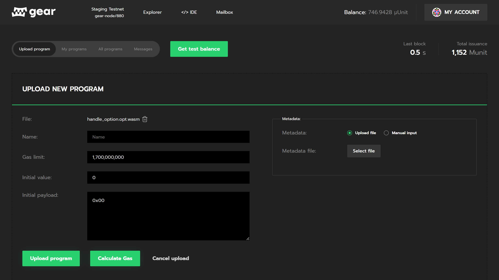

# 上传智能合约

遵循 Actor 模型的通信原则，创建一个只包含 WASM 文件程序，作为有效载荷的具体交易类型之一。

向区块链上传一个新的程序（智能合约）是通过调用自定义 extrinsic `gear.uploadProgram(code, salt, initPayload, gasLimit, value)` 来实现的。

字段含义如下：

- `code: Bytes` - 二进制 WASM 代码。
- `salt: Bytes` - 随机数据，以确定其唯一性。
- `initPayload: Bytes` - 在程序初始化期间将由 init() 函数处理的 init 信息有效载荷。
- `gasLimit: u64` - 是指用户愿意花在处理上传新程序上的 gas。
- `value: u128` - 向新账户转账的数量。

## 上传事件

> 注意：extrinsics 代表来自外部的信息，而事件代表来自链的信息。extrinsics 可以触发事件。

为上传程序而调用的 extrinsics 会触发一系列的 event。了解更多 events 信息，请点击[链接](/docs/api/events#gear-events-types)

## 如何上传

Gear 有以下几种上传程序的方法：

### 通过 Gear GUI 上传

上传程序最简单的方法是使用官网 [idea.gear-tech.io](https://idea.gear-tech.io) 中的“Upload program”选项。

### 通过 gear-js 库上传

Gear-js 库提供了一种简单直观的方式来连接 Gear 组件 API，包括与程序的交互。更多详情请看 [Gear API](https://wiki.gear-tech.io/api/connect)。
