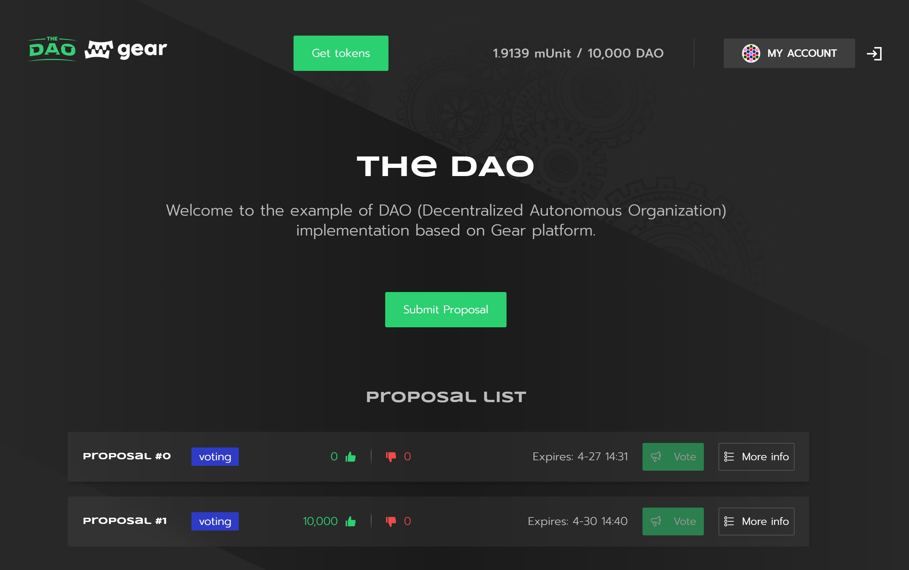

# 去中心化自治组织 (DAO)

## 简介

去中心化自治组织（decentralized autonomous organization，简称 DAO），是一种管理组织或机构的新型方式，使个体能够以透明、公平和诚实的方式为特定事业共同努力。DAO 可以被视为由志同道合的人组成的在线组织，团体成员可以公平拥有并管理该组织。

决策由提案和投票决定，以确保在一个 DAO 中，每个人都有发言权。这一点很重要，因为它意味着没有任何中心实体可以因为个人利益或基于个人信仰操纵任何事情。

DAO 提供了安全的替代方案，为某一特定事业聚集资金。但这不仅仅是成员通常可以管理的钱。例如，一个团体可以建立一个 DAO 来管理一个慈善机构，以开始接受捐赠并相应地分配援助。然而，到目前为止，DAO 目前最大的用例是去中心化的投资基金。在这里，一群投资者创建了一个风险基金，将资金集中在一起，并透明地投票决定如何分配资金。

## 接口

## 源文件

1. `ft_messages.rs` - 包含同质化代币合约的函数。DAO 合约通过 `transfer_tokens` 和 `balance` 函数与同质化代币合约进行交互：

```rust
pub async fn transfer_tokens(
		&mut self,
		token_id: &ActorId, /// - 同质化代币合约地址
		from: &ActorId, /// - 发送方地址
		to: &ActorId, /// - 接收方地址
		amount: u128, /// - Token 数量
)
```

这个函数发送一个消息 (这个 Action 在枚举 `FTAction` 中定义) 并接受返回结果 (这个返回结果在枚举 `FTEvent` 中定义)：

```rust
	let transfer_response: FTEvent = msg::send_and_wait_for_reply(
        *token_id, /// - 同质化代币合约地址，
        FTAction::Transfer(transfer_data), /// - 同质化代币合约中的 Action
        0,
    ).unwrap()
     .await
     .expect("Error in transfer tokens");
```

balance 函数也采用类似的方式定义：

```rust
pub async fn balance(
		&mut self,
		token_id: &ActorId, /// - 同质化代币合约地址，
		account: &ActorId, /// - 账户地址
)
```

并发送消息：

```rust
let balance_response: FTEvent = msg::send_and_wait_for_reply(
        *token_id, /// - 同质化代币合约地址，
		FTAction::BalanceOf(H256::from_slice(account.as_ref())) /// - 同质化代币合约中的 Action
        0,
    ).unwrap()
     .await
     .expect("Error in balance response");
```

2. `lib.rs` - 定义了合约的逻辑。

## 合约结构

合约包含了以下结构：

```rust
struct Dao {
    approved_token_program_id: ActorId,
    period_duration: u64,
    voting_period_length: u64,
    grace_period_length: u64,
    total_shares: u128,
    members: BTreeMap<ActorId, Member>,
    proposal_id: u128,
    proposals: BTreeMap<u128, Proposal>,
    locked_funds: u128,
}
```

其中：

`approved_token_program_id` - Token (ERC20) 合约的引用，用户用来抵押获得 DAO 的份额。

`period_duration` - DAO 中最小的时间单位，以毫秒 (ms) 计。

`voting_period_length` - 投票时长。投票持续时间 = 间隔时间单位 * 投票时长（period_duration * voting_period_length）.

`grace_period_length` - 在投票期之后，DAO 成员可以在一段时间内离开 DAO (ragequit)，在这段时间内他们不会被稀释，最终也不会受到提案被接受到 DAO 的影响。

`total_shares` - 所有成员的总体份额。初始值为 0。

`members` - DAO 所有成员。

`proposal_id` - 最后一个提案的索引编号。

`proposals` - 所有的提案（提案队列）。

`locked_funds` - 当提交资金提案时，这些代币将被锁定。

参数 `approved_token_program_id`，`period_duration`，`grace_period_length` 在合约初始化时进行设置。合约初始化在以下函数中进行：

```rust
#[no_mangle]
pub unsafe extern "C" fn init() {
    ...
}
```

初始化参数使用如下数据结构：

```rust
struct InitDao {
    approved_token_program_id: ActorId,
    period_duration: u64,
    voting_period_length: u64,
    grace_period_length: u64,
}
```

提案数据结构：

```rust
 pub struct Proposal {
    pub proposer: ActorId, /// - 提交提案的成员
    pub applicant: ActorId, /// - 希望成为会员的申请人
    pub yes_votes: u128, /// - 支持该提案的总票数
    pub no_votes: u128, /// - 反对该提案的总票数
    pub quorum: u128, /// - 为了使提案获得通过，必须达到一定的赞成票
    pub processed: bool, /// - 如果提案已被处理，则为 true
    pub did_pass: bool, /// - 如果提案已通过，则为 true
    pub details: String, /// - 提案详情
    pub starting_period: u64, /// - 投票期开始时间
    pub ended_at: u64, /// -  投票期结束时间
    pub votes_by_member: BTreeMap<ActorId, Vote>, /// - 每个成员对该提案的投票情况
}
```

成员数据结构：

```rust
pub struct Member {
    pub shares: u128, /// - 该成员的股份
    pub highest_index_yes_vote: u128, /// - 成员投票赞成的最高提案的索引（当用户要离开 DAO 时检查该值）
}
```

合约接收的外部 Action 在枚举 `DaoActions` 中定义。合约的返回在枚举 `DaoEvents` 中定义。

## DAO 函数

- 加入 DAO。用户可以调用该函数，以便向 DAO 合约发送代币并成为 DAO 成员。

```rust
async fn deposit(&mut self, amount: u128)
```

- 资助提案。“申请人”将会得到资助

```rust
async fn submit_funding_proposal(
        &mut self,
        applicant: &ActorId,
        amount: u128,
        quorum: u128,
        details: String,
    )
```

- 成员或者成员的委托地址可以提交他们对于提案的投票（YES 或 NO）。

```rust
async fn submit_vote(
        &mut self,
        proposal_id: u128,
        vote: Vote,
    )
```

- 成员在宽限期内提取资产的权利。如果成员们不同意提案的结果，同时提案被采纳的话，会对他们的股份产生影响，就可以使用这个权利。该成员只有对那项提案投了反对票才能愤然退出。

```rust
async fn ragequit(
    &mut self,
        amount: u128,
    )
```

- 宽限期内提案竞争后的提案处理。如果提案被接受，抵押代币存入合约和新的份额被铸造并发行给申请人。如果提案被拒绝，抵押的代币将退还给申请人。

```rust
async fn process_proposal(
        &mut self,
        proposal_id: u128
    )
```

- 这些函数将在 `async fn main()` 中通过 `DaoAction` 来调用。

```rust
	#[gstd::async_main]
	async fn main() {
		let action: DaoAction = msg::load().expect("Could not load Action");
    	match action {
            DaoAction::Deposit { amount } => dao.deposit(amount).await,
            DaoAction::SubmitFundingProposal {
                applicant,
                amount,
                quorum,
                details,
            } => {
                dao.submit_funding_proposal(&applicant, amount, quorum, details)
                    .await;
            }
            ...
	}
```

2. `state.rs` - 定义了`State` 和 `StateReply`。链下获取合约状态的能力也很重要。它被定义在 `fn meta_state()`中。合约收到读取某数据请求（可接受的请求在 `State` 中定义）时发送相应的返回数据。合约返回的数据定义在 `StateReply` 中。

```rust
pub unsafe extern "C" fn meta_state() -> *mut [i32; 2] {
    let state: State = msg::load().expect("failed to decode input argument");
    let encoded = match state {
        State::UserStatus(account) => {
            let role = if dao.is_member(&account) {
                Role::Member
            } else {
                Role::None
            };
            StateReply::UserStatus(role).encode()
        }
        State::AllProposals => StateReply::AllProposals(dao.proposals.clone()).encode(),
       ...
    };
    gstd::util::to_leak_ptr(encoded)
}
```

## 用户界面

一个 [即用型应用](https://dao.gear-tech.io/)实例提供了一个与[DAO](https://github.com/gear-dapps/dao-light)和[GFT](https://github.com/gear-dapps/fungible-token)智能合约互动的用户界面。

Gear 同质化代币可以创建基于实用代币的 DAO，详情请看[本文](gft-20.md)。

这个视频演示了整体配置和用户互动工作流程。

**https://youtu.be/6lxr7eojADw**

中文字幕版视频在：**https://www.bilibili.com/video/BV1VF411j7ez**



### 在.env 中配置 dApp

```sh
REACT_APP_NETWORK
REACT_APP_CONTRACT_ERC
REACT_APP_CONTRACT_DAO
```

- `REACT_APP_NETWORK` 是 Gear 网络地址 (wss://rpc-node.gear-tech.io:443)
- `REACT_APP_CONTRACT_ERC` 是 同质化代币合约地址
- `RREACT_APP_CONTRACT_DAO` 是 DAO 合约地址

有一个[例子](https://github.com/gear-tech/dao-app/blob/master/.env.example)可以参考。

### 如何运行

安装依赖：

```sh
yarn
```

运行：
```sh
yarn run start
```

## 源码

DAO 智能合约的例子的源代码和其测试的实例源码在 [GitHub](https://github.com/gear-dapps/dao-light)。

DAO 扩展版可以管理、会员提案和委托投票，源码在 [https://github.com/gear-dapps/dao-app](https://github.com/gear-dapps/dao-app)。

更多关于在 Gear 上测试智能合约的细节，请参考这篇文章：[应用测试](https://wiki.gear-tech.io/zh-cn/developing-contracts/testing/)。