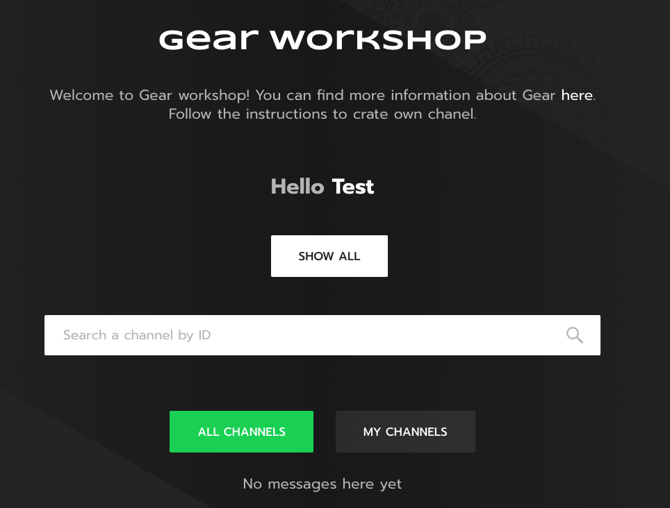
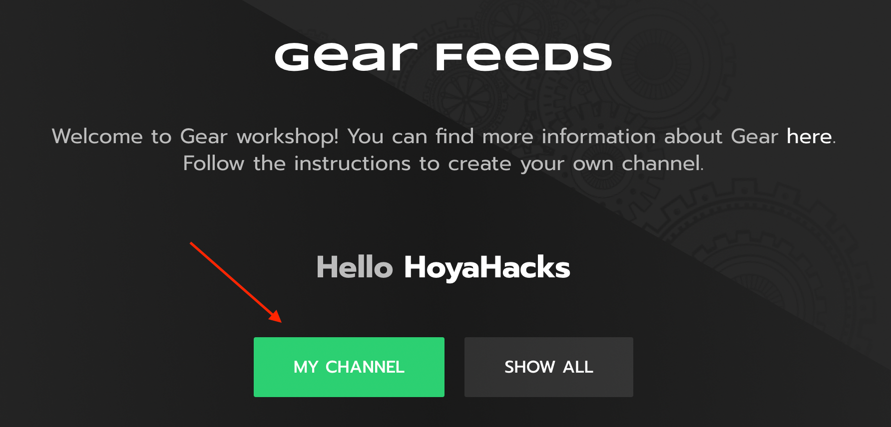

# 介绍
为了向我们快速增长的社区介绍 Gear 开发的平台，我们开发了一个去中心化应用，以展示使用我们的智能合约可以实现的一些特性。具体来说，我们的目标是建立一个类似 Twitter 的平台：每个用户都可以有自己的“信息流”，“信息流”可以订阅，登陆页面包含全球和个人的“信息流”。

# 信息流 dApp 的构成
这个应用的由两份智能合约组成：路由合约和频道合约。一个应用有一份路由合约，每个用户拥有一份频道合约。

路由合约只有一个非常直接的目标：记录新的频道合约实例化病验证它们的有效性。因此，它只包含一个操作：注册，注册操作需要由需要添加的频道合约的所有者来触发调用。

频道合约稍微复杂一点：它负责处理添加到提要中的帖子，跟踪订阅者，并提供关于自己的元信息。

# 交互流程
下面是合约之间的交互关系图：

现在让我们一步一步地了解应用的流程。

首先，频道所有者应该编译他们自己版本的合约，并填入频道相关的信息。然后，当合约通过 [idea portal](https://idea.gear-tech.io) 上传到网络时，合约的所有者应该向路由合约发送一个 `Register` 消息。一旦路由合约收到该消息，它就会向最近部署的合约发送一个 `Meta` 请求，以验证它是否被正确设置。如果频道合约的响应正确，它就会被添加到可用频道列表中。

如果你想查看路由合约和频道合约的可用代码，你可以在这里找到它们。[router](https://github.com/gear-tech/apps/tree/master/gear-feeds-router), [channel](https://github.com/gear-tech/gear-feeds-channel)。

[Gear Feeds 合约](https://github.com/gear-tech/gear-feeds-channel) 代码库包含部署合约的逐步说明。

# Gear Feeds 网站

你可以使用这个 [链接](https://workshop.gear-tech.io) 来进入 Gear Feeds 网站。

先使用你的 [Polkadot.js 插件钱包](https://polkadot.js.org/extension/) 登陆。

现在你可以浏览所有频道。

如果你已经使用你登陆网站的同一个 ID 上传了你的合约，你应该在 `my channels` 下看到它。

在查看自己的频道时，你可以向其添加帖子（你将不得不进行交易）。所有订阅者将在他们的个人频道中看到这些帖子。

# 结论
Gear Feeds 是一个成熟的应用程序的例子，其核心逻辑是在 Gear 上通过智能合约实现的去中心化的应用程序。我们希望看到更多由 Gear Feeds 启发的令人兴奋的项目，以及我们的社区成员创造的最近的平台改进! :) 