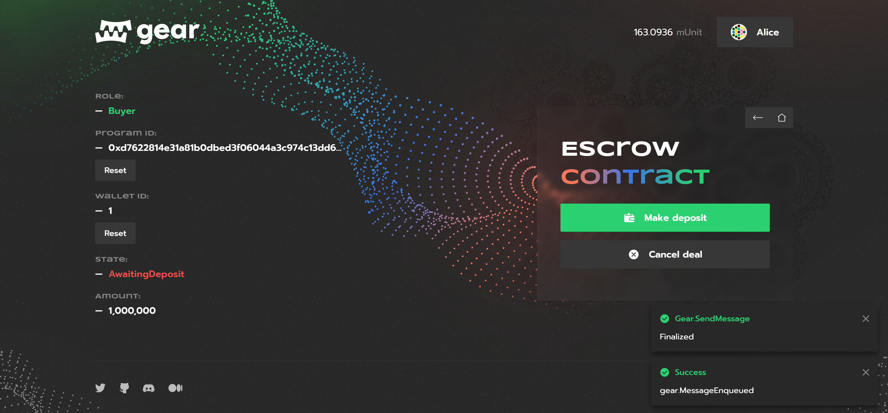

# 第三方担

## 介绍

第三方担保是一个特殊钱包，某些资产 (如钱或股票) 存放在其中，直到某些条件得到满足。就智能合约而言，第三方担保是存储在区块链上的钱包，与常规担保一样，可以从一个用户那里接收一些资产 (例如加密资产或代币，在这个例子中，是像 [VFT](../Standards/vft)资产)，并在满足特定条件时将它们发送给另一个用户。

本篇文章主要介绍智能合约的作用和代码逻辑。想获得更详细的技术描述，请参考[技术文档](https://dapps.gear.rs/escrow_io)和[源码](#source-code)。

你也可以通过视频了解本合约：**https://youtu.be/CD8j4epEY4E**.

## 业务逻辑

* 任何用户都可以创建合约，作为买方或卖方
* 买方可以支付定金并确认合同
* 卖方可以将已付款合同中的代币退还给买方
* 买卖双方都可以取消未付款合同

一个担保合约包含了“买方”、“卖方”信息和各自的“状态”，以及可以担保的代币的“数量”信息：

```rust
pub struct Wallet {
    /// A buyer.
    pub buyer: ActorId,
    /// A seller.
    pub seller: ActorId,
    /// A wallet state.
    pub state: WalletState,
    /// An amount of tokens that a wallet can have. **Not** a current amount on
    /// a wallet balance!
    pub amount: u128,
}
```

`WalletState` 是一个枚举类型，用于存储合约约的当前状态：

```rust
enum WalletState {
    AwaitingDeposit,
    AwaitingConfirmation,
    Closed,
}
```

## 接口

### 初始化配置

```rust
/// Initializes an escrow program.
#[derive(Decode, Encode, TypeInfo)]
pub struct InitEscrow {
    /// Address of a fungible token program.
    pub ft_program_id: ActorId,
}
```

### 方法

```rust
/// An enum to send the program info about what it should do.
///
/// After a successful processing of this enum, the program replies with [`EscrowEvent`].
#[derive(Decode, Encode, TypeInfo)]
pub enum EscrowAction {
    /// Creates one escrow wallet and replies with its ID.
    ///
    /// # Requirements
    /// * [`msg::source()`](gstd::msg::source) must be `buyer` or `seller` for this wallet.
    /// * `buyer` or `seller` mustn't have the zero address.
    ///
    /// On success, returns [`EscrowEvent::Created`].
    Create {
        /// A buyer.
        buyer: ActorId,
        /// A seller.
        seller: ActorId,
        /// An amount of tokens.
        amount: u128,
    },

    /// Makes a deposit from a buyer to an escrow wallet
    /// and changes wallet's [`WalletState`] to [`AwaitingConfirmation`](WalletState::AwaitingConfirmation).
    ///
    /// Transfers tokens to an escrow wallet until a deal is confirmed (by [`EscrowAction::Confirm`]) or cancelled ([`EscrowAction::Cancel`]).
    ///
    /// # Requirements
    /// * [`msg::source()`](gstd::msg::source) must be a buyer for this wallet.
    /// * Wallet mustn't be paid or closed (that is, wallet's [`WalletState`] must be [`AwaitingDeposit`](WalletState::AwaitingDeposit)).
    ///
    /// On success, returns [`EscrowEvent::Deposited`].
    Deposit(
        /// A wallet ID.
        WalletId,
    ),

    /// Confirms a deal by transferring tokens from an escrow wallet
    /// to a seller and changing wallet's [`WalletState`] to [`Closed`](WalletState::Closed).
    ///
    /// Transfers tokens from an escrow wallet to a seller for this wallet.
    ///
    /// # Requirements
    /// * [`msg::source()`](gstd::msg::source) must be a buyer for this wallet.
    /// * Wallet must be paid and unclosed (that is, wallet's [`WalletState`] must be [`AwaitingDeposit`](WalletState::AwaitingConfirmation)).
    ///
    /// On success, returns [`EscrowEvent::Confirmed`].
    Confirm(
        /// A wallet ID.
        WalletId,
    ),

    /// Refunds tokens from an escrow wallet to a buyer
    /// and changes wallet's [`WalletState`] back to [`AwaitingDeposit`](WalletState::AwaitingDeposit)
    /// (that is, a wallet can be reused).
    ///
    /// Refunds tokens from an escrow wallet to a buyer for this wallet.
    ///
    /// # Requirements
    /// * [`msg::source()`](gstd::msg::source) must be a seller for this wallet.
    /// * Wallet must be paid and unclosed (that is, wallet's [`WalletState`] must be [`AwaitingDeposit`](WalletState::AwaitingConfirmation)).
    ///
    /// On success, returns [`EscrowEvent::Refunded`].
    Refund(
        /// A wallet ID.
        WalletId,
    ),

    /// Cancels a deal and closes an escrow wallet by changing its [`WalletState`] to [`Closed`](WalletState::Closed).
    ///
    /// # Requirements
    /// * [`msg::source()`](gstd::msg::source) must be a buyer or seller for this wallet.
    /// * Wallet mustn't be paid or closed (that is, wallet's [`WalletState`] must be [`AwaitingDeposit`](WalletState::AwaitingDeposit)).
    ///
    /// On success, returns [`EscrowEvent::Cancelled`].
    Cancel(
        /// A wallet ID.
        WalletId,
    ),
}
```

### Meta state 查询

```rust
/// An enum for requesting the program state.
///
/// After a successful processing of this enum, the program replies with [`EscrowStateReply`].
#[derive(Decode, Encode, TypeInfo)]
pub enum EscrowState {
    /// Gets wallet info.
    ///
    /// On success, returns [`EscrowStateReply::Info`].
    Info(
        /// A wallet ID.
        WalletId,
    ),
    /// Gets all created wallets.
    ///
    /// On success, returns [`EscrowStateReply::CreatedWallets`].
    CreatedWallets,
}
```

## 用户界面

一个[现成的应用](https://escrow.gear-tech.io/)实例提供了一个与[第三方担保](https://github.com/gear-foundation/dapps-dao-light)智能合约互动的用户界面。


你也可以通过视频了解如何使用：**https://youtu.be/CD8j4epEY4E**.



源码在 [GitHub](https://github.com/gear-tech/gear-js/tree/main/apps/escrow).

### .env 中基本配置

For proper application functioning, one needs to create `.env` file and adjust an environment variable parameters. An example is available [here](https://github.com/gear-tech/gear-js/blob/main/apps/escrow/.env.example).

为了使应用程序正常运行，需要创建`.env`文件并调整环境变量。有一个例子在[这里](https://github.com/gear-tech/gear-js/blob/main/apps/escrow/.env.example)。

```sh
REACT_APP_NODE_ADDRESS
```

- `REACT_APP_NODE_ADDRESS` 是 Gear Network 的 地址 (默认 wss://rpc-node.gear-tech.io:443)

:::note

为了使所有的功能都能按预期工作，应该根据当前 `@gear-js/api` 的版本来选择节点及其运行时版本。

在应用程序出现问题时，尝试切换到另一个网络或运行你自己的本地节点，并在 `.env` 文件中指定其地址。确保智能合约 wasm 文件已上传并在该网络中运行。

:::

## 源码

Escrow 的合约源码可以在 [GitHub](https://github.com/gear-foundation/dapps-escrow) 找到。

更多关于在 Gear 的测试智能合约的细节，请参考这篇文章：[应用测试](/docs/developing-contracts/testing)。
