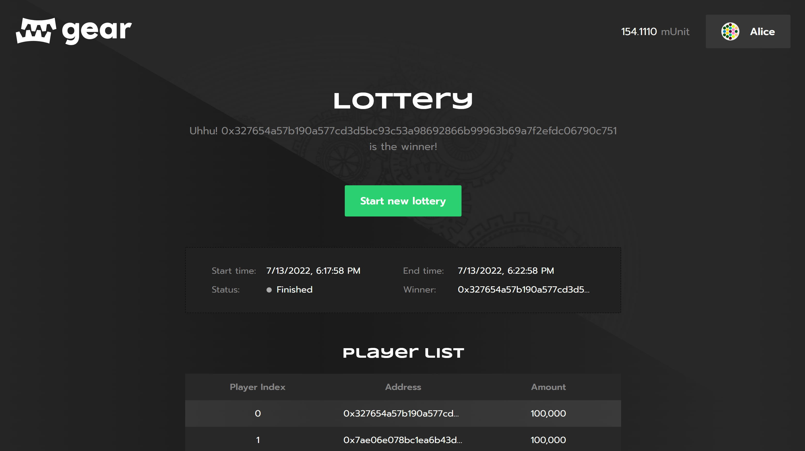

# 彩票

## 介绍

任何人都可以轻松创建自己的游戏应用程序，并在 Gear Network 上运行它。为了做到这一点，Gear 创建了一个 Game-of-chance 智能合约的例子，可以在[GitHub](https://github.com/gear-dapps/lottery)上找到。

本文会介绍接口、数据结构、基本功能及其用途。你可以按直接使用，也可以根据自己的场景进行修改。

Gear 还[提供](https://github.com/gear-tech/gear-js/tree/master/apps/lottery)了一个[游戏界面](https://lottery.gear-tech.io/)，展示智能合约的互动。在这个例子中，谁初始化合约，谁就被认为是游戏所有者。只有所有者才有权利开始/结束游戏。玩家通过向合约发送带有赌注的信息，自己加入到机会游戏中。然后玩家监控游戏的状态。赢家是随机决定的。

你可以在这里观看关于如何启动和运行游戏应用程序，及其如何使用的视频：**https://youtu.be/35StUMjbdFc**。

## 源文件

1. `lottery/src/lib.rs` - 包含彩票合约的方法体。
2. `lottery/io/src/lib.rs` - 包含合约的接收和回复信息的枚举和数据结构

## 数据结构

合约有以下数据结构：

```rust
struct Lottery {
    lottery_state: LotteryState,
    lottery_owner: ActorId,
    token_address: Option<ActorId>,
    players: BTreeMap<u32, Player>,
    lottery_history: BTreeMap<u32, ActorId>,
    lottery_id: u32,
    lottery_balance: u128,
}
```

`lottery_state` - 游戏状态信息：开始时间、结束时间

`lottery_owner` -  初始化合约的所有者的地址

`token_address` - 代币的合约地址

`players` - 玩家的数据集合

`lottery_history` - 赢家的数据集合

`lottery_id` – 当前游戏 id

`lottery_balance` - 游戏中中的总投注额


`LotteryState` 的数据结构：

```rust
pub struct LotteryState {
    pub lottery_started: bool,
    pub lottery_start_time: u64,
    pub lottery_duration: u64,
}
```

`Player` 数据结构：

```rust
pub struct Player {
    pub player_id: ActorId,
    pub balance: u128,
}
```

## 枚举

```rust
pub enum LtAction {
    Enter(u128),
    StartLottery {
        duration: u64,
        token_address: Option<ActorId>,
    },
    LotteryState,
    PickWinner,
}

pub enum LtEvent {
    LotteryState(LotteryState),
    Winner(u32),
    PlayerAdded(u32),
}

pub enum LtState {
    GetWinners,
    GetPlayers,
    BalanceOf(u32),
    LotteryState,
}

pub enum LtStateReply {
    Winners(BTreeMap<u32, ActorId>),
    Players(BTreeMap<u32, Player>),
    Balance(u128),
    LotteryState(LotteryState),
}
```

## 方法

游戏合约通过函数 `transfer_tokens` 与同质化代币合约互动。

```rust
async fn transfer_tokens(
	&mut self,
	from: &ActorId, /// - the sender address
	to: &ActorId, /// - the recipient address
	amount_tokens: u128 /// - the amount of tokens
)
```

这个方法发送信息（消息定义在了`FTAction`）并收到回复（消息定义在了 `FTEvent`）。

```rust
let _transfer_response: FTEvent = msg::send_and_wait_for_reply(
    self.token_address.unwrap(), /// - the fungible token contract address
    FTAction::Transfer {		/// - action in the fungible token-contract
        from: *from,
        to: *to,
        amount: amount_tokens,
    },
    0,
)
```

发行彩票。只有所有者可以启动彩票合约。彩票必须没有在之前发行过。

```rust
fn start_lottery(
	&mut self,
	duration: u64,
	token_address: Option<ActorId>
)
```

由玩家调用，以参加彩票。该玩家不能多次参加彩票活动。

```rust
async fn enter(
	&mut self,
	amount: u128
)
```

彩票计算赢家。只有所有者可以挑选赢家。

```rust
async fn pick_winner(
	&mut self
)
```

这些函数在 `async fn main()` 中通过`LtAction`调用。
这是程序的入口，并且程序正等待`LtAction`格式的消息。

```rust
#[gstd::async_main]
async fn main() {
    if msg::source() == ZERO_ID {
        panic!("Message from zero address");
    }

    let action: LtAction = msg::load().expect("Could not load Action");
    let lottery: &mut Lottery = unsafe { LOTTERY.get_or_insert(Lottery::default()) };

    match action {
        LtAction::Enter(amount) => {
            lottery.enter(amount).await;
        }

        LtAction::StartLottery {
            duration,
            token_address,
        } => {
            lottery.start_lottery(duration, token_address);
        }

        LtAction::LotteryState => {
            msg::reply(LtEvent::LotteryState(lottery.lottery_state.clone()), 0).unwrap();
            debug!("LotteryState: {:?}", lottery.lottery_state);
        }

        LtAction::PickWinner => {
            lottery.pick_winner().await;
        }
    }
}
```

能够在链下读取合约状态也很重要。它在`fn meta_state()` 中定义。合约接收到读取特定数据的请求（可能的请求在 `LtState` 中定义）并发送回复。合约关于其状态的回复在 `LtStateReply` 中定义。

```rust
#[no_mangle]
unsafe extern "C" fn meta_state() -> *mut [i32; 2] {
    let query: LtState = msg::load().expect("failed to decode input argument");
    let lottery: &mut Lottery = LOTTERY.get_or_insert(Lottery::default());

    let encoded = match query {
        LtState::GetPlayers => LtStateReply::Players(lottery.players.clone()).encode(),
        LtState::GetWinners => LtStateReply::Winners(lottery.lottery_history.clone()).encode(),
        LtState::LotteryState => LtStateReply::LotteryState(lottery.lottery_state.clone()).encode(),

        LtState::BalanceOf(index) => {
            if let Some(player) = lottery.players.get(&index) {
                LtStateReply::Balance(player.balance).encode()
            } else {
                LtStateReply::Balance(0).encode()
            }
        }
    };

    gstd::util::to_leak_ptr(encoded)
}
```

## 用户界面

一个[即用型应用](https://lottery.gear-tech.io/)的例子提供了一个用户界面，与在 Gear Network 中运行的[游戏](https://github.com/gear-dapps/lottery)智能合约进行互动。

本视频演示了如何配置和运行 Dapp，并解释了用户互动流程：**https://youtu.be/35StUMjbdFc**



合约源代码可以在 [GitHub](https://github.com/gear-tech/gear-js/tree/master/apps/lottery)找到。

### 在 .env 文件中配置环境变量

为了使应用程序正常运行，需要创建`.env`文件并调整环境变量。[这是个例子](https://github.com/gear-tech/gear-js/blob/master/apps/lottery/.env.example)。


```sh
REACT_APP_NODE_ADDRESS
REACT_APP_LOTTERY_CONTRACT_ADDRESS
```

- `REACT_APP_NODE_ADDRESS` 是 Gear 的网络地址 (通常为 wss://rpc-node.gear-tech.io:443)
- `REACT_APP_MARKETPLACE_CONTRACT_ADDRESS` 合约地址

### 如何运行

安装必要依赖：
```sh
npm install
```

运行程序：

```sh
npm start
```

在浏览器打开 http://localhost:3000

## 总结

Lottery 的源代码可以在 GitHub 找到：[`lottery/src/lib.rs`](https://github.com/gear-tech/apps/blob/master/lottery/src/lib.rs)。

本合约的测试代码基于 gtest：

- [`simple_tests.rs`](https://github.com/gear-dapps/lottery/blob/master/src/simple_tests.rs)

- [`panic_tests.rs`](https://github.com/gear-dapps/lottery/blob/master/src/panic_tests.rs)

- [`token_tests.rs`](https://github.com/gear-dapps/lottery/blob/master/src/token_tests.rs)

更多关于在 Gear 上测试智能合约的细节，请参考这篇文章：[应用测试](https://wiki.gear-tech.io/zh-cn/developing-contracts/testing/)。
