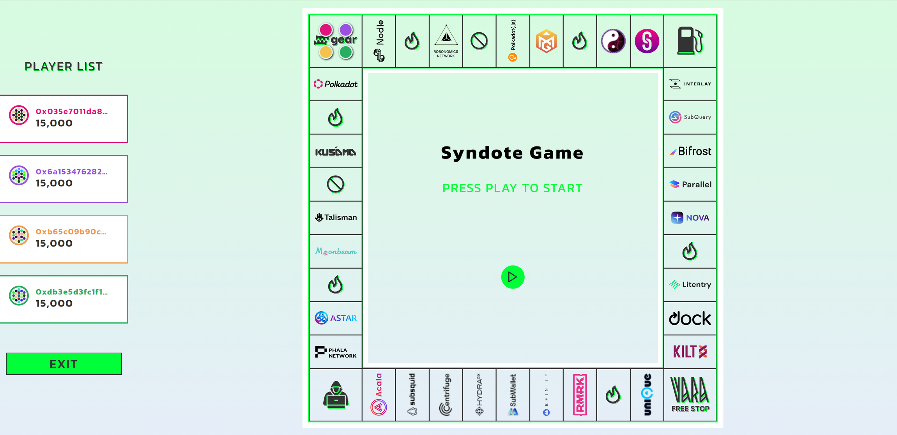
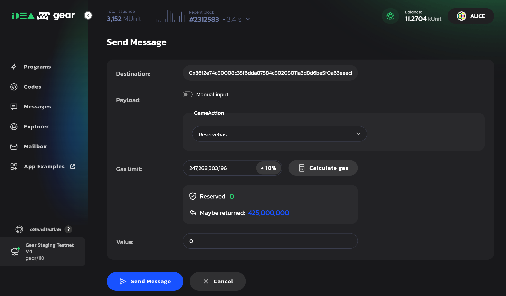
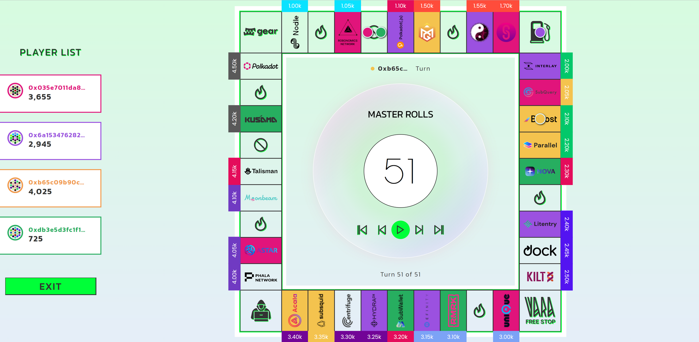
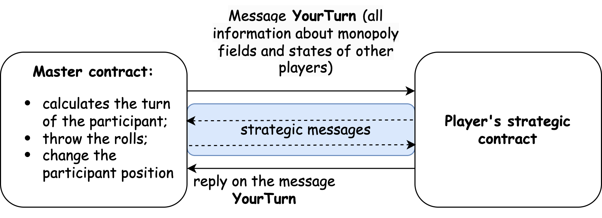

# 大富翁游戏 (Syndote)

Syndote 是一个类似大富翁的去中心化游戏的名字，它**完全在链上**运行。它没有后台或任何中心化的组件，用户界面直接与 Gear Network 中上传的智能合约交互。

这是一场“游戏策略大战”，玩家通过执行各种游戏策略来相互竞争，这些作为智能合约上传到网络中。

Syndote 由 Master 合约和 Player 合约组成。主合约是启动和控制游戏的主合约。玩家合约实施的游戏策略对于游戏的每个参与者来说都是独一无二的。

游戏开始后，游戏中的所有动作都会自动进行，但 UI 提供了一个功能，可以单独跳转到每个动作以分析玩家的策略。要完成游戏并确定获胜者，需要许多动作，这些动作在几个区块中进行处理。为了让 master 合约有足够的 gas 来执行所有的动作，使用了[gas reservation](../developing-contracts/gas-reservation)技术。



要启动游戏，需要：

- ⚒️ 构建 Master 和 Player 合约
- 🏗️ 上传合约到链上
- 🖥️ 构建并运行用户界面

## ⚒️ 构建 Master 和 Player 合约

- 获取 [Master 合约](https://github.com/gear-tech/syndote-game/tree/master/program/syndote) 源码 和[Player  合约](https://github.com/gear-tech/syndote-game/tree/master/program/player) 源码。
- 根据需要修改玩家的合约以实现最佳游戏策略。
- 如 [program/README.md](https://github.com/gear-tech/syndote-game/blob/master/program/README.md#building-contracts)所述，构建合约

## 🏗️ 上传合约到链上

### 在本地运行 Gear 节点

在测试和调试程序时推荐这样做。

[此处](https://get.gear.rs/) 可以找到 Gear 节点二进制执行文件。

```sh
./gear --dev --tmp --unsafe-ws-external --rpc-methods Unsafe --rpc-cors all
```

按照 [运行游戏](#running-the-game) 部分所述上传并运行 Master 和 Player 合约并注册玩家。

### 在 Gear Network 中运行程序

1. 使用 [idea.gear-tech.io](https://idea.gear-tech.io/) 不是合约
2. 在网络选择器中选择 Staging Testnet - wss://rpc-node.gear-tech.io network.
3. 上传并运行 Master 和 Player 合约。

## 🖥️  构建并运行用户界面

1. 在本地下载 [本仓库](https://github.com/gear-tech/gear-js) 并使用 [README.md](https://github.com/gear-tech/gear-js/tree/main/apps/syndote#readme) 中的指令运行游戏应用程序。

2. 安装程序依赖：

```sh
yarn install
```
3. 声明环境变量 - 创建新的`.env`文件，检查`.env.example`文件以获得必要的变量。

4. 将最新版本的`syndote.meta.wasm`文件放在本地`gear-js\apps\syndote\src\assets\wasm`文件夹中，必要时进行替换。

:::note
为了使所有的功能都能按预期工作，应该根据当前的`@gear-js/api`版本来选择节点及其运行时版本。如果应用程序出现问题，尝试切换到另一个网络或运行你自己的本地节点，并在`.env`文件中指定其地址。在适用的情况下，确保智能合约 wasm 文件被上传并在该网络中相应运行。
:::

5. 运行应用：

```sh
yarn start
```

## 运行游戏

### 运行用户界面

1. 访问 [idea.gear-tech.io](https://idea.gear-tech.io/)，找到上传的 Master 合约，点击`Send message`按钮。



2. 目前单次 gas 预留量最高可达 245 000 000 000，因为尚无法进行超过区块 gas 限制（250 000 000 000）的预留。为确保主合约有足够的 gas 运行并完成游戏，建议至少进行 5-10 次预留。

3. 按照[构建和运行用户界面](#🖥️-build-and-run-user-interface)中所述，在本地运行应用程序。

4. 在 idea.gear-tech.io 上找到 Players 合约，并复制其 ID。

5. 在应用程序的界面中依次注册玩家。每个玩家的注册都是一个交易，需要签名。最多可以注册 4 名球员。

6. 一切都完成后，通过 `Play`按钮开始游戏。你几乎可以立即看到游戏结果。单击`<` and `>`按钮浏览游戏并检查每个单独的动作。



### 直接在本地节点上运行

1. 为了运行游戏，你必须将 Master 合约和 Player 合约部署到网络上（本地节点）。在初始化过程中，主合约被填入信息（牢房成本、特殊牢房：监狱、彩票等）。

2. 为自动游戏提供足够的 gas 预留。在每一轮比赛之前，Master 合约会检查 gas 数量，如果不够，它将向游戏管理员发送消息，要求再次预留 gas。要进行预留，你必须向 Master 合约发送以下信息：

```sh
GameAction::ReserveGas
```

3. 注册你的玩家合约。出于测试目的，你可以多次上传同一玩家的合约。在 Syndote 主合约中最多可以添加四个或更少的玩家。
要注册玩家，你必须向 Syndote 合约发送以下信息。要注册玩家，必须向 Syndote 合约发送以下消息：

```sh
GameAction::Register {
    player: ActorId
}
```

4. 玩家注册后，发送消息即可开始游戏：

```sh
GameAction::Play
```

5. 如果游戏还没有结束，再进行预约，再次发送消息`GameAction::Play`。游戏结束后，状态变为 Finished，管理员可以通过开始新的玩家注册来重新开始游戏：

```sh
GameAction::StartRegistration
```

## 智能合约
### Master 合约

[Master 合约](https://github.com/gear-dapps/syndote/tree/master/syndote) 使用垄断卡信息（单元成本，特殊单元：监狱，彩票）进行初始化。正如已经提到的，它有足够的 gas 预留以以便自动游戏。在每个玩家的步骤之前，`Master` 合约会检查 gas 量，如果不够，它会向游戏管理员发送一条消息，请求再次预订 gas。

**玩家注册**:

玩家部署他们的策略合约，并向 `Master` 合约发送 `Register` 信息。

Master 合约：
- 在参与者列表中添加玩家，并以下列结构进行初始化：

```rust
struct PlayerInfo {
    position: 0,
	balance: 15000,
    debt: 0,
	in_jail: false,
	round: 0,
    cells: BTreeSet::new(),
    penalty: 0,
    lost: false,
}
```

- 如果参与者的数量是 4，`Master` 合约进入等待状态，等待游戏开始。

当达到所需的参与者数量时，管理员会向 `Master`合约发送一条信息 `Play`。这条消息启动了一个自动游戏，将依次滚动显示参与者的算法：
- `Master` 合约开始这一轮。每轮包含 4 个步骤（每个玩家走一个步骤）。在每一步之前，`Master` 合约都会检查参与者的状态（他们是破产还是可能已经有赢家）；
- 每个步骤依次包含与策略合约的交互：
- 如果本轮步数为 4，`Master`合约开始下一轮。



**策略消息：**

[策略合约](https://github.com/gear-dapps/syndote/tree/master/player)  根据垄断场上的位置，发送策略信息。一个玩家可能处于以下位置之一：

 - 一个 cell 有自己的财产。一个玩家有一个权利：
   - 在单元格上添加一个齿轮。齿轮可以是 `青铜`、`银 `或 `金`；
   - 升级装备（从`青铜`到`白银`，从`白银`到`黄金`）；
- 什么也不做

在 `AddGear`和`Upgrade`操作期间，如果余额不足，玩家可以将其他财产卖给银行。

- 具有其他属性的单元格。玩家必须支付租金。如果他没有足够的余额，他可以将他的财产卖给银行。否则他将被宣布破产。
- 出售尚未有人购买的房产。玩家有权利：
  - 购买单元格（如果余额不足，可以选择将房产出售给银行）；
  - 什么也不做

- 监狱。玩家可以掷骰子。如果是双倍，他就会出狱，并且他的位置会因滚动总和而移动。如果不是双倍，玩家可以支付罚款或等待下一轮再次掷骰子。

- 空单元格。在 `Master` 合约中，有一些单元格没有被填入任何东西。开发者自己可以扩展游戏的功能，增加不同的游戏机制。

### 玩家合约

`Player` is a contract in which the monopoly game strategy is implemented. It must meet the following requirements:

`Player` 是实施大富翁策略的合约。它必须满足以下要求：
- 它必须接受来自`Master`合约的以下消息：
    ```rust
    pub struct YourTurn {
        pub players: BTreeMap<ActorId, PlayerInfo>,
        pub properties: BTreeMap<u8, (Vec<Gear>, Price, Rent)>,
    }
    ```

该结构包含所有玩家的状态以及垄断领域和所建齿轮的信息。

- 根据收到的信息，策略合约必须做出行动（`BuyCell`, `AddGear`, `Upgrade`, `PayRent`, `ThrowRolls`等）。该行动必须是给大富翁合约的异步信息。

- 移动必须正确进行。例如，如果一个玩家在一个已经被占领的领域并试图购买它，那么 Master 合约将对他进行罚款。每走错一步扣一分。如果玩家得到 5 个罚分，则该玩家出局。

- 在这一步之后，玩家必须对大富翁合约发送回复。这样大富翁合约就知道了这一步已经完成。回复可以是一条简单的空消息。

- 如果玩家的合约没有回复，`Master` 合约会将该玩家从游戏中移除。

- `Master` 合约每回合提供有限数量的 gas。这个数量足够移动，但如果玩家的合约包含不正确的逻辑（例如，无限循环），它将被从游戏中移除。
