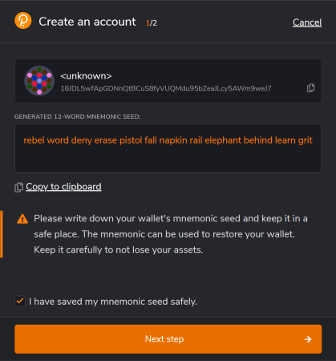
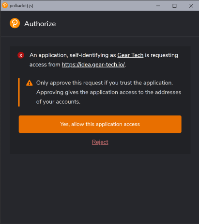
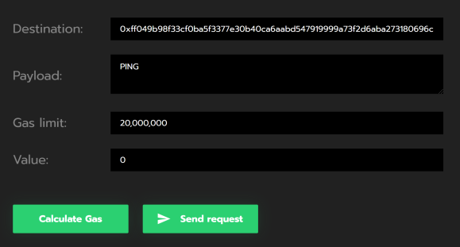

# 5 分钟手册

在这篇文章中，我们将会编写并部署第一个智能合约到 GEAR 网络中。

## 1. 前期准备

1. 为方便起见，最好为所有与 GEAR 有关的内容创建一个专用目录。

```bash
mkdir -p ~/GEAR
cd ~/GEAR
```

文章的其余部分将假设你正在使用建议的文件路径，所以请根据你的目录树进行调整。

2. 首先，我们需要安装在 Rust 中构建第一份合约所需的工具。

我们将使用 [Rustup](https://rustup.rs/) 来安装 Rust 编译器。

```bash
curl --proto '=https' --tlsv1.2 -sSf https://sh.rustup.rs | sh
```

3. 现在，让我们为 `rustup`安装一个 `nightly` 版本，因为 `GEAR` 使用了一些 `rustup` 提供的最新功能。

```bash
rustup update
rustup update nightly
```

4. 我们需要把 Rust 智能合约编译为 WASM，所以我们需要一个 WASM 编译器。让我们将 WASM 编译器添加到工具链中。

```bash
rustup target add wasm32-unknown-unknown --toolchain nightly
```

现在，通过 clone 我们的公共[github repo](https://github.com/gear-tech/gear)来获得 GEAR 的源代码。

```bash
git clone https://github.com/gear-tech/gear.git
```

## 2. 创建你的第一个 GEAR 合约

1. 现在让我们在 `gear` 文件夹内，创建 `contracts` 文件夹，然后通过 `cd` 切换进文件夹

```bash
mkdir -p ~/gear/contracts
cd ~/gear/contracts
```

2. 下一步，为合约建立一个 Rust 库。

```bash
cargo new first-gear-app --lib
```

`gear/contracts` 目录树应该是这样的：

```bash
└── first-gear-app
    ├── Cargo.toml
    └── src
        └── lib.rs
```

3. 现在开始写一些代码。用你喜欢的编辑器打开 `first-gear-app`，我们使用 `VS Code`。

```bash
code ~/gear/contracts/first-gear-app
```

4. 我们将配置 `Cargo.toml`，可以使合约正确地创建。

   ```toml
   [package]
   name = "first-gear-app"
   version = "0.1.0"
   authors = ["Your Name"]
   edition = "2021"
   license = "GPL-3.0"

   [lib]
   crate-type = ["cdylib"]

   [dependencies]
   gcore = { git = "https://github.com/gear-tech/gear.git", features = ["debug"] }
   gstd = { git = "https://github.com/gear-tech/gear.git", features = ["debug"] }

   [profile.release]
   lto = true
   opt-level = 's'
   ```

5. 用我们的第一个智能合约的代码替换 `lib.rs`。在编辑器中打开 `src/lib.rs` 并粘贴以下代码：

   ```rust
   #![no_std]

   use gstd::{debug, msg, prelude::*};

   static mut MESSAGE_LOG: Vec<String> = vec![];

   #[no_mangle]
   pub unsafe extern "C" fn handle() {
       let new_msg = String::from_utf8(msg::load_bytes()).expect("Invalid message");

       if new_msg == "PING" {
           msg::reply_bytes("PONG", 12_000_000, 0);
       }

       MESSAGE_LOG.push(new_msg);

       debug!("{:?} total message(s) stored: ", MESSAGE_LOG.len());

       for log in MESSAGE_LOG.iter() {
           debug!(log);
       }
   }

   #[no_mangle]
   pub unsafe extern "C" fn init() {}
   ```

在这篇文章中，我们将不会深入研究智能合约实现背后的具体细节。你唯一需要知道的是，这个合约发送了`PING`消息，会收到`PONG`消息作为回应。如果你想了解更多关于为 GEAR 编写智能合约的信息，请参考这篇关于[智能合约的文章]（smart-contracts/gear-program.md）。

6. 然后，将合约代码编译为 WASM。

   ```bash
   cd ~/gear/contracts/first-gear-app/
   RUSTFLAGS="-C link-args=--import-memory" cargo +nightly build --release --target=wasm32-unknown-unknown
   ```

如果一切顺利，工作目录应该有一个 `target`目录，如下所示：

```bash
target
    ├── CACHEDIR.TAG
    ├── release
    │   ├── ...
    └── wasm32-unknown-unknown
        ├── CACHEDIR.TAG
        └── release
            ├── build
            │   └── ...
            ├── deps
            │   └── ...
            ├── examples
            ├── first_gear_app.d
            ├── first_gear_app.wasm <---- this is our .wasm file
            ├── incremental
            ├── libfirst_gear_app.d
            └── libfirst_gear_app.rlib

```

编译好的 `first_gear_app.wasm` 文件在 `target/wasm32-unknown-unknown/release` 。

## 3. 在测试网上部署第一个合约

Gear 提供了一个模拟真实 Gear 去中心化网络的演示环境，请访问 [idea.gear-tech.io](https://idea.gear-tech.io) 。

### 1. 创建账户

1. 访问 [https://polkadot.js.org/extension/](https://polkadot.js.org/extension/)，下载 Polkadot 浏览器插件。

Polkadot 浏览器插件可以管理账户并允许用这些账户签署交易。它是一个安全的工具，允许将你的账户注入到任何基于 Substrate 的应用程序中。它不执行钱包功能，比如说发送资金。

2. 下载后，点击'+'按钮，创建一个新账户。


3. 请保存好 12 个单词的助记词。



4. 选择合适的网络 - 选择 "Allow to use on any chain"。为这个账户提供任何名称和密码，并点击"Add the account with the generated seed" 来完成账户注册。


5. 访问 [idea.gear-tech.io](https://idea.gear-tech.io)。系统将提示你授予 Gear Tech 应用程序对你账户的访问权，点击 "Yes, allow this application access" 。



6. 点击右上方的 `Connect` 按钮，选择一个账户，连接到 Gear Tech。

7. 根据 Actor 模型，智能合约通过消息上传到网络。Gear 节点在消息处理过程中会收取一定的 gas（关于[gas](smart-contracts/messaging.md#gas)）。账户需要有足够的资金来上传智能合约到`TestNet`。点击 "Get test balance"。


窗口的底部会出现一个关于成功获得余额的通知。你还可以在右上角的账户名称旁边看到当前的账户余额。


### 2. 上传合约

1. 当你的账户余额足够时，点击 `Upload program` 并找到我们上面提到的
   `.wasm`文件。


2. 指定合约名称，并设定 Gas limit 为 20 000 000，然后点击 `Upload program` 按钮。


3. 签署交易，将合约上传到 Gear 网络。此外，签署合约并将元数据上传到 Gear 演示环境，以便可以使用该合约。为方便起见，建议设置复选框 `Remember my password for the next 15 minutes` 。


4. 合约上传后，前往 `Recently uploaded programs` 并找到你的合约。


### 3. 向合约发送消息

1. 现在，尝试向新上传的合约发送一条消息，看看它是如何响应的！使用这个按钮：

2. 在打开的对话框中 `PING` 的 `Payload` 字段中，提供 20 000 000 的 gas，然后点击 `Send request` 按钮。



3. 签署消息发送交易，如步骤 #2.3 所示

4. 成功处理消息后，合约会发送 PONG 作为响应：


---

关于 Gear 编写智能合约的信息以及智能合约实现背后的具体内容，请访问 [智能合约](smart-contracts/gear-program.md)
