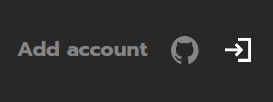
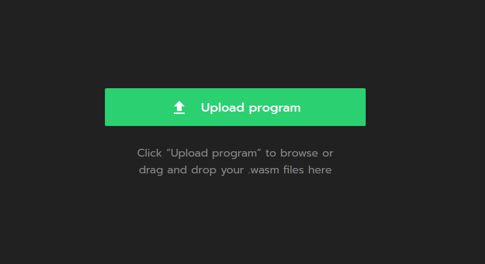
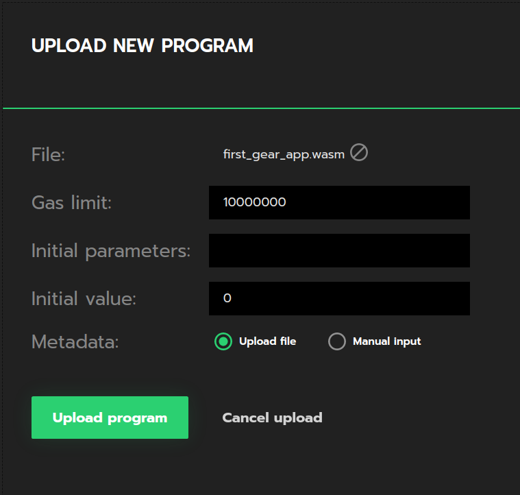
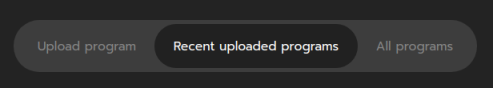
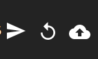

# Getting started in 5 minutes

在这篇文章中，我们将会编写并部署第一个智能合约到 GEAR 网络中。

## Prerequesites

(可选）为方便起见，最好为所有与 GEAR 有关的内容创建一个专用目录。

```bash
mkdir -p ~/GEAR
cd ~/GEAR
```

文章的其余部分将假设你正在使用建议的路径，所以请根据你的目录树进行调整。


首先，我们需要安装在 Rust 中构建第一份合约所需的工具。


我们将使用[Rustup](https://rustup.rs/)来安装 Rust 编译器。

```bash
curl --proto '=https' --tlsv1.2 -sSf https://sh.rustup.rs | sh
```

现在，让我们为 `rustup`安装一个 `nightly`版本，因为 `GEAR` 使用 le 一些`rustup` 提供的最新功能。

```bash
rustup update
rustup update nightly
```

我们需要把 Rust 智能合约编译为 WASM，所以我们需要一个 WASM 编译器。让我们将 WASM 编译器添加到工具链中。

```bash
rustup target add wasm32-unknown-unknown --toolchain nightly
```

现在，通过 clone 我们的公共[github repo](https://github.com/gear-tech/gear)来获得 GEAR 本身的源代码。

```bash
git clone https://github.com/gear-tech/gear.git
```

## Creating your first GEAR smart contract

现在让我们在`GEAR` 文件夹内，创建 `contracts` 文件夹，然后通过 `cd` 切换进文件夹

```bash
mkdir -p ~/GEAR/contracts
cd ~/GEAR/contracts
```

下一步将是为合约建立一个 Rust 库。

```bash
cargo new first-gear-app --lib
```

`GEAR/contracts` 目录树应该是这样的：

```bash
└── first-gear-app
    ├── Cargo.toml
    └── src
        └── lib.rs
```

现在开始写一些代码。用你喜欢的编辑器打开 `first-gear-app`，我们使用`VS Code`。

```bash
code ~/GEAR/contracts/first-gear-app
```

我们将配置`Cargo.toml`，可以使合约正确地创建。

```yaml
[package]
name = "first-gear-app"
version = "0.1.0"
authors = ["Your Name"]
edition = "2021"
license = "GPL-3.0"

[lib]
crate-type = ["cdylib"]

[dependencies]
gcore = { git = "https://github.com/gear-tech/gear.git", features = ["debug"] }
gstd = { git = "https://github.com/gear-tech/gear.git", features = ["debug"] }

[profile.release]
lto = true
opt-level = 's'
```

用我们的第一个智能合约的代码替换 `lib.rs`。

你应该在编辑器中打开`src/lib.rs`并粘贴以下代码：

```rust
#![no_std]

use gcore::{ext, msg};
use gstd::prelude::*;

static mut MESSAGE_LOG: Vec<String> = vec![];

#[no_mangle]
pub unsafe extern "C" fn handle() {
    let new_msg =
        String::from_utf8(gstd::msg::load_bytes()).expect("Invalid message: should be utf-8");

    if new_msg == "PING" {
        msg::reply(b"PONG", 10_000_000, 0);
    }

    MESSAGE_LOG.push(new_msg);

    ext::debug(&format!(
        "{:?} total message(s) stored: ",
        MESSAGE_LOG.len()
    ));

    for log in MESSAGE_LOG.iter() {
        ext::debug(log);
    }
}

#[no_mangle]
pub unsafe extern "C" fn handle_reply() {
    msg::reply(b"PONG", 10_000_000, 0);
}

#[no_mangle]
pub unsafe extern "C" fn init() {}
```

在这篇文章中，我们将不会深入研究智能合约实现背后的具体细节。你唯一需要知道的是，这个合约发送了`PING`消息，会收到`PONG`消息作为回应。如果你想了解更多关于为 GEAR 编写智能合约的信息，请参考这篇关于[智能合约的文章]（smart-contracts/gear-program.md）。

然后，编译合约代码。

```bash
cargo +nightly build --target wasm32-unknown-unknown --release
```

如果一切顺利，工作目录应该有一个 `target` 目录，如下所示的：

```bash
target
    ├── CACHEDIR.TAG
    ├── release
    │   ├── ...
    └── wasm32-unknown-unknown
        ├── CACHEDIR.TAG
        └── release
            ├── build
            │   └── ...
            ├── deps
            │   └── ...
            ├── examples
            ├── first_gear_app.d
            ├── first_gear_app.wasm <---- this is our .wasm file
            ├── incremental
            ├── libfirst_gear_app.d
            └── libfirst_gear_app.rlib

```

我们需要的是`target/wasm32-unknown-unknown/release`目录内的 `first_gear_app.wasm` 文件。现在知道它在哪里了，让我们进入下一步。

## Deploy your Smart Contract to the TestNet

Gear 提供了 1 个 GUI 工具，叫[idea.gear-tech.io](https://idea.gear-tech.io)。

首先，使用最合适的方法登录

其次，在右上角，可以应该创建一个帐户。



接下来，你需要充值您的帐户，以便有足够的 [gas](smart-contracts/messaging.md) 来上传合约。

当你的账户余额足够时，点击 `Upload program` 并导航到我们上面提到的
`.wasm`文件。



现在你应该看到以下界面：



你现在可以上传程序并等待 IDEA 将其上传到`TestNet`。


一旦你的程序被上传，前往`Recently uploaded programs`并找到你的程序。



你可以通过这些按钮与你的程序互动。



现在，试着给你新上传的程序发送一个`PING` 信息，看看它是如何反应的。

关于上传第一份合约的教程到此结束。

如果要了解更多关于的内容，你可以到 `GEAR Wiki` 的 `Smart Contracts`部分。
