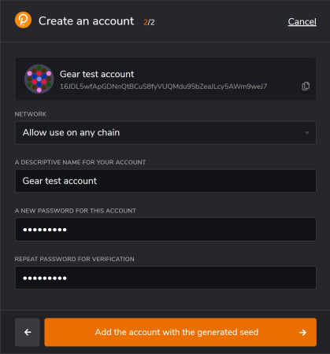
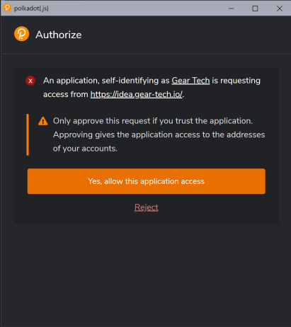
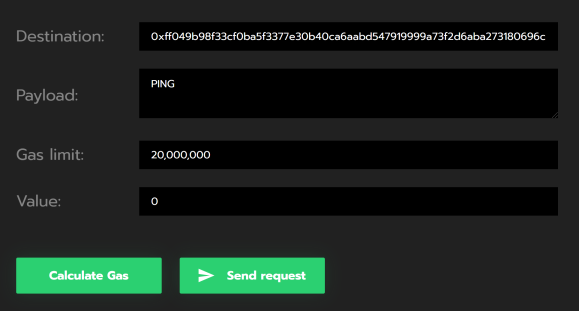
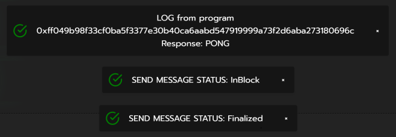

# 5 分钟入门

本文基本概括如何在 Gear 网络上运行智能合约。文章会指导开发者如何编写智能合约，将其编译为 Wasm，并部署到 Gear 网络。

在这个例子中，我们将使用一个模拟真实 Gear 去中心化网络的演示环境。

## 前期准备

1. 为了方便起见，建议你为所有与 Gear 相关的内容创建一个专用目录。本文的其余部分将假设你使用的是所建议的路径。输入以下命令来在 Home 目录创建一个专用文件夹并跳转到文件夹中：

```bash
mkdir -p ~/gear
cd ~/gear
```

2. 确保已经安装了在 Rust 中构建智能合约所需的所有工具。我们将使用[Rustup](https://rustup.rs/) 来安装 Rust 编译器。

```bash
curl --proto '=https' --tlsv1.2 -sSf https://sh.rustup.rs | sh
```

3. 现在，让我们为 `rustup` 安装一个 `nightly` 版本，因为 `Gear` 使用了 一些 `rustup` 提供的最新功能。

```bash
rustup update
rustup update nightly
```

4. 我们需要把 Rust 智能合约编译为 Wasm，所以我们需要一个 Wasm 编译器。让我们将 Wasm 编译器添加到工具链中。

```bash
rustup target add wasm32-unknown-unknown --toolchain nightly
```

**_注意_** 如果你使用 Windows，请下载并安装 [Build Tools for Visual Studio](https://visualstudio.microsoft.com/downloads/?q=build+tools)。


## 创建你的第一个 Gear 智能合约

1. 现在让我们在 `gear` 文件夹内，创建 `contracts` 文件夹，然后通过 `cd` 切换进文件夹

```bash
mkdir -p ~/gear/contracts
cd ~/gear/contracts
```

2. 下一步将是为合约建立一个 Rust 库。

```bash
cargo new first-gear-app --lib
```

`gear/contracts` 目录树应该是这样的：

```bash
└── first-gear-app
    ├── Cargo.toml
    └── src
        └── lib.rs
```


3. 现在开始写一些代码。用你喜欢的编辑器打开 `first-gear-app`，我们使用`VS Code`。

```bash
code ~/gear/contracts/first-gear-app
```

4. 创建 `build.rs` 文件，并粘贴以下代码：

```rust
fn main() {
    gear_wasm_builder::build();
}
```

同时配置`Cargo.toml`，可以使合约正确地创建。

```toml
[package]
name = "first-gear-app"
version = "0.1.0"
authors = ["Your Name"]
edition = "2021"
license = "GPL-3.0"

[dependencies]
gstd = { git = "https://github.com/gear-tech/gear.git", features = ["debug"], branch = "stable" }

[build-dependencies]
gear-wasm-builder = { git = "https://github.com/gear-tech/gear.git", branch = "stable" }

[dev-dependencies]
gtest = { git = "https://github.com/gear-tech/gear.git", branch = "stable" }
```

5. 用我们的第一个智能合约的代码替换 `lib.rs`。在编辑器中打开 `src/lib.rs` 并粘贴以下代码：

```rust
#![no_std]

use gstd::{debug, msg, prelude::*};

static mut MESSAGE_LOG: Vec<String> = vec![];

#[no_mangle]
unsafe extern "C" fn handle() {
    let new_msg = String::from_utf8(msg::load_bytes().expect("Unable to load bytes"))
        .expect("Invalid message");

    if new_msg == "PING" {
        msg::reply_bytes("PONG", 0).expect("Error in sending reply");
    }

    MESSAGE_LOG.push(new_msg);

    debug!("{:?} total message(s) stored: ", MESSAGE_LOG.len());

}
```

这个合约发送了`PING`消息，会收到`PONG`消息作为回应。

6. 然后，编译合约代码

```bash
cd ~/gear/contracts/first-gear-app/
cargo build --release
```

如果一切顺利，工作目录应该有一个 `target` 目录，如下所示的：

```
target
    ├── CACHEDIR.TAG
    ├── release
    │   ├── ...
    └── wasm32-unknown-unknown
        ├── CACHEDIR.TAG
        └── release
            ├── build
            │   └── ...
            ├── deps
            │   └── ...
            ├── examples
            ├── incremental
            ├── first_gear_app.d
            └── first_gear_app.wasm <---- this is our .wasm file
```

我们需要的是 `target/wasm32-unknown-unknown/release` 目录内的 `first_gear_app.wasm` 文件。现在知道它在哪里了，让我们进入下一步。

## 在测试网上部署你的第一个合约

Gear provides a demo environment that emulates the real Gear decentralized network, available in [idea.gear-tech.io](https://idea.gear-tech.io).
Gear 提供了一个模拟真实 Gear 去中心化网络的 demo 环境，可以通过 [idea.gear-tech.io](https://idea.gear-tech.io) 访问。

### 创建账户

1. 通过 [https://polkadot.js.org/extension/](https://polkadot.js.org/extension/) 为浏览器下载 Polkadot 扩展插件。这个扩展插件可以管理账户并允许用这些账户签名交易。它是一个安全的工具，允许将你的账户注入到任何基于 Substrate 的应用程序。它不执行钱包功能，例如，发送资金。

2. 下载完成后，点击 '+' 来创建新的账户：


3. 确保你安全的保存了 12 个单词的助记词。


4. 选择合适的网络 - 选择 "Allow to use on any chain"。为这个账户提供任何名称和密码，并点击"Add the account with the generated seed" 来完成账户注册。



5. 前往 [idea.gear-tech.io](https://idea.gear-tech.io)。系统将提示你授予 Gear Tech 应用程序对你账户的访问权，点击 "Yes, allow this application access" 。



6. 点击右上方的 `Connect` 按钮，选择一个账户，连接到 Gear Tech。

7. 根据 Actor 模型，智能合约通过消息上传到网络。Gear 节点在消息处理过程中会收取一定的 gas。账户需要有足够的资金来上传智能合约到`TestNet`。点击 "Get test balance"。


窗口的底部会出现一个关于成功获得余额的通知。你还可以在右上角的账户名称旁边看到当前的账户余额。


### 上传合约

1. 当你的账户余额足够时，点击 `Upload program` 并找到我们上面提到的 `.wasm` 文件。


2. 指定合约名称，并设定 Gas limit 为 20 000 000，然后点击 `Upload program` 按钮。


3. 签署交易，将合约上传到 Gear 网络。此外，签署合约并将元数据上传到 Gear 演示环境，以便可以使用该合约。为方便起见，建议设置复选框 `Remember my password for the next 15 minutes` 。


:::note


上传后，如果合约名称前面有红点，代表初始化错误。请再次上传合约，并**扩大 Gas limit**，可以尝试将**默认值扩大 10 倍**。

:::

4. 合约上传后，前往 `Recently uploaded programs` 并找到你的合约。


### 向合约发送消息

1. 现在，尝试向新上传的合约发送一条消息，看看它是如何响应的！使用这个按钮：
   

2. 在打开的对话框中 `PING` 的 `Payload` 字段中，提供 20 000 000 的 gas，然后点击 `Send request` 按钮。



3. 签名消息发送交易，如上传合约中的步骤 3 所示

4. 成功处理消息后，合约会发送 PONG 作为响应：



---

## 更多内容


除了这篇 "5 分钟入门"，你还可以参考另一篇展示在 Gear 平台上创建应用程序的简单性和便利性的文章--[初学者的第一个智能合约](https://app.subsocial.network/6310/gear-tech-the-first-smart-contract-on-rust-for-beginners-31604)。
这篇文章以 `Voting` 应用程序为例，描述了 Gear 智能合约的结构，如何使用程序的角色模型架构，处理消息，以及如何处理状态。

关于 Gear 编写智能合约的信息以及智能合约实现背后的具体内容，请访问 [智能合约](/docs/developing-contracts/executable-functions)。
